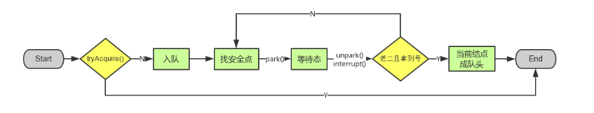

# AQS
AQS的全称为`AbstractQueuedSynchronizer`, 即抽象队列的同步器， 很多同步的API的实现都是基于此实现， 例如`ReentrantLock`,`Semaphore`,`CountDownLatch`等

## 框架


在AQS内容，通过维护`volidate int state`的值来实现同步, `state=1`代表锁定; `state=0`代表未锁定。 以及内部维护一个`FIFO`的队列, 缓存线程的等待队列。(多线程争用资源的时候, 会降线程加入到队列之中。)

1. state的访问方式有三种
- setState()
- getState()
- compareAndSetState()

2. AQS的资源的访问模式
- exclusive mode (独占的模式): 争用共享资源时, 只有一个线程能够执行, 其他线程处于(park)阻塞状态(例如: ReentrantLock)。
- shared mode(共享模式): 多个线程可以同时执行

> NOTE: 不同自定的队列同步器, 只需要实现共享资源`state` 的获取和释放即可, 至于线程的等待队列, `AQS`已经帮我们实现。

3. 自定义同步器需要实现以下方法
- tryAcquire(int arg) : 独占方式, 成功则返回true, 失败则返回false
- tryRelease(int arg) : 独占方式, 成功返回true, 失败则返回false
- isHeldExclusively() : 判断该线程是否在独占资源, 只有用到`condition`的时候才会用到该方法
- tryAcquireShared(int arg) : 共享方式. 尝试获取资源，`0` 表示成功, 但是没有剩余资源; 负数表示失败; 正数表示成功，并且还有剩余资源。
- tryReleaseShared(int arg) : 共享方式. 尝试释放资源, 如果释放后允许唤醒后续等待的线程则返回true,否则返回false.

以`ReentrantLock`为例, state 初始化状态为0, 表示未锁定。 会调用`tryAcquire`独占锁对state + 1; 其他线程在进行`tryAcquire`的时候就会失败。 直到线程unlock到state=0的状态。其他线程才有机会获取锁. 在释放锁之前, 当前的线程能够重复获取当前的锁, 并将state的状态累加。 这样的时候，在进行释放锁的时候就需要多次调用释放的操作。

一般来讲, 自定义同步器只需要实现独占模式或者共享模式其中的一种, 主要有tryAcquire-tryRelease 和tryAcquireShared-tryRealeaseShared两种模式，但是`ReentrantReadWriteLock` 实现了两种模式。


## 源码详解
### 1. accquire(int args)
```java
public final void acquire(int arg) {
    if (!tryAcquire(arg) &&
        acquireQueued(addWaiter(Node.EXCLUSIVE), arg)) {
      selfInterrupt();
    }
  }
```
函数流程如下:
- tryAcquire() - 尝试直接去获取资源, 如果成功则直接返回
- addWaiter() - 如果直接获取资源失败, 创建独占模式的Node, 并加入到线程等待队列的尾部
- acquireQueued - 使线程在队列中获取资源, 一直获取资源后才会返回. 如果在整个过程中被中断, 则返回true. 否则返回false.
- 如果线程在等待过程中被中断, 它是不响应的, 只是获取资源后才进行自我中断(selfInterrupt), 将中断补上。

### 1.1 tryAcquire(int args)
该方式尝试获取独占资源。如果获取成功, 则返回true; 如果失败则返回false; 这也正是`Lock`语义, 类似但是不局限于`tryLock`的实现。

```java
protected boolean tryAcquire(int arg) {
    throw new UnsupportedOperationException();
  }
```

这里是具体交由`AQS`的实现, 这里主要让子类实现该方法, 实现具体的锁定的方式, 主要用于自定义独占同步器。

### 1.2 addWaiter(Node node)
```java
private Node addWaiter(Node mode) {
    // 这里是创建了一个节点, 其中包含了当前的线程, 以及以什么样的模式获取锁
    Node node = new Node(Thread.currentThread(), mode);
    // Try the fast path of enq; backup to full enq on failure
    // 找到队列的尾部
    Node pred = tail;
    // 通过cas的方式向对位添加一个等待的节点
    if (pred != null) {
      node.prev = pred;
      if (compareAndSetTail(pred, node)) {
        pred.next = node;
        return node;
      }
    }

    // 通过CAS自旋的方式加入到队尾
    enq(node);
    return node;
  }
```

该方会在第一次进行尝试直接添加到队尾, 如果尝试失败, 则会通过`CAS`自旋的形式加入到队列的尾部。

对于Node而言, 有一下四种状态需要说明:
- `CANCELLED` : 值为1，在等待队列中等待超时, 或者线程等待被中断, 从要从线程等待队列中移除该NODE节点。即`waitStatus`的状态为`CANCELLED`，并且该节点的状态不会再改变。
- `SIGNAL` - 值为-1, 该状态处于唤醒状态, 当前面的节点处于释放资源或者被取消, 将会通知其后继节点执行
- `CONDITION` - 值为-2, 该标识的节点处于`等待队列`中, 节点的线程等待在`Condition`上, 当其他的线程调用了`Condition`的`signal`后, 将从`等待队列`转移到同步队列中, 并获取同步锁
- `PROPAGATE` - 值为-3, 与共享模式相关, 在共享模式中, 该状态表明节点处于可以执行的状态。
- `0` 表示一个初始化的状态。

> NOTE: 通过`waitStatus > 0`表示`CANCELLED`和`waitStatus < 0`表示有效状态

### 1.3 enq(Node node)
```java
private Node enq(final Node node) {
    // 通过CAS向队列的尾部添加一个节点
    for (; ; ) {
      Node t = tail;
      if (t == null) { // Must initialize
        // 如果当前没有设置head, 则会先创建一个虚拟的head,
        // 然后直接向尾部进行插入数据node
        Node h = new Node(); // Dummy header
        // 这里是设置predecessor和next的，能够被互相访问。
        h.next = node;
        node.prev = h;
        if (compareAndSetHead(h)) {
          tail = node;
          return h;
        }
      } else {
        node.prev = t;
        // 加入到队尾成功则返回, 加入失败则继续尝试加入到队尾
        if (compareAndSetTail(t, node)) {
          t.next = node;
          return t;
        }
      }
    }
  }
```

### 1.4 acquireQueued(Node, int)
```java
final boolean acquireQueued(final Node node, int arg) {
    try {
      boolean interrupted = false;
      for (; ; ) {
        final Node p = node.predecessor();
        // 这个方式判断当前节点的上一个节点, 如果上一个节点为头部节点,
        // 我们知道头部节点是一个虚拟的节点, 因此是不需要等待的，则尝试获取
        // 资源, 如果获取成功, 则当前的节点设置为头部节点
        if (p == head && tryAcquire(arg)) {
          setHead(node);
          p.next = null; // help GC
          return interrupted;
        }
        // 该处主要找到一个park的点, 主要判断父节点是否为signal的waitStatus
        if (shouldParkAfterFailedAcquire(p, node) &&
            parkAndCheckInterrupt()) {
          interrupted = true;
        }
      }
    } catch (RuntimeException ex) {
      cancelAcquire(node);
      throw ex;
    }
  }
```

这个方法会判断, 如果需要排队的节点高寒处于第二个节点, 则尝试获取资源的状态, 如果失败, 则需要将当前的节点寻找到能够park的位置.

#### 1.4.1 shouldParkAfterFailedAcquire(Node, Node)
该方法检查状态, 主要检查当前的排队的节点是否能够进入park状态
```java
private static boolean shouldParkAfterFailedAcquire(Node pred, Node node) {
    int ws = pred.waitStatus;
    if (ws == Node.SIGNAL)
      /*
       * This node has already set status asking a release
       * to signal it, so it can safely park
       */ {
      return true;
    }

    if (ws > 0) {
      /*
       * Predecessor was cancelled. Skip over predecessors and
       * indicate retry.
       *
       * 这里判断了祖先节点已经被取消, 则应该取消祖先节点的等待, 并从等待队列中剔除。
       */
      do {
        node.prev = pred = pred.prev;
      } while (pred.waitStatus > 0);
      pred.next = node;
    } else {
      /*
       * waitStatus must be 0 or PROPAGATE. Indicate that we
       * need a signal, but don't park yet. Caller will need to
       * retry to make sure it cannot acquire before parking.
       */
      compareAndSetWaitStatus(pred, ws, Node.SIGNAL);
    }
    return false;
  }
```
主要判断前继节点是否处于`SIGNAL`的状态, 如果前继的节点不是`SIGNAL`的状态, 那么会尝试将前置的节点设置为`SIGNAL`状态。如果前继节点为`CANCELLED`的状态, 将会跳过这些节点, 使已经取消的节点能够被回收.


#### 1.4.2 parkAndCheckInterrupt()

当等待的节点找到了park的位置之后, 通过`park()`方法处于`waiting`的状态, 等待被`unpark`或者`interrupt`的执行。

```java
private final boolean parkAndCheckInterrupt() {
    LockSupport.park(this);
    return Thread.interrupted();
  }
```

### 1.5 小结
这里总结一下`acquireQueued`的过程:
- 进入到线程等待队列, 并寻找到安全的park的配置
- 调用`park()`方法进入`waiting`状态, 等待`unpark()`或者`interrupt()`方法
- 被唤醒后, 查看自己是否能够拿到资源状态, 如果拿到, 则被设置为head节点; 如果没有拿到, 则继续当前的流程，。

### 1.6 acquire方法的小节
总结下`acquire`的流程:
- 调用自定义同步器的`tryAcquire`方法尝试获取资源, 如果成功则直接返回
- 如果获取失败, 则通过`addWaiter`方法将当前线程缓存到队列的尾部, 并标记为独占模式
- `acquireQueued`方法找到适合自己的park点, 并在等待队列中休息, 直到(unpark)会去重复尝试获取资源.如果被interrupt则返回true, 否则返回false.
- 如果线程在等待过程中被中断, 并不会立即响应, 而是等到拿到资源后, 通过`selfInterrupt`进行自我中断。



## 参考文章
[JAVA并发之AQS](https://www.cnblogs.com/waterystone/p/4920797.html)
