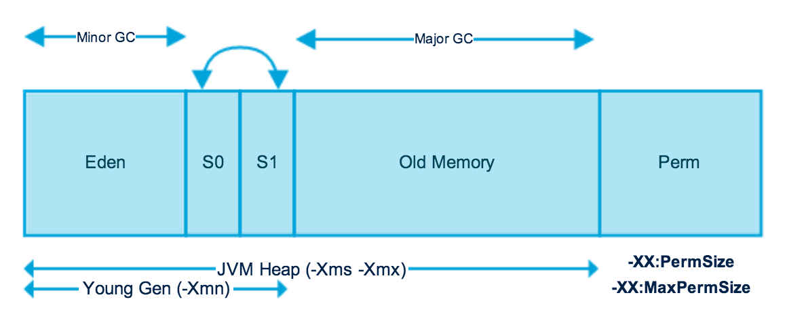

# jvm 内存划分区域参数


## -Xms
代表着最小堆, 在jvm启动时就会分配到该大小的区域

## -Xmx
代表最大堆, 在jvm最小堆不能满足需求时, 对jvm内存进行扩展, 直到最大堆的内存大小

## -Xmn
代表新生代区域的大小

## -XX:SurvivorRatio
代表着`Eden`区域与`Survivor`区域的比例. 一般`Survivor`的区域有两个。
例如:
-XX:SurvivorRatio = 3;
则`Survivor`的大小 = 1/5 * 新生代大小

## -XX:NewSize
设置新生代大小

## -XX:NewRatio
设置新生代与老年代比值。
例如:
-XX:NewRatio = 3; 表示新生代 = 1/4. 该表达式表带的意思为: 老年代/新生代 = 3;

## 老年代的内存
```txt
老年代的内存 = 堆的大小 - 新生代内存大小
```

## -XX:PermSize/-XX:MaxPermSize
用于指定永久代区域的大小(在JDK1.8之后, 更改为`-XX:MetaSize`)

+ 收集器的设置
  - -XX:+UseSerialGC : 设置穿行收集器
  - -XX:+ParallelGC: 设置并行收集器
  - -XX:+UseParalledlOldGC : 设置并行老年代收集器
  - -XX:+UseConcMarkSweepGC : 设置并发收集器

+ 垃圾回收统计信息
  - -XX:+PrintGC : 打印GC信息
  - -XX:+PrintGCDetails : 打印GC收集详细信息
  - -XX:+PrintGCTimeStamps : 打印垃圾收集器收集的时间
  - -Xloggc:filename : 将垃圾收集日志输出到指定文件中

+ 并行收集器设置
  - -XX:ParallelGCThreads=n : 设置并行收集器在收集垃圾时使用的线程(CPU)数量. 会占用CPU资源
  - -XX:MaxGCPauseMillis=n : 设置并行收集器最大的暂停时间(Stop The World的时间?)
  - -XX:GCTimeRatio=n : 设置垃圾回收时间占用程序执行时间的比例.(1/(1 + n))

+ 并发收集器设置
  - -XX:+CMSIncrementalMode : 设置为增量模式, `适合于单CPU模式`
