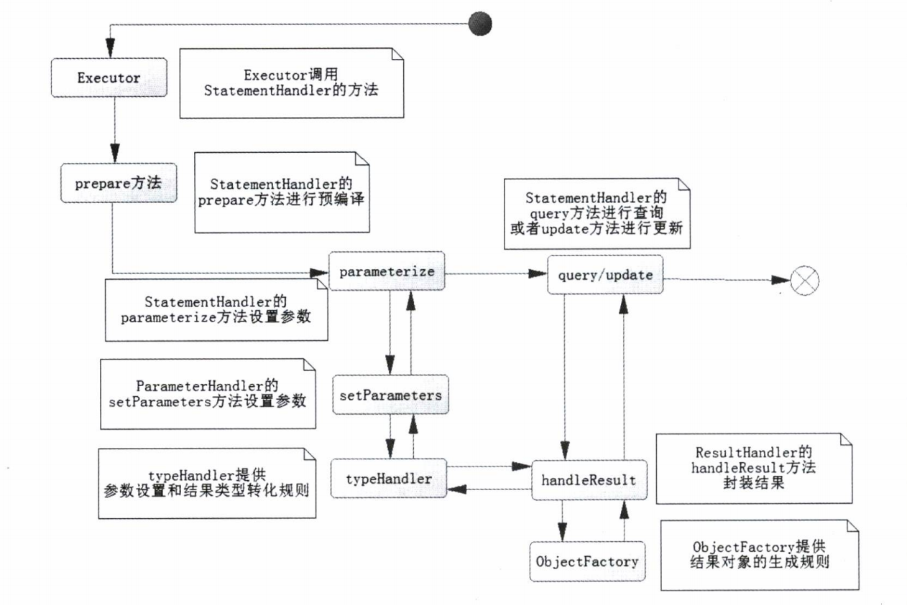

# SqlSession下的四大元素

## 四大元素
在Mybatis中,SqlSession主要通过`executor`,`StatementHandler`,`ParameterHandler`,`ResultHandler`四个组件进行从请求到返回结果的处理.

- Executor : 代表执行器, 用来调度`StatementHandler`,`ParameterHandler`,`ResultHandler`等来执行对应的SQL
- StatementHandler: 它的作用就是获取`Statement(PreparedStatement)`对象,是最核心部分
- ParameterHandler: 是SQL对参数的处理
- ResultHandler: 是对最后数据的请求结果的处理

### 执行器(Executor)
Executor起到了很关键的作用, 它是执行Java与数据库交互的一个组件.在mybatis中,一共有三种可以选择(在Mybatis配置文件中可以进行配置.):
- SIMPLE: 简单执行器, 在不配置的时候, 默认使用
- REUSE: 是一种执行器重用预处理语句
- BATCH: 执行器重用语句与批量更新, 它是针对批量专用的执行器.

在Mybatis中存在一种特殊的Executor,`CachingExecutor`, 当开启二级缓存的时候, 就汇默认采用这种执行器, 这种执行器只是一个中间执行器, 最终执行的还是以上三种。

### 数据库会话器(StatementHandler)
`StatementHandler`就是用来专门处理数据库回话的,
对于mybatis而言,一共有三种会话器, `SimpleStatementHandler`,`PreparedStatementHandler`,`CallableStatementHandler`。这三种会话器都是通过`RoutingStatementHandler`进行统一处理, 这里使用到了`适配模式`

在StatementHandler中，有三个比较重要的方式`prepare`,`parameterize`,`query`
- prepare:
  - 对sql进行预编译
  - 设置执行SQL的超时时间
  - 设置获取数据的最大行数
- parameterize
  - 主要是对预编译的SQL进行参数设置
- ResultSetHandler
  - 封装结果并返回

### 参数处理器(ParameterHandler)
参数处理器就是对预编译的SQL进行参数的设置

### 结果处理器(ResultSetHandler)
对SQL返回的结果进行处理

## SqlSession运行总结

