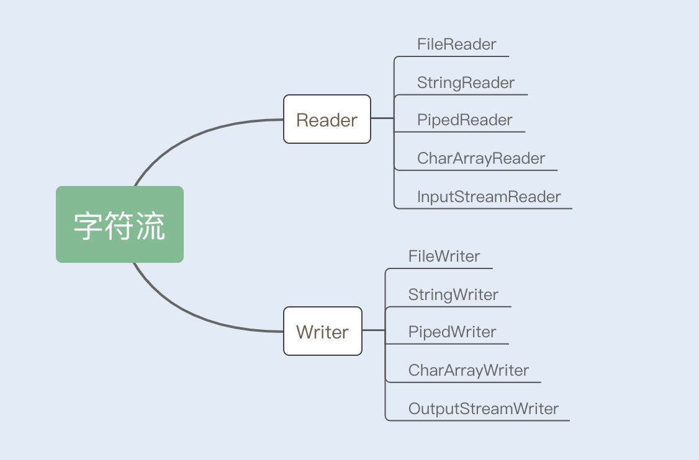

# 如何解决高并发下I/O瓶颈

## 什么是I/O

`I/O`是机器获取和交换信息的主要渠道，而流是完成`I/O`操作的主要方式。

在计算机中，流是一种信息的交换。流是有序的，因此从相对于某一机器或者应用程序而言，我们通常把机器或者应用程序接收外界的信息称为`输入流(InputStream)`. 从机器或者应用程序向外输出的信息称为`输入流(OutputStream)`, 合称为`输入/输出流(I/O Stream)`

### 字节流

`InputStream/OutputStream`是字节流的抽象类，这两个抽象类又派生除了若干子类，不同的子类分别处理不同的操作类型。如果是文件的读写操作，就是用`FileInputStream/FileOutputStream`；如果是数组的读写操作，就是用`ByteArrayInputStream/ByteArrayOutputStream`；如果是普通字符串的读写操作，就是用`BufferedInputStream/BufferedOutputStream`。

### 字符流

`Reader/Writer`是字符流的抽象类，这两个抽象类也派生出了若干子类，不同的子类粉笔处理不同的操作类型。

## 传统I/O的性能问题

- I/O操作分类
  - 磁盘I/O操作
    - 从磁盘中读取数据源输入到内存中，之后将读取的信息持久化输出在物理磁盘上
  - 网络I/O操作
    - 从网络中读取信息输入到内存，最终将信息输出到网络中。

### I/O存在的缺陷

#### 1. 多次内存复制

在传统I/O中，通过`InputStream`从源数据中读取数据流输入到缓冲区里。通过`OutputStream`将数据输出到外部设备。

- 执行过程
  - JVM发出`read()`系统调用，并通过read系统调用向`内核`发起度请求
  - 内核向硬件发出读指令，并等待读就绪
  - 内核把将要读取的数据复制到指向的内核缓存中
  - 操作系统内核将数据复制到用户控件缓存区，然后read系统调用返回。

> 该次读操作发生了两次内存复制操作，这种操作会导致不必要的`数据拷贝`和上下文切换，从而降低`I/O`的性能

#### 2. 阻塞

在传统I/O中，`InputStream`的`read()`是一个while循环操作，它会一直等待数据读取，直到数据就绪才会返回。**这就意味着如果没有数据就绪，这个读操作将会一直被挂起，用户线程将会处于阻塞状态**

> 少量请求情况下，这种方式没有问题，响应速度也很高，但是在发生大量连接请求时，就需要创建大量监听线程，这时如果线程没有数据就绪就会被`挂起`，然后进入阻塞状态，一旦线程发生阻塞，这些线程将不断地抢夺CPU资源，从而导致大量的`CPU`上下文切换，增加系统的性能开销。

## 优化I/O操作

### 1. 使用缓冲区优化读写流操作

- 传统I/O中，`InputStream/OutputStream`是基于字节为单位处理数据
- NIO 是基于`块(Block)`的，它以块为单位处理数据。
  - 重要的两个组件
    - 缓冲区(Buffer)
      - 是一块连续的内存块，是NIO读写数据的中转地
    - 通道(Channel)
      - 表示缓冲数据源头或者目的地，它用于读取缓冲或者写入数据，是访问缓冲的接口。

> Buffer可以将文件一次性读入内存再做后续处理，而传统的方式是边读文件边处理数据

### 2. 使用DirectBuffer减少内存复制

NIO的Buffer除了做缓冲块优化之外，还提供了一个可以直接访问物理内存的类`DirectBuffer`. `普通Buffer分配的是JVM堆内存，而DirectBuffer是直接分配物理内存（非堆内存）`

#### java写出数据的处理方式

数据要输出到外部设备，必须先从用户空间复制到内核空间，再复制到输出设备。

在Java中，用户空间中又存在一个拷贝，从Java堆内存中拷贝到`临时的直接内存中`，`通过临时的直接内存拷贝到内存空间中去。`

> 由于DirectBuffer申请的是非JVM的物理内存，所以创建和销毁的代价很高。DirectBuffer申请的内存并不是直接由JVM负责垃圾回收，但是在DirectBuffer包装内被回收时，会通过Java Reference机制来释放该内存。

#### 直接将文件读入用户空间

DirectBuffer是通过`unsafe.allocateMemory(size)`方法分配内存，也就是基于本地类Unsafe类调用native方法进行内存分配的。

而在NIO中，还存在另外一个Buffer类: `MappedByteBuffer`，跟`DirectBuffer`不同的是，`MappedByteBuffer`是通过本地类调用`mmap`进行文件内存映射的，`map()`系统调用方法会将文件从`硬盘拷贝到用户控件`, 只进行一次数据拷贝，从而减少了传统的`read()`方法从硬盘拷贝到内核空间这一步。

### 3. 避免阻塞，优化I/O操作

- 传统I/O输入流读取时，解除阻塞的三个条件:
  - 有数据可读
  - 链接释放
  - 空指针或者I/O异常

#### 通道(Channel)与多路复用器(Selector)

##### 通道(Channel)

- 传统I/O读取数据面临的问题
  - 应用程序调用操作系统I/O接口时，是由CPU完成分配，这种方式最大的问题是`发生大量I/O请求时，非常消耗CPU`
  - 之后操作系统引入了`DMA`(直接存储器存储)，内核控件与磁盘之间的存取完全由DMA负责，但这种方式依然想CPU申请权限，且需要借助DMA总线来完成数据复制操作。如果DMA总线过多，就会造成总线冲突。

为了解决以上问题，`Channel`有自己的处理器，可以完成内核空间和磁盘之间的I/O操作。在NIO中，我们读取和写入数据都要通过Channel，由于Channel是双向的，所以读、写可以同时进行。

##### 多路复用(Selector)

`Selctor`是Java NIO编程的基础，用于检查一个或多个NIO Channel的状态是否处于`可读`、`可写`

Selector是基于事件驱动实现的，可以在Selector中注册`accept`,`read`箭筒事件，`Selector`会不断轮询注册在其上的`Channel`, 如果某个`Channel`上面发生监听事件，这个Channel就处于就绪状态，然后进行I/O操作。

一个线程使用一个`Selctor`, 通过轮询的方式，可以监听多个`Channel`上的事件。我们可以在注册`Channel`时设置该通道为`非阻塞`， 当`Channel`上没有I/O操作时，该线程就不会一直等待了，而是会不断轮询所有`Channel`, 从而避免发生阻塞。

> 目前操作系统的I/O多路复用机制都使用了`epoll`，相比传统的`select`机制，`epoll`没有最大句柄`1024`的限制。

