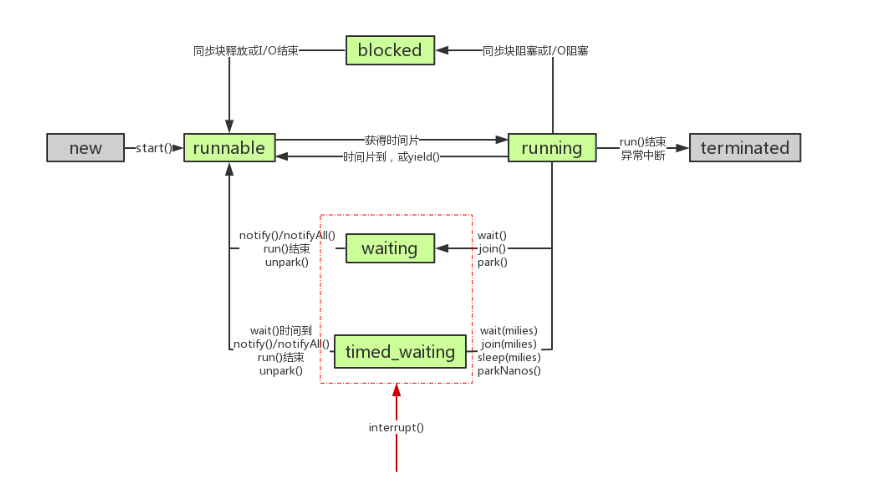

# 线程间状态转换


> NOTE: 在调用obj.wait()的状态的时候, 必须要获取obj的锁, 因为在进行obj.notify()的方法会释放对应的obj的状态, 并进入`waiting状态`

1. 阻塞与等待的区别
阻塞: 当一个线程尝试获取对象锁(非JUC中的锁, 即`synchronized`), 如果对象锁已经被其他的线程锁持有, 则当前线程进入阻塞状态.(这种状态会由JVM来进行唤醒, 不需要我们通过程序的方式进行唤醒。而且当前的阻塞状态不会响应中断的请求.)

等待: 当一个线程等待另外一个线程通知调度器的一个条件时, 该线程进入等待状态。它的特点是需要另外一个线程来显示的唤醒自己, 可以响应中断的请求。

 在`synchronized`和`Lock`的时候, Lock是通过`park`和`unpark`的方式来让线程进入一个等待(waiting)状态。而`synchronized`则是让线程进入阻塞状态, 等待jvm进行唤醒。


## 主要操作
1. start()
该方法在启动的时候执行, 一个线程只能启动一次
```java
public synchronized void start() {
        /**
	 * This method is not invoked for the main method thread or "system"
	 * group threads created/set up by the VM. Any new functionality added
	 * to this method in the future may have to also be added to the VM.
	 *
	 * A zero status value corresponds to state "NEW".
         */
        if (threadStatus != 0 || this != me)
            throw new IllegalThreadStateException();
        group.add(this);
        start0();
        if (stopBeforeStart) {
      	  stop0(throwableFromStop);
      	}
    }
```
当该线程执行了start()的方法之后, 就处于`RUNNABLE`的状态，然后等待CPU分配时间片。

2. run()
当线程启动成功之后, 则会等待CPU分配时间片, 当获取时间片之后, 就会调用run()方法执行具体的逻辑

3. sleep();
sleep()主要是为了让线程处于一个`TIME_WAITING`的状态.
```java
sleep(long millis);

sleep(long millis, long nanoseconds);
```

sleep 的方法会释放当前CPU占用, 让CPU能够执行其他的任务。
> NOTE: sleep并不会释放当前的锁, 如果线程处于睡眠状态, 那么就会持续的持有锁。那么即使调用了`sleep`, 其他线程也不能获取到锁。

4. yield()
- `yield`方法会让当前线程交出CPU的执行时间, 让CPU能够去执行其他的线程。
- `该方法并不会释放当前持有的锁`.
- `yield`并不能控制CPU具体交出的时间
- `yield`方法只能让具有相同优先级的线程有获取CPU执行的机会
- `yield`会让线程进入到`RUNNABLE`的状态, 等待CPU下一次时间片的分配.

5. join()
```java
join()
join(long millis)     //参数为毫秒
join(long millis,int nanoseconds)    //第一参数为毫秒，第二个参数为纳秒
```

`join()`方法实际上利用了`wait()`的方法, 只不过它并不是等待`notify()/notifyAll()`, 并且不受影响。可以通过以下两个条件触发:
- `join()`时间到
- 执行`join()`的线程`run()`方法执行完

```java
public final synchronized void join(long millis)
      throws InterruptedException {
    long base = System.currentTimeMillis();
    long now = 0;

    if (millis < 0) {
      throw new IllegalArgumentException("timeout value is negative");
    }

    if (millis == 0) {
      // 判断当前的线程是否还处于存活的状态
      while (isAlive()) {
        wait(0);
      }
    } else {
      // 这里的notify并不会影响它, 因为被唤醒之后,
      // 则会继续通过判断是否处于alive的状态, 继续进行wait状态
      while (isAlive()) {
        long delay = millis - now;
        // 如果已经超过等待的时间, 则阻断
        if (delay <= 0) {
          break;
        }
        wait(delay);
        now = System.currentTimeMillis() - base;
      }
    }
  }
```

6. interrupt()
此操作会中断等待中的线程, 并将线程的中断标志位置位。如果线程在运行状态则不会受到影响。
可以通过如下的三种方式来进行状态的判断：
- isInterrupted() : 此方法只是用于读取标志位的状态, 并不会重置标志位
- interruptted(): 此方法会读取线程的中断标志位的状态, 并重置标志位
- throw InterruptException : 抛出该异常的同时, 并重置标志位

7. suspend() / resume()
挂起状态, 知道被resume的调用。
但是调用`suspend()`和`resume()`可能会因为争锁的问题而发生死锁。


## 参考文档
[线程间状态转换](http://www.cnblogs.com/waterystone/p/4920007.html)
