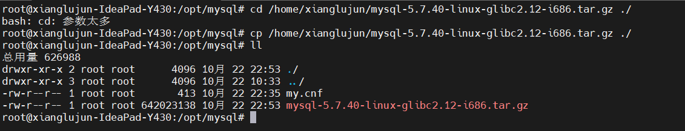
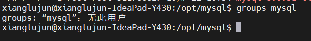
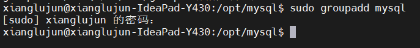
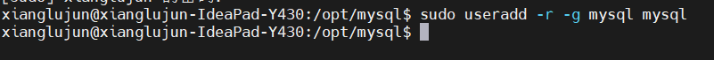
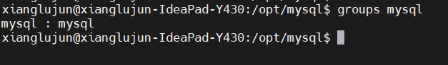
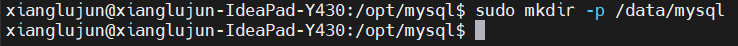
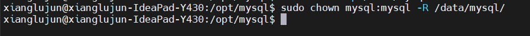
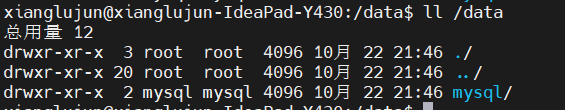
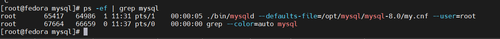

# mysql压缩包安装方法

本文主要记录通过压缩包的方式启动mysql, 记录主要操作步骤，以便于后面能够快速操作。

## 1. 下载压缩包

压缩包的下载主要从[mysql官网](https://dev.mysql.com/downloads/mysql/)下载，下载速度挺快的。

## 2. 上传安装包

我这里演示的是linux环境，因此需要将包上传到远程的服务器，当然如果在本地操作，则可以省略这一步。



## 3. 解压压缩包

```shell
tar -zxvf mysql-8.0.31-linux-glibc2.17-aarch64.tar.gz
```

## 4. 环境准备

### 4.1 判断是否包含mysql用户及用户组

```shell
# 判断是否包含mysql用户组
groups mysql
```



### 4.2 如果用户组不存在，则创建用户组和用户

```shell
# 创建用户组
groupsadd mysql

# 创建用户
useradd -r -g mysql mysql

# 再次查看用户组信息
groups mysql
```







### 4.3 创建mysql数据目录并赋予权限

```shell
# 创建数据目录
mkdir -p /data/mysql
# 赋予权限
chown mysql:mysql -R /data/mysql
# 查看目录权限是否正确
ll /data
```







以上就说明mysql用户以及用户组信息创建完成，并为mysql数据目录设置了权限。

## 5. 安装mysql

### 5.1 my.cnf

在mysql压缩包中默认是没有该文件的，因此这里需要我们创建并做修改，为了便于管理，我们将my.cnf文件创建到解压的目录中，这样可以和启动文件一起管理。

```shell
# 创建文件
touch my.cnf
# 编辑文件
vi my.cnf
```

通过`i`按键开始编辑配置文件，然后将如下配置拷贝进入到文件中.

```shell
[mysqld]
bind-address=0.0.0.0
# 启动端口
port=3306
# mysql基础目录，就是mysql运行目录
basedir=/opt/mysql/mysql-8.0
# 数据存放目录
datadir=/data/mysql
socket=/tmp/mysql.sock
# 错误日志存放目录
log-error=/data/mysql/log.err
# 进程文件
pid-file=/data/mysql/mysql.pid
# 默认字符集
character_set_server=utf8mb4
symbolic-links=0
# 默认时间
explicit_defaults_for_timestamp=true
```

### 5.2 初始化mysql

初始化mysql主要设计到一些参数的设置，具体命令如下

```shell
./bin/mysqld \
--defaults-file=/opt/mysql/my.cnf \
--basedir=/opt/mysql \ 
--datadir=/data/mysql \
--user=mysql \
--initialize 
```

以上命令就是初始化mysql的命令，有时候mysql会提示缺少依赖文件，可以执行

```shell
yum search libaio
yum install libaio

# ubuntu
apt-cache search libaio
apt-get install libaio1

# red hat
yum install ncurses-compat-libs
```

不同平台执行的依赖可能会有所差别，可以根据对应平台执行。

## 6. 启动mysql

通过以上操作之后，mysql就可以启动了，启动方式如下：

```shell
mysqld --defaults-file=/opt/mysql/mysql-8.0/my.cnf --user=root
```

这是可以通过查询进程的方式，查询mysql是否启动起来

```shell
ps -ef | grep mysql
```



这是就表示mysql已经启动完成。

## 7. 修改默认密码

### 7.1 临时密码过期

上面可以从日志中获取生成的临时密码，但是临时密码是有时间限制的，当临时密码过期之后，就无法登陆mysql, 可以采用一下方式:

修改默认my.cnf配置文件，并在文件末尾新增`skip-grant-tables`配置信息

```shell
[mysqld]
...
skip-grant-tables
```

当有了这个配置之后，则再次登陆mysql的时候，就不要校验密码的正确性，如下：

```shell
mysql -uroot -p
```

输入密码后，就能够进入到mysql.

### 7.2 修改默认密码

当进入到Mysql后就可以修改连接密码，这个时候，我们可以通过以下方式修改密码：

```shell
flush privileges;
set password for 'root'@'localhost' = 'mysql'
# 较老的版本可以使用如下:
set password for 'root'@'localhost'=password('mysql')
```

### 7.3 修改远程链接

默认情况下远程是无法访问的，因此我们需要更新链接的用户的host字段取值，例如：我希望能够所有机器都可以链接，则按照如下更改:

```shell
# 切换数据库
use mysql;

# 更新host字段
update user set host='%' where user = 'root'

# 或者也可以通过授权的方式
grant all privileges on *.* to 'root'@'%'  with grant option;
```

这是就可以使用远程进行访问了。到这里一个简单版本的mysql就安装完成了，其他配置可以查阅官方文档。

> 当操作完成后，需要将my.cnf文件中的`skip-grant-tables`配置取消。

## 8. 一些问题

### 8.1 客户端访问8.0的时候，提示`### Public Key Retrieval is not allowed`

用户使用了 sha256_password 认证，密码在传输过程中必须使用 TLS 协议保护，其中如果 RSA 公钥不可用，可以使用服务器提供的公钥；即可以在连接中通过 `ServerRSAPublicKeyFile `指定服务器的 RSA 公钥，或者用`AllowPublicKeyRetrieval=True`参数以允许客户端从服务器获取公钥；但是需要注意的是这可能会导致恶意的代理通过中间人攻击(MITM)获取到明文密码，所以默认是关闭的，必须在url参数中添加`allowPublicKeyRetrieval=true`用于开启。
