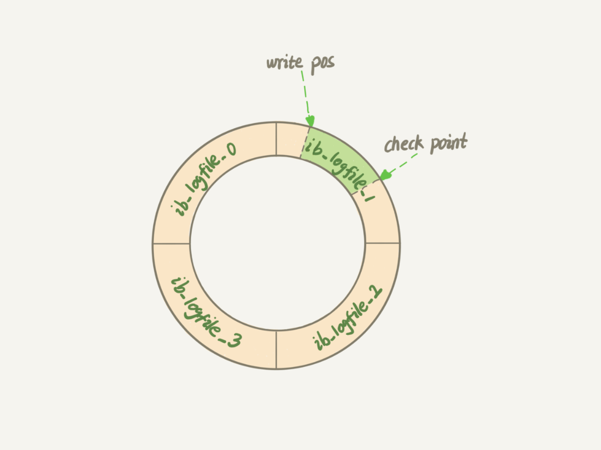

# mysql日志

## redo Log

在Mysql中，MySQL为了解决每次更新或者插入数据的时候，都需要操作磁盘IO引发的成本高的问题，引入了`WAL`技术，全称为`Write-Ahead Logging`，它的关键点就是先写日志、再写磁盘。

- 当有一条记录需要更新的时候，InnoDB引擎会先把记录写到redo log, 并更新内存。这个时候更新操作就算完成了。
- InnoDB引擎会在适当的时候，将这个操作记录更新到磁盘里面，而这个更新往往是在系统比较空闲的时候做的

### 日志设计

InnoDB的redo log是固定大小的，比如可以配置为一组4个文件，每个文件的大小是1GB, 那么整个redo log就有4GB的操作大小。从头开始写，写到末尾就又回到开头循环写。



- `write pos`是当前记录的位置，一边写一边后移，写到第三号文件末尾就回到第0号文件开头
- `checkpoint`是当前要擦除的位置，也是往后推移并且循环的，擦除记录前要把记录更新到数据文件。

> redo log , 保证了InnoDB即使数据库发生异常重启，之前提交的记录都不会丢失，这个能力称为`crash-safe`

## binlog

MySQL整理来看，包含了两部分:

- server层，主要做的是MySQL功能层面上的事情
- 引擎层, 负责存储相关的具体事宜

> redo log 是InnoDB引擎特有的日志，而Server层也有自己的日志，称为binlog

## redo log 与binlog区别

- redo log 是InnoDB引擎特有的；binlog是MySQL的Server层实现的，所有引擎都可以使用
- redo log是物理日志，记录的是`在某个数据页上做了什么修改`; binlog是逻辑日志，记录的是这个语句的原始逻辑，比如`ID=2`这一行的c字段加1
- redo log是循环写的，空间固定会用完; binlog是可以追加写入的。`追加写`是指binlog文件写到一定大小后会切换到下一个，并不会覆盖以前的日志。

## SQL更新执行过程

加入有一下更新操作:

```sql
update t1 set id = id +1 where id = 2;
```

执行过程如下：

- 执行器调用引擎获取`id = 2`数据，id是主键，引擎直接用树搜索找到这一行。如果`id=2`这一行所在的数据页本来就在内存中，直接返回给执行器; 否则，需要先从磁盘加载行所在页，再获取行数据，并返回
- 执行器拿到引擎的含数据，把id+1，的到新的一行数据，再调用引擎接口写入这一行新数据
- 引擎将这行新数据更新到内存中(Buffer Pool)中，同事将这个更新操作记录到`redo log`中，此时`redo log`是`prepare`状态，然后告知执行器执行完成，随时可以提交事务
- 执行器生成这个操作的`binlog`, 并将binlog写入到磁盘
- 执行器调用引擎的提交事务接口，引擎把刚刚写入的redo log 改成提交`commit`状态，更新完成


## 两阶段提交

由于redo log和binlog是两个独立的逻辑，如果不用连接段提交，要么就是先写完redo log在写binlog, 或者顺序反过来。

仍然使用上面的update的示例来具体。假设当前id=2的行，字段c的值是0，再假设执行update语句过程中写完第一个日志后，第二个日志还没有写完，期间发生了crash, 会出现一下两种情况：

- 先写redo log, 后写binlog. 假设在redo log写完，binlog还没有写完的时候，MySQL进程异常重启。由于之前说过, redo log写完之后，系统即使崩溃，仍然能够把数据恢复回来，所以恢复后这这一行c的值是`1`. 但是由于binlog在crash之前并没有写入磁盘，这时候binlog中缺少了记录这个语句的操作。因此在之后从库开始同步或者备份的时候，会导致数据不一致的情况。
- 先写binlog后写redo log. 如果在binlog写完之后crash, 由于redo log还没写，崩溃回复以后这个事务无效，所以这一行的c的值是0.但是binlog却记录了`0->1`的日志。所以，在之后用binlog来恢复的时候就多了一个事务出来，恢复出来的这一行c的值就是1，造成数据不一致。

> redo log 与 binlog都可以用于表示事务的提交状态，而两阶段提交就是让这两个状态逻辑上的一致。

## 参数配置

- redo log 配置：
  - `innodb_flush_log_at_trx_commit = 1`表示每次事务的redo log都直接持久化到磁盘。这样可以保证MySQL异常重启之后数据不丢失
- binlog配置
  - `sync_binlog = 1`表示每次事务的binlog都持久化到磁盘。这样可以博阿正MySQL异常重启之后binlog不丢失