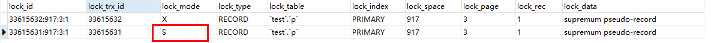

## 数据库相关概念的学习

1. 不可重复读
不能重复读是指在事务开始之后, 第一次读取的结果集和第二次读取的结果集不一致。

EG:
TRANSACTION1: select * from p where id < 5;
TRANSACTION2: insert into p values (2);
TRANSACTION2: commit;
TRANSACTION1: select * from p where id < 5;

以上是作为一个正确的事务执行顺序, 如果`TRANSACTION1`两次执行了相同的SQL语句, 但是却获取了`TRANSACTION2`插入的结果。 这种主要是事务级别为`READ COMMITTED`时出现。

2. 脏读
脏读是指的事务之间读取了其他事务没有提交的数据

EG:
TRANSACTION1: BEGIN
TRANSACTION1: SELECT * FROM p WHERE id < 5;
TRANSACTION2: BEGIN
TRANSACTION2: INSERT INTO p VALUES (2);
TRANSACTION1: SELECT * FROM p WHERE id < 5;

`TRANSACTION1`两次读取之间，事务`TRANSACTION2`插入了一条数据，但是没有提交，如果`TRANSACTION1`读取到了`TRANSACTION2`插入的数据, 这就产生了数据脏读. 这种情况主要出现在`READ UNCOMMITTED`的隔离级别之下。

3. 幻读
幻读指的是两个事务之间, 操作相同的数据差生了冲突，导致另外一个事务无法正常执行业务的后续操作。

TRANSACTION1: `BEGIN`;
TRANSACTION1: `SELECT * FROM WHERE id = 1`;

TRANSACTION2: `BEGIN`;
TRANSACTION2: `INSERT INTO p VALUES (1)`;

TRANSACTION1: `INSERT INTO p VALUES (1)`;
ERROR 1062 (23000): `Duplicate entry '1' for key 'PRIMARY'`

以上主要操作了两个事务, 在`TRANSACTION1`中判断`id=1`的记录不存在, 准备插入一个`id = 1`的记录, 但是在这期间, `TRANSACTION2`插入了一条`id = 1`的记录, 这是导致了`TRANSACTION1`插入失败，但是当通过`select * from where id = 1`查询这条记录时, 却查询不到这条记录, 这是因为`mysql`采用了`REPEATABLE READ`的策略，导致了其他事务提交的数据不能被读取到。

解决幻读最好的办法就是通过`锁`的方式对需要操作的数据加锁, 防止事务执行失败。

> NOTE: 在`Serializable`隔离级别之下, 查询语句默认的都会加锁(共享锁(S)), 因此这种的话, `TRANSACTION1`的第三部可以正常执行,`TRANSACTION2`等待锁的释放.

