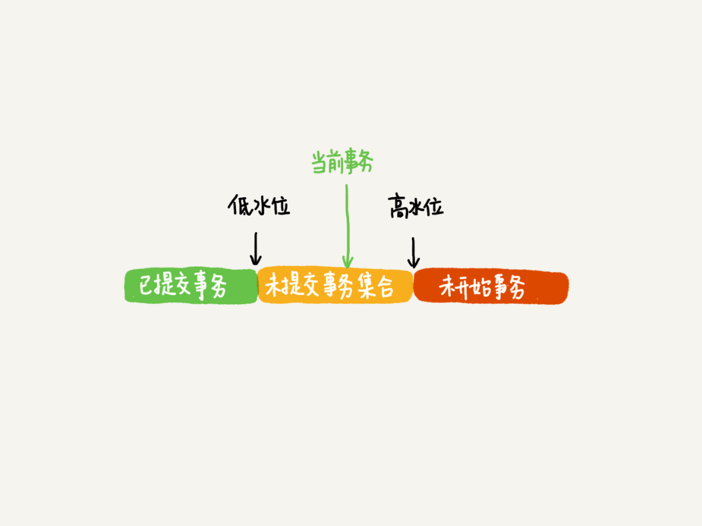

## MySQL 事务
### mysql事务的四个特性
1. 原子性(Atomicity)
原子性是指整个数据库事务是不可分割的工作单位。只有使事务中的所有数据库操作都成功，整个事务才算成功。如果事务中任何一个SQL执行失败，已执行的SQL的操作必须被撤销, 数据库状态应该回退到执行事务前的状态。

2. 一致性(Consistency)
一致性是指事务将数据库从一个状态转换为下一个一致性的状态。在事务开始前和开始后, 数据的完整性约束没有被破坏。

3. 隔离性(Isolation)
一个事务的影响在提交前对其他事务都是不可见的。 - 这种通过锁的机制来实现。

4. 持久性(durability)
事务一旦提交，其结果就是永久性的。即使发生宕机的行为, 数据库也能够恢复数据。

## 事务的实现
在Mysql中, 事务的原子性，一致性，持久性都是通过`redo`和`undo`来实现的

### redo
在InnoDB存储引擎中，事务日志通过重做(redo)日志文件和InnoDB存储引擎的日志缓冲(InnoDB Log Buffer)来实现的. 当开始一个事务时，会记录该事物的一个LSN(Log Sequence Number, 日志序列号); 当执行事务时，会往InnoDB存储日志的缓冲里插入事务日志；
当事务提交时, 必须将InnoDB的日志缓冲写入磁盘(默认的实现: `innodb_flush_log_at_trx_commit=1`). 也就是写数据之前，先写日志。这种方式叫做预写日志方式(Write-Ahead Logging) WAL

### undo
重做日志记录了事务的行为，可以很好的通过其进行"重做"。但是事务有时候还需要撤销，这时就需要undo. 对于undo的实现， Mysql主要通过相反的方式记录， 例如INSERT操作, 实际上会记录一个DELETE操作。 对于DELETE操作，会记录一个INSERT语句。对于UPDATE会有一个相反的UPDATE操作。

> NOTE: 在进行`INSERT`或者`DELETE`操作的时候, 会产生多个`undo`页。  在每次进行事务提交之后，undo也信息并不是每次都进行回收，回收的操作是在`master thread`中进行的, `master thread`中也不是每次都是对`undo`页信息进行回收。

### 事务控制语句
- `START TRANSACTION | BEGIN` : 显式的开启一个事务
- `COMMIT`: 提交事务, 事务对数据的更改将会保存到数据库, 并且是永久性保存。
- `ROLLBACK`: 结束一个事务，并回滚所有的没有提交的修改。
- `SAVEPOINT identifier`: 在当前事务中创建一个保存点, 一个事务中允许创建多个保存点
- `RELEASE SAVEPOINT identifier`: 删除一个事务的保存点, 如果删除的保存点不存在, 则会抛出异常
- `ROLLBACK TO [SAVEPOINT] indentifier`: 这个语句与SAVEPOINT一起起作用。可以把事务回滚到标记点，而不用回滚在标记点前的任何工作。
- `SET TRANSACTION`: 这个语句用来设置事务的隔离级别。InnoDB引擎提供的事务隔离级别有: `READ UNCOMMITTED`, `READ COMMITTED`, `REPEATABLE READ`,`SERIALIZABLE`四种隔离级别。

> begin/start transaction 命令并不是一个事务的七点，在执行到他们之后的第一个InnoDB表的语句，事务才真正启动。如果要马上启动一个事务，可以使用`start transaction with consistent snapshot`

#### 事务的启动方式

- 第一种启动方式，一致性视图是在执行第一个快照读语句时创建
- 第二种启动方式，一致性视图是在执行start transaction with consistent snapshot时创建的。

## 事务的隔离级别
- READ UNCOMMITTED(未提交读)
  - 一个事务还没有提交时，他做的变更就能被别的事务看到。
  - 在事务A读取数据时，事务B读取数据时加了共享锁，修改数据时加了排他锁。这种隔离级别，会导致脏读，不可重复读，以及幻读

- READ COMMITTED(读已提交)
  - 一个事务提交之后，它所做的变更才会被其他事务看到
  - 在事务A读取数据时增加了共享锁，一旦读取，立即释放锁。事务B读取修改数据时增加了行级排它锁，直到事务结束后才释放锁。也就是说，事务A在读取数据时，事务B只能读取数据，不能修改。当事务A读取到数据后，事务B才能修改。这种隔离级别可以避免`脏读`. 但依然存在不可重复读以及幻读的问题。

- REPEATABLE READ（可重复读）
  - 一个事务执行过程中看到的数据，总是跟这个事务在启动时看到的数据是一致的。当然在可重复度隔离级别下，未提交的变更对其他事务也是不可见的。
  - 在事务A读取数据时增加了共享锁，事务结束，才释放锁。事务B读取修改数据时增加了行级排它锁，直到事务结束后才释放锁。也就是说，事务A在没有结束事务时，事务B只能读取数据，不能修改。当事务A结束事务，事务B才能修改。这种隔离级别，可以避免脏读，不可重复读，但依然存在幻读的问题。

- SERIALIZABLE(可序列化)
  - 写会加锁，读会加锁。当出现读写所出图的时候，后访问的事务必须等待前一个事务执行完成，才能继续执行。
  - 在事务A读取数据时，增加了共享锁，事务结束，才释放锁，事务B读取修改数据时，增加了`表级排它锁`。可序列化解决了脏读，不可重复读，幻读等问题，但隔离级别越高的同事，并发性越来越低


隔离级别越低，事务请求的锁越少,或者保持锁的时间就越短。这也就是为什么大多数的数据采用的都是`READ COMMITTED`的模型。

可以通过以下的命令, 来设置会话或者全局的事务级别:
```sh
set [global | session ] transaction isolation level [READ UNCOMMITTED | READ COMMITTED | REPEATABLE READ | SERIALIZABLE]
```

如果想在mysql启动的时候就是用默认的隔离级别，需要在mysql配置文件中配置一下信息:
```sh
transaction-isolation=READ-COMMITTED
```

查看当前级别的事务隔离级别:

```sh
select @@tx_isolation
```

查看全局的隔离级别
```#!/bin/sh
select @@global.tx_isolation
```

> NOTE: 在SERIALIZABLE的隔离级别下，InnoDB会为所有的SELECT操作加一个`LOCK IN SHARE MODE`加一个共享锁。

### 实现方式

在实现上，数据库里会创建一个视图，访问的时候以视图的逻辑结果为准。

- 在`可重复度(RR)`隔离级别下，这个视图是在事务启动的时候创建的，这个事务存在期间都用这个事务。
- 在`读提交(RC)`隔离级别下，这个视图是在每个SQL语句开始执行的时候创建的。
- `读未提交(RU)`隔离级别下直接返回记录上的最新值，没有视图概念
- 而串行化隔离级别下直接用加锁的方式来避免并行访问。

### 事务隔离的实现

在MySQL中，实际上每条记录在更新的时候都会同时记录一条回滚操作。记录上的最新值通过回滚操作，都可以的到前一个值的状态。


当前值是4， 但是在查询这条记录的时候，不同时刻启动的事务会有不同的`read-view`. 在上图中，A, B, C里面，这一个记录的值分别是1, 2, 4. 同一条记录在系统中可以存在多个版本。就是数据库的多版本并发控制(MVCC). 对于read-view A ，要得到1， 就必须将当前值依次执行图中所有的`回滚操作`的到。

#### MySQL中的两种视图

- 一个是view. 它是一个用查询语句定义的虚拟表，而调用的时候执行查询语句并生成结果。创建视图的语法是`create view...`, 而它的查询方法与表一样
- 另外一个是InnoDB在实现MVCC时用到的一致性视图，即consistent read view, 用于支持RC和RR隔离级别的实现。

#### MVCC中快照如何工作

InnoDB里面每个事务有一个唯一的事务ID, 叫做`transaction id`. 它是在事务开始的时候向InnoDB的事务系统申请的，`是按申请的顺序严格递增的`。

而每行数据也是有多个版本的，每次事务更新数据的时候，都会生成一个新的数据版本，并且吧`transaction id`复制给这个数据版本的事务ID, 记为`row_trx_id`. 同时，就的数据版本要保留，并且在新的数据版本中，能够有信息可以直接拿到它。


在上图中，图2中的三个虚线箭头，就是`undo log`; 而v1, v2, v3并不是物理真实存在的，而是每次需要的时候根据当前版本和undo log计算出来的。

#### MVCC如何实现

按照可重复读的定义，一个事务启动的时候，能够看到左右已经提交的事务结果。但是之后，这个事务执行期间，其他事务对它不可见。

因此，一个事务需要在启动的时候声明说，`以我启动的时刻为准，如果一个数据版本是在我启动之前生成的，就能够见到。如果是我启动以后才生成的，就无法看见，我就必须要找到它的上一个版本。`

在实现上，InnoDB为每个事务构造一个数组，用来保存这个事务启动瞬间，当前正在`活跃`的所有事务ID, `活跃`指的就是，启动了但还没提交。

> 同时我们也考虑到，如果有正在执行的事务，在执行的过程中也是可能会更新的，因此也是不可见的，因此在mysql中会维护一个正在执行的事务列表，在执行中的事务也是不可见的。

数组里面事务ID的最小值记为低水位，当前系统里面已经创建过的事务ID的最大值加1记为高水位。这个视图数组和高水位，就组成了当前事务的一致性视图(read-view)



这样对于当前事务启动瞬间来说，一个数据版本的row_trx_id，有以下几种可能:

1. 如果落在绿色部分，表示这个版本是已提交的事务或者是当前事务自己生成的，这个数据可见的。
2. 如果落在红色部分，表示这个版本是由将来启动的事务生成的，是肯定不可见的
3. 如果落在黄色部分，那么就包含了两种情况：
   1. 若row_trx_id在数组中，表示这个版本是由还没有提交的事务生成，不可见
   2. 若row_trx_id不在数组中，表示这个版本已经提交了的事务生成的，可见

> 对于更新而言，所有更新数据都是先读后写的，而这个读，只能读当前的值，成为`当前读`

可重复读的核心就是一致性读；而事务更新数据的时候，就只能用当前读，如果当前的记录的行锁被其他事务占用的话，就会进入所等待。

而读提交逻辑与可重复读的逻辑类似，主要有一下区别：

- 在可重复读隔离级别下，只需要在事务开始的时候创建一致性读，之后事务里的其他查询都功用这个一致性读
- 在读提交隔离级别下，每个语句执行前都会重新算出一个新的视图。

#### 在读提交隔离下的逻辑


这个时候，事务A的查询语句的视图数组在执行这个语句的时候创建的，时序上(1, 2), (1,3)生成时间都在创建这个视图数组的时刻之前，但是在这个时刻:

- (1,3)还没有提交，属于情况1， 不可见
- (1,2)提交了，属于情况3， 可见

#### 回滚日志什么时候删除?

在不需要的时候删除回滚日志，系统会判断，当前没有事务需要用到这些回滚日志时， 回滚日志就会被删除。

#### 长事务的影响

- 长事务意味着系统里面会存在很老的事务视图。由于这些事务随时可能访问数据库里面的任何数据，所以这个这个事务提交之前，数据库里面它可能用到的回滚记录都必须保留。这就导致占用大量存储空间。
- 除此之外，长事务还占用锁资源，也可能拖垮这个库。

## 分布式事务

分布式事务指的是, 允许多个独立的事务资源参与一个全局事务之中。

分布式事务由一个或者多个资源管理器(Reources Manager)、一个事务管理器(Transaction Manager)以及一个应用程序组成。
- 资源管理器 : 提供访问事务资源的方法。通常一个事务就一个资源管理器
- 事务管理器 : 协调参与全局事务中的各个事务, 需要和参与全局事务中的所有资源管理器进行通信。
- 应用程序 : 定义事务的边界, 指定全局事务中的操作。

### 查看Mysql是否开启分布式事务
```#!/bin/sh
show variables like 'innodb_support_xa'
```

## 不好的事务习惯
1. 在循环中重复提交事务
在循环中重复提交事务，会导致每一次提交都会讲提交的数据记录到`redo`的日志文件中. 例如: 循环10000次，实际上会有10000条`undo`日志. 同时也伴随着, 如果中途因为某条语句插入失败，已经插入的数据实际上时不能回滚的。因此因当前在循环中，将操作的数据放到同一个事务当中, 这是性能会提升更多。

2. 使用自动回滚
如果在存储过程中, 使用了自动回滚，或者进行了异常的捕获, 实际上在程序调用的时候，很难捕获到异常信息, 我们可以将存储过程中的事务放到程序之中, 然后调用存储过程, 并在程序之中进行提交或者回滚。
