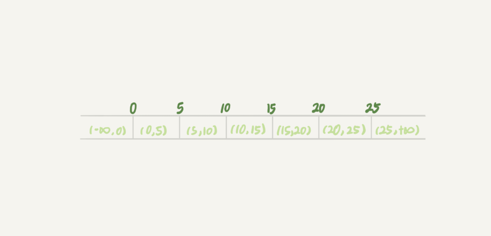
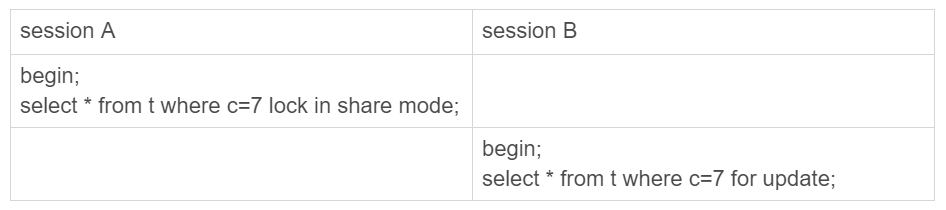

### 幻读

> 什么是幻读。 幻读是指一个事务在前后两次查询同一个范围的时候，后一次查询看到了前一次没有看到的行。
>
> - 在可重复读隔离级别下，普通的查询是快照读，是不会看到别的事务插入的数据的。因此，幻读在`当前读`下才会出现
> - 如果查询的范围数据被修改，然后通过`当前读`查询出来，不能为幻读，幻读仅专指`新插入的行`

#### 如何解决幻读

```sql

CREATE TABLE `t` (
  `id` int(11) NOT NULL,
  `c` int(11) DEFAULT NULL,
  `d` int(11) DEFAULT NULL,
  PRIMARY KEY (`id`),
  KEY `c` (`c`)
) ENGINE=InnoDB;

insert into t values(0,0,0),(5,5,5),
(10,10,10),(15,15,15),(20,20,20),(25,25,25);
```


产生幻读的原因，行锁只能锁住行，但是新插入记录这个动作，要更新的是记录之间的间隙. 因此解决幻读问题，InnoDB只好引入新的锁，也就是间隙锁(Gap Lock).

在上面的sql中，插入了六条记录，却产生了7个间隙锁。



当我们在执行`select * from t where d = 5 for update`的时候，就不知道给数据库中已有的6个记录加上了行锁，还同时加了7个间隙锁。这样就确保了无法再插入新的记录。


在间隙锁中，跟间隙锁`存在冲突关系的，是往间隙中插入一个记录`操作。



这里sessionB不会被堵住。因为t表里并没有c=7这个记录，因此sessionA加的间隙锁(5,20). 而session B也是在这个间隙间加的间隙锁。

## next-key lock

`间隙锁`和`行锁`合称next-key lock. 每个next-key lock是前开后闭区间。也就是说，我们的表t初始化以后，如果`select * from t for update`要把整个表所有记录锁起来，就形成了7个next-key lock, 分别是`(负无穷大, 0],(0, 5],(5, 10],(10, 15],(15, 20],(20, 25],(25, +supermum], `

> 间隙锁和next-key lock的引入，帮我们解决了幻读的问题。但是可能会导致同样的语句锁住更大的范围，这其实影响了并发度的。

另外间隙锁并不是在所有的事务隔离级别下都会生效的，因此，间隙锁只会在可重复读的隔离级别下才会生效。如果我们将隔离级别设置为读提交，就没有间隙锁了。

