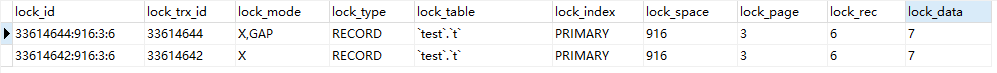

## 数据库锁

### 什么是锁?
数据库锁是用于对公共资源的并发访问。是为了保证数据的并发性和一致性

### 锁类型
- 共享锁(S Lock): 允许事务读取一行数据
- 排它锁(X Lock): 允许事务更新或者删除一条数据
- 意向排它锁(IS Lock): 事务想要获取一个表中某几行的排它锁
- 意向共享锁(XS Lock): 事务想要获取一个表中某几行的共享锁

#### 锁兼容
如果一个事务获得了行R的共享锁, 那么另外一个事务可以立即获得行R的共享锁。

#### 锁不兼容
如果事务想获取行R的排他锁，则必须等待事务释放行R上的共享锁。

#### 排它锁和共享锁的兼容性
||X|S|
| :-----: | :------: | :-------: |
| ------- | -------- | --------- |
| X       | 冲突     | 冲突      |
| S       | 冲突     | 兼容      |

Mysql InnoDB引擎支持多粒度锁定, 这种锁定支持行级上的锁和表级上的锁同时存在.为了支持不同粒度的锁定, mysql支持一种额外的锁定方式

### 意向锁
意向锁是表级锁，用来揭示下一行将要请求的锁类型。因为InnoDB支持的是行级别的锁, 因此意向锁不会阻塞除全表扫描以外的任何请求。


### 查看当前锁的请求信息
```sh
SHOW ENGINE INNODB STATUS
```

在`Innodb Plugin`出来之前, 我们可以通过`SHOW PROCESSLIST`或者`SHOW ENGINE INNONB STATUS`的状态来查看锁定的状况, 在新版的`Mysql`中, 我们可以通过`INNODB_TRX`,`INNODB_LOCKS`,`INNODB_LOCK_WAITS`通过这三张表监控当前的事务并分析可能存在的锁的问题

### INNODB_TRX
- trx_id: InnoDB引擎内部唯一的事务ID
- trx_state: 当前事务状态
- trx_started: 事务开始时间
- trx_requested_lock_id: 等待事务的锁ID. 如果`trx_state`的状态为`LOCK WAIT`, 那么该值代表当前的事务等待之前事务占用锁资源的ID. 如果`trx_state`的状态不是`LOCK WAIT`, 则该值为`null`
- trx_wait_started: 事务等待的开始时间
- trx_weight: 事务的权重，反映了一个事务修改和锁住的行数。在InnoDB引擎中发生死锁需要回滚时，InnoDB会选择该值最小的进行回滚。
- trx_mysql_thread_id: MYSQL中的线程ID, SHOW PROCESSLIST 显示的结果
- trx_query: 事务运行的SQL语句. 在实际运行中发现, 该值可能会存在为NULL.

在`INNODB_TRX`中并不能判断锁的情况, 需要通过`INNODB_LOCKS`进行查看

### INNODB_LOCKS
- lock_id : 锁ID
- lock_trx_id: 事务ID
- lock_mode: 锁定模式
- lock_type: 锁的类型，表锁还是行锁
- lock_table: 要加锁的表
- lock_index: 锁的索引
- lock_space: InnoDB存储引擎表空间的ID号
- lock_page: 被锁住的页的数量。如果为表锁，该列为NULL
- lock_rec: 被锁住行的数量, 如果为标所，该列为NULL
- lock_data: 被锁住行的主键值.当是表锁时，该列为NULL

### INNODB_LOCK_WAITS
可以很直观的查看锁的等待情况
- requesting_trx_id : 申请锁资源的事务ID
- requesting_lock_id: 申请的锁资源
- blocking_trx_id: 阻塞的事务ID
- blocking_trx_id: 阻塞的锁的ID

## MVCC(多版本并发控制)
快照数据其实就是行数据的历史版本，可能有多个版本存在。一个行数据不止一个版本的历史数据，这种技术被称为行多版本技术。由此带来的并发控制, 称之为多并发版本控制。

在`Read Commited`和`Repeatable Read`(InnoDB 默认的事务级别)中, 都是使用非锁定的一致性读。然而对于快照的定义却不同.
- `Read Commited`隔离模式中, 对于快照数据，非锁定读总是读取被锁定行的最新快照数据.
- `Repeatable Read`个例模式中, 对于快照数据, 非锁定读总是读取事务开始时的快照数据.

### 锁定读
- SELECT ... FOR UPDATE (加的是一个`X`锁，其他任务的锁定操作都会被阻塞)
- SELECT ... LOCK IN SHARE MODE (加的是一个`S`锁, 其他的事务可以在之上加`S`锁，但是不能加`X`锁, 会被阻塞)


## 自增长和锁
### 自增长方式
```sql
select max(auto_inc_col) from t FOR UPDATE
```

插入操作会依据这个自增长器的值去赋值给自增长列，这种技术被称作`Auto-Inc Locking`. 这种锁其实是一个`表级锁`，为了提高插入的性能, 带锁的释放并不是等到事务完成后，而是完成自增长值插入的SQL后自动释放。

在`5.1.22`版本之后采用了轻量级的自增长.

### 自增长方式分类
- INSERT-like: 指代的是所有的插入语句。如： INSERT, REPACE, INSERT...SELECT, REPLACE...SELECT, LOAD DATA等。
- Simple-insert: Simple insert 指能在插入前就确定插入行数的语句. 这些语句包括`INSERT`, `REPLACE`.但是不包括`INSERT ... ON DUPLICATE KEY UPDATE`这类SQL语句
- Bulk-inserts: 插入前不能确定需要插入的记录行数.例如: INSERT...SELECT, REPLACE...SELECT,LOAD DATA
- Mixed-mode inserts: 指插入中有一部分需要生成ID, 有一部分已经制定了ID. 其中就包括了`INSERT ... ON DUPLICATE KEY UPDATE`

### 设置自增长模式
通过设置`innodb_autoinc_lock_mode`的方式进行指定。一下为具体的取值说明:
- `innodb_autoinc_lock_mode=0`在`5.1.22`版本之前采用的方式, 也就是`AUTO-INC Locking`的方式
- `innodb_autoinc_lock_mode=1`这是该参数的默认值. 对于`simple-inserts`的方式插入数据, 则使用互斥量的方式进行自增（mutux）.而对于`Bulk-inserts`的操作,则依然采用的是`AUTO-INC Locking`的方式进行自增。（如果已经使用`AUTO-INC Locking`生成值，在使用`simple-inserts`的方式进行时候，依然会等待锁的释放。但是这种模式可能会导致事务回滚之后, 导致自增的值不能连续）(大致的意思是说: 如果通过insert已经执行过的SQL语句, 在事务末尾进行了回滚，这是自增的值不会回滚。)
- `innodb_autoinc_lock_mode=2`表示的是所有的`INSERT-like`都是采用的互斥量(mutux)进行自增, 而不是采用`AUTO-INC Locking`方式

> NOTE: 在mysql中，自增长的列必须是索引，并且必须处在所以的第一列。

## 外键和锁
外键主要用于引用完整性的约束检查。

> NOTE: 对于一个外键列, 如果没有显示的对这个列加索引, InnoDB会自动的为其加上一个索引, 因为这样可以避免表级锁。`oracle`在这方面没有加上索引, 需要手工的加上，这也是导致了很多死锁的原因。

> NOTE: 对于外键值的插入和更新，都会先查询父表中的记录．即`SELECT`父表。但是对于父表的`SELECT`操作，并不是非锁定模式, 因为这样会导致数据不一致的问题。因此这是使用的是`SELECT ... LOCK IN SHARE MODE`的方式。如果需要查询的列上已经有了`X`锁, 则会阻塞。(加入使用的非锁定读, 那么就可能导致在进行级联更新的时候, 父表中的关联数据已经被删除。)

## 锁的算法
InnoDB中有3种行锁的算法设计, 分别是:
- Record Lock: 单个记录上的锁
- Gap Lock: 间隙锁, 锁定一个范围的记录，但是不包括记录本身。
- Next-Key Lock: Gap Lock + Record Lock, 锁定一个范围，并锁定记录本身

`Record Lock`总是会去锁定索引记录。如果InnoDB在创建表的时候没有指定任何一个索引，将会使用隐式的主键来进行锁定。

例如:
|SessionA|SessionB|
| :-------                                       | :-------                                |
| ---------------------------------------------- | --------------------------------------- |
| begin;                                         |                                         |
| select * from t where a < 6 lock in share mode | begin;                                  |
|                                                | insert into t select 5(或者6)(blocking) |

在这种情况下，无论是插入5或者6都会处于`Blocking`状态, 因为在`Next-Key Lock`模式下,锁定的是(-∞,6)范围内的所有的数据. 以为`5`和`6`刚好在锁定范围内, 因此必须进行阻塞。

> NOTE: 以上的演示都是在`InnoDB`默认的配置下进行的, 即事务的隔离级别为`Repetable Readable`的模式下。因为在`Repeatble Readable`模式下,`Next-Key Lock`算法为默认的锁定算法。

> NOTE: 经过试验, 如果范围锁定的条件不存在, 这时MySQL除了会锁定范围内的数据之外，`同时也会锁定其后的第一条记录`. 例如以上的数据中, 6这条记录不存在, 那么插入`insert into t select 7`这条数据时，也会产生阻塞。(具体为什么，我也不知道!).



## 锁问题
1. 丢失更新
丢失更新（Lost Update）是一个很经典的数据库问题。
- 事务T1查询一条数据，并放在本地内存, 展示给用户USER1
- 事务T2查询一条数据, 并放在本地内存, 展示给用户USER2
- 这是USE1修改了数据并进行保存
- USER2修改了数据并进行保存。

解决这种问题的办法就是, 通过对操作记录进行加锁的办法，让并行的事务串行处理。

2. 脏读
脏数据和脏页有所不同
> 脏页: 在内存池中已经被修改的页, 还没有来的及刷新到磁盘, 即数据库实例内存中的页数据与磁盘上的页中数据不一致。当然，在数据刷新到磁盘之前，已经写到了日志文件之中。

> 脏数据: 在缓存池中被修改的数据, 并且没有被提交(例如: 事务隔离级别为: `READ-UNCOMMITED`)。(可以理解为: 一个事务读到了另外一个事务中没有提交的数据, 这就违背了事务的隔离性。)

可以通过`set @@tx_isolation='read-uncommitted'`进行临时的事务隔离级别的切换，并进行测试。

3. 不可重复读
不可重复读是指在一个事务里多次读取同一数据。例如, 在第一个事务两次读取数据期间, 第二个事务对相同数据进行了修改，这就会导致一个事务内的两次读取的数据产生差异, 这就是不可重复读。

不可重复读和脏读的区别: 脏读则是读取的是没有提交的数据, 不可重复读是指的是已经已提交的数据。但是违反了数据库事务的一致性。

在MySQL中采用了`Next-Key Lock`的方式避免不可重复读。在通过对索引锁定的时候, 不仅仅是锁定了扫描到的索引, 也会锁定这些索引覆盖的范围。因此对于这个范围内的插入是不允许的。这就避免了另外的事务在锁定的方位内进行数据插入而导致的不可重复读的问题。因此MySQL默认的事务级别为`Repeatable Read`, 并采用`Next-Key Lock`的算法。

## 死锁
前面有说道, MySQL不会回滚大部分异常的，但是对于死锁一定会回滚当前的事务。发现死锁之后, InnoDB立马回滚当前的事务, 其实在程序中得到了`1213`的异常，其实是不需要进行回滚的。

在`Oracle`中产生死锁的原因是没有对外键进行添加索引, 但是`InnoDB`会自动为外键加上索引。因此可以良好的避免死锁的问题, 人为的删除这种索引，会跑出异常.

> NOTE: 当默认删除外键上的索引的时候，会抛出异常，异常信息如下: `ERROR 1553 (HY000): Cannot drop index 'b': needed in a foreign key constraint`

## 阻塞
因为锁的不兼容情况，所以有时候再获取锁的时候需要等待另外一个事务的锁释放锁占用的资源. 在InnoDB的源码中，使用了`Mutux`的数据结构实现锁。 在访问资源前需要使用`mutux_enter`进行获取锁, 在访问资源或者修改资源技术后立即执行`mutux_exit`进行锁的释放。

### 参数设置
- innodb_lock_wait_timeout: 用来控制锁的等待时间，默认为(50s)
- innodb_rollback_on_timeout: 用来标记在等待超时之后，是否对操作的数据进行回滚(默认是OFF)

其中`innodb_lock_wait_timeout`是动态的，可以在数据库运行阶段直接进行更改。但是`innodb_rollback_on_timeout`是属于静态的配置, 不能直接在数据库运行阶段更改，如果通过`set @@innodb_rollback_on_timeout=on`进行操作，会出现`1025的错误信息`

mysql在事务中`多数情况下出现异常都不会回滚数据`, 因此需要我们在使用的时候对事务进行`commit`或者`rollback`的操作。

## 锁升级
在`InnoDB`中不存在锁升级的情况，在`InnoDB`中，1 个锁和1000000个锁的开销是一样的，都没有开销。
