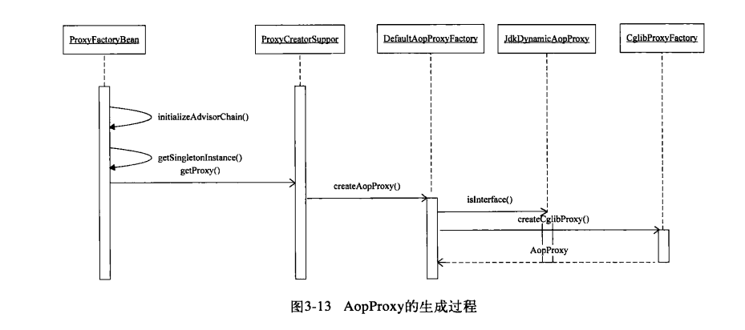

# AOP的相关概念

## Advice 通知
Advice作为通知, 定义了在切入点应该做什么,  为切面提供织入的功能。
- BeforeAdvice
- AfterAdvice
- ThrowAdvice

通知, 用于处理增强的函数回调, 在每个类中都定义了回调的函数, 在对PointCut的进行增强的时候, 会调用对应的通知回调函数进行相应的处理.

## Pointcut 切入点

切入点是指: 决定了那些对那些方法进行增强

## Advisor 通知器

通知器是堆通知和切入点的整合

## ProxyFactoryBean
在Spring中, AOP代理对象成生成都是使用`ProxyFactoryBean`作为入口, 通过`getObject`方法来生成AOP的代理对象

### AopProxy

在Spring中, AOP一共有两个实现方式
- JdkDynamicAopProxy : 当别代理的对象是一个接口的时候, 采用这种方式
- Cglib2AopProxy: Cglib的方式, 除开接口意外的代理方式(会通过加载`net.sf.cglib.proxy.Enhancer`判断是否在CLASSPATH中引入了对应的包)
- 关于AOP的所有的配置, 都是存放在`AdvisedSupport`的类中

#### JdkDynamicAopProxy
- 本身是一个InvocationHandler的实现, 因此`JdkDynamicAopProxy`封装了所有的AOP的实现过程
- 通过`getProxy`创建代理对象

#### Cglib2AopProxy
- 通过CGLIB实现代理模式
- 通过设置Callbacks实现AOP的增强功能和回调
- 在`Cglib2AopProxy`中, 使用了`DynamicAdvisedInterceptor`实现对`Advice`的回调

## AOP 的实现原理
在AOP Proxy被创建的时候, 相关的拦截器(Advisor/Interceptor)已经被设置到了代理对象中去了, 拦截器在代理对象起作用是通过对拦截器对象的方法调用来实现的。

- JDK Proxy 的代理对象, 主要通过`InvocationHandler`来实现拦截器的回调
- CGLIB Proxy 使用第三方的代理实现, 需要遵循CGLIB的规范, 通过`DynamicAdvisedInterceptor`实现回调
