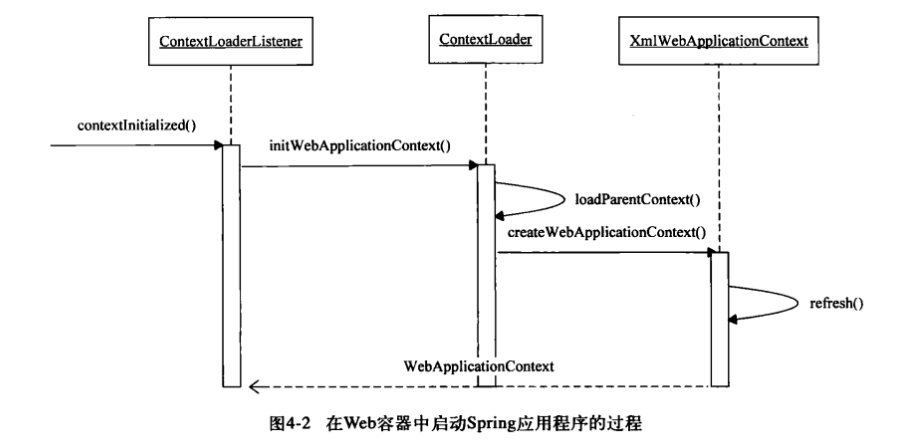
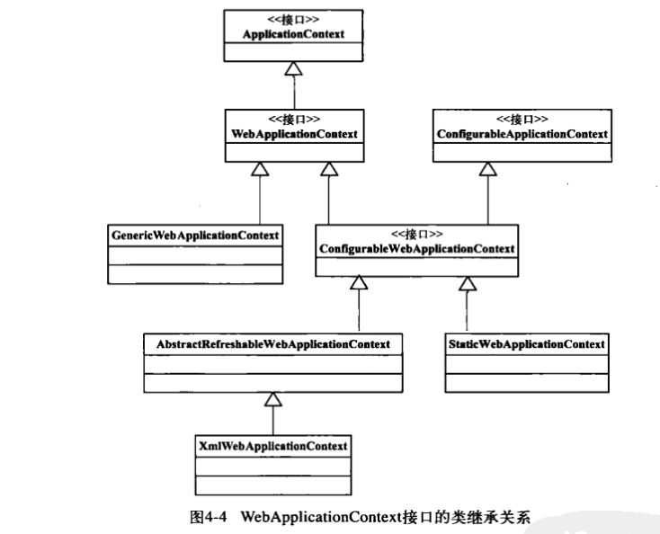

# SpringMVC实现原理
SpringMVC是建立在Spring IOC之上的, 在学习SpringMVC之前, 需要知道Spring MVC中是如何启动Spring MVC容器的

## WEB环境中的相关配置
```xml
<servlet>
  <servlet-name>sample</servlet-name>
  <servlet-class>org.springframework.web.servlet.DispatcherServlet</servlet-class>
  <load-on-start-up>2</load-on-start-up>
</servlet>

<servlet-mapping>
  <servlet-name>sample</servlet-name>
  <url-pattern>/*</url-pattern>
</servlet-mapping>

<context-param>
  <param-name>contextConfigLocation</param-name>
  <param-value>/WEB-INF/applicationContext.xml</param-value>
</context-param>

<listener>
  <listener-class>org.springframework.web.context.ContextLoaderListener</listener-class>
</listener>
```

- DispatcherServlet 用来分发请求
- ContextLoaderListener 用来加载Spring IOC容器, 用来加载在`context-param`中定义的`xml`配置文件

## 容器的启动
容器的启动时根据`ContextLoaderListener`中的`contextInitialized()`方法启动, 如题的加载序列图如下.


以下为`WebApplicationContext`的继承类图:


### WebApplication中的加载方式
- 通过默认的xml配置方式：`/WEB-INF/applicationContext.xml`
- 通过`namespace`的方式加载, 诸如`/WEB-INF/namespace.xml`, 例如可以根据`DispatcherServlet`的`servlet-name`来加载对应的配置文件
- 配置了文件的加载位置
