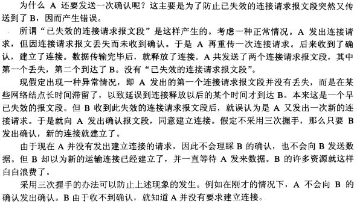

主要学习来源自[通俗大话来理解TCP三次握手四次挥手](https://github.com/jawil/blog/issues/14)
# Socket原理
## 套接字(Socket)概念

套接字（socket）是通信的基石，是支持TCP/IP协议的网络通信的基本操作单元。它是网络通信过程中端点的抽象表示，包含进行网络通信必须的五种信息：`连接使用的协议`，`本地主机的IP地址`，`本地进程的协议端口`，`远地主机的IP地址`，`远地进程的协议端口`。
应用层通过传输层进行数据通信时，TCP会遇到同时为多个应用程序进程提供并发服务的问题。多个TCP连接或多个应用程序进程可能需要通过同一个 TCP协议端口传输数据。为了区别不同的应用程序进程和连接，许多计算机操作系统为应用程序与TCP／IP协议交互提供了套接字(Socket)接口。应 用层可以和传输层通过Socket接口，区分来自不同应用程序进程或网络连接的通信，实现数据传输的并发服务。

## 建立套接字(socket)
建立Socket连接至少需要一对套接字，其中一个运行于客户端，称为`ClientSocket` ，另一个运行于服务器端，称为`ServerSocket`。

套接字之间的连接过程分为三个步骤：
- 服务器监听，
```txt
服务器监听：服务器端套接字并不定位具体的客户端套接字，而是处于等待连接的状态，实时监控网络状态，等待客户端的连接请求。
```
- 客户端请求，
```txt
客户端请求：指客户端的套接字提出连接请求，要连接的目标是服务器端的套接字。
为此，客户端的套接字必须首先描述它要连接的服务器的套接字，指出服务器端套接字的地址和端口号，
然后就向服务器端套接字提出连接请求。
```
- 连接确认。
```txt
连接确认：当服务器端套接字监听到或者说接收到客户端套接字的连接请求时，就响应客户端套接字的请求，
建立一个新的线程，把服务器端套接字的描述发给客户端，一旦客户端确认了此描述，双方就正式建立连接。
而服务器端套接字继续处于监听状态，继续接收其他客户端套接字的连接请求。
```

## socket链接与TCP连接
创建Socket连接时，可以指定使用的传输层协议，Socket可以支持不同的传输层协议（TCP或UDP），当使用TCP协议进行连接时，该Socket连接就是一个TCP连接。

## Socket连接与HTTP连接
由于通常情况下Socket连接就是TCP连接，因此Socket连接一旦建立，通信双方即可开始相互发送数据内容，直到双方连接断开。但在实际网络应用中，客户端到服务器之间的通信往往需要穿越多个中间节点，例如路由器、网关、防火墙等，大部分防火墙默认会关闭长时间处于非活跃状态的连接而导致`Socket`连接断连，因此需要通过轮询告诉网络，该连接处于活跃状态。

而HTTP连接使用的是 "请求—响应" 的方式，不仅在请求时需要先建立连接，而且需要客户端向服务器发出请求后，服务器端才能回复数据。

很多情况下，需要服务器端主动向客户端推送数据，保持客户端与服务器数据的实时与同步。此时若双方建立的是Socket连接，服务器就可以直接将数据传送给客户端；若双方建立的是HTTP连接，则服务器需要等到客户端发送一次请求后才能将数据传回给客户端，因此，客户端定时向服务器端发送连接请求， 不仅可以保持在线，同时也是在“询问”服务器是否有新的数据，如果有就将数据传给客户端。TCP(Transmission Control Protocol)　传输控制协议

TCP是主机对主机层的传输控制协议，提供可靠的连接服务，采用三次握手确认建立一个连接:

> 位码即tcp标志位,有6种标示:SYN(synchronous建立联机) ACK(acknowledgement 确认) PSH(push传送) FIN(finish结束) RST(reset重置) URG(urgent紧急)
Sequence number(顺序号码) Acknowledge number(确认号码)

# TCP是什么?
TCP (Transmission Control Protocol 传输控制协议)是一种面向链接的, 可靠的, 基于字节流的传输通信协议.

以下为OSI七层模型:


- 其中`TCP`工作在第四层(传输层 Tranport)
- `IP`工作在第三层(网络层 NetWork)
- `ARP`工作在第二层(数据链路层 DataLink层)
- 第四层的数据叫做`Segment`

同时我们需要简单的知道, 数据从应用层下来, 每一次鞥都会加上头部信息进行封装, 在发送到数据接收端。对于每一次的网络数据的发送, 都会进行数据的封装和拆封的操作, OSI模型中, 每一层的描述和作用如下:
|OSI中的层|功能|TCP/IP协议族|
| :----  | :---- | :---- |
| ------ | ----- | ----- |
| 应用层 |文件格式, 电子邮件, 文件服务, 虚拟中断 | TFTP, HTTP, SNMP, FTP, SMTP, DNS, Telnet  |
| 表示层 |数据格式化, 代码转换, 数据加密       |没有协议       |
| 会话层       | 解除或建立与别的节点的联系    | 没有协议      |
| 传输层       | 提供端对端的接口      | TCP, UDP      |
| 网络层       | 为数据包选择路由      | IP, ICMP, RIP, OSPF, BGP, IGMP      |
| 数据链路层       |传输有地址的帧以及错误检测功能       |SLIP, CSLIP, PPP, ARP, RARP,MTU      |
| 物理层       | 以二进制形式在物理媒体上进行传输      |ISO2110, IEEE802, IEEE802.2       |

## TCP头部信息
其中`ACK`, `SYN`, `序号`这三部分在以下会用到, 他们的介绍如下图:


以上为`TCP`头部的格式, 这是理解其他内容的基础, 因此这里会详细的说明:
- `Source Port`和`Destination Port`分别占用了在16位(2字节), 表示源端口号和目标端口号, 用以区分主机中的不同进程, 而`ip`地址是用来区分不同的主机的, 源端口号和目的端口号 + `IP首部`的源IP地址以及目的IP地址就能唯一确定一个TCP链接。
- `Sequence Number`：用来标识从`TCP`发端向`TCP`收端发送数据字节流, 它表示在这个报文段中的第一个数据字节在数据流中的序号, 主要用来解决在网络中出现`乱序`的问题。
- `Acknowledgment Number`: 32位确认序列号包含发送确认的一端期望收到的下一个序列号, 因此, 确认序列号应该是上一次已成功收到数据字节序号+1。不过只有当标志位中的`ACK`标志为1时该确认序列号字段才生效.主要用来解决不丢包的问题。
- `Offset`: 给出首部中32bit的数目, 需要这个值是因为任选字段是可变的. 这个字段占(4 bit),(最多能表示15个32bit的字，即4*15=60个字节的首部长度。) 因此`TCP`最多有60个字节的首部。然而没有任选字段, 则正常的长度是20字节。
- `TCP Flags`: TCP首部中有6个标志位, 他们中的多个可以同时被设置为1, 主要用于操作TCP的状态机的, 一次为`URG`, `ACK`, `PSH`, `RST`, `SYN`, `FIN`每个标志位意义如下:
  - URG: 此标志位表示TCP包的紧急指针域有效, 用来保证TCP链接不被中断，并且督促中间层设备尽快处理这些数据。
  - ACK: 此标志位表示答域有效, 就是前面所说的TCP应答号将会包含在TCP数据包中; 可以取两个值: 0 - 表示应答域无效; 1- 应答域有效
  - PSH: 这个标志位表示`Push`操作，所谓`push`操作就是指数据包在到达接收端之后, 立即传送给应用程序, 而不是在缓冲区中排队.
  - RST: 这个标志位表示链接复位请求, 用来复位那些差生错误的链接, 也被用来拒绝错误和非法的数据包。
  - SYN: 表示同步序号, 用来建立连接. 当链接请求时, `SYN`和`ACK`一起使用。
    - SYN=1, ACK=0 表示链接请求
    - SYN=1, ACK=1 表示链接被响应
  这个标识位经常被用来进行端口扫描, 扫描着发送一个只有`SYN`的数据包, 如果对象主机响应了一个数据包, 就表明这个主机存在这个端口; 但是由于这种方式只是进行TCP三次握手的第一次握手, 因此这种扫描方式成功代表了被扫描机器很不安全，一台安全的主机将强制要求一个链接严格进行三次握手。
  - FIN: 表示发送端已经达到数据末尾, 也就是说双方的数据传输完成。没有数据可以传送了。发送`FIN`标示位的数据包后, 链接将被断开。这个标识的数据也经常被用来进行数据扫描。
- windows: 窗口大小, 也就是有名的滑动窗口, 用来进行流量控制。

## 握手和挥手全过程
具体流程如下:


### 三次握手
- 第一次握手: 建立连接. 客户端发送连接请求报文, `SYN=1`M, `Sequence Number`为`x`: seq=x; 客户端进入`SYN_SEND`状态, 等待服务器确认。
- 第二次握手: 服务器收到`SYN`报文段. 服务端收到客户端的`SYN`段，需要对这个`SYN`进行确认,  设置`Acknowledgment Number`为`x+1`(Sequence Number+1)；同时，自己自己还要发送`SYN=1`请求信息，将SYN位置为1，`Sequence Number`为y；服务器端将上述所有信息放到一个报文段（即SYN+ACK报文段）中，一并发送给客户端，此时服务器进入`SYN_RCVD`状态；
- 第三次握手： 客户端收到服务器的`SYN+ACK`报文段。然后将`Acknowledgment Number`设置为`y+1`，向服务器发送`ACK`报文段，这个报文段发送完毕以后，客户端和服务器端都进入`ESTABLISHED`状态，完成TCP三次握手。

完成了三次握手，客户端和服务器端就可以开始传送数据。以上就是TCP三次握手的总体介绍。

### 四次挥手
- 第一次分手：主机1（可以使客户端，也可以是服务器端），设置`Sequence Number`和`Acknowledgment Number`，向主机2发送一个`FIN`报文段；此时，主机1进入`FIN_WAIT_1`状态；这表示主机1没有数据要发送给主机2了；
- 第二次分手：主机2收到了主机1发送的`FIN`报文段，向主机1回一个`ACK`报文段，`Acknowledgment Number`为`Sequence Number`加1；主机1进入`FIN_WAIT_2`状态；主机2告诉主机1，我“同意”你的关闭请求；
- 第三次分手：主机2向主机1发送`FIN`报文段，请求关闭连接，同时主机2进入`LAST_ACK`状态；
- 第四次分手：主机1收到主机2发送的`FIN`报文段，向主机2发送`ACK`报文段，然后主机1进入`TIME_WAIT`状态；主机2收到主机1的`ACK`报文段以后，就关闭连接；此时，主机1等待`2MSL`后依然没有收到回复，则证明Server端已正常关闭，那好，主机1也可以关闭连接了。

## 为什么要三次握手?
> 在谢希仁著《计算机网络》第四版中讲“三次握手”的目的是“为了防止已失效的连接请求报文段突然又传送到了服务端，因而产生错误”。在另一部经典的《计算机网络》一书中讲“三次握手”的目的是为了解决“网络中存在延迟的重复分组”的问题。

> “已失效的连接请求报文段”的产生在这样一种情况下：client发出的第一个连接请求报文段并没有丢失，而是在某个网络结点长时间的滞留了，以致延误到连接释放以后的某个时间才到达server。本来这是一个早已失效的报文段。但server收到此失效的连接请求报文段后，就误认为是client再次发出的一个新的连接请求。于是就向client发出确认报文段，同意建立连接。假设不采用“三次握手”，那么只要server发出确认，新的连接就建立了。由于现在client并没有发出建立连接的请求，因此不会理睬server的确认，也不会向server发送数据。但server却以为新的运输连接已经建立，并一直等待client发来数据。这样，server的很多资源就白白浪费掉了。采用“三次握手”的办法可以防止上述现象发生。例如刚才那种情况，client不会向server的确认发出确认。server由于收不到确认，就知道client并没有要求建立连接。”



## 为什么要四次分手

那四次分手又是为何呢？TCP协议是一种面向连接的、可靠的、基于字节流的运输层通信协议。TCP是`全双工模式`，这就意味着，当主机1发出`FIN`报文段时，只是表示主机1已经没有数据要发送了，主机1告诉主机2，它的数据已经全部发送完毕了；但是，这个时候主机1还是可以接受来自主机2的数据；当主机2返回`ACK`报文段时，表示它已经知道主机1没有数据发送了，但是主机2还是可以发送数据到主机1的；当主机2也发送了`FIN`报文段时，这个时候就表示主机2也没有数据要发送了，就会告诉主机1，我也没有数据要发送了，之后彼此就会愉快的中断这次TCP连接。如果要正确的理解四次分手的原理，就需要了解四次分手过程中的状态变化。

- `FIN_WAIT_1`: 这个状态要好好解释一下，其实`FIN_WAIT_1`和`FIN_WAIT_2`状态的真正含义都是表示等待对方的`FIN`报文。而这两种状态的区别是：`FIN_WAIT_1`状态实际上是当`SOCKET`在`ESTABLISHED`状态时，它想主动关闭连接，向对方发送了`FIN`报文，此时该`SOCKET`即进入到`FIN_WAIT_1`状态。而当对方回应`ACK`报文后，则进入到`FIN_WAIT_2`状态，当然在实际的正常情况下，无论对方何种情况下，都应该马上回应`ACK`报文，所以`FIN_WAIT_1`状态一般是比较难见到的，而`FIN_WAIT_2`状态还有时常常可以用netstat看到。（主动方）

- `FIN_WAIT_2`：上面已经详细解释了这种状态，实际上`FIN_WAIT_2`状态下的`SOCKET`，表示半连接，也即有一方要求`close`连接，但另外还告诉对方，我暂时还有点数据需要传送给你(ACK信息)，稍后再关闭连接。（主动方）

- `CLOSE_WAIT`：这种状态的含义其实是表示在等待关闭。怎么理解呢？当对方close一个SOCKET后发送`FIN`报文给自己，你系统毫无疑问地会回应一个`ACK`报文给对方，此时则进入到`CLOSE_WAIT`状态。接下来呢，实际上你真正需要考虑的事情是察看你是否还有数据发送给对方，如果没有的话，那么你也就可以 close这个SOCKET，发送FIN报文给对方，也即关闭连接。所以你在CLOSE_WAIT状态下，需要完成的事情是等待你去关闭连接。（被动方）

- `LAST_ACK`: 这个状态还是比较容易好理解的，它是被动关闭一方在发送`FIN`报文后，最后等待对方的ACK报文。当收到`ACK`报文后，也即可以进入到CLOSED可用状态了。（被动方）

- `TIME_WAIT`: 表示收到了对方的`FIN`报文，并发送出了`ACK`报文，就等`2MSL`后即可回到`CLOSED`可用状态了。如果`FIN_WAIT1`状态下，收到了对方同时带`FIN`标志和`ACK`标志的报文时，可以直接进入到`TIME_WAIT`状态，而无须经过`FIN_WAIT_2`状态。（主动方）

- `CLOSED`: 表示连接中断。
