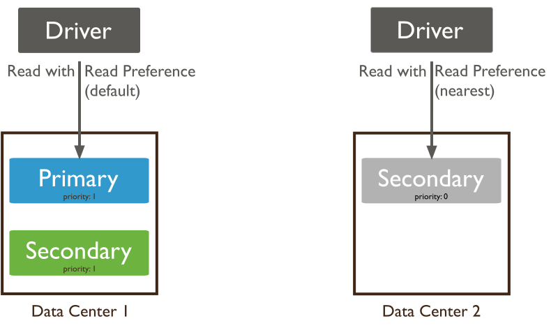

# 副本集读写

在副本集中读写与独立的Mongodb实例存在一定的差别，在副本集中，我们可以通过指定写的concern模式实现数据统一，从一定程度防止数据的丢失和不一致问题。在读的方面，也可以通过指定读取指定的节点，减少primary的读写的压力。

## 写Concern

`write concern`描述了写入数据的成员实例的数量。在副本集中，默认值`w: 1`即代表了在写入数据时，只需要primary写入成功就可以立即返回写入结果。当指定的值大于1的时候，表明了除了primary以及其他secondary节点数据写入成功的数量满足设置的值即可返回写入的结果。

在`write concern`中除了可以设置数字以外，也可以设置值为`majority`, 该值表示在写入数据的时候，需要大多数的成员都返回写入成功，才会对写入客户端响应写出结果。这里为了避免返回成功又导致数据的回滚，可以结合`j:true`来使用，使得写出的数据持久化到磁盘。

则完整的操作流程图如下：


> 当应用向primary写数据时，primary需要等待大多数或者指定数量的成员都返回执行成功的想用后，才会将执行结果返回给应用。

当在写入数据的时候，如果设置过小的值，可能导致在写入响应后数据回滚，导致写入失败。当设置过大的值时，会降低吞吐量和增加响应时间，因为要等待更多的成员对写入操作进行响应。

以下操作中，在插入数据的时候，就包含了`writeConcern`的可选参数以及插入操作的过期时间。

```shell
db.products.insert(
   { item: "envelopes", qty : 100, type: "Clasp" },
   { writeConcern: { w: "majority" , wtimeout: 5000 } }
)
```

在这个操作中，主要包含了两个逻辑:

- 设置`writeConcern`参数的时候，其值`majority`表示了在写入数据的时候，会将写操作同步到其他的secondary并进行执行，当secondary执行完成之后，就需要将执行结果返回到Primary，primary会做响应的统计，当响应的secondary节点总数满足设定条件时，就会将结果返回到客户端中。这么做的好处时，保证了数据写入大部分节点成功，遵从多数原则，可以保证一定程度保证数据的不丢失。

- `wtimeout`指定的是写入数据的时间超过了指定的超时时间，当secondary在一定时间内没有将执行结果响应到primary，这将导致primary返回失败的结果。但是这个失败并不代表写入数据失败，可能指代同步数据延迟导致的超时，因此可能在后面的同步操作中，会将操作最终同步到所有的secondary节点。

## 读取数据

`read preference`表示的是mongodb的客户端将读取的操作路由到合适的节点的操作。



默认情况下，mongodb客户端都是从primary执行数据的读取，但是我们可以通过`read preference`指定从secondary中读取数据。

在mongodb中，支持的`read preference`如下:

| Mode               | 描述                                                                                                                                                     |
| ------------------ | ------------------------------------------------------------------------------------------------------------------------------------------------------ |
| primary            | 该模式为默认模式，都是从当前的副本集中的Primary节点执行数据读取                                                                                                                    |
| primaryPreferred   | 在大部分场景下，都是从primary节点读取数据，但是当primary节点处于不可用状态时，将从secondary读取数据                                                                                          |
| secondary          | 所有的读操作都从secondary节点读取                                                                                                                                  |
| secondaryPreferred | 大部分场景数据的读取都是从secondary节点进行，但是当secondary节点处于不可用状态时，将从primary节点读取数据                                                                                      |
| nearest            | 该模式从副本集成员中随机选择节点读取数据，该选择的方式基于指定的延迟的阈值设定。在计算延迟时间的时候，将会参考以下条件:<br/><pre>1. localthresholdMs选项的设定<br/>2. maxStalenessSeconds选项的设定<br/>3. 任何指定的tag列表</pre> |

### 行为

- 由于secondary同步primary的数据是一个异步的行为，因此可能同步的操作会延迟与primary, 因此当我们从secondary读取数据的时候，可能会读不到或者读取到旧的文档数据值，因此应用需要判断是否能够容忍这种延迟带来的影响。

- `read preference`不影响数据的可见性。即数据可以在执行同步操作完成看，查询到文档数据

- `read preference`不影响因果一致性。

### 读取模式

#### primary

- primary模式是mongodb默认的读取模式，当primary处于不可用状态时，则在primary上的读操作将会抛出异常

- 在primary模式中，不能使用`tag`和`maxStalenessSeconds`的选项，当在primary上使用这两个选项时，将会执行错误

- 当多文档事务中包含了读操作时，此时必须在primary节点上进行，同一个事务的操作必须要路由到同一个节点上

#### primaryPreferred

- `primaryPreferred`模式在大多数场景下都是从Primary节点上读取数据，当primary处于不可用状态时，将读操作在secondary节点上完成。在该模式中，从secondary节点上读取文档，可以满足`maxStalenessSeconds`和`tag`的参数设置

- 在`primaryPreferred`模式中，如果设置了`maxStalenessSeconds`参数后，当副本集中没有Primary节点后，mongodb将会计算secondary的节点最后一次写入数据的时间和最新数据写入时间的差值，然后选择值小于或者等于`maxStalenessSeconds`阈值的secondary节点执行查询。

- 在`primaryPreferred`模式中，如果指定了`tag`信息，则mongodb从secondsary中根据tag过滤节点，
  
  - 如果在节点中有secondary包含了tag， 然后计算secondary节点同步数据落后的时间，然后选择落后时间最短的secondary节点，并执行查询操作
  
  - 如果没有符合条件tag的secondary节点，将执行报错

- 当`primaryPreferred`同时设置了`maxStalenessSeconds`和`tag`参数是，则优先根据同步落后实现小于`maxStalenessSeconds`阈值的节点然后在根据tag过滤

- 使用`primaryPreferred`模式查询数据可能返回陈旧数据(查询为空或者更新前的数据)。这主要是因为同步是一个异步的行为，存在一定的时间差。

#### secondary

- 该模式只会在secondary节点上执行读取操作，当secondary节点处于不可用状态时，将会执行报错。
  
  > 在副本集模式中，至少会有一个secondary节点，但是在最小的模型中，例如一个primary, 一个secondary, 一个仲裁者，此时就可能会出现secondary宕机情况，因此就会导致在seconday节点上的查询失败。

- 当`maxStalenessSeconds`配合该模式使用时，需要计算secondary与primary之间数据同步的时间延迟，过滤在阈值范围内的secondary节点，如果节点存在则从secondary上执行读取操作。若果secondary节点不存在，则执行读操作超时

- 如果指定了`tag`信息，则mongodb从secondsary中根据tag过滤节点，
  
  - 如果在节点中有secondary包含了tag， 然后计算secondary节点同步数据落后的时间，然后选择落后时间最短的secondary节点，并执行查询操作
  
  - 如果没有符合条件tag的secondary节点，将执行报错

- 同时设置了`maxStalenessSeconds`和`tag`参数是，则优先根据同步落后实现小于`maxStalenessSeconds`阈值的节点然后在根据tag过滤

- 使用该模式可能会过去到旧数据

#### secondaryPreferred

- 该模式大部分操作都是在secondary上完成，当secondary节点都处于不可用状态时，则会从primary节点上执行读取操作。

- 当`maxStalenessSeconds`配合该模式使用时，需要计算secondary与primary之间数据同步的时间延迟，过滤在阈值范围内的secondary节点，如果节点存在则从secondary上执行读取操作。若果secondary节点不存在，则执行读操作超时

- 如果指定了`tag`信息，则mongodb从secondsary中根据tag过滤节点，
  
  - 如果在节点中有secondary包含了tag， 然后计算secondary节点同步数据落后的时间，然后选择落后时间最短的secondary节点，并执行查询操作
  
  - 如果没有符合条件tag的secondary节点，将执行报错

- 同时设置了`maxStalenessSeconds`和`tag`参数是，则优先根据同步落后实现小于`maxStalenessSeconds`阈值的节点然后在根据tag过滤

- 使用该模式可能会过去到旧数据

#### nearest

- 该模式会计算并不区分Primary或者secondary节点，而是根据网络的延迟情况来随机选择操作的节点。

- 当`maxStalenessSeconds`配合该模式使用时，需要计算secondary与primary之间数据同步的时间延迟，过滤在阈值范围内的secondary节点，如果节点存在则从secondary上执行读取操作。若果secondary节点不存在，则执行读操作超时

- 如果指定了`tag`信息，则mongodb从secondsary中根据tag过滤节点，
  
  - 如果在节点中有secondary包含了tag， 然后计算secondary节点同步数据落后的时间，然后选择落后时间最短的secondary节点，并执行查询操作
  
  - 如果没有符合条件tag的secondary节点，将执行报错

- 同时设置了`maxStalenessSeconds`和`tag`参数是，则优先根据同步落后实现小于`maxStalenessSeconds`阈值的节点然后在根据tag过滤

- 使用该模式可能会过去到旧数据
