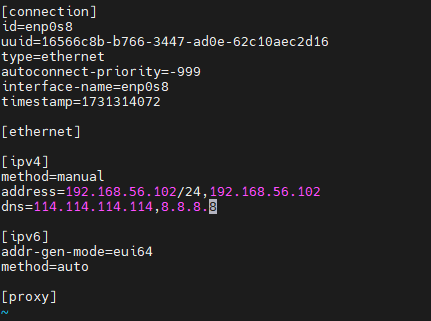
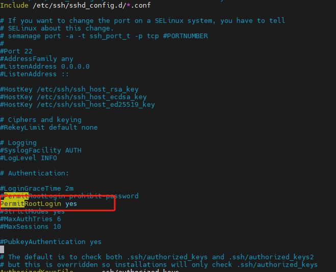

# Centos Stream 9相关配置

## 1. 网络配置

Centos Stream 9 中默认使用NetworkManager做网络管理，因此我们需要在这个目录下修改网络参数配置。

```shell
cd /etc/NetworkManager/system-connections
# 查看配置文件列表
ll
# 通过nmcli查看已有的驱动列表
nmcli
# 复制已有驱动，例如enp0s3
cp -av enp0s3.connection enp0s8.connection
# 修改配置信息，一定要修改id,uuid信息，否则会导致驱动无法启动
vi enp0s8.connection
# 重新加载配置
nmcli c reload
# 启动驱动
nmcli c up enp0s8
```

 

## 2. ssh 默认允许root登录

```shell
cd /etc/ssh
vi sshd_config
# 找到PermitLogin 并修改值为yes, 主要处于安全考虑，默认不允许使用root登录
```



## 3. 关闭图形界面

```shell
# 关闭图形界面
sudo systemctl set-default multi-user.target


# 开启图形界面
sudo systemctl set-default graphical.target
sudo reboot
```
