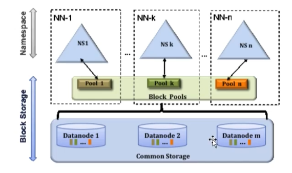
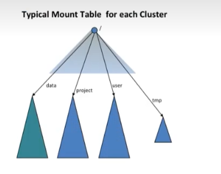

# Hadoop Federation联邦

## 1. NameNode需要多少内存

  业界看法：1GB内存存放1000000 block元数据。

200个节点的集群中每个节点有24TB存储空间，block大小为128MB， block复制因子为3，能存12500,000个block; 200x24,000,000MB/(128MB*3)，此时，NameNode内存大概需要12.5GB


## 2. HDFS组成

### Namespace

- 包括目录，文件和block块

- 支持所有文件系统命名空间相关的操作，如创建、删除、修改、列出文件及目录

### Block存储服务包含两部分

- Namespace中的block块管理
  
  - 通过心跳禁止和注册机制提供了对DataNode集群的管理
  
  - 处理block块报告，管理block块的位置
  
  - 提供跟block块相关的操作，如创建、修改、删除和查询block块的位置
  
  - 管理block副本如何放置，当副本数少于指定值之后增加副本，当副本数多于指定值之后删除副本

- 存储
  
  - 在DataNode本地文件系统中存储block块，并提供读写访问



1. NameNode节点之间是相互独立的联邦关系，即他们之间不需要协调服务

2. DataNode向集群中所有的NameNode注册，发送心跳和block块列表报告，处理来自NameNode的指令

3. 用户可以使用ViewFS创建个性化的命名空间试图，ViewFS类似于在Unix/Linux系统中的客户端挂载表

### VERSION

- namespaceID：用于标记namenode的ID

- blockpoolID：用于标记block存储池的ID

- clusterID：所在集群的ID



为了实现上面的多个NameNode管理不同的namespace, 这里需要在`core-site.xml`做如下的配置:

```xml
<configuration>
    <property>
        <name>fs.defaultFS</name>
        <value>viewfs://ClusterX</value>
    </property>
    <property>
        <name>fs.viewfs.mounttable.ClusterX.link./data</name>
        <value>hdfs://node1:8020/data</value>
    </property>
    <property>
        <name>fs.viewfs.mounttable.ClusterX.link./user</name>
        <value>hdfs://node2:8020/user</value>
    </property>
    <property>
        <name>fs.viewfs.mounttable.ClusterX.linkFallback</name>
        <value>hdfs://node1:8020/home</value>
    </property>
</configuration>
```

然后修改`hdfs-site.xml`配置文件

```xml
<configuration>
    <property>
        <name>dfs.namenode.http-address.ns2</name>
        <value>node2.50070</value>
    </property>
    <property>
        <name>dfs.namenode.secondary.http-address.ns2</name>
        <value>node2.50090</value>
    </property>
    <property>
        <name>dfs.namenode.http-address.ns1</name>
        <value>node1.50070</value>
    </property>
    <property>
        <name>dfs.namenode.secondary.http-address.ns1</name>
        <value>node1.50090</value>
    </property>
</configuration>
```

### 格式化

```shell
# 格式化node1
hdfs namenode -format -clusterId myviewfs

# 格式化Node2
hdfs namenode -format -clusterId myviewfs
```

> 在格式化Node1和Node2的时候，需要指定一个clusterId信息，这里需要保证这两个clusterId必须一致，这样才能保证他们是同一个集群，并且是一个联邦的关系

## 3. 优点

1. 可以通过namenode/namespace把元数据的存储和管理分散到多个节点中，使得namenode/namespace可以通过增加机器来进行水平扩展

2. 能把单个namenode的负载分散到多个节点，在HDFS数据规模比较大的时候，不会降低HDFS的性能

3. 可以通过多个namespace来隔离不同类型的应用，把不同类型应用的HDFS元数据的存储和管理分派到不同的namespace中
