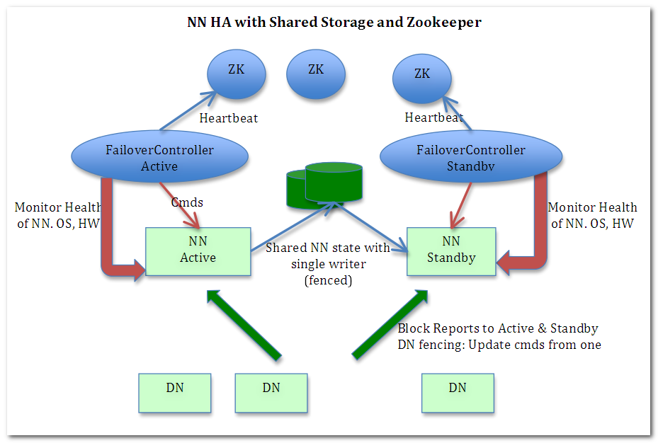

# Hadoop HA集群搭建

## 1. Zookeeper安装

Zookeeper安装可以参考[Zookeeper安装](../zookeeper/zookeeper安装.md)

## 2. hadoop配置

在配置HA之前，一共有四条服务器：

- node1 - 192.168.56.102

- node2 - 192.168.56.103

- node3 - 192.168.56.104

- node4 - 192.168.56.105

为了配置方便，将以上的映射放入到`/etc/hosts`文件中:

```shell
192.168.56.102 node1
192.168.56.103 node2
192.168.56.104 node3
192.168.56.105 node4
```

然后将hosts的配置文件复制到其他的节点:

```shell
scp /etc/hosts node2:/etc/hosts
scp /etc/hosts node3:/etc/hosts
scp /etc/hosts node4:/etc/hosts
```

| node1                                          | node2                                      | node3                    | node4         |
| ---------------------------------------------- | ------------------------------------------ | ------------------------ | ------------- |
| NameNode<br/>JournalNode<br/>SecondaryNameNode | NameNode<br/>JournalNode<br/>DataNode<br/> | DataNode<br/>JournalNode | DataNode<br/> |



### 2.1 SSH免密登录

SSH免密登录，可以参考[hadoop安装](./hadoop安装.md)中的免密登录作为参考。

### 2.2 hadoop-env.sh

这个文件需要修改`JAVA_HOME`的配置，这是因为通过ssh登录的客户端，无法加载`/etc/profile`中的配置，因此这个文件的JAVA_HOME要替换成为JDK安装的绝对路径

### 2.3 hdfs-site.xml

```xml
<configuration>
        <!-- 指定block副本数  -->
        <property>
                <name>dfs.replication</name>
                <value>2</value>
        </property>
        <!-- 指定secondarynamenode所在的位置 -->
        <property>
                <name>dfs.namenode.secondary.http-address</name>
                <value>192.168.56.102:50090</value>
        </property>

        <property>
                <name>dfs.namenode.rpc-address</name>
                <value>0.0.0.0:9000</value>
        </property>
        <property>
                <name>dfs.namenode.datanode.registration.ip-hostname-check</name>
                <value>false</value>
        </property>
        <property>
                <name>dfs.datanode.use.datanode.hostname</name>
                <value>true</value>
        </property>
        <property>
                <name>dfs.client.use.datanode.hostname</name>
                <value>true</value>
        </property>
        <!-- 解析参数 dfs.nameservices 值 hdfs://mycluster的地址  -->
        <property>
                <name>dfs.nameservices</name>
                <value>mycluster</value>
        </property>
        <!--mycluster由以下两个namenode-->
        <property>
                <name>dfs.ha.namenodes.mycluster</name>
                <value>nn1,nn2</value>
        </property>
        <property>
               <name>dfs.namenode.rpc-address.mycluster.nn1</name>
                <value>node1:8020</value>
        </property>
        <!--指定nn2地址和端口号-->
        <property>
                <name>dfs.namenode.rpc-address.mycluster.nn2</name>
                <value>node2:8020</value>
        </property>
        <!--指定客户端查找active的namenode的策略：会给所有的namenode发请求，以决定哪个是active的namenode-->
        <property>
                <name>dfs.client.failover.proxy.provider.mycluster</name>
                <value>org.apache.hadoop.hdfs.server.namenode.ha.ConfiguredFailoverProxyProvider</value>
        </property>
        <!--指定三台journal node服务器地址-->
        <property>
                <name>dfs.namenode.shared.edits.dir</name>
                <value>qjournal://node1:8485;node2:8485;node3:8485/mycluster</value>
        </property>

        <property>
                <name>dfs.journalnode.edits.dir</name>
                <value>/opt/apps/hadoop/hadoop-2.6.5/ha/jnn</value>
        </property>
        <!--当active nn出现故障时，ssh到对应的服务器，将namenode进程kill-->
        <property>
                <name>dfs.ha.fencing.methods</name>
                <value>sshfence</value>
        </property>

        <property>
                <name>dfs.ha.fencing.ssh.private-key-files</name>
                <value>/root/.ssh/id_rsa</value>
        </property>
        <!--启动NN故障自动切换-->
        <property>
                <name>dfs.ha.automatic-failover.enabled</name>
                <value>true</value>
        </property>
</configuration>
  <!--指定nn1地址和端口号-->
        <property>
                                
```

- `dfs.nameservices`：该配置定义了一个解析参数，值为mycluster

- `dfs.ha.namenodes.mycluster`：指定了两台NameNode节点，分别名称叫做nn1, nn2

- `dfs.namenode.rpc-address.mycluster.nn1`, `dfs.namenode.rpc-address.mycluster.nn2`：分别配置了nn1节点和nn2节点的NameNode监听的地址和端口号

- `dfs.journalnode.edits.dir`：该配置主要配置JournalNode节点节点地址和端口号

- `dfs.client.failover.proxy.provider.mycluster`：是配置了集群的NameNode在发生宕机的时候，如何决定active节点。这里配置的`org.apache.hadoop.hdfs.server.namenode.ha.ConfiguredFailoverProxyProvider`会由客户端进行决定

- `dfs.ha.fencing.ssh.private-key-files`：这里主要配置了在NameNode发生宕机的时候，登录远程服务器所需要的秘钥路径。如果已经配置了免密登录，则可以不用配置

### 2.4 core-site.xml

```xml
<configuration>
        <!-- 指定访问HDFS的时候路径的默认前缀 / hdfs://localhost:9000 -->
        <property>
                <name>fs.defaultFS</name>
                <!-- 在高可用模式下，不能写单独的namenode的路径，而是需要以集群的方式配置和访问  -->
                <!--<value>hdfs://192.168.56.102:9000</value>-->
                <value>hdfs://mycluster</value>
        </property>
        <!-- 指定hadoop的临时目录位置，他会给namenode, secondarynamenode以及datanode的存储目录指定前缀  -->
        <property>
                <name>hadoop.tmp.dir</name>
                <value>/opt/apps/hadoop/hadoop-2.6.5/ha</value>
        </property>
        <!-- 指定每个zookeeper服务器的位置和客户端编号  -->
        <property>
                <name>ha.zookeeper.quorum</name>
                <value>192.168.56.102:2181,192.168.56.103:2181,192.168.56.104:2181</value>
        </property>
</configuration>

```

### 2.5 slaves

```shell
192.168.56.103
192.168.56.104
192.168.56.105

```

以上配置就算完成，这是我们需要执行初始化操作

### 2.6 初始化

```shell
# 初始化zkfc
hdfs zkfc -formatZK

# 初始化namenode
hdfs namenode -format

# 在node2节点上同步namenode的配置
hdfs namenode -bootstrapStandBy
```

### 2.7 启动hadoop

在完成了以上步骤之后，就可以启动hadoop了

```shell
start-dfs.sh
```
