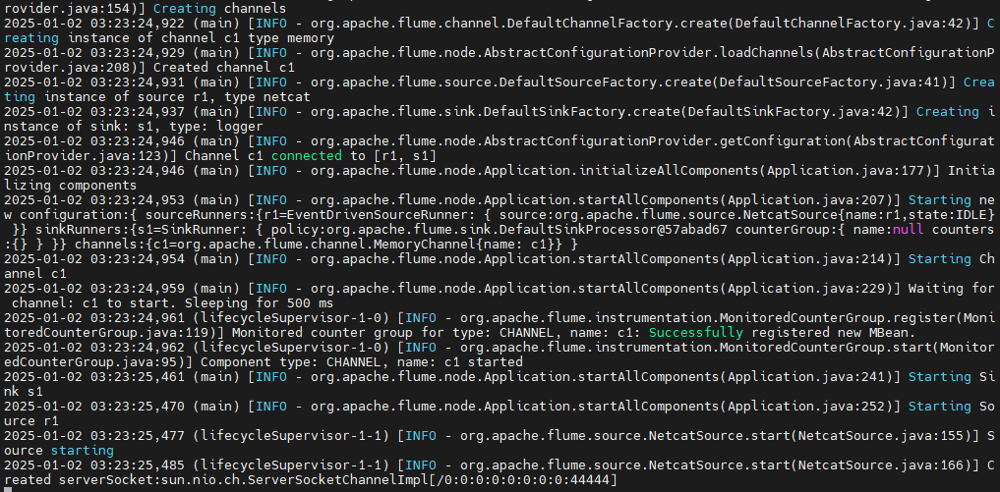
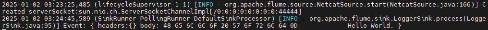
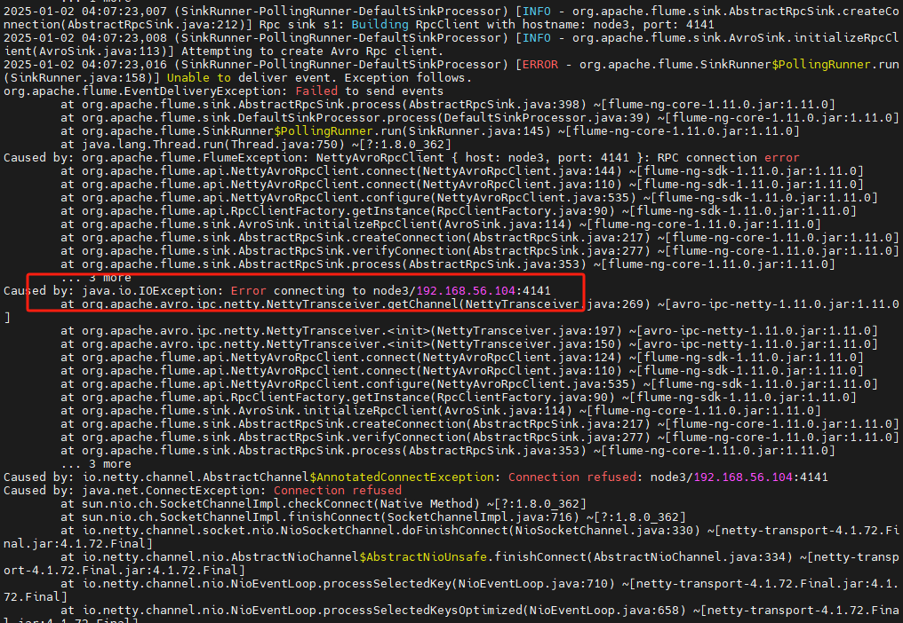
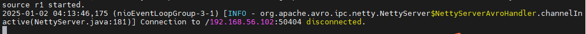
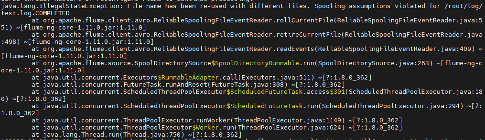

# Flume概述


## 介绍

- Apache Flume是一个分布式，可靠和可用的系统，用于有效地搜集、聚合和将大量日志数据从许多不同的来源转移到集中式数据存储。

- Apache Flume的使用不仅限于日志数据聚合，由于数据源是可定制的，Flume可以用来传输大量的事件数据，包括但不限于网络流量数据，社交媒体生成的数据、电子邮件消息和几乎任何可能得数据源

从上面的架构图中，可以看出，flume主要是有三部分组成：

- Source：表示数据的输入，数据的来源等信息

- Channel：则表示数据传输的通道

- Sink：则是对数据的处理，然后将数据存储到HDFS

## 安装

在安装Flume之前，还是需要先安装，安装包的下载地址[Releases &mdash; Apache Flume](https://flume.apache.org/releases/)，可以根据自己的需要下载需要的版本，在这里，我使用的是1.11版本，也是目前最新的版本。

对于目前已经安装Hadoop组件版本如下：

| 组件名称   | 组件版本  |
| ------ | ----- |
| Hadoop | 2.6.5 |
| Hive   | 4.0.1 |
| HBase  | 2.0.6 |

以上版本都是能够在Hadoop上正常执行的，在这里就安装Flume最新的版本。

### 下载安装包

```shell
wget https://dlcdn.apache.org/flume/1.11.0/apache-flume-1.11.0-bin.tar.gz
```

加压压缩包

```shell
tar -xzvf apache-flume-1.11.0-bin.tar.gz
# 配置环境变量
vi /etc/profile
export FLUME_HOME=/opt/apps/flume/flume-1.11.0
export PATH=$PATH:$FLUME_HOME
# 让配置生效
source /etc/profile
```

### flume-env.sh

该文件主要是环境变量的配置，这里主要配置JAVA_HOME等信息，

```shell
# Enviroment variables can be set here.

export JAVA_HOME=/usr/lib/jvm/java-1.8.0-openjdk-1.8.0.362.b09-4.el9.x86_64

# Give Flume more memory and pre-allocate, enable remote monitoring via JMX
 export JAVA_OPTS="-Xms100m -Xmx2000m -Dcom.sun.management.jmxremote -Dflume.root.logger=INFO,console"
```

### flume-conf.properties

该文件主要是配置source, channel和sink的地方，这里以官方给出的例子说明配置方法：

```properties
# The configuration file needs to define the sources,
# the channels and the sinks.
# Sources, channels and sinks are defined per agent,
# in this case called 'agent'
a1.sources=r1
a1.sinks=s1
a1.channels=c1

# For each one of the sources, the type is defined
a1.sources.r1.type=netcat
a1.sources.r1.bind=0.0.0.0
a1.sources.r1.port=44444

# The channel can be defined as follows.

# Each sink's type must be defined
a1.sinks.s1.type=logger

#Specify the channel the sink should use

# Each channel's type is defined.
a1.channels.c1.type=memory
a1.channels.c1.capacity=1000
a1.channels.c1.tranactionCapacity=100
# Other config values specific to each type of channel(sink or source)
# can be defined as well
# In this case, it specifies the capacity of the memory channel
a1.sources.r1.channels=c1
a1.sinks.s1.channel=c1
```

这里简单做个说明：

- `a1`：表示配置一个agent的名称为a1的实例

- `a1.sources`：表示source的名称

- `a1.sinks`：表示sink的名称

- `a1.channels`：表示channel的名称

- `a1.sources.r1.type`: 这里表示source的类型，这里配置的是netcat，表示可以通过网络传输数据，因此后面配置了`a1.sources.r1.bind`和`a1.sources.r1.port`地址和端口号信息

- `a1.channels.c1.type`配置了数据缓存的方式，这里是配置的是存储在内存中，并配置了内存的容量信息

- `a1.sources.r1.channels`和`a1.sinks.s1.channel`则是表示关联到channel实例上

### log4j2.xml

在新版的flume中，通过配置`-Dflume.root.logger=INFO,console`已经不起作用，而是需要修改log4j2.xml的配置信息，让日志能够在console中输出，具体配置如下:

```xml
<Configuration status="ERROR">
  <Properties>
    <Property name="LOG_DIR">.</Property>
  </Properties>
  <Appenders>
    <Console name="Console" target="SYSTEM_ERR">
      <PatternLayout pattern="%d (%t) [%p - %l] %m%n" />
    </Console>
    <RollingFile name="LogFile" fileName="${LOG_DIR}/logs/flume.log" filePattern="${LOG_DIR}/archive/flume.log.%d{yyyyMMdd}-%i">
      <PatternLayout pattern="%d{dd MMM yyyy HH:mm:ss,SSS} %-5p [%t] (%C.%M:%L) %equals{%x}{[]}{} - %m%n" />
      <Policies>
        <!-- Roll every night at midnight or when the file reaches 100MB -->
        <SizeBasedTriggeringPolicy size="100 MB"/>
        <CronTriggeringPolicy schedule="0 0 0 * * ?"/>
      </Policies>
      <DefaultRolloverStrategy min="1" max="20">
        <Delete basePath="${LOG_DIR}/archive">
          <!-- Nested conditions: the inner condition is only evaluated on files for which the outer conditions are true. -->
          <IfFileName glob="flume.log.*">
            <!-- Only allow 1 GB of files to accumulate -->
            <IfAccumulatedFileSize exceeds="1 GB"/>
          </IfFileName>
        </Delete>
      </DefaultRolloverStrategy>
    </RollingFile>
  </Appenders>

  <Loggers>
    <Logger name="org.apache.flume.lifecycle" level="info"/>
    <Logger name="org.apache.flume" level="info"/>
    <Logger name="org.jboss" level="WARN"/>
    <Logger name="org.apache.avro.ipc.netty.NettyTransceiver" level="WARN"/>
    <Logger name="org.apache.hadoop" level="INFO"/>
    <Logger name="org.apache.hadoop.hive" level="ERROR"/>
    <Root level="INFO">
      <AppenderRef ref="Console" />
      <AppenderRef ref="LogFile" />
    </Root>
  </Loggers>
</Configuration>
```

### 启动flume agent

启动flume也很简单，主要命令如下:

```shell
flume-ng agent --conf conf --conf-file conf/flume-conf.properties --name a1 
```

在这个命令中，主要参数说明如下：

- `--conf`用于指定配置文件的路径，这个路径下需要包含`flume-env.sh`和`log4j2.xml`两个文件

- `--conf-file`用于指定properties配置文件的路径

- `--name`用于指定启动agent的名称

启动完成后，将会看到如下的日志信息：



从日志信息中可以看到，启动监听端口在`44444`上，可以通过`telnet node1 44444`链接，并发送信息，这有如下输出信息：



## Flume串联配置


从以上的结构图可以看出，串联表达的意思是，一个agent的输出作为另外一个agent的输入，这样来实现数据的串联传输，在上面已有 的基础上，采用如下的部署结构

| 节点名称  | 角色      |
| ----- | ------- |
| node1 | source  |
| node3 | avro 接收 |

在flume中，要实现这种串联，主要使用`avro source`来实现，

#### node1的avro sink

在上面已有的配置基础上，将sink的输出由`logger`改为`avro`, 详细的配置参数可以参考官方网站：[Flume 1.11.0 User Guide &mdash; Apache Flume](https://flume.apache.org/releases/content/1.11.0/FlumeUserGuide.html#avro-sink)

通过命令`vi conf/flume-conf.properties`文件，修改配置信息如下:

```properties
a1.sources=r1
a1.sinks=s1
a1.channels=c1

# For each one of the sources, the type is defined
a1.sources.r1.type=netcat
a1.sources.r1.bind=0.0.0.0
a1.sources.r1.port=44444

# The channel can be defined as follows.

# Each sink's type must be defined
a1.sinks.s1.type=avro
a1.sinks.s1.hostname=node3
a1.sinks.s1.port=4141

#Specify the channel the sink should use

# Each channel's type is defined.
a1.channels.c1.type=memory
a1.channels.c1.capacity=1000
a1.channels.c1.tranactionCapacity=100
# Other config values specific to each type of channel(sink or source)
# can be defined as well
# In this case, it specifies the capacity of the memory channel
a1.sources.r1.channels=c1
a1.sinks.s1.channel=c1
```

相比于标准版的配置，只是修改了sinks相关的配置信息，让sink时传输到另外一个agent.

### node3的avro source

将node1的配置信息拷贝到Node3节点，并修改node3的配置信息

```shell
scp -r flume node3:`pwd`
```

在已经有了flume之后，则需要自己配置`FLUME_HOME`的配置信息，修改`flume-env.sh`的配置文件，然后修改`flume-conf.properties`配置文件如下：

```properties
# The configuration file needs to define the sources,
# the channels and the sinks.
# Sources, channels and sinks are defined per agent,
# in this case called 'agent'
a1.sources=r1
a1.sinks=s1
a1.channels=c1

# For each one of the sources, the type is defined
a1.sources.r1.type=avro
a1.sources.r1.bind=0.0.0.0
a1.sources.r1.port=4141

# The channel can be defined as follows.

# Each sink's type must be defined
a1.sinks.s1.type=logger

#Specify the channel the sink should use

# Each channel's type is defined.
a1.channels.c1.type=memory
a1.channels.c1.capacity=1000
a1.channels.c1.tranactionCapacity=100
# Other config values specific to each type of channel(sink or source)
# can be defined as well
# In this case, it specifies the capacity of the memory channel
a1.sources.r1.channels=c1
a1.sinks.s1.channel=c1
```

这里将source的类型`a1.sources.r1.type`修改成了`arvo`, 详细的参数信息，可以参考官方网站: [Flume 1.11.0 User Guide &mdash; Apache Flume](https://flume.apache.org/releases/content/1.11.0/FlumeUserGuide.html#avro-source)

### 先启动node1还是node3?

当两个agent产生依赖的时候，就会涉及到谁先启动的问题，当我们尝试先启动node1时，将会看到如下的错误日志信息:



但是它本身由重试的机制，因此，我们将Node启动起来即可，使用同样的命令

```shell
flume-ng agent --conf conf --conf-file conf/flume-conf.properties --name a1 
```

在连接成功之后，将会看到node3有如下信息输出：



flume在官方还有很多种用法，例如:


在以上的结构中，都有使用到串联的用法。

## Source种类

到目前为止，关于Source已经使用了`netcat`和`avro`两种类型，在Flume中Source有多种类型的使用，具体如下:

- Avro Source

- Thrift Source

- Exec Source

- Spooling Directory Source

- Kafka Source

- NetCat Source

### Exec Source

Exec Source在启动的时候运行指定的命令，并期望该进程持续在标准输出上生成数据(stderr 被简单地丢弃，除非属性日志StdErr设置为true)。如果进程处于任何原因退出，Source也将退出，不再产生数据。例如在用`cat file`或者`tail -f file_name`将持续产生数据流到agent.

详细的参数信息，可以参考官方网站: [Flume 1.11.0 User Guide &mdash; Apache Flume](https://flume.apache.org/releases/content/1.11.0/FlumeUserGuide.html#exec-source)

对于Exec Source使用也比较简单：

```properties
a1.sources = r1
a1.channels = c1
a1.sources.r1.type = exec
a1.sources.r1.shell=/bin/shell -c
a1.sources.r1.command = tail -F /var/log/secure
a1.sources.r1.channels = c1
```

主要的参数说明如下：

- `a1.sources.r1.type=exec`：这个表明在source上使用的Exec Source

- `a1.sources.r1.shell=/bin/bash -c`：这个说明执行shell命令时使用的command shell信息，常用的包括了`/bin/sh`, `/bin/ksh`, `/bin/bash`等

- `a1.sources.r1.command=tail -f /var/log/secure`：这个就是具体需要执行的命令，该命令的输出，会作为agent输入输入。

### Spooling Directory Source

`Spooling Directory Source`能够指定目录，并将目录下的文件进行扫描，给Source在发送完成文件之后，会将文件名称加上后缀信息，以标记文件是否已经处理完成。完整参数配置可以参考：[Flume 1.11.0 User Guide &mdash; Apache Flume](https://flume.apache.org/releases/content/1.11.0/FlumeUserGuide.html#spooling-directory-source)

```properties
a1.sources.r1.type=spooldir
a1.sources.r1.spoolDir=/root/log
a1.sources.r1.fileHeader=true
```

> 默认情况下，spoolingdir采用处理文件的方式文`rename`方式，该方式会在文件处理完成后，将文件进行重命名。

#### 读取实时日志文件是否会出错？

加入想象这么一个场景，通过spooldir方式读取应用日志文件，但是日志文件程序在不断的写日志，这样会出现什么样的问题？



我通过`echo 'Hello World' >> test.log`的方式模拟应用输出，在操作完成两次后，就发现再也收不到日志信息了，查看日志，发现是因为两次操作后，会因为已经处理过的文件名称重复，导致程序处理失败，不再处理。

> 新版的flume中，还有另外一种方式，`a1.sources.r1.trackingPolicy=tracker_dir`, 这种方式不会将文件进行重命名，而是会在`a1.sources.r1.trackerDir=.flumespool`目录中生成一个空的文件，这种文件名称和rename命名的方式一致。

到这里起始就有疑问了，spooldir处理的是静态文件，如果你的文件在不断的添加内容，这个时候它是扫描不到的，而是只会认为这个文件已经被处理过了。

> 同时spooldir的模式，也是不会扫描子目录下的文件的，这点需要注意。

## Sinks类型

### HDFS Sink

Flume支持将数据写到HDFS中，支持创建text和sequence file类型的文件，HDFS Sink支持一些转义字符，具体如下：

| 别名           | 描述                                                |
| ------------ | ------------------------------------------------- |
| %{host}      | 获取event中名称为`host`的header信息，这里可以是任何event中的header名称 |
| %t           | 当前时间的毫秒数                                          |
| %a           | 本地的一周星期几的名称                                       |
| %A           | 展示一周星期几的全名                                        |
| %b           | 月份名称的缩写                                           |
| %B           | 月份的名称                                             |
| %c           | 当前的日期和时间                                          |
| %d           | 一月中第几天，不足两位以0填充                                   |
| %e           | 一月中的第几天                                           |
| %D           | 日期，与%m/%d/%y一样                                    |
| %H           | 一天中的小时，24小时制，不足两位以0填充                             |
| %I           | 一天中的小时，12小时制                                      |
| %j           | 一年中的第几天，不足三位以0填充                                  |
| %k           | 一天中第几天，24小时制，                                     |
| %m           | 月份，不足两位以0填充                                       |
| %n           | 月份                                                |
| %M           | 分钟，不足两位以0填充                                       |
| %p           | 上午或者下午，取值为pm或者am                                  |
| %s           | 从1970-01-01 00:00:00到现在的秒数                        |
| %S           | 秒，不足两位以0填充                                        |
| %y           | 以两位数字展示年份                                         |
| %Y           | 展示四位年份                                            |
| %z           | 展示`+hhmm`格式数字时区，例如`-0400`                         |
| %[localhost] | 获取正在运行agent的服务的hostname信息                         |
| %[IP]        | 获取agent所在主机的IP地址                                  |
| %[FQDN]      | 获取agent所在主机的规范主机名                                 |

对于HDFS Sink的所有配置参数，可以参考官方文档：[Flume 1.11.0 User Guide &mdash; Apache Flume](https://flume.apache.org/releases/content/1.11.0/FlumeUserGuide.html#hdfs-sink)，这里主要介绍一些常用的参数即可：

| 属性名称                   | 默认值          | 说明                                                                                                                          |
| ---------------------- | ------------ | --------------------------------------------------------------------------------------------------------------------------- |
| channel                | -            | 绑定的channel名称                                                                                                                |
| type                   | -            | 组件名称，必须是hdfs                                                                                                                |
| hdfs.path              | -            | HDFS路径，如果是集群，则需要写上集群的名称，例如:hdfs://mycluster/path                                                                            |
| hdfs.filePrefix        | FlumeData    | flume在hdfs目录中创建文件的前缀                                                                                                        |
| hdfs.fileSuffix        | -            | flume在hdfs目录中创建文件的后缀                                                                                                        |
| hdfs.inUsePrefix       | -            | flume正在写入的临时文件的前缀                                                                                                           |
| hdfs.inUseSuffix       | .tmp         | flume正在写入的临时文件的后缀                                                                                                           |
| hdfs.rollInterval      | 30           | 单位秒，表明多少时间写入一个新文件。0表示不写入新文件                                                                                                 |
| hdfs.rollSize          | 1024         | 当文件大小达到多少字节，开始写入新文件。0表示不基于文件大小写新文件                                                                                          |
| hdfs.rollCount         | 10           | 当写一个新的文件之前要求当前文件写入多少个事件。0表示不基于事件数写新文件                                                                                       |
| hdfs.idleTimeout       | 0            | 单位：秒。多长时间没有新增时间则关闭文件。0表示不关闭。                                                                                                |
| hdfs.batchSize         | 100          | 写多少个事件开始向HDFS刷数据                                                                                                            |
| hdfs.codeC             | -            | 压缩格式：gzip, bzip2, lzo, lzop, snappy                                                                                         |
| hdfs.fileType          | SequenceFile | 当前支持三个值：SequenceFile, DataStream, CompressedStream<br/>(1) DataStream不压缩文件，不需要设置codeC<br/>(2) CompressedStream 必须设置codeC的类型 |
| hdfs.maxOpenFiles      | 5000         | 最大打开多少个文件。如果超过了限制，则关闭旧的文件                                                                                                   |
| hdfs.minBlockReplicas  | 10           | 每个HDFS sink用于HDFS io操作的线程数(open, write等)                                                                                    |
| hdfs.rollTimerPoolSize | 1            | 每个HDFS sink使用几个线程用于调度计时文件滚动                                                                                                 |
| hdfs.round             | false        | 支持文件夹滚动的属性。是否需要新建文件夹，如果设置为true, 则会影响所有的基于时间的转义字符，除了`%t`                                                                     |
| hdfs.roundValue        | 1            | 该值与 roundUnit一起指定文件夹股东的时长，会四舍五入                                                                                             |
| hdfs.roundUnit         | second       | 控制文件夹个数，多长时间生成新的文件夹夹。可选参数有:`second`, `minute`,`hour`                                                                        |
| hdfs.timeZone          | Local Time   | 时区主要用于文件夹路径                                                                                                                 |
| hdfs.useLocalTimeStamp | false        | 一般设置为true, 使用本地时间。如果不使用本地时间，要求flume发送的事件header中带有时间戳，该时间可以通过转义字符获取                                                          |

以下文简单的配置:

```properties
a1.channels = c1
a1.sinks = k1
a1.sinks.k1.type = hdfs
a1.sinks.k1.channel = c1
a1.sinks.k1.hdfs.path = /flume/events/%Y-%m-%d/%H%M/%S
a1.sinks.k1.hdfs.filePrefix = events-
a1.sinks.k1.hdfs.round = true
a1.sinks.k1.hdfs.roundValue = 10
a1.sinks.k1.hdfs.roundUnit = minute
```

### Hive Sink

Hive Sink就是将数据存储到Hive数据库中，以下为配置项的说明信息：

| 属性名            | 默认值    | 说明                                                                                                  |
| -------------- | ------ | --------------------------------------------------------------------------------------------------- |
| channel        | -      | 绑定channel名称                                                                                         |
| type           | -      | 组件类型名称，必须为hive                                                                                      |
| hive.metastore | -      | 元数据仓库地址：例如: thrift://node1.9083                                                                     |
| hive.database  | -      | 数据库名称                                                                                               |
| hive.table     | -      | 表名                                                                                                  |
| hive.partition | -      | 逗号分割的分区值，标识写到哪个分区，可以包含转义字符，例如hive分区定义如下：(age: int, sex: int), 则以下的`20,1`则表示将数据存储到`age=20,sex=1`的分区中 |
| callTimeout    | 10000  | Hive和HBase的IO超时时间，比如openTxn, write, commit, abort等操作，单位毫秒                                           |
| batchSize      | 15000  | 一个hive的事务允许写的事件最大数量                                                                                 |
| roundUnit      | minute | 控制多长时间生成一个文件夹，有`second, minute, hour`三个值可选                                                          |

详细的参数设置，可以查看官网：[Flume 1.11.0 User Guide &mdash; Apache Flume](https://flume.apache.org/releases/content/1.11.0/FlumeUserGuide.html#hive-sink)

例如有以下Hive表格，

```sql
create table weblogs ( id int , msg string )
    partitioned by (continent string, country string, time string)
    clustered by (id) into 5 buckets
    stored as orc;
```

则可以配置Hive Sink如下：

```properties
a1.channels = c1
a1.channels.c1.type = memory
a1.sinks = k1
a1.sinks.k1.type = hive
a1.sinks.k1.channel = c1
a1.sinks.k1.hive.metastore = thrift://127.0.0.1:9083
a1.sinks.k1.hive.database = logsdb
a1.sinks.k1.hive.table = weblogs
a1.sinks.k1.hive.partition = asia,%{country},%Y-%m-%d-%H-%M
a1.sinks.k1.useLocalTimeStamp = false
a1.sinks.k1.round = true
a1.sinks.k1.roundValue = 10
a1.sinks.k1.roundUnit = minute
a1.sinks.k1.serializer = DELIMITED
a1.sinks.k1.serializer.delimiter = "\t"
a1.sinks.k1.serializer.serdeSeparator = '\t'
a1.sinks.k1.serializer.fieldnames =id,,msg
```

> 对于`a1.sinks.k1.serializer`这个选项，还可以直接使用JSON，JSON中的字段名称，对应了HIve Table中的列名。

### Logger Sink

该Sink主要是在`INFO`级别记录日志信息，主要是在开发过程中用于调试和测试用的。主要配置信息如下:

```properties
a1.channels = c1
a1.sinks = k1
a1.sinks.k1.type = logger
a1.sinks.k1.channel = c1
```

### HBase Sink

HBase Sink主要目的是将数据写出到HBase中，主要配置信息如下：

| 属性名称            | 默认值 | 描述                                                              |
| --------------- | --- | --------------------------------------------------------------- |
| channel         | -   | 绑定的channel名称                                                    |
| type            | -   | 组将类型名称，必须是hbase                                                 |
| table           | -   | hbase的表名                                                        |
| columnFamily    | -   | 列族的名称                                                           |
| zookeeperQuoram | -   | 对应于hbase-size.xml中的`hbase.zookeeper.quoram`的值，指定zookeeper集群地址列表 |

详细完整的配置信息，可以参考官方网站：[Flume 1.11.0 User Guide &mdash; Apache Flume](https://flume.apache.org/releases/content/1.11.0/FlumeUserGuide.html#hbasesink)

> 对于HBase的配置，目前最新版本类型分为了两个，`hbase`和`hbase2`用来区分新旧版本，这点需要注意, 他们在配置参数的列表上是一样的，只是类型上的差异。

以下文HBase Sink的简单配置：

```properties
a1.channels = c1
a1.sinks = k1
a1.sinks.k1.type = hbase
a1.sinks.k1.table = foo_table
a1.sinks.k1.columnFamily = bar_cf
a1.sinks.k1.serializer = org.apache.flume.sink.hbase.RegexHbaseEventSerializer
a1.sinks.k1.channel = c1
```

#### AsyncHBaseSink

该配置主要是能够实现异步的HBase输入写入功能，配置参数和HBase Sink没有差别，只是在类型上进行标记：

```properties
a1.channels = c1
a1.sinks = k1
a1.sinks.k1.type = asynchbase
a1.sinks.k1.table = foo_table
a1.sinks.k1.columnFamily = bar_cf
a1.sinks.k1.serializer = org.apache.flume.sink.hbase.SimpleAsyncHbaseEventSerializer
a1.sinks.k1.channel = c1
```

### Kafka Sink

该Sink主要作用是将数据发布到Kafka的topic中，必要的参数如下：

| 属性名称                    | 默认值                 | 描述                                                                                                                 |
| ----------------------- | ------------------- | ------------------------------------------------------------------------------------------------------------------ |
| type                    | -                   | 必须设置为`org.apache.flume.sink.kafka.KafkaSink`                                                                       |
| kafka.bootstrap.servers | -                   | kafka服务端地址列表                                                                                                       |
| kafka.topic             | default-flume-topic | 指定发布到具体的topic名称。这里有两种情况，如果在配置文件中指定了topic, 将发送到指定topic中，如果这里没有配置，但是event事件中带有了topic字段，则发布到指定topic. 事件中的topic信息优先级更高 |

```properties
a1.sinks.k1.channel = c1
a1.sinks.k1.type = org.apache.flume.sink.kafka.KafkaSink
a1.sinks.k1.kafka.topic = mytopic
a1.sinks.k1.kafka.bootstrap.servers = localhost:9092
a1.sinks.k1.kafka.flumeBatchSize = 20
a1.sinks.k1.kafka.producer.acks = 1
a1.sinks.k1.kafka.producer.linger.ms = 1
a1.sinks.k1.kafka.producer.compression.type = snappy
```

以下就是简单的kafka sink的配置, 具体配置可以参考: [Flume 1.11.0 User Guide &mdash; Apache Flume](https://flume.apache.org/releases/content/1.11.0/FlumeUserGuide.html#kafka-sink)

### Http Sink

该sink就是将数据发送到指定的http服务中， 具体配置参数如下：

| 属性名称           | 默认值  | 描述              |
| -------------- | ---- | --------------- |
| channel        | -    |                 |
| type           | -    | 必须设置为http       |
| endpoint       | -    | 必须为POST请求的URL地址 |
| connectTimeout | 5000 | socket链接超时时间    |
| requestTimeout | 5000 | 最大的处理请求超时时间     |

```properties
a1.channels = c1
a1.sinks = k1
a1.sinks.k1.type = http
a1.sinks.k1.channel = c1
a1.sinks.k1.endpoint = http://localhost:8080/someuri
a1.sinks.k1.connectTimeout = 2000
a1.sinks.k1.requestTimeout = 2000
a1.sinks.k1.acceptHeader = application/json
a1.sinks.k1.contentTypeHeader = application/json
a1.sinks.k1.defaultBackoff = true
a1.sinks.k1.defaultRollback = true
a1.sinks.k1.defaultIncrementMetrics = false
a1.sinks.k1.backoff.4XX = false
a1.sinks.k1.rollback.4XX = false
a1.sinks.k1.incrementMetrics.4XX = true
a1.sinks.k1.backoff.200 = false
a1.sinks.k1.rollback.200 = false
a1.sinks.k1.incrementMetrics.200 = true
```

> 任何空的事件或者NULL事件将不会发送任何的HTTP请求

### Custom Sink

Flume也支持自定义Sink，在实现时需要实现`Sink`接口，在实现Sink后，它所依赖的所有的文件都必须放在agent执行的classpath中， 具体配置如下：

```properties

```
