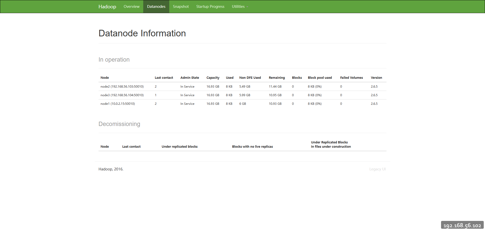

# hadoop安装

再开始安装hadoop之前，需要做一些基本的操作，因为hadoop使用java写的，因此需要JAVA的一个环境，版本为1.7+. jdk的安装这里就不做介绍了。

## 1. hadoop压缩包

hadoop压缩包的安装可以通过官方网站[hadoop下载页](https://hadoop.apache.org/releases.html)下载对应的版本，也可以通过[Index of /dist/hadoop/common](https://archive.apache.org/dist/hadoop/common/)下载对应的版本，我这里使用的是2.6.5版本进行安装。

```shell
tar -zxvf hadoop-2.6.5.tar.gz
```

## 2. 伪分布式安装

### 2.1 修改hadoop-env.sh

```shell
vi etc/hadoop/hadoop-env.sh
```

在这个文件中，主要修改`JAVA_HOME`配置，主要是因为，通过ssh登录的客户端，不会去加载`/etc/profile`的文件，因此，在这个文件中，需要将JAVA_HOME的路径替换成为绝对路径。

```shell
export JAVA_HOME=/usr/lib/jvm/java-1.8.0-openjdk-1.8.0.362.b09-4.el9.x86_64
```

### 2.2 hdfs-site.xml

```shell
vi etc/hadoop/hdfs-site.xml
```

配置文件中可以输入以下配置文件内容:

```xml
<configuration>
        <!-- 指定block副本数  -->
        <property>
                <name>dfs.replication</name>
                <value>1</value>
        </property>
        <!-- 指定secondarynamenode所在的位置 -->
        <property>
                <name>dfs.namenode.secondary.http-address</name>
                <value>localhost:50090</value>
        </property>
</configuration>
```

### 2.3 core-site.xml

```xml
<configuration>
        <!-- 指定访问HDFS的时候路径的默认前缀 / hdfs://localhost:9000 -->
        <property>
                <name>fs.defaultFS</name>
                <value>hdfs://localhost:9000</value>
        </property>
        <!-- 指定hadoop的临时目录位置，他会给namenode, secondarynamenode以及datanode的存储目录指定前缀  -->
        <property>
                <name>hadoop.tmp.dir</name>
                <value>/opt/apps/hadoop/hadoop-2.6.5/pseudo</value>
        </property>
</configuration>
```

### 2.4 slaves

```shell
192.168.56.102
```

### 2.5 启动hadoop

```shell
# 启动hadoop
start-dfs.sh

# 上传文件
hdfs dfs -put hadoop-2.6.5.zip /
```

hadoop启动完成后，可以在浏览器中访问`http://192.168.56.102:50070/`查看hadoop启动情况，可以看下如下界面


这就表示hadoop启动成功，则简单的hadoop配置完成。

## 3. 分布式部署

准备至少三台服务器节点：

- 192.168.56.102 - node1

- 192.168.56.103 - node2

- 192.168.56.104 - node3

> 每台节点都需要安装JDK并配置环境变量, 这里主要注意一下JAVA_HOME在通过SSH登录的时候，无法从/etc/profile中读取，需要在hadoop-env.xml中指定绝对路径

| node1                                       | node2    | node3    |
| ------------------------------------------- | -------- | -------- |
| NameNode<br/>DataNode<br/>SecondaryNameNode | DataNode | DataNode |

### 3.1 环境准备

在集群通信方面，采用的是ssh通信方式，并且可以在一个集群中的任何一个节点启动和停止整个节点，因此ssh是比较重要的。

```shell
yum install openssh-server -y
```

### 3.2 ssh无密码登录

在有了ssh之后，紧接着就需要配置无密码登录远程服务器，这是因为，如果没有这个配置的话，会导致在启动hadoop的时候，频繁的输入密码，可能导致集群启动失败。

```shell
# 在node1上生成密钥对
ssh-keygen -t rsa
# 将公钥copy到远程服务器和node1上
ssh-copy-id -i /root/.ssh/id_rsa.pub root@192.168.56.102
ssh-copy-id -i /root/.ssh/id_rsa.pub root@192.168.56.103
ssh-copy-id -i /root/.ssh/id_rsa.pub root@192.168.56.104
```

这个时候，我们呢就可以通过命令查看是否配置成功

```shell
ssh 'root@192.168.56.103'
```

### 3.3 core-site.xml

```xml
<configuration>
        <!-- 指定访问HDFS的时候路径的默认前缀 / hdfs://localhost:9000 -->
        <property>
                <name>fs.defaultFS</name>
                <value>hdfs://192.168.56.102:9000</value>
        </property>
        <!-- 指定hadoop的临时目录位置，他会给namenode, secondarynamenode以及datanode的存储目录指定前缀  -->
        <property>
                <name>hadoop.tmp.dir</name>
                <value>/opt/apps/hadoop/hadoop-2.6.5/full</value>
        </property>
</configuration>
```

> 在这里面主要配置了默认的filesystem的访问路径，因为我们将node1作为NameNode节点，因此需要指向node1节点，端口号为9000

### 3.4 hdfs-site.xml

```xml
<configuration>
        <!-- 指定block副本数  -->
        <property>
                <name>dfs.replication</name>
                <value>2</value>
        </property>
        <!-- 指定secondarynamenode所在的位置 -->
        <property>
                <name>dfs.namenode.secondary.http-address</name>
                <value>192.168.56.102:50090</value>
        </property>

        <property>
                <name>dfs.namenode.rpc-address</name>
                <value>0.0.0.0:9000</value>
        </property>
        <property>
            <name>dfs.namenode.datanode.registration.ip-hostname-check</name>
            <value>false</value>
        </property>
</configuration>
```

- dfs.replication：用于指定datanode的副本的数量，三个节点指定2个，可以实现互相备份

- dfs.namenode.rpc-address：这个配置主要用于绑定NameNode的ip地址和端口，指定0.0.0.0可以实现在多ip上进行绑定，如果不指定，可能导致在DataNode注册的时候，无法访问NameNode

- dfs.namenode.datanode.registration.ip-hostname-check：这个配置用于关闭host配置的检查，因为我们这里使用的是IP地址，就不需要检查，如果不配置，在比较低的版本上，会出现`host can't resolve`的错误，导致集群无法启动

### 3.5 slaves

```properties
192.168.56.102
192.168.56.103
192.168.56.104
```

这个文件配置了集群中的所有的节点的ip地址，这些ip地址都将在启动的时候通过ssh的方式进行连接和执行启动datanode的命令。

### 3.6 同步配置

以上命令启动完成之后，就可以将配置发送到整个集群的服务器，可以使用scp命令来实现

```shell
scp -r /opt/apps/hadoop 192.168.56.103:`pwd`
scp -r /opt/apps/hadoop 192.168.56.104:`pwd`
scp -r /opt/apps/hadoop 192.168.56.104:`pwd`
```

> 这里使用了`pwd`的用法，因此在执行scp的时候，需要在`/opt/apps`下执行，这样就可以少写一些命令了。

### 3.7 启动集群

```shell
start-dfs.sh
```

我们将看到以下的输出日志信息:


执行到这里，我们就可以通过访问[Namenode information](http://192.168.56.102:50070/dfshealth.html#tab-overview)查看集群的信息。


## 4. 问题以及解决办法

#### org.apache.hadoop.hdfs.server.protocol.DisallowedDatanodeException: Datanode denied communication with namenode because hostname cannot be resolved

这个错误主要是因为我们使用IP地址，而不是通过host的方式通信，这里就不需要检查hosts的配置信息，这里主要有两种解决方式：

- 在`/etc/hosts`中配置映射

- 在`hdfs-site.xml`中关闭Hosts的检查，主要配置如下:

```xml

        <property>
            <name>dfs.namenode.datanode.registration.ip-hostname-check</name>
            <value>false</value>

        </property>


```

### 在50070webui上能够看到3个存活节点，但是只看到一个DataNode信息

在网上看了很多都是说VERSION里面版本编号一致，根本不是这个问题，如果没有效果，这个时候就考虑是不是hostname相同导致的，可以通过修改hostname来完成

```shell
hostname
# 修改hostname
hostnamectl set-hostname node1
```

在查看DataNode节点列表时，已经能够正确展示三个了




