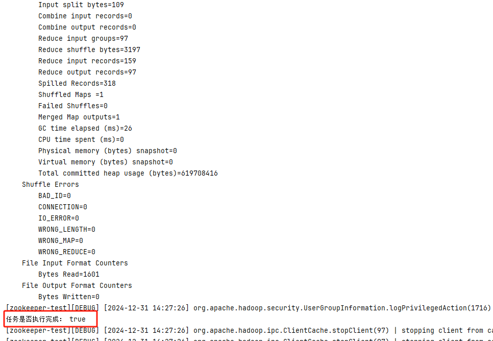
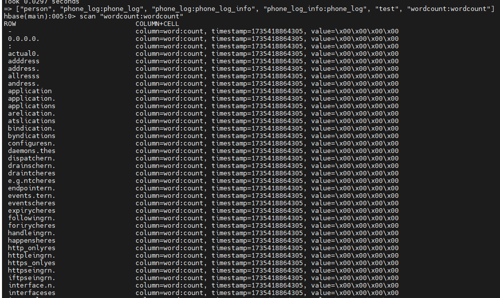
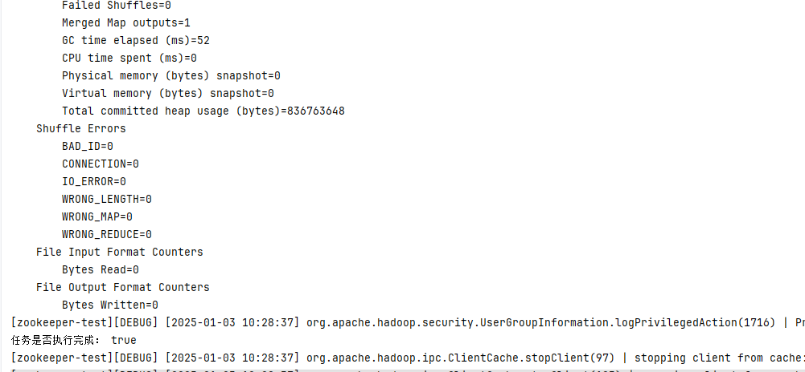
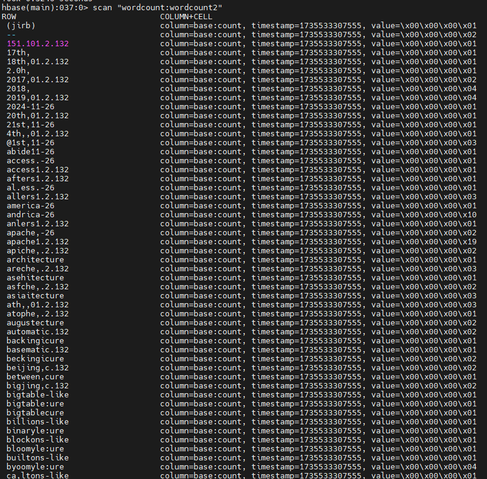

# HBase与MapReduce整合

## HBase与MR整合

> 以下代码都是基于Hadoop 2.6.5和HBase 2.0.6版本构建，具体的maven依赖如下：

#### pom.xml

```xml
 <dependencies>
        <dependency>
            <groupId>org.apache.hbase</groupId>
            <artifactId>hbase-client</artifactId>
            <version>2.0.6</version>
            <exclusions>
                <exclusion>
                    <artifactId>hadoop-annotations</artifactId>
                    <groupId>org.apache.hadoop</groupId>
                </exclusion>
                <exclusion>
                    <artifactId>hadoop-auth</artifactId>
                    <groupId>org.apache.hadoop</groupId>
                </exclusion>
                <exclusion>
                    <artifactId>hadoop-common</artifactId>
                    <groupId>org.apache.hadoop</groupId>
                </exclusion>
            </exclusions>
        </dependency>
        <dependency>
            <groupId>com.google.protobuf</groupId>
            <artifactId>protobuf-java</artifactId>
            <version>2.5.0</version>
        </dependency>
        <dependency>
            <groupId>org.apache.hadoop</groupId>
            <artifactId>hadoop-client</artifactId>
            <version>2.6.5</version>
            <exclusions>
                <exclusion>
                    <artifactId>hadoop-common</artifactId>
                    <groupId>org.apache.hadoop</groupId>
                </exclusion>
            </exclusions>
        </dependency>
        <dependency>
            <groupId>org.apache.hadoop</groupId>
            <artifactId>hadoop-auth</artifactId>
            <version>2.6.5</version>
        </dependency>
        <dependency>
            <groupId>org.apache.hadoop</groupId>
            <artifactId>hadoop-client</artifactId>
            <version>2.6.5</version>
        </dependency>
        <dependency>
            <groupId>org.apache.hadoop</groupId>
            <artifactId>hadoop-hdfs</artifactId>
            <version>2.6.5</version>
        </dependency>
        <dependency>
            <groupId>org.apache.hbase</groupId>
            <artifactId>hbase-server</artifactId>
            <version>2.0.6</version>
            <exclusions>
                <exclusion>
                    <artifactId>hadoop-common</artifactId>
                    <groupId>org.apache.hadoop</groupId>
                </exclusion>
                <exclusion>
                    <artifactId>hadoop-auth</artifactId>
                    <groupId>org.apache.hadoop</groupId>
                </exclusion>
                <exclusion>
                    <artifactId>hadoop-client</artifactId>
                    <groupId>org.apache.hadoop</groupId>
                </exclusion>
                <exclusion>
                    <artifactId>hadoop-hdfs</artifactId>
                    <groupId>org.apache.hadoop</groupId>
                </exclusion>
                <exclusion>
                    <artifactId>hadoop-mapreduce-client-core</artifactId>
                    <groupId>org.apache.hadoop</groupId>
                </exclusion>
                <exclusion>
                    <artifactId>hbase-client</artifactId>
                    <groupId>org.apache.hbase</groupId>
                </exclusion>
                <exclusion>
                    <artifactId>hbase-common</artifactId>
                    <groupId>org.apache.hbase</groupId>
                </exclusion>
                <exclusion>
                    <artifactId>hbase-hadoop-compat</artifactId>
                    <groupId>org.apache.hbase</groupId>
                </exclusion>
                <exclusion>
                    <artifactId>hbase-hadoop2-compat</artifactId>
                    <groupId>org.apache.hbase</groupId>
                </exclusion>
                <exclusion>
                    <artifactId>hbase-protocol</artifactId>
                    <groupId>org.apache.hbase</groupId>
                </exclusion>
            </exclusions>
        </dependency>
        <dependency>
            <groupId>org.apache.hbase</groupId>
            <artifactId>hbase-mapreduce</artifactId>
            <version>2.0.6</version>
        </dependency>
        <dependency>
            <groupId>org.slf4j</groupId>
            <artifactId>slf4j-api</artifactId>
            <version>2.0.13</version>
        </dependency>
        <dependency>
            <groupId>org.slf4j</groupId>
            <artifactId>slf4j-log4j12</artifactId>
            <version>1.7.26</version>
        </dependency>
    </dependencies>
```

### 从HDFS读取数据，MR计算，将计算结果存储到HBase

该实例还是以单词统计为例，计算的步骤如下：

- 从hdfs中读取文件，默认按照行读取

- 将每行读取的数据发送给Mapper任务，Mapper任务负责拆分单词，并向Context写出数据

- Reducer接受分组后的数据，并形成一直统计求和结果，并写出到HBase中

#### WordCountFromHdfsMapper

```java
package org.hadoop.learn.word.count.from.dfs;

import org.apache.hadoop.io.LongWritable;
import org.apache.hadoop.io.Text;
import org.apache.hadoop.mapreduce.Mapper;

import java.io.IOException;

/**
 * 用于对输入的拆分，将句子拆分成单词等
 */
public class WordCountFromHdfsMapper extends Mapper<LongWritable, Text, Text, LongWritable> {

    private Text outKey = new Text();
    private LongWritable outValue = new LongWritable();

    @Override
    protected void map(LongWritable key, Text value, Mapper<LongWritable, Text, Text, LongWritable>.Context context) throws IOException, InterruptedException {
        String line = value.toString();
        if (null == line || line.trim().equals("")) {
            return;
        }

        String[] words = line.split(" ");
        for (String word : words) {
            String s = word.toLowerCase().replaceAll("![a-z]]", "");
            outKey.set(s);
            context.write(outKey, outValue);
        }
    }
}
```

#### WordCountFromHdfsReducer

```java
package org.hadoop.learn.word.count.from.dfs;

import org.apache.hadoop.hbase.NamespaceDescriptor;
import org.apache.hadoop.hbase.NamespaceNotFoundException;
import org.apache.hadoop.hbase.TableName;
import org.apache.hadoop.hbase.client.*;
import org.apache.hadoop.hbase.io.ImmutableBytesWritable;
import org.apache.hadoop.hbase.mapred.TableReduce;
import org.apache.hadoop.hbase.util.Bytes;
import org.apache.hadoop.io.LongWritable;
import org.apache.hadoop.io.Text;
import org.apache.hadoop.mapred.JobConf;
import org.apache.hadoop.mapred.OutputCollector;
import org.apache.hadoop.mapred.Reporter;

import java.io.IOException;
import java.util.Iterator;

public class WordCountFromHdfsReducer implements TableReduce<Text, LongWritable> {
    private static final String NAMESPACE = "wordcount";
    private static final String TABLE = "wordcount";

    @Override
    public void reduce(Text key, Iterator<LongWritable> values, OutputCollector<ImmutableBytesWritable, Put> output, Reporter reporter) throws IOException {
        int sum = 0;
        while (values.hasNext()) {
            sum += values.next().get();
        }

        Put put = new Put(key.getBytes());
        put.addColumn(Bytes.toBytes("word"), Bytes.toBytes("count"), Bytes.toBytes(sum));
        output.collect(new ImmutableBytesWritable(key.getBytes()), put);
    }

    @Override
    public void close() throws IOException {

    }

    @Override
    public void configure(JobConf job) {
        try {
            Connection connection = ConnectionFactory.createConnection(job);
            Admin admin = connection.getAdmin();
            initNamespace(admin);
            initTable(admin);
        } catch (IOException e) {
            throw new RuntimeException(e);
        }
    }

    private void initTable(Admin admin) {
        TableName tableName = TableName.valueOf(NAMESPACE, TABLE);
        try {
            boolean isExits = admin.tableExists(tableName);
            if (!isExits) {
                TableDescriptorBuilder tableDescriptorBuilder = TableDescriptorBuilder.newBuilder(tableName);
                tableDescriptorBuilder.setColumnFamily(ColumnFamilyDescriptorBuilder.newBuilder(Bytes.toBytes("word")).build());
                admin.createTable(tableDescriptorBuilder.build());
                System.out.println("表创建成功: " + TABLE);
            }
        } catch (IOException e) {
            throw new RuntimeException(e);
        }
    }

    private void initNamespace(Admin admin) {
        try {
            admin.getNamespaceDescriptor(NAMESPACE);
        } catch (NamespaceNotFoundException e) {
            try {
                admin.createNamespace(NamespaceDescriptor.create(NAMESPACE).build());
                System.out.println("namespace创建成功: " + NAMESPACE);
            } catch (IOException ex) {
                throw new RuntimeException(ex);
            }
        } catch (IOException e) {
            throw new RuntimeException(e);
        }
    }
}
```

#### WordCountFromHdfsMain

```java
package org.hadoop.learn.word.count.from.dfs;

import org.apache.hadoop.conf.Configuration;
import org.apache.hadoop.fs.Path;
import org.apache.hadoop.hbase.mapred.TableMapReduceUtil;
import org.apache.hadoop.io.LongWritable;
import org.apache.hadoop.io.Text;
import org.apache.hadoop.mapred.FileInputFormat;
import org.apache.hadoop.mapred.FileOutputFormat;
import org.apache.hadoop.mapred.JobConf;
import org.apache.hadoop.mapreduce.Job;

import java.io.IOException;

/**
 * 该类主要实现了从HDFS->MR->HBASE这样已过过程，实现了将HDFS的数据通过Reduce任务写出到HBASE中
 */
public class WordCountFromHdfsMain {
    public static void main(String[] args) throws IOException, InterruptedException, ClassNotFoundException {

        System.setProperty("HADOOP_HOME", "H:\\xianglujun\\hadoop-2.6.5");
        System.setProperty("hadoop.home.dir", "H:\\xianglujun\\hadoop-2.6.5");
        System.setProperty("HADOOP_USER_NAME", "root");

        Configuration cfg = new Configuration(true);
        cfg.set("hbase.zookeeper.quorum", "node1:2181,node2:2181,node3:2181");
        // 本地运行
        cfg.set("mapreduce.framework.name", "local");
        // 设置hdfs的FileSystem


        JobConf jobConf = new JobConf(cfg, WordCountFromHdfsMain.class);
        FileInputFormat.addInputPath(jobConf, new Path("/xianglujun/wordcount/wc.txt"));
        FileOutputFormat.setOutputPath(jobConf, new Path("/xianglujun/wordcount/wc_out_1231"));
        jobConf.setJobName("mp任务从hdfs中获取数据并存储到hbase");
        jobConf.setMapOutputKeyClass(Text.class);
        jobConf.setMapOutputValueClass(LongWritable.class);

        TableMapReduceUtil.initTableReduceJob(
                "wordcount:wordcount", // 需要操作的表的名称
                WordCountFromHdfsReducer.class, // reduce任务
                jobConf,
                null, // 分区类
                false// 是否上传Hbase的包到分布式存储
        );

        jobConf.setJarByClass(WordCountFromHdfsMain.class);

        Job job = Job.getInstance(jobConf);
        job.setMapperClass(WordCountFromHdfsMapper.class);
        boolean completed = job.waitForCompletion(true);
        System.out.println("任务是否执行完成： " + completed);
    }
}
```

在配置Job任务的时候，主要使用了`TableMapReduceUtil`这个工具类，这个工具类主要是帮助配置Reducer任务相关参数，具体的源码如下：

```java
public static void initTableReduceJob(String table, Class<? extends TableReduce> reducer, JobConf job, Class partitioner, boolean addDependencyJars) throws IOException {
        job.setOutputFormat(TableOutputFormat.class);
        job.setReducerClass(reducer);
        job.set("hbase.mapred.outputtable", table);
        job.setOutputKeyClass(ImmutableBytesWritable.class);
        job.setOutputValueClass(Put.class);
        job.setStrings("io.serializations", new String[]{job.get("io.serializations"), MutationSerialization.class.getName(), ResultSerialization.class.getName()});
        if (partitioner == HRegionPartitioner.class) {
            job.setPartitionerClass(HRegionPartitioner.class);
            int regions = MetaTableAccessor.getRegionCount(HBaseConfiguration.create(job), TableName.valueOf(table));
            if (job.getNumReduceTasks() > regions) {
                job.setNumReduceTasks(regions);
            }
        } else if (partitioner != null) {
            job.setPartitionerClass(partitioner);
        }

        if (addDependencyJars) {
            addDependencyJars(job);
        }

        initCredentials(job);
    }
```

在这段代码中，主要关注一下几个点：

- `setOutputFormat()`这个是设置写出时的格式信息，也是最终将数据写到哪里的入口

- `OutputValue()`这个表明了写出的数据类型，这里设置的是`Put`对象，这个对象就是请求HBase所需要的参数.

执行以上代码，当任务执行完成后，会有以下的输出信息：



> 如果这段日志没有被输出，需要自行配置一下log4j.properties文件

然后查看HBase是否已经包含了数据：



这就表示数据已经执行完毕，将数据写出到HBase任务就完成啦~~

### 从HBase读取数据，MR计算，并输出到HBase中

这个实例还是以单词统计为例，然后计算步骤如下：

- 在wordcount的namespace中准备一张sentences表，每一行存放的就是句子信息

- 从sentences表中读取数据，并将读出的数据发送给Mapper任务

- Mapper处理任务，并输出拆分单词结果

- Reducer任务则将分组数据统计形成一致的结果，并写出到`wordcount2`表中

#### SentencesInitializer

该类主要是做数据初始化，保证依赖的HBase的表中包含了需要的任务数据，具体代码如下：

```java
package org.hadoop.learn.word.count.from.hbase;

import org.apache.hadoop.conf.Configuration;
import org.apache.hadoop.hbase.NamespaceDescriptor;
import org.apache.hadoop.hbase.NamespaceNotFoundException;
import org.apache.hadoop.hbase.TableName;
import org.apache.hadoop.hbase.client.*;
import org.apache.hadoop.hbase.util.Bytes;

import java.io.BufferedReader;
import java.io.IOException;
import java.io.InputStream;
import java.io.InputStreamReader;

/**
 * 这里是做数据初始化
 */
public class SentencesInitializer {
    private String namespace;
    private String tableName;
    private TableName tbName;
    private Connection connection;

    public SentencesInitializer(String namespace, String tableName, Configuration cfg) throws IOException {
        this.namespace = namespace;
        this.tableName = tableName;
        this.tbName = TableName.valueOf(namespace, tableName);
        this.connection = ConnectionFactory.createConnection(cfg);
    }

    public void init() throws IOException {
        try {
            initNamespace();
            initTable();

            // 读取数据，并写入到数据表
            int key = 1;
            InputStream is = this.getClass().getResourceAsStream("sentences.txt");
            try (BufferedReader reader = new BufferedReader(new InputStreamReader(is))) {
                String line = null;
                BufferedMutator bufferedMutator = connection.getBufferedMutator(this.tbName);
                while ((line = reader.readLine()) != null) {
                    if (!line.trim().equals("")) {
                        Put put = new Put(Bytes.toBytes(key));
                        put.addColumn(Bytes.toBytes("base"), Bytes.toBytes("line"), Bytes.toBytes(line));
                        bufferedMutator.mutate(put);
                        key++;
                    }
                }
                bufferedMutator.flush();
            }
        } catch (Exception e) {
            e.printStackTrace();
            throw new RuntimeException(e);
        } finally {
            if (connection != null) {
                connection.close();
            }
        }
    }

    private void initTable() throws IOException {
        Admin admin = connection.getAdmin();
        boolean b = admin.tableExists(this.tbName);
        if (b) {
            admin.disableTable(this.tbName);
            admin.truncateTable(this.tbName, true);

            return;
        }
        TableDescriptorBuilder tableDescriptorBuilder = TableDescriptorBuilder.newBuilder(this.tbName);
        tableDescriptorBuilder.setColumnFamily(ColumnFamilyDescriptorBuilder.newBuilder(Bytes.toBytes("base")).build());
        admin.createTable(tableDescriptorBuilder.build());
    }

    private void initNamespace() throws IOException {
        Admin admin = connection.getAdmin();
        try {
            admin.getNamespaceDescriptor(this.namespace);
        } catch (NamespaceNotFoundException e) {
            e.printStackTrace();
            admin.createNamespace(NamespaceDescriptor.create(this.namespace).build());
        }
    }
}
```

> 该类主要是从该类所在的目录下读取sentences.txt文件，文件内容自己定义就行，然后将数据初始化到指定的`namespace:table`表中

#### WordCountFromHbaseMapper

```java
package org.hadoop.learn.word.count.from.hbase;

import org.apache.hadoop.hbase.Cell;
import org.apache.hadoop.hbase.client.Result;
import org.apache.hadoop.hbase.io.ImmutableBytesWritable;
import org.apache.hadoop.hbase.mapred.TableMap;
import org.apache.hadoop.hbase.util.Bytes;
import org.apache.hadoop.io.LongWritable;
import org.apache.hadoop.io.Text;
import org.apache.hadoop.mapred.JobConf;
import org.apache.hadoop.mapred.OutputCollector;
import org.apache.hadoop.mapred.Reporter;

import java.io.IOException;
import java.util.List;

/**
 * 用于对输入的拆分，将句子拆分成单词等
 */
public class WordCountFromHbaseMapper implements TableMap<Text, LongWritable> {

    private Text outKey = new Text();
    private LongWritable outValue = new LongWritable(1);

    @Override
    public void map(ImmutableBytesWritable key, Result value, OutputCollector<Text, LongWritable> output, Reporter reporter) throws IOException {
        byte[] bases = Bytes.toBytes("base");
        List<Cell> columnCells = value.getColumnCells(bases, Bytes.toBytes("line"));
        for (Cell cell : columnCells) {
            String line = Bytes.toString(cell.getValueArray(), cell.getValueOffset(), cell.getValueLength());
            String[] words = line.split(" ");
            for (String word : words) {
                String s = word.toLowerCase().replaceAll("!([a-z]+)", "");
                outKey.set(s);
                output.collect(outKey, outValue);
            }
        }
    }

    @Override
    public void close() throws IOException {

    }

    @Override
    public void configure(JobConf job) {

    }
}
```

#### WordCountFromHbaseReducer

```java
package org.hadoop.learn.word.count.from.hbase;

import org.apache.hadoop.hbase.NamespaceDescriptor;
import org.apache.hadoop.hbase.NamespaceNotFoundException;
import org.apache.hadoop.hbase.TableName;
import org.apache.hadoop.hbase.client.*;
import org.apache.hadoop.hbase.io.ImmutableBytesWritable;
import org.apache.hadoop.hbase.mapred.TableReduce;
import org.apache.hadoop.hbase.util.Bytes;
import org.apache.hadoop.io.LongWritable;
import org.apache.hadoop.io.Text;
import org.apache.hadoop.mapred.JobConf;
import org.apache.hadoop.mapred.OutputCollector;
import org.apache.hadoop.mapred.Reporter;

import java.io.IOException;
import java.util.Iterator;

public class WordCountFromHbaseReducer implements TableReduce<Text, LongWritable> {
    private static final String NAMESPACE = "wordcount";
    private static final String TABLE = "wordcount2";

    @Override
    public void reduce(Text key, Iterator<LongWritable> values, OutputCollector<ImmutableBytesWritable, Put> output, Reporter reporter) throws IOException {
        int sum = 0;
        while (values.hasNext()) {
            sum += values.next().get();
        }

        Put put = new Put(key.getBytes());
        put.addColumn(Bytes.toBytes("base"), Bytes.toBytes("count"), Bytes.toBytes(sum));
        output.collect(new ImmutableBytesWritable(key.getBytes()), put);
    }

    @Override
    public void close() throws IOException {

    }

    @Override
    public void configure(JobConf job) {
        try {
            Connection connection = ConnectionFactory.createConnection(job);
            Admin admin = connection.getAdmin();
            initNamespace(admin);
            initTable(admin);
        } catch (IOException e) {
            throw new RuntimeException(e);
        }
    }

    private void initTable(Admin admin) {
        TableName tableName = TableName.valueOf(NAMESPACE, TABLE);
        try {
            boolean isExits = admin.tableExists(tableName);
            if (!isExits) {
                TableDescriptorBuilder tableDescriptorBuilder = TableDescriptorBuilder.newBuilder(tableName);
                tableDescriptorBuilder.setColumnFamily(ColumnFamilyDescriptorBuilder.newBuilder(Bytes.toBytes("base")).build());
                admin.createTable(tableDescriptorBuilder.build());
                System.out.println("表创建成功: " + TABLE);
            }
        } catch (IOException e) {
            throw new RuntimeException(e);
        }
    }

    private void initNamespace(Admin admin) {
        try {
            admin.getNamespaceDescriptor(NAMESPACE);
        } catch (NamespaceNotFoundException e) {
            try {
                admin.createNamespace(NamespaceDescriptor.create(NAMESPACE).build());
                System.out.println("namespace创建成功: " + NAMESPACE);
            } catch (IOException ex) {
                throw new RuntimeException(ex);
            }
        } catch (IOException e) {
            throw new RuntimeException(e);
        }
    }
}
```

#### WordCountFromHbaseMain

```java
package org.hadoop.learn.word.count.from.hbase;

import org.apache.hadoop.conf.Configuration;
import org.apache.hadoop.fs.Path;
import org.apache.hadoop.hbase.mapred.TableMapReduceUtil;
import org.apache.hadoop.io.LongWritable;
import org.apache.hadoop.io.Text;
import org.apache.hadoop.mapred.FileOutputFormat;
import org.apache.hadoop.mapred.JobConf;
import org.apache.hadoop.mapreduce.Job;
import org.hadoop.learn.word.count.from.dfs.WordCountFromHdfsMain;

import java.io.IOException;

public class WordCountFromHbaseMain {
    public static void main(String[] args) throws IOException, InterruptedException, ClassNotFoundException {
        System.setProperty("HADOOP_HOME", "H:\\xianglujun\\hadoop-2.6.5");
        System.setProperty("hadoop.home.dir", "H:\\xianglujun\\hadoop-2.6.5");
        System.setProperty("HADOOP_USER_NAME", "root");

        Configuration cfg = new Configuration(true);
        cfg.set("hbase.zookeeper.quorum", "node1:2181,node2:2181,node3:2181");
        // 本地运行
        cfg.set("mapreduce.framework.name", "local");

        JobConf jobConf = new JobConf(cfg, WordCountFromHdfsMain.class);
//        FileInputFormat.addInputPath(jobConf, new Path("/xianglujun/wordcount/wc.txt"));
        FileOutputFormat.setOutputPath(jobConf, new Path("/xianglujun/wordcount/wc_out_1231"));
        jobConf.setJobName("mp任务从hdfs中获取数据并存储到hbase");
        jobConf.setMapOutputKeyClass(Text.class);
        jobConf.setMapOutputValueClass(LongWritable.class);
        jobConf.set("mapred.mapper.new-api", "false");
        jobConf.set("mapreduce.map.compatibility.major.version", "false");

        //        jobConf.set("mapreduce.job.map.class", WordCountFromHbaseMapper.class.getName());
        TableMapReduceUtil.initTableMapJob(
                "/wordcount:sentences",
                "base:line",
                WordCountFromHbaseMapper.class,
                Text.class,
                LongWritable.class,
                jobConf,
                false
        );

        TableMapReduceUtil.initTableReduceJob(
                "wordcount:wordcount2", // 需要操作的表的名称
                WordCountFromHbaseReducer.class, // reduce任务
                jobConf,
                null, // 分区类
                false// 是否上传Hbase的包到分布式存储
        );

        jobConf.setJarByClass(WordCountFromHdfsMain.class);

        Job job = Job.getInstance(jobConf);
//        job.setMapperClass(WordCountFromHdfsMapper.class);
        new SentencesInitializer("wordcount", "sentences", cfg).init();
        boolean completed = job.waitForCompletion(true);
        System.out.println("任务是否执行完成： " + completed);
    }
}
```

执行以上代码，将会看到成功的结果标志：



从HBase表中查看数据是否正常：



以上就是HBase和Hadoop MapReduce任务整合的实现过程。
