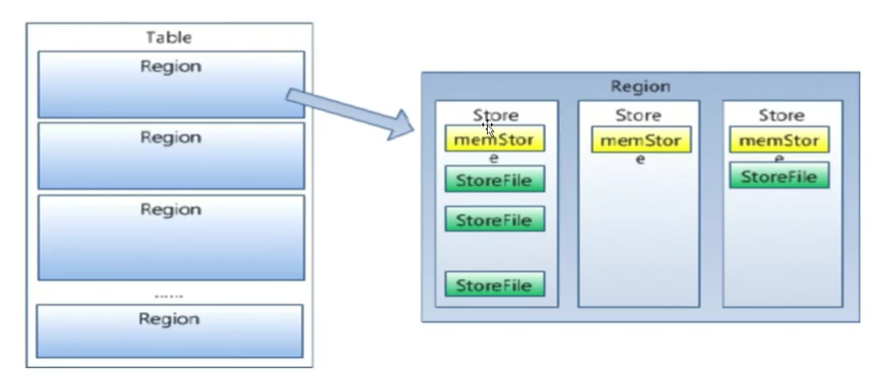
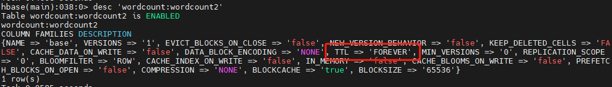

# HBase优化

## Pre-Creating Regions

默认情况下，在创建HBase表时会自动创建一个region分区，当导入数据的时候，所有的HBase客户端都向这个region写数据，直到这个Region足够大才会进行切分(也可以通过手动分区`split 'wordcount:wordcount'`).

HBase同时也提供了加快批量写入速度的方法，就是通过预先创建一批空的Regions, 这样当数据写入HBase时，会按照Region分区情况再集群内部做数据的负载均衡。

```sql
create 'table_name', 'column_family', {SPLITS ['row-100','row-200','row-300']}
```

## Row Key

HBase中 row key 用来检索表中的记录，用以支持以下三种方式：

- 通过单个row key访问：即按照单个row key键值进行get操作

- 通过row key的range 进行scan：即通过设置startRowKey和stopRowKey，在这个区间内进行扫描，同时是否包含起始和结束数据，可以通过参数配置

- 全表扫描：即直接扫描整张表中所有行记录

在HBase中，row key 可以是任意长度的字符串，最大长度为`64kb`, 实际应用中一般为`10-100bytes`，存为`byte[]数组`，一般设计为定长的。

> row key 是按照字段顺序存储，因此，设计row key时，要充分利用这个排序特点，将经常读取的数据存储到一块，将最近可能被访问的数据放一块

Row Key的设计规则如下：

- 越小越好：存储空间小，具体要在满足业务的前提下

- Row Key的设计是要根据实际业务来

- 散列性：
  
  - 取反：比如在生成的200的RowKey时，可以存储为001。主要考虑数据的均衡性
  
  - Hash

## Column Family

- 不要在一张表中定义太多的列族

- 目前HBase并不能很好的处理超过2-3个列族的表，主要是因为列族在flush的时候，它临近的列族也会因为关联效应被触发flush, 最终导致系统产生很多的I/O.



> 一个region由多个store组成，一个store对应一个列族(Column Family)

## In Memory

在创建表的时候，可以通过`HColumnDescriptor.setInMemory(true)`将表放在RegionServer的缓存中，保证在读取的时候被Cache命中。用以在读取比较频繁的列族上。

## Max Version

创建表的时候，可以通过`HColumnDescriptor.setMaxVersion(int maxVersions)`设置表中数据的最大版本，如果只需要保存最新版本的数据，那么可以设置`setMaxVersions(1)`.

> 这里主要设置保持的版本的数量，当需要对历史版本进行记录和查询的时候，则需要设置大于1，具体根据业务来确定。

## Time To Live

在创建表的时候，可以通过`HColumnDescriptor.setTimeToLive(int timeToLive)`设置表中的数据的存储生命周期，过期数据将自动被删除。

例如，如果只需要保存最近一天的数据，则可以设置`setTimeToLive(24 * 60 * 60)`单位为`秒`



## Compact 与Split

在HBase中，数据在更新时首先写入日志文件(WAL HLog)和内存(MemStore)中，MemStore中的数据是排序的，当MemStore累计到一定的阈值时，就会创建一个新的MemStore，并且将老的MemStore添加到Flush 队列，由单独的现成flush到磁盘上，成为一个StoreFile。与此同时，系统会在zookeeper中记录一个redo point, 表示这个时刻之前的变更已经持久化了(minor compact)。

StoreFile是只读的，一旦创建后就不可以再修改。因此HBase的更新其实是不断追加的操作。当一个Store中的StoreFile数量达到阈值后，就会进行一次合并(major compact), 将对同一个key的修改合并到一起，形成一个大的StoreFile, 当StoreFile的大小达到阈值后，又会对StoreFile进行分割(split), `等分`为两个StoreFile

由于对表的更新时不断追加的，处理读请求时，需要访问Store中全部的StoreFile和MemStore，将它们按照row key进行合并，由于StoreFile和MemStore都是经过排序的，并且StoreFile带有内存中索引，通常合并过程还是比较快的。

实际应用中，可以考虑必要时手动进行`major compact`，将同一个row key的修改进行合并成一个大的StoreFile, 同时，可以将StoreFile设置大些，减少Split的发生。

HBase为了防止小文件(被刷到磁盘的MemStore过多)，以保证查询效率，HBase需要再必要的时候将这些小的StoreFile合并成相对较大的StoreFile，这个过程就称之为`Compaction`

在HBase中，主要存在两种类型的`Compaction`:`minor Compaction`和`Major Compaction`

- `Minor Compaction`：是针对较小，很少文件的合并

- `Major Compaction`: 是针对将所有的StoreFile合并成一个，触发Major Compaction的条件有以下几个：
  
  - `major_compact`命令
  
  - `majorCompact()` api的调用
  
  - region server自动运行(`hbase.hregion.majoucompaction`默认为24小时、`hbase.hregion.majorcompaction.jetter`默认值为0.2防止RegionServer在同一时间进行major compaction)
    
    - `hbase.hregion.marjorcompaction.jetter`参数的作用是：对参数`habase.hregion.majoucompaction`规定的值起到浮动的作用，加入两个擦拿书都为默认值`24`和`0.2`, 那么major compact最终使用的数值为`19.2~28.8`这个范围

## 写优化

### HTable参数设置

#### write buffer

通过设置`HTable.setWriteBufferSize(writeBufferSize)`方法可以设置HTable客户端的写buffer大小，如果新设置的buffer小于当前写Buffer中的数据时，buffer会被立即flush到服务端中。其中，writeBufferSize的单位是字节数，可以根据实际写入数据量的多少来设置该值。

该配置的默认值为2MB(2097152个字节)，这个大小比较适中，一般用户插入HBase中的数据都比较小，即每次插入的数据都远小于缓冲区的大小。如果需要存储较大的数据，通常需要考虑调大这个值，从而允许客户端更高效地将一定数据的数据组成一组，通过一个RPC请求执行。

> 为每个用户创建的HTable实例都设定缓冲区大小比较麻烦，为了避免这种重复配置，可以在`hbase-site.xml`文件中加入以下设定值:
> 
> ```xml
> <property>
>     <name>hbase.client.write.buffer</name>
>     <value>20971520</value>
> </property>
> ```

#### Auto Flush

通过设置`HTable.setAutoFlushTo(false)`将HTable客户端的自动Flush关闭，这要可以实现批量写入数据到HBase，而不是每执行一次PUT就进行一次数据更新，只有当PUT填满客户端缓存时，才实际像HBase写入数据。

> 默认情况下，是开启了Auto Flush 的，如果在写入数据频繁且多的时候，则可以考虑将flush关闭，提高写入的效率。

#### WAL Flag

在HBase中，客户端向集群中的RegionServer提交数据时，首先向HLog中写入日志，只有到WAL日志写入成功后，再向MemStore中写，然后才会通知客户端写入数据成功。

如果WAL日志写入失败，客户端会被通知提交失败，这样做的好处是可以在RegionServer 宕机后，通过HLog日志做数据恢复。

因此，在对于数据不太重要或者允许数据丢失的场景，则可以通过设置`Put.setWriteToWAL(false)`来关闭向HLog中写入日志，从而提交输入写的性能。

> 该配置需要谨慎的关闭WAL日志，因为这样的话，如果RegionServer宕机，数据的更新/删除删除将无法通过WAL日志恢复。

### 批量写

在对HTable的操作中，提供了两种方法执行put操作：

- put(Put)

- put(List<Put>): 批量执行Put操作

通过调用批量的方法操作可以将指定的RowKey列表，批量写入多行记录，这样做的好处是批量执行，只需要一次网络I/O开销，这对于数据实时性要求高，网络传输RTT高的场景下可能带来明显的性能提升。

>  在较高版本的HBase中，同时也提供了`BufferedMutator`带有缓冲执行的类，该类可以通过`mutate()`方法执行PUT/DELETE操作，执行后不会立即执行，而是等待缓存满或者手动通过flush()操作执行操作。

### 多线程并发写

多线程并发写的实现思路是，创建多个HTable客户端对象，然后通过一定规则向不同的HTable客户端写入数据，提高写数据的吞吐量。

在客户端开启多个HTable写线程，每个写线程负责一个HTable对象的flush操作，这样结合定时flush和写buffer(writeBufferSize)，可以既保证在数据量小的时候，数据可以在较短时间内被flush, 同时又保证在数据量较大的时候，写满buffer就及时flush.

## 读优化

### Scanner Caching

`hbase.client.scanner.caching`配置项可以设置HBase Scanner一次性从服务端抓取数据条数，默认情况下一次一条。通过将该配置设置为一个合理的值，可以减少scan过程中`next()`的时间开销，代价是scanner需要通过客户端的内存来维持这些被cache的行记录。

由三个地方可以进行配置

- 在HBase的conf配置文件hbase-site.xml中进行配置

- 通过调用`HTable.setScannerCaching(int scannerCaching)`配置

- 通过调用`scan.setCaching(int caching)`配置

> 三者的优先级从上到下越来越高

### Scan Attribute Selection

can时指定需要的Column Family, 可以较少网络传输数据量，否则scan默认操作会返回整行所有Column Family的数据

```java
scan.addFamily(Bytes.toByte("base"));
```

### Close ResultScanner

通过scan取完数据后，记得要关闭ResultScanner，否则RegionServer可能会出现问题，即RegionServer所持有的对象资源无法被释放，可能导致OOM

```java
resultScanner.close()
```

### 批量读

通过调用HTable.get(Get)方法可以根据指定的RowKey获取一行记录，同样HBase提供了另外一个方法，通过HTable.get(List<Get>)方法可以根据指定的RowKey列表，批量获取多行记录。

> 这么做的好处是，只需要一次网路I/O开销，这对于对数据实时性要求高且网络传输RTT高的情景下可能带来明显的性能提升。

### 客户端缓存查询结果

对于频繁查询HBase的应用场景，可以考虑在应用程序中作缓存，当有心的查询请求时，首先在缓存中查找，如果存在则返回，不再查询HBase。否则发起对HBase读请求查询，然后在应用程序中奖结果缓存起来。缓存的淘汰策略，可以考虑(LRU最近很少使用)等差用的策略。

### 服务器端BlockCache

HBase上RegionServer的内存分为两个部分

- MemStore： 该缓存主要用于在写入数据时，缓存写入或者更新的数据

- BlockCache：主要用于读的缓存

#### MemStore

- 写请求会先写入MemStore，RegionServer会给每个Region提供一个MemStore，当- MemStore满64MB以后，会启动Flush刷新到磁盘。

- 当MemStore的总大小超过限制时(heapSize * hbase.regionserver.global.memstore.upperlimmit * 0.9), 会强制启动flush进程，从最大的MemStore开始flush指导低于限制。

#### BlockCache

- 读请求先到MemStore中查数据，查不到就到BlockCache中查，再查不到就会到磁盘上去读，并把读取到的结果放入到BlockCache中。

- 由于BlockCache采用的是LRU策略，因此BlockCache达到上限(heapsize \* hfile.block.cache.size\*0.85)后， 会启动淘汰策略，淘汰哪些很少被使用的数据缓存。

> 一个RegionServer上有一个BlockCache和N个MemStore，他们的大小之和不能超过hepsize \* 0.8, 否则HBase不能启动。

默认HBase中，`BlockCache 默认大小为0.2, MemStore为0.4`, 对于注重读响应时间的系统，可以将BlockCache设置大些，以增加缓存的命中率。

## HTable和HTablePool使用

HTable和HTablePool都是HBase客户端API的一部分，可以使用他们对HBase表进行CRUD操作。

### HTable

HTable是HBase客户端与HBase服务端通讯的Java API对象，客户端可以通过HTable对象与服务端进行CRUD操作。

HTable使用时的一些注意事项：

- 规避HTable对象的创建开销
  
  因为客户端创建HTable对象后，需要进行一系列操作：
  
  - 检查`hbase:meta`表确认指定名称的HBase表是否存在
  
  - 判断表是否有效，查询表Region所在的RegionServer
  
  这个过程是比较耗时的操作，因此最好在程序启动时一次性创建完成HTable对象。

- HTable对象不是线程安全的，不同对象间不要共享HTable对象

- HTable对象之间共享Configuration
  
  - 共享Zookeeper链接：每个客户端需要与Zookeeper建立链接，查询用户的table regions位置，这些信息可以在连接建立后缓存起来共享使用
  
  - 共享公共资源：客户端需要通过Zookeeper查找ROOT和hbase:meta表，这些需要网络传输开销，客户端缓存这些公共资源后能够减少后续的网络传输开销，加快查找过程速度。

### HTablePool

可以解决HTable存在的线程不安全问题，同时通过维护固定数量的HTable对象，能够在程勋运行间复用这些HTable资源对象。

- HTablePool可以自动创建HTable对象，而且对客户端来说使用上是完全透明的，可以避免多线程间数据并发修改问题

- HTablePool中的HTable对象之间是共用Configuration链接的，可以减少网络开销

HTablePool使用的代码实例如下：

> 该类在旧版本中使用，在比较新的版本中，已经更换为HConnectionManager进行操作。。

> Connection creation is a heavy-weight operation. Connection implementations are thread-safe, so that the client can create a connection once, and share it with different threads. Table and Admin instances, on the other hand, are light-weight and are not thread-safe. Typically, a single connection per client application is instantiated and every thread will obtain its own Table instance. Caching or pooling of Table and Admin is not recommended

> 这段话大致意思为：创建Connection是比较重量级的操作，对于Connection本身而言是线程安全的，因此我们只需要创建一次Connection并在不同线程间共享，但是创建Table和Admin的对象是很轻量级的，但不是线程安全的，因此这样的对象不推荐被池化共享。

因此在比较高的版本中，HTablePool已经被移除了，只需要通过`Connection`进行操作就可以了，具体使用如下:

```java
public class SentencesInitializer {
    private String namespace;
    private String tableName;
    private TableName tbName;
    private Connection connection;

    public SentencesInitializer(String namespace, String tableName, Configuration cfg) throws IOException {
        this.namespace = namespace;
        this.tableName = tableName;
        this.tbName = TableName.valueOf(namespace, tableName);
        this.connection = ConnectionFactory.createConnection(cfg);
    }

    public void init() throws IOException {
        try {
            initNamespace();
            initTable();

            // 读取数据，并写入到数据表
            int key = 1;
            InputStream is = this.getClass().getResourceAsStream("sentences.txt");
            try (BufferedReader reader = new BufferedReader(new InputStreamReader(is))) {
                String line = null;
                BufferedMutator bufferedMutator = connection.getBufferedMutator(this.tbName);
                while ((line = reader.readLine()) != null) {
                    if (!line.trim().equals("")) {
                        Put put = new Put(Bytes.toBytes(key));
                        put.addColumn(Bytes.toBytes("base"), Bytes.toBytes("line"), Bytes.toBytes(line));
                        bufferedMutator.mutate(put);
                        key++;
                    }
                }
                bufferedMutator.flush();
            }
        } catch (Exception e) {
            e.printStackTrace();
            throw new RuntimeException(e);
        } finally {
            if (connection != null) {
                connection.close();
            }
        }
    }

    private void initTable() throws IOException {
        Admin admin = connection.getAdmin();
        boolean b = admin.tableExists(this.tbName);
        if (b) {
            admin.disableTable(this.tbName);
            admin.truncateTable(this.tbName, true);

            return;
        }
        TableDescriptorBuilder tableDescriptorBuilder = TableDescriptorBuilder.newBuilder(this.tbName);
        tableDescriptorBuilder.setColumnFamily(ColumnFamilyDescriptorBuilder.newBuilder(Bytes.toBytes("base")).build());
        admin.createTable(tableDescriptorBuilder.build());
    }

    private void initNamespace() throws IOException {
        Admin admin = connection.getAdmin();
        try {
            admin.getNamespaceDescriptor(this.namespace);
        } catch (NamespaceNotFoundException e) {
            e.printStackTrace();
            admin.createNamespace(NamespaceDescriptor.create(this.namespace).build());
        }
    }
}

```


