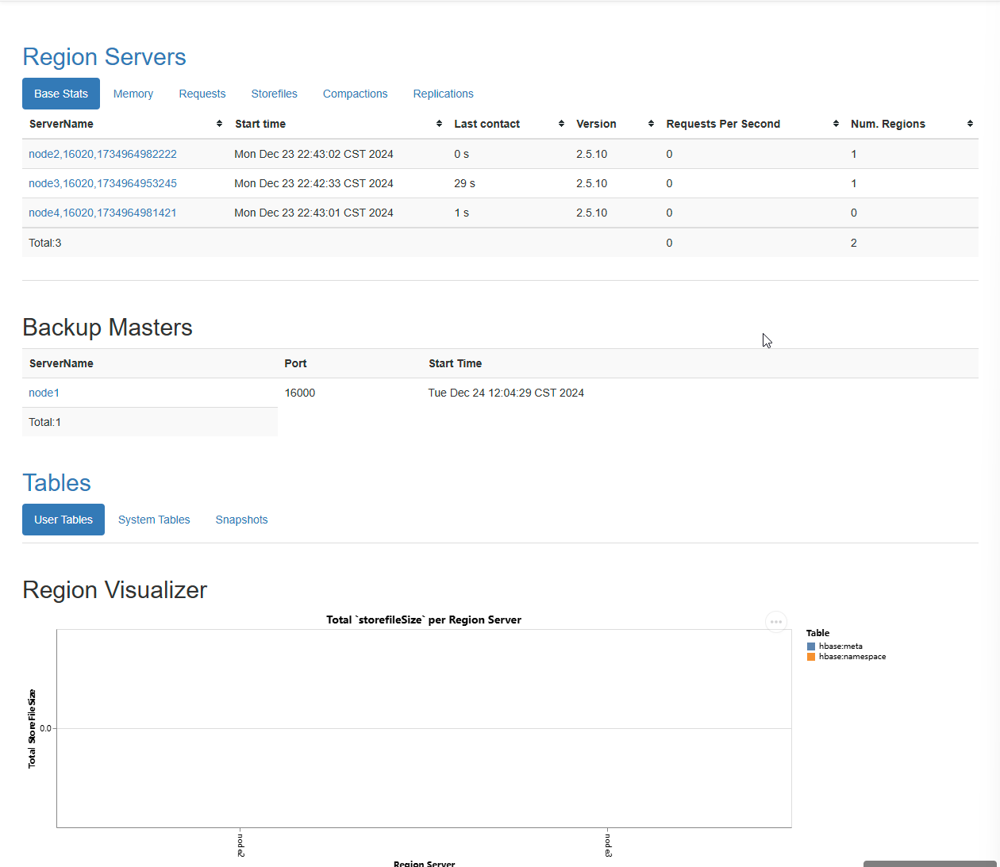
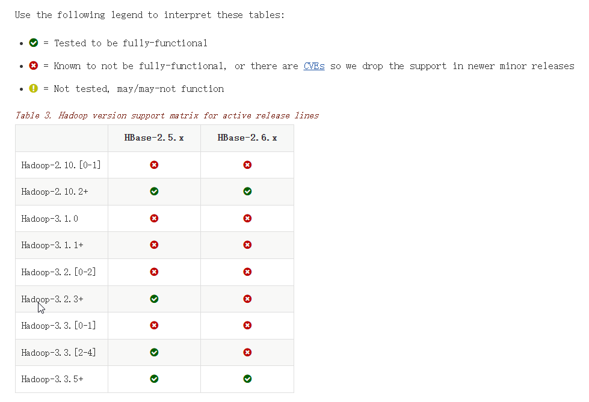
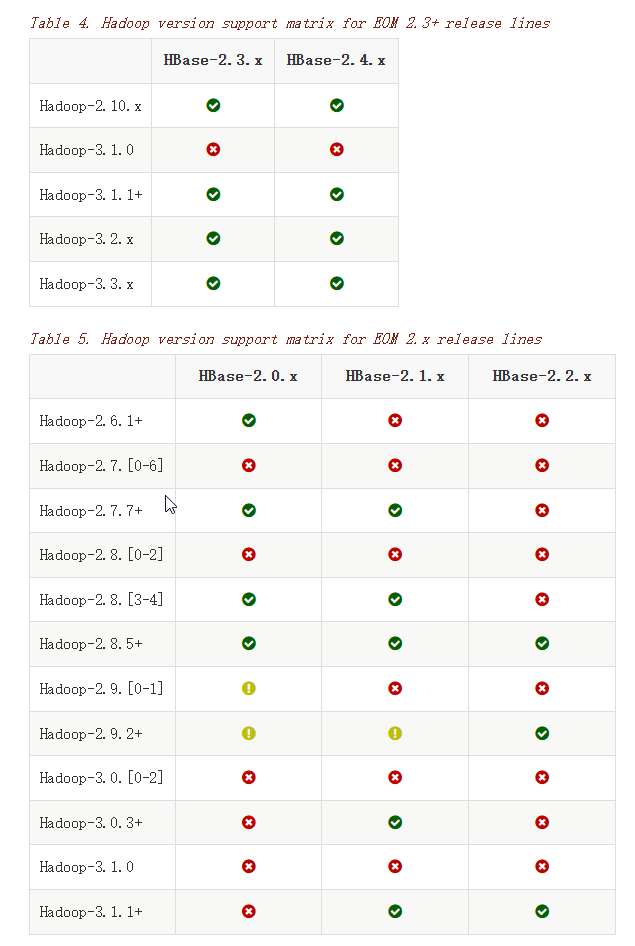
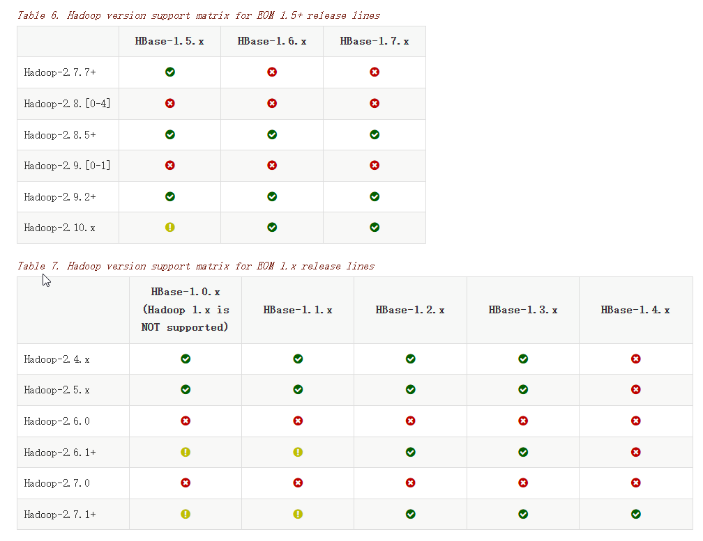
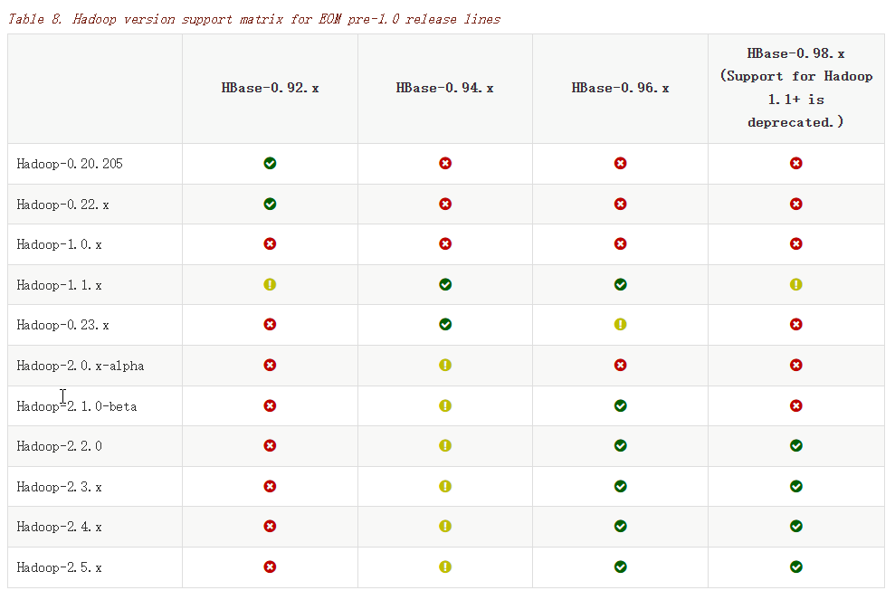

# HBase分布式安装

## 下载

HBase的安装包可以从官方的网站[Index of /dist/hbase](https://archive.apache.org/dist/hbase/)中下载自己需要的版本即可。

## 设备配置

我一共有4台虚拟机，分别是：

- node1: 192.168.56.102

- node2:192.168.56.103

- node3:192.168.56.104

- node4:192.168.56.105

| NodeName | Master | Zookeeper | RegionServer |
|:--------:|:------:|:---------:|:------------:|
| node1    | Y      | Y         | N            |
| node2    | backup | Y         | Y            |
| node3    | N      | Y         | Y            |
| node4    | N      | N         | Y            |

zookeeper的安装已经完成，可以参考[zookeeper安装](../../zookeeper/zookeeper安装.md)进行配置

### 服务器之间免密登录

```shell
# 在node1上生成密钥对
ssh-keygen -t rsa
# 将公钥copy到远程服务器和node1上
ssh-copy-id -i /root/.ssh/id_rsa.pub root@node2
ssh-copy-id -i /root/.ssh/id_rsa.pub root@node3
ssh-copy-id -i /root/.ssh/id_rsa.pub root@node4
```

## 解压并配置环境变量

```shell
wget https://archive.apache.org/dist/hbase/stable/hbase-2.5.10-bin.tar.gz

tar -xzvf hbase-2.5.10-bin.tar.gz

# 配置HBASE_HOME变量
vi /etc/profile

# 加入以下配置
export HBASE_HOME=/opt/apps/hbase/hbase-2.5.10
export PATH=$PATH:$HBASE_HOME/bin

# 通过source让变量生效
source /etc/profile
```

## Hive配置

### regionservers

该配置文件主要表明哪些节点作为RegionServer来使用，按照以上的表格，主要就是:

- node2

- node3

- node4

这四台来使用，因此该文件就配置这三台节点就行。

```tex
node2
node3
node4
```

> 这里使用这个名称，是因为在/etc/hosts中已经配置过映射了，所以可以直接使用名称。如果没有配置，则需要使用IP地址

### 配置backup-master

node2会作为backup节点存在，因此在`HBASE_HOME/conf`目录下创建`backup-masters`文件，并写入`node2`信息：

```shell
echo "node2" >> backup-masters
```

### hbase-env.sh

这个是HBase的环境配置脚本，这里面需要我们指定`JAVA_HOME`和`HBASE_PID_DIR`的路径，具体配置如下:

```shell
export HBASE_PID_DIR=/opt/apps/hbase/hbase-2.5.10
export JAVA_HOME=/usr/lib/jvm/java-1.8.0-openjdk-1.8.0.362.b09-4.el9.x86_64
```

### zookeeper配置

这里使用外部的zookeeper集群，因此需要做一下配置：

- 设置使用外部的zookeeper, 则需要在`conf/hbase-env.sh`中设置`HBASE_MANAGES_ZK=false`

- 使用外部的zookeeper有两种方式：
  
  - 将zookeeper的的配置文件zoo.cfg文件拷贝到HBASE目录中，在HBase启动的时候，会优先读取`zoo.cfg`文件
  
  - 在`hbase-site.xml`文件中配置zookeeper信息
    
    ```xml
    <property>
        <name>hbase.cluster.distributed</name>
        <value>true</value>
    </property>
    <property>
        <name>hbase.rootdir</name>
        <value>hdfs://mycluster/hbase_ha</value>
    </property>
    <property>
        <!-- 默认的端口号可以不用加 -->
        <name>hbase.zookeeper.quorum</name>
        <value>node1,node2,node3</value>
    </property>
    <property>
        <name>hbase.zookeeper.property.dataDir</name>
        <value>/opt/apps/hbase/data</value>
    </property>
    ```

### hdfs-site.xml

该文件主要使用hdfs的时候会用到，这里可以创建一个软连接到`conf`目录，这样对hdfs的任何更改，都可以直接获取到：

```shell
ln $HADOOP_HOME/etc/hadoop/hdfs-site.xml hdfs-site.xml
```

### 拷贝配置到其他节点

因为一共有四个节点，那么其他节点可以不用单独配置，可以通过`scp`的方式将配置好的拷贝过去即可

```shell
# 进入到目录下
cd $HBASE_HOME
cd ..


# 执行拷贝
scp -r ./hbase/ node1:`pwd`
scp -r ./hbase/ node3:`pwd`
scp -r ./hbase/ node4:`pwd`
```

### 启动HBase

```shell
start-hbase.sh
```

### 访问web ui

可以通过`node1:16010`的方式访问HBase的集群信息。可以看到集群信息如下:



## HBase和Hadoop依赖









所有的配置文件可以参考官方网站[Apache HBase® Reference Guide](https://hbase.apache.org/book.html#hbase_default_configurations)
