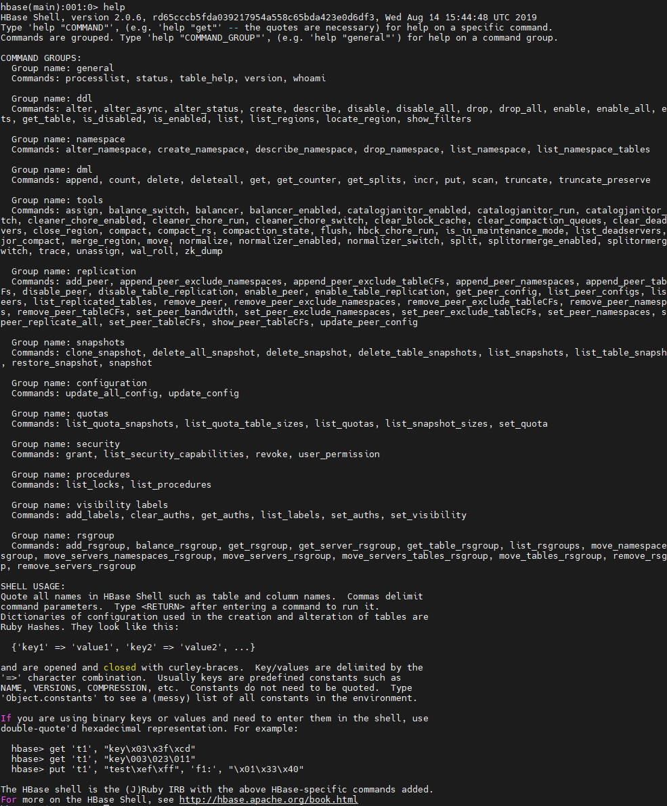
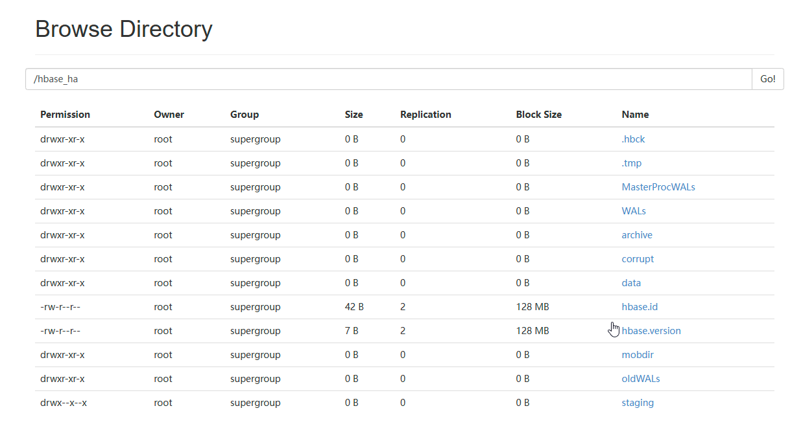
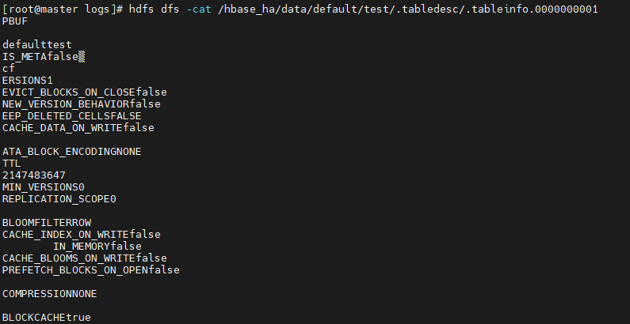
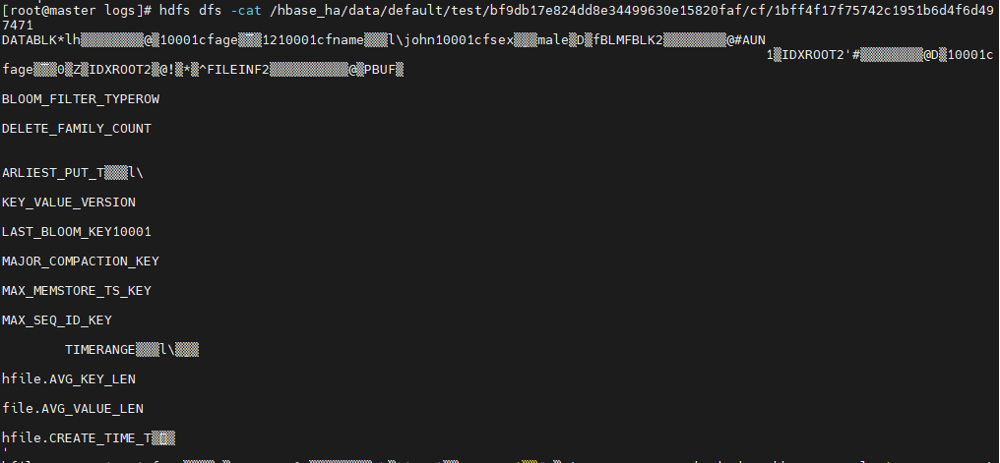
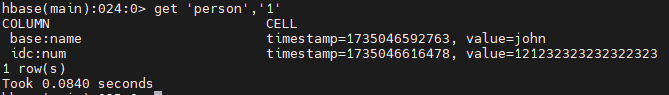
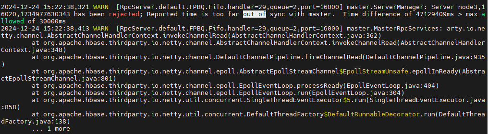

# HBase基本操作

## 基本操作

| 名称        | Shell命令                                                                      |
| --------- | ---------------------------------------------------------------------------- |
| 创建表       | create '表名','列族名'[,...]                                                      |
| 添加记录      | put '表名','RowKey','列族名称:列名'                                                  |
| 查看表中的记录总数 | count '表名'                                                                   |
| 删除记录      | delete '表名','RowKey', '列族名称:列名'                                              |
| 删除一张表     | 先要屏蔽该表，才能对该表进行删除<br/><ul><li>1. disable '表名'</li><li>2. drop '表名称'</li></ul> |
| 查看所有记录    | scan '表名'                                                                    |

## 链接hbase

```shell
# 链接hbase
hbase shell

# 计入到shell客户端后，可以输入help
shell> help
```

输入help之后，就会出现hbase支持的操作命令，具体图片如下：



## 表操作

### 创建表

```sql
create 'test','cf'

-- 查看表列表
list 'test'
```

### 添加数据

```sql
put 'test','1001','cf:name','zhangfei'
-- 通过scan命令查看数据
scan 'test'
```

### 查询一行数据

```sql
-- 查询RowKey=1001的记录
get 'test','1001'

-- 查询某一行的某一列
get 'test', '1001', 'cf:name'
```

### 删除表

```sql
-- 首先禁用表
diable 'test'
-- 执行删除
drop 'test'
```

在做了以上操作之后，可以在hdfs上查看对应的文件信息，信息如下：



在以上的操作中，创建了`test`表，可以通过hdfs查看文件中存储的数据信息：



然后在`test`目录下可以看到写入的数据文件，查看内容如下：



这里就是记录表中数据的地方。

> 如果在目录中没有发现存放数据的文件，那么可能是因为还没有写入到hdfs导致的，可以通过`flush 'test'`的命令，手动将数据写入到磁盘。

## 基本概念进阶

### RowKey

1. 决定一行数据

2. 按照字典顺序排序

3. RowKey只能存储`64k`的字节数据(UTF-8格式下2.133万多个汉字)

### Column Family列族和Qualifier 列

1. HBase表中的每个列都归属于某一个列族，列族必须作为表模式(schema)定义的一部分预先给出。

2. 列名以列族作为前缀，每个"列族"都可以有多个列(column)。新的列族成员可以随后按需动态加入

3. 权限控制、存储以及调优都是在列族层面进行的。

4. HBase把同一列族数据存储在同一目录下，分别进行保存。

### Cell单元格

- 由行和列的坐标交叉决定

- 单元格是有版本的

- 单元格的内容是未解析的字节数据

- 由`{RowKey, column(=<column family> + <qualifier>), version}`唯一确定单元格

- Cell中的数据是没有类型的， 全部是由字节数组进行存储

### Timestamp时间戳

列的数据存储格式如下：

```shell
rowkey - <column family>:<qualifier> <vesion> <cell value>
```

- 在HBase每个cell存储单元对同一份数据有多个版本，根据唯一的时间戳来区分每个版本之间的差异，不同版本的数据按照时间倒序排序，最新的数据版本排在最前面。

- 时间戳的类型是`64位整型`

- 时间戳可以由HBase赋值，此时间戳是精确到毫秒的当前系统时间

- 时间戳也可以由客户显式赋值，如果应用程序要避免数据版本冲突，就必须自己生成具有唯一性的时间戳

- 在HBase 0.96之前，保留的版本数为3.但是在0.96中，更新版本已经修改为`1`



#### 时间误差

在HBase中，regionserver之间可以容忍`30秒`的时间误差，否则会导致`regionserver`的失败。



以上就是因为时间的原因导致regionserver启动失败的信息。

### HLog(WAL log)

> WAL：Write Ahead Log。这种设计在很多系统中都有设计，主要是在写入数据的时候，先写日志文件。这么做的主要目录是能够在发生宕机时，能否恢复数据。

HLog文件就是一个不同的`Hadoop Sequence File`, `Sequence File`的Key就是HLogKey对象，HLogKey中记录了写入数据的归属信息，除了`table`和`region`名字外，同时还包括`sequence number`和`timestamp`, `timestamp`是写入时间。`sequence number`的起始值为`0`，或者是最近一次文件系统中`sequence number`。

`HLog SequenceFile`的Value是HBase的`KeyValue`对象，即对应`HFile`中的`KeyValue`。

### 目录表

目录表`hbase:meta`作为HBase表存在，并从hbase shell的list命令中过滤掉，但实际上是一个表，和其他表一样。

> `hbase:meta`表(以前称为META)表，保存系统中所有Region的列表，`hbase:meta`存储在Zookeeper中。

该表的主要表结构如下：

```sql
key:
    region的key，结构为: [table],[region start key, end key], [region id]
values:
    info:regioninfo(当前region序列化的HRegionInfo实例)
    info:server(包含当前region的RegionServer的server:port)
    info:serverstartcode(包含当前region的RegionServer进程的开始时间)
```

当表数据发生拆分时，将创建额外的两列，称为`info:splitA`和`info:splitB`。这些列代表两个子Region, 这些列的值也是序列化的`HRegionInfo`实例。Region分割后，将删除此行。

#### 为RegionServer分配Region

在前面讲到，HMaster会为RegionServer分配Region, 具体分配顺序如下：

当HBase启动的时候，Region通过如下步骤赋值给RegionServer:

- 系统启动的时候，HMaster调用`AssignmentManager`(赋值管理器)

- `AssignmentManager`在hbase:meta中查找已经存在的Region条目

- 如果Region条目依旧是正确的(比如：`RegionServer`依然在线)，就保留该赋值信息

- 如果赋值不正确，就调用`LoadBalancerFactory`对Region进行赋值。负载均衡器将Region赋值给`RegionServer`。在`HBase1.0`版本中，默认的负载均衡器是`StochasticLoadBalancer`

- 在RegionServer打开Region的时候使用RegionServer的开始代码更新`hbase:meta`中RegionServer的赋值

#### 客户端访问

- 由于RegionServer宕机，Region会立即变为不可用(主要是因为RegionServer节点在Zookeeper上创建的是临时节点，宕机后session消失，则节点消失)

- HMaster检测到RegionServer的失败，认为Region赋值不正确，采用启动顺序的流程重新为`Region赋值`

- 这时客户端正在进行的查询会重试，而不是丢失

- 在以下的时间内操作会转移到新的RegionServer: `Zookeeper session timeout + split time + assignment/replay time`
