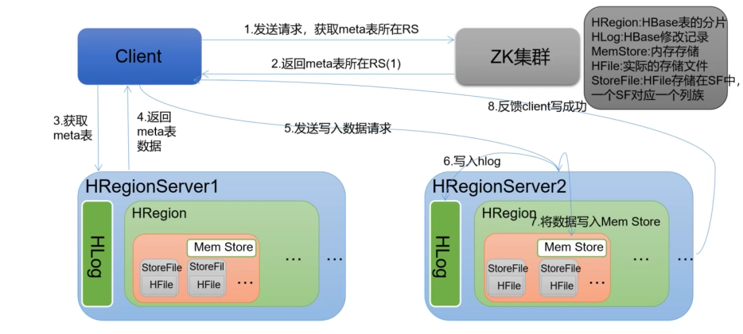
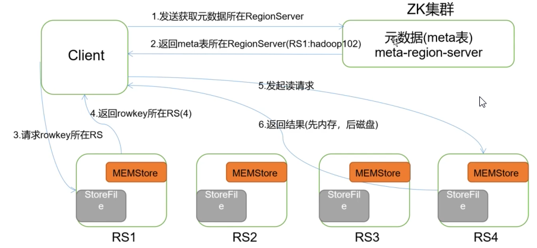

# HBase读写流程

## LSMTree

LSM数(log-structured merge-tree)。输入数据先被存储在文件(HLog)，这些文件内的数据完全有序。当有日志文件被修改时，对应的更新会被先保存在内存中来加速查询。当系统经历多次数据修改，且内存(存放数据)空间被占满后，LSM数会把有序的`键-记录`对写到磁盘中，同时创建一个新的数据存储文件（StoreFile）。此时，因为最近的修改都已经被持久化了，内存中保存的最近更新就可以被丢弃了。

文件存储的组织与B树相似，不过其为磁盘顺序读取做了优化，所有节点都是满的并按页存储。修改数据文件的操作通过滚动合并完成，也就是说，系统将现有的页与内存刷写数据混合在一起进行管理，直到数据块达到它的容量(region的阈值，达到阈值进行region的切割，重新分配HRegionServer)

多次数据刷写之后会创建许多数据存储文件，后台线程就会自动将小文件聚合成大文件，这样磁盘查找就会被限制在少数几个存储文件中。磁盘上的树结构也可以拆分成独立的小单元，这样更新就可以被分散到多个数据存储文件中。所有的数据存储文件都按键排序，所以没有必要存储文件中为新的键预留位置。

查询时先查找内存中的存储，然后再查找磁盘上的文件。这样客户端看来数据存储文件的位置也是透明的。

> 删除是一种特殊的更改，当一条记录被删除标记之后，查找会跳过这些删除过的键，当页被重写时，有删除标记的键会被丢弃。

## 大合并(major)和小合并(minor)

随着memStore的刷写会生成很多磁盘文件。如果文件的数目达到阈值，合并(compaction)过程将把它们合并成数量更少、体积更大的文件。这个过程持续到这些文件中最大的文件超过配置的最大存储文件大小，此时会触发一个Region拆分。

### 小合并(minor)

- minor合并负责重写最后生成的几个文件到一个更大的文件中。文件数量是由`hbase.hstore.compaction.min`属性设置的。它的默认值是`3`，并且最小值需要大于或等于2.

- 过大的数字将会延迟minor合并的执行，同时也会增加执行时消耗的资源及执行的时间。

- minor合并可以处理的最大文件数量默认为`10`, 用户可以通过`hbase.hstore.compaction.max`来配置。

- `hbase.hstore.compaction.min.size`： 该配置默认设置为Region的memStore刷写大小

- `hbase.hstore.compaction.max.size`：默认值为`Long.MAX_VALUE`, 配置项属性进一步减少了需要合并的文件列表。任何比最大合并大小大的文件都会被排除在外

### 大合并(major)

把所有文件压缩成一个单独的文件。默认情况下，major合并间隔是`7天`, 看情况随机的加上或减去`4.8小时`

> 如果要删除数据，不会直接修改`StoreFile`, 因为hadoop不允许修改。HBase会将删除的数据标记为已删除(给该数据添加`墓碑标记`), 如果添加了墓碑标记，查询不到该数据。在大合并的时候，将标记了墓碑标记的数据真正删除。

## 写流程

在前面提到，客户端的读写操作都需要先跟HMaster进行通信，然后由HMaster返回RegionServer的地址，然后才能真正的操作Region中的数据。

那接下来看看，当用户向HRegsionServer发出`HTable.put()`请求时，是怎样的流程：

- 首先在写入数据的时候，需要决定数据是否要写入到`HLog`类实现的预写日志中。WAL是标准的`Hadoop SequenceFile`，并且存储了`HLogKey`实例。这些键包括序列号和实际数据，所以在服务器崩溃时可以回滚还没有持久化的数据。

- 当数据被写入到WAL的日志中，数据就会被放入到MemStore中。同时还会检查MemStore是否已经写满，
  
  - 如果MemStore已经写满，则会将MemStore的数据flush到磁盘中，数据的刷写请求由另外HRegionServer的线程处理：主要过程为，会在HDFS中创建一个新的HFile。同时也会保留写入的序号，系统能够感知到哪些数据被持久化。
  
  - 如果MemStore没有写满，则写入到MemStore中，本次操作结束。

## 读流程

- Client访问Zookeeper，查找`hbase:meta`表位置，查询所在的`RegionServer`上

- Client访问RegionServer上`hbase:meta`表中的数据，查找要操作`rowkey`的所在表对应的Region所在的RegionServer

- Client读取RegionServer上的Region数据

当定位到RegionServer上的Region数据以后，按照以下的步骤查找数据：

- 查找MemStore

- 如果MemStore不存在，则查找BlockCache

- 如果BlockCache中没有，则查找StoreFile数据

- 在StoreFile中查找完数据后，同时将数据缓存到BlockCache中
