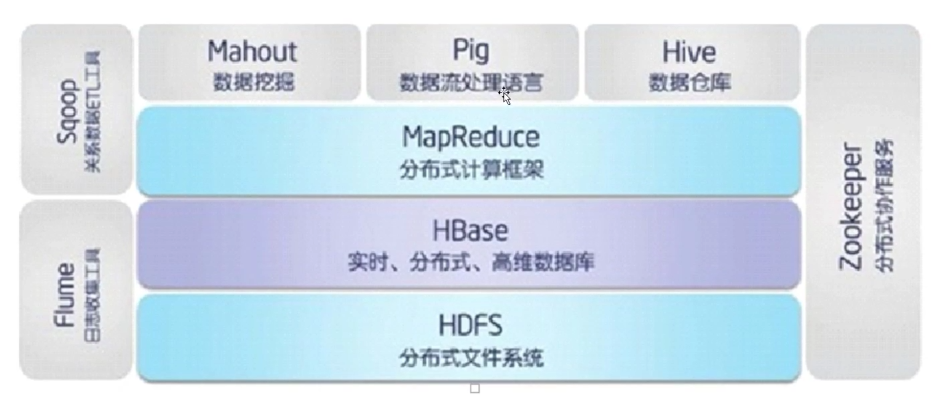
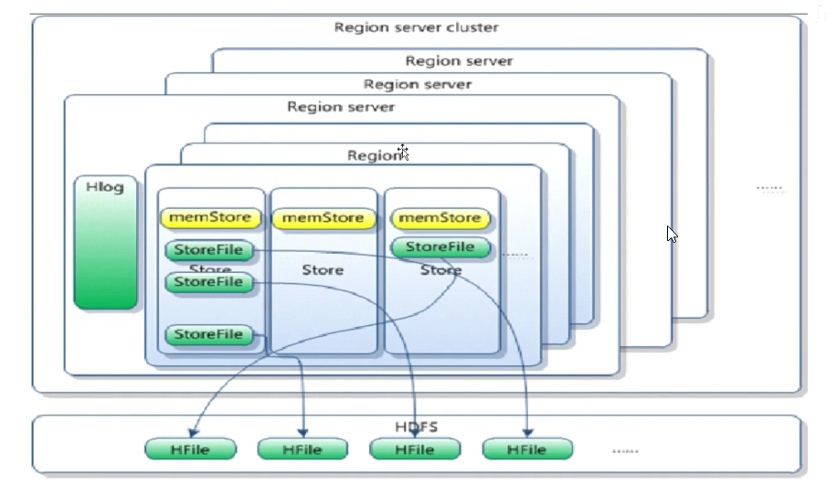

# HBase框架结构



HBase是Hadoop数据库，是一个分布式，可伸缩，面向列，高性能，高可靠性，实时读写，大数据存储区的分布式NOSQL数据库，HBase能够满足随机、实时读/写访问大数据。它是一个非关系型数据库。HBase是在Hadoop和HDFS之上提供了类似BigTable的功能。

> 作用：存储非结构化、半结构化和结构化的松散数据(列式存储的NoSQL数据库)

## 名词解释

### NameSpace

命名空间，相当于关系数据库中的database，每个命名空间下有多个表。HBase默认自带的命名空间hbase和default。

- hbase
  
  - 这个命名空间中存放的时HBase内置的表

- default:
  
  - 是用户默认使用的命名空间

### Region

- 类似关系型数据库的表，不同支出在于HBase定义表示只需要声明列族，不需要声明具体的列。

- 列可以动态的按需指定

- HBase更加适合字段经常变更的场景

- 开始创建表式一个表对应一个Region，当表增大到一定值会被拆分为两个Region

### Row

HBase表中的每行数据被称为Row，由一个RowKey和多个Column组成，数据是按照RowKey的字典顺序存储，并且查询只能根据RowKey进行检索，所以对于RowKey的设计很关键。

### Column

列式由列族(Column Family)和列限定符(Column Qualifier)进行限定。

> 一般在定义的时候，只需要定义列族，而限定符无需预先定义。存储格式为: 列族:列名。 例如: base:name

### Cell

某行中的某一列被称为Cell(单元格)，由{rowkey, column family:column qualifier, time stamp}确定单元。Cell中没有具体的类型，全部是字节码的形式(字节数组)存储

### TimeStamp

用于标识数据的不同版本(version)，每条数据写入时，如果不指定时间戳，系统会自动为其加上该字段，值为HBase的写入时间。

## HBase架构


### 目录表hbase:meta

目录表hbase:meta作为HBase表存在，并从hbase shell的list(类似show tables)命令中过滤掉，但实际上是一个表，就像其他表一样。

该表又被称为META表，保存系统中所有region的列表。`hbase:meta`位置信息存储在zookeeper中， `同时也是所有查询的入口`。

#### 表结构

```sql
key:
    region的key，结构为: [table],[region start key, end key], [region id]
values:
    info:regioninfo(当前region序列化的HRegionInfo实例)
    info:server(包含当前region的RegionServer的server:port)
    info:serverstartcode(包含当前region的RegionServer进程的开始时间)
```

当表数据发生拆分时，将创建额外的两列，称为`info:splitA`和`info:splitB`。这些列代表两个子Region, 这些列的值也是序列化的HRegionInfo实例。Region分割后，将删除此行。

```sql
a,,endkey
a,startkey,endkey
a,startkey,
```

> 在HBase中，空建用于标识表开始和表结束。就有空开始键的Region是表中的第一个Region。如果某一个Region同时具有空开始和空结束键，则它是表中唯一的Region.

### Client

HBase客户端查找关注的行范围所在的RegionServer。 它通过查询`hbase:meta`表来完成此操作。在找到所需要的Region后，客户端与提供该Region的RegionServer通信，而不是通过Master, 并发出读取和写入请求。

这部分信息缓存在客户端中，以便后续请求无需再次查找。如果Master的负载均衡器重新平衡或者由于RegionServer宕机，都会重新指定该Region的RegionServer,客户端将重新查询并将新的数据缓存在客户端。


图片来自[HBase架构详解及读写流程-腾讯云开发者社区-腾讯云](https://cloud.tencent.com/developer/article/2184702)

客户端访问流程如下：

- Client先访问zookeeper，从`hbase:meta`获取元数据表位于RegionServer信息

- 访问元数据表对应的RegionServer服务器，根据请求信息(namespace:table/rowkey)，在meta表中查询出目标数据位于哪个RegionServer的具体Region

- 将获取到的Region信息已经元数据表的位置信息缓存到客户端的`meta cache`，方便下次访问

- 与目标Region所在RegionServer进行通信

- 将数据写入到WAL中

- 将数据写入到对应的memStore中

- 向客户端发送写入成功的消息

- 0等达到memStore写入数据限制时，将数据写入到HFile中

### Zookeeper

- 保证任何时候，集群中只有一个活跃的`HMaster`

- 存储所有Region所在`RegionServer`等信息

- 实时监控`Region Server`上线和下线信息，并告知`HMaster`

- 存储HBase的`schema`和`table`元数据

### HMaster

- 为RegionServer分配Region

- 负责RegionServer的负载均衡

- 发现失效的RegionServer并重新分配其上的Region

- 管理用户对table的增删改操作

> 主要是对region的管理，包括对Region的分配和管理对表的操作。

HMaster不对提供对外的数据操作，而是将具体的操作交由RegionServer完成。

### RegionServer

- 维护Region，处理对Region的I/O操作

- 负责切分在运行过程中变得过大的Region

### Region

- HBase自动把表水平划分成多个Region, 每个Region会保存一个表里面某段连续的数据，主要是按照行建(RowKey)的顺序排列

- 每个表一开始只有一个Region，随着数据不断插入表，Region不断增大，当增大到一个阈值的时候，Region就会裂变为两个Region

- 当table中的行不断增多，就会有越来越多的Region，这样一张完整的表被保存在多个RegionServer上。

- 一个Region由多个Store组成，一个Store对应一个CF(列族)

- HRegion是HBase中分布式存储和负载均衡的最小单元。最小单元就表示不同的HRegion可以分布在不同的HRegion Server上。HRegion由一个或者多个Store组成，每个Store保存一个column Family. 每个Store又由一个memStore和0至多个StoreField组成。`StoreField以HFile格式保存在HDFS上`



### Memstore和StoreFile

- store包括：内存中memStore和磁盘storeFile

- 写操作先写入memStore， 当memStore中的数据达到某个阈值，RegsionServer会启动FlushCache进程写入StoreFile，每次写入会形成单独的一个StoreFile

- 当StoreFile文件数量增长到一定阈值后，系统会进行合并(minor, major, compaction)，在合并过程中会进行版本合并和删除工作, 形成更大的StoreFile

- 当一个Region所有StoreFile的数量和大小超过一定阈值后，会把先前的Region分割为两个，并由HMaster分配到新的RegionServer服务器，实现负载均衡

- 客户端检索数据，先查找MemStore，再BlockCache(查询缓存)， 找不到再找StoreFile

## HBase特点

- 强大的一致读/写: HBase不是`最终一致性`的DateStore, 他非常适合告诉计算器聚合等任务

- 自动分片：HBase表通过Region分布在集群上，并随着数据的增长, Region会自动分割和重新分配

- 自动的RegionServer故障转移

- Hadoop/HDFS集成：HBase支持HDFS作为其分布式文件系统

- MapReduce：HBase通过MapReduce进行大规模并行处理，将HBase用作源和漏。即`HBase->MR->HDFS`或者`HBase -> MR -> HBase -> HDFS -> MR -> HBase`

- Java客户端API：HBase支持易于使用的Java API以进行编程访问

- Thrfit / REST API：HBase还支持非Java前端的Thrift和REST

- 块缓存和布隆过滤器：HBase支持块缓存和布隆过滤器，已实现大容量查询优化。

- HBase内置网页，用于运维监控和JMX指标

- 缺点：`不支持行间事务，但是支持行内事务`
