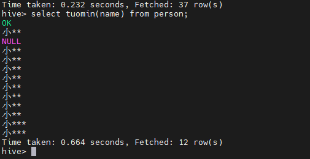
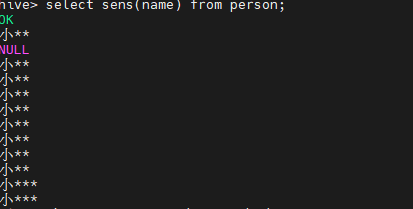
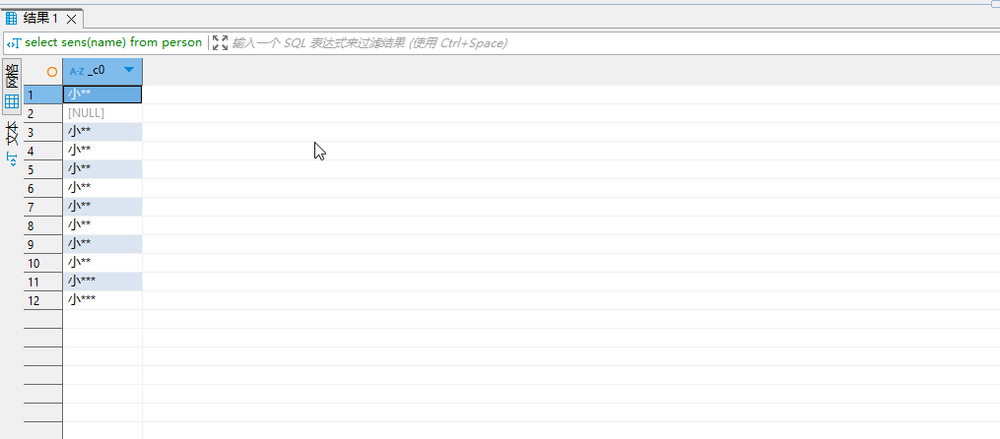
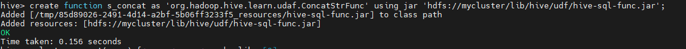
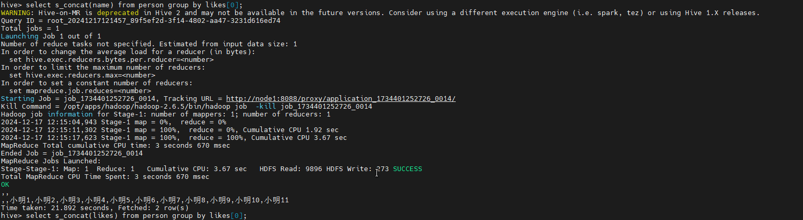

# Hive SQL

## Hive SerDe

Hive SerDe：Serializer and Deserializer

SerDe用于序列化和反序列化，构建在数据存储和执行引擎之间，对两者实现解耦。

Hive同各国`ROW FORMAT DELIMITED`以及`SERDE`进行内容的读写。

```sql
row_format
: DELIMITED
    [FIELDS TERMINATED BY char [ESCAPED BY char]]
    [COLLECTION ITEMS TERMINATED BY char]
    [MAP KEYS TERMINATED BY char]
    [LINES TERMINATED BY char]
:SERDE serde_name [WITH SERDEPROPERTIES (property_name=property_value...)]
```

### Hive 正则匹配

```sql
create table logtb1(
    host string,
    identity string,
    s_u string,
    time string,
    request string,
    referer string,
    agent string
)
row format serde 'org.apache.hadoop.hive.serde2.RegexSerDe'
with serdeproperties(
    "input.regex" = "([^ ]*)\s+([^ ]*)\s+([^ ]*)\s+\\[(.*)\\]\s+\"(.*)\”\s+([-|[0-9]]*)\s+(.*)"
) stored as textfile;
```

数据格式如下

```tex
192.168.57.4 - - [29/Feb/2016:18:14:35+0800] "GET[29/Feb/2016:18:14:36+08001/tomcat.css HTTP/1.1” 304 -
192.168.57.4 - - [29/Feb/2016:18:14:35+0800] "GET[29/Feb/2016:18:14:36+08001/tomcat.css HTTP/1.1” 304 -
192.168.57.4 - - [29/Feb/2016:18:14:35+0800] "GET[29/Feb/2016:18:14:36+08001/tomcat.css HTTP/1.1” 304 -
192.168.57.4 - - [29/Feb/2016:18:14:35+0800] "GET[29/Feb/2016:18:14:36+08001/tomcat.css HTTP/1.1” 304 -
192.168.57.4 - - [29/Feb/2016:18:14:35+0800] "GET[29/Feb/2016:18:14:36+08001/tomcat.css HTTP/1.1” 304 -
192.168.57.4 - - [29/Feb/2016:18:14:35+0800] "GET[29/Feb/2016:18:14:36+08001/tomcat.css HTTP/1.1” 304 -
192.168.57.4 - - [29/Feb/2016:18:14:35+0800] "GET[29/Feb/2016:18:14:36+08001/tomcat.css HTTP/1.1” 304 -
192.168.57.4 - - [29/Feb/2016:18:14:35+0800] "GET[29/Feb/2016:18:14:36+08001/tomcat.css HTTP/1.1” 304 -
192.168.57.4 - - [29/Feb/2016:18:14:35+0800] "GET[29/Feb/2016:18:14:36+08001/tomcat.css HTTP/1.1” 304 -
192.168.57.4 - - [29/Feb/2016:18:14:35+0800] "GET[29/Feb/2016:18:14:36+08001/tomcat.css HTTP/1.1” 304 -
192.168.57.4 - - [29/Feb/2016:18:14:35+0800] "GET[29/Feb/2016:18:14:36+08001/tomcat.css HTTP/1.1” 304 -
192.168.57.4 - - [29/Feb/2016:18:14:35+0800] "GET[29/Feb/2016:18:14:36+08001/tomcat.css HTTP/1.1” 304 -
192.168.57.4 - - [29/Feb/2016:18:14:35+0800] "GET[29/Feb/2016:18:14:36+08001/tomcat.css HTTP/1.1” 304 -
192.168.57.4 - - [29/Feb/2016:18:14:35+0800] "GET[29/Feb/2016:18:14:36+08001/tomcat.css HTTP/1.1” 304 -
```

## Hive排序方式

Hive支持一下集中排序方式：

- `order by`：对于查询结果做全排序，只允许有一个reduce处理，当数据量较大时，应该慎用，严格模式下，必须配合limit使用

- `sort by`：对于单个reduce的数据进行排序

- `distribute by`- 分区排序，经常和sort by 一起使用

- `cluster by`- 相当于sort by + distribute by. cluster by 不能通过`asc, desc`来指定升序或者降序。

## Hive函数

### 内置运算符

#### 关系运算符(where字句中)

| 运算符           | 类型     | 说明                                                                                     |
| ------------- | ------ | -------------------------------------------------------------------------------------- |
| A = B         | 所有原始类型 | 如果A等于B, 则返回true, 否则返回false                                                             |
| A == B        | 无      | 失败，因为无效的语法，SQL使用"="表示相等关系                                                              |
| A <> B        | 所有原始类型 | 如果A不等于B返回true, 否则返回false。如果A或B值为NULL， 则返回NULL                                          |
| A < B         | 所有原始类型 | 如果A小于B返回true, 否则返回false.如果A或B值为NULL, 则返回NULL                                           |
| A <= B        | 所有原始类型 | 如果A小于等于B返回true, 否则返回false.如果A或B值为NULL, 则返回NULL                                         |
| A > B         | 所有原始类型 | 如果A大于B返回true, 否则返回false.如果A或B值为NULL, 则返回NULL                                           |
| A >= B        | 所有原始类型 | 如果A大于等于B返回true, 否则返回false.如果A或B值为NULL, 则返回NULL                                         |
| A IS NULL     | 所有类型   | 如果A的值为NULL, 返回true，否则返回false                                                           |
| A IS NOT NULL | 所有类型   | 如果A的值不为NULL, 则返回true, 否则返回false                                                        |
| A LIKE B      | 字符串    | 如果A或B值为NULL, 结果返回NULL。字符串A与B通过sql进行匹配，如果符合返回true, 否则返回false. 其中"_"表示匹配一个字符，"%"表示匹配多个字符 |
| A RLIKE B     | 字符串    | 如果A或B值为NULL, 结果返回NULL。字符串A与B通过JAVA进行匹配，如果相符则返回true, 否则返回false.                         |
| A REGEXP B    | 字符串    | 与RLIKE相同。使用正则表达式匹配                                                                     |

#### 算术运算符

| 运算符    | 类型     | 说明                                                                 |
| ------ | ------ | ------------------------------------------------------------------ |
| A + B  | 所有数字类型 | A和B相加，结果与操作数同类型                                                    |
| A - B  | 所有数字类型 | A和B相减，结果与操作数同类型                                                    |
| A * B  | 所有数字类型 | A和B相乘，结果与操作值有共同类型。如果乘法造成溢出，将选择更高的类型                                |
| A / B  | 所有数字类型 | A和B相除，结果是一个double类型的结果                                             |
| A % B  | 所有数字类型 | A除以B余数与操作数值有共同类型                                                   |
| A & B  | 所有数字类型 | 运算符查看两个参数的二进制表示法的值，并执行按位与操作。两个表达式的相同位为1时，结果位1；否则为0                 |
| A \| B | 所有数字类型 | 运算符查看两个参数的二进制表示法的值，并进行按位或运算。相同位只要有一个1，则结果为1，否则为0                   |
| A ^ B  | 所有数字类型 | 运算符查看两个参数的二进制表达法的值，并执行按位异或操作。当且仅当只有一个表达式的某位上为1时，结果的该位才为1.否则结果的该位为0 |
| ~A     | 所有数字类型 | 对一个表达式执行按位"非"取反操作                                                  |

#### 逻辑运算符

| 运算符     | 类型  | 说明                                                           |
| ------- | --- | ------------------------------------------------------------ |
| A AND B | 布尔值 | A和B同时为true是，结果为true, 否则为false                                |
| A && B  | 布尔值 | 与AND相同                                                       |
| A OR B  | 布尔值 | A或B 中任何一个结果为true， 则结果为true, 否则为false. 如果A和B同时为NULL, 则结果为NULL |
| A \| B  | 布尔值 | 与OR相同                                                        |
| NOT A   | 布尔值 | 如果A为NULL或结果为false时，返回true. 否则返回false                         |
| !A      | 布尔值 | 与NOT相同                                                       |

### 内置函数

#### 复杂类型函数

| 函数     | 类型                             | 说明                                   |
| ------ | ------------------------------ | ------------------------------------ |
| map    | (key1, value2, key2, value2..) | 通过指定的键/值对，创建一个map                    |
| struct | (val1, val2, val3...)          | 通过指定的字段值，创建一个结构。结构字段名称将COL1, COL2... |
| array  | (val1, val2, val3...)          | 通过指定的元素，创建一个数组                       |

#### 对复杂类型函数操作

| 函数      | 类型              | 说明                       |
| ------- | --------------- | ------------------------ |
| A[n]    | A是一个数组，n是一个整型   | 返回数组A中的第n个元素，第一个元素下标从0开始 |
| M[]key] | M是Map<K,V>，关键K型 | 返回Map中键key对应的值           |
| S.x     | S为struct类型      | 返回结构S中的x属性的值             |
|         |                 |                          |

#### 数学函数

| 返回类型       | 函数                                                 | 说明                       |
| ---------- | -------------------------------------------------- | ------------------------ |
| BIGINT     | round(double a)                                    | 四舍五入                     |
| DOUBLE     | round(double a,int d)                              | 小数部分d位之后数字四舍五入           |
| BIGINT     | floor(double a)                                    | 对给定的数字A进行向下取整最接近的整数      |
| BIGINT     | ceil(double, a), ceiling(double a)                 | 将给定数字a向上取整               |
| double     | rand(), rand(int seed)                             | 返回大于或等于0且小于1的平均分布随机数。    |
| double     | exp(double a)                                      | 返回e的a次方                  |
| double     | ln(double a)                                       | 返回给定数值的自然对数              |
| double     | log10(double a)                                    | 返回给定数值的以10为底自然对数         |
| double     | log2(double a)                                     | 返回给定数值的以2为底自然对数          |
| double     | log(double base, double a)                         | 返回给定数值a的以base为底自然对数      |
| double     | pow(double a, double p), power(double a, double p) | 返回数字a的p次幂的结果             |
| double     | sqrt(double a)                                     | 返回数值的平方根                 |
| string     | bing(bigint a)                                     | 返回二进制格式                  |
| string     | hex(bigint a) hex(string a)                        | 将证书或字符串转换为十六进制字符串        |
| string     | unhex(string a)                                    | 将十六进制字符串转换为由数字表示的字符串     |
| string     | conv(bigint num, int from_base, int to_base)       | 将指定数值，由原来的度量体系转换为指定的试题体系 |
| double     | abs(double a)                                      | 取绝对值                     |
| int double | pmod(int am, int b), pmod(double a, double b)      | 返回a除以b的余数的绝对值            |
| double     | sin(double a)                                      | 返回给定角度的正弦值               |

#### 搜集函数

| 返回类型 | 函数                    | 说明           |
| ---- | --------------------- | ------------ |
| int  | size(Map<key, value>) | 返回map类型的元素数量 |
| int  | site(Array<T>)        | 返回数组类型的元素数量  |

#### 类型转换函数

> INT -> BIGINT自动转换， BIGINT -> INT需要强制转换类型

| 返回类型    | 函数                   | 说明    |
| ------- | -------------------- | ----- |
| 指定 type | cast(expr as <type>) | 类型转换。 |

#### 日期函数

| 返回类型   | 函数                                              | 说明                                                                                                          |
| ------ | ----------------------------------------------- | ----------------------------------------------------------------------------------------------------------- |
| string | from_unixtime(bigint unixtime[, string format]) | UNIX_TIMESTAMP参数表示返回一个值"yyyy-MM-dd HH:mm:ss"或"yyyyMMddHHmmss.uuuuuu"格式，这取决于是否在一个字符串或数字语境中使用的功能，该值表示当前的时区的时间 |
| bigint | unix_timestamp()                                | 如果不带参数的调用，返回一个unix时间戳，从1970年开始计算                                                                            |
| bigint | unix_timestamp(string date)                     | 指定日期参数调用UNIX_TIMESTAMP(), 返回从1970年到指定时间的秒数                                                                  |
| bigint | unix_timestamp(string date, string pattern)     | 指定时间输入格式，返回从1970到指定日期的秒数                                                                                    |
| string | to_date(string timestamp)                       | 返回时间中的年月日                                                                                                   |
| string | to_dates(string date)                           | 给定一个日期date, 返回一个天数                                                                                          |
| int    | year(string date)                               | 返回指定时间的年份                                                                                                   |
| int    | month(string date)                              | 返回指定时间的月份                                                                                                   |
| int    | day(string date)                                | 返回指定时间的日期                                                                                                   |

#### 条件函数

| 返回  | 函数                                                        | 说明                                   |
| --- | --------------------------------------------------------- | ------------------------------------ |
| T   | if(boolean testCondition, T valueTrue, T valueFaseOrNull) | 判断是否满足条件，如果满足返回一个值，如果不满足则返回另外一个值     |
| T   | COALESCE(T v1, T v2...)                                   | 返回一组数据中，第一个不为NULL的值，如果均为NULL, 返回NULL |
| T   | CASE a WHEN  b THEN c [WHEN  d THEN e]*[ELSE f] END       | 当a=b时，返回c; 当a=d时，返回e, 否则返回f          |
| T   | CASE WHEN a THEN b [WHEN c THEN d] *[ELSE e] END          | 当值为a时返回b, 当值为c时返回d, 否则返回e            |

### 自定义函数

自定义函数包含三种UDF, UDAF, UDTF

- UDF(User-Defined-Function)：一进一出

- UDAF(User-Defined Aggregation Function)：聚集函数，多进一出

- UDTF(User-Defined Table-Generating Functions)： 一进多处

> 使用方式：在HIVE会话中add自定义函数jar文件，然后创建function继而使用函数

#### 自定义函数的步骤(UDF)

- UDF函数可以直接应用于select语句，对查询结构做格式化处理后，再输出内容

- 编写UDF函数的时候需要注意以下几点
  
  - 自定义UDF需要继承`org.apache.hadoop.hive.ql.UDF`
  
  - 需要实现evaluate函数，evaluate函数支持重载

以下实现了一个简单的 脱敏工具类，值展示文本的第一个字符即可：

```java
package org.hadoop.hive.learn.udf;

import org.apache.hadoop.hive.ql.exec.UDF;

/**
 * 只展示第一个字符的操作
 */
public class SensitiveFunc extends UDF {
    public String evaluate(String str) {
        if (str == null || str.length() <= 1) {
            return str;
        }

        int length = str.length();
        String res = str.substring(0,1);

        StringBuilder sb = new StringBuilder(res);
        for (int i = 1; i < length; i++) {
            sb.append("*");
        }
        return sb.toString();
    }

    public static void main(String[] args) {
        SensitiveFunc sensitiveFunc = new SensitiveFunc();
        String res = sensitiveFunc.evaluate("你好劜");
        System.out.println(res);
    }
}
```

- 将以上代码打包为jar包，并上传到hive所在服务器中。

- 进入hive客户端，添加jar包
  
  ```shell
  add jar /root/hive-learn-1.0-SNAPSHOT.jar
  ```

- 创建临时函数：
  
  ```sql
  create temporary function tuomin as 'org.hadoop.hive.learn.udf.SensitiveFunc'
  ```

在创建完成以上的函数之后，就可以使用这个函数了：



我们可以看到自己定义的脱敏函数已经完成啦~~~~

> 这样的缺点是，因为创建的时temporary的函数，因此在hive客户端关闭之后，这个函数就无法再次被找到。

在以上的步骤中，我们也可以将jar包上传的hdfs上，然后通过一下命令使用:

```sql
create temporary function tumin as 'org.hadoop.hive.learn.udf.SensitiveFunc' using jar 'hdfs://node1:8020/path/tuomin.jar'
```

##### 创建永久函数

永久函数因为需要使用到jar, 这个时候我们可以将jar包上传到hdfs中，然后创建永久函数，当在任何机器上使用函数时，都可以直接从hdfs上加载jar包并使用，具体步骤如下:

```shell
# 创建目录
hdfs dfs -mkdir -p /lib/hive/udf

# 上传jar包
hdfs dfs -put /root/hive-learn-1.0-SNAPSHOT.jar /lib/hive/udf/hive-sql-func.jar
```

然后有了以上的jar包之后，则在Hive客户端，创建永久的函数:

```sql
hive> create function sens as 'org.hadoop.hive.learn.udf.SensitiveFunc' using jar 'hdfs://mycluster/lib/hive/udf/hive-sql-func.jar'
```

有了这个函数之后，我就可以在任何地方使用这个函数了：



一下为在hive的客户端工具查询的情况：



##### 函数的维护

```sql
#删除函数名
drop function sens
```

#### UDAF自定义集函数

> 多行进一行出，如sum(), min()，用在group by时

##### 实现步骤如下

1. 必须继承
   
   - `org.apache.hadoop.hive.ql.exec.UDAF`(函数类继承)
   
   - `org.apache.hadoop.hive.ql.exec.UDAFEvaluator`(内部类 Evaluator实现UDAFEvaluator接口)

2. Evaluator需要实现`init`, `iterate`,`terminatePartial`, `merge`, `terminate`这几个函数
   
   - init()：类似于构造函数，用于UDAF初始化
   
   - iterate()：接受传入的参数，并进行内部的轮转，返回boolean
   
   - termiatePartial()：无参数，其为iterate函数轮转结束后，返回轮转数据，类似于hadoop的Combiner
   
   - merge()：接受terminatePartial的返回结果，进行数据merge操作，其返回类型为boolean
   
   - terminate()：返回最终的聚集函数结果

##### 关于UDAF的四个阶段

- PARTIAL1：这个阶段用于接受数据库的原始数据，`iterate()`和`terminatePartial()`方法将被调用。一般指代了mapreduce任务中的map阶段

- PARTIAL2: 这个阶段接受了部分的合并数据，主要是多map阶段产生的数据做合并操作。相当于mapreduce任务中的conbiner. 这个阶段`merge()`和`terminatePartial()`任务将被调用

- FINAL：这个阶段对PARTIAL2产生的数据做整体的合并操作。这个阶段中，`merge()`和`terminate()`方法将被调用。这个阶段就相当于mapreduce任务中的reduce阶段

- COMPLETE：这个阶段就是完结的阶段，`terminate()`和`iterate()`方法将被调用。这个阶段如果mapreduce没有reduce任务，那么将会直接到COMPLETE阶段。这个阶段也是接受的数据库的原始数据

##### 实现concat功能

这段代码主要实现字符串concat功能，实现在group的时候，将对应的字段拼接为一个字符串，具体代码如下：

```java
package org.hadoop.hive.learn.udaf;

import org.apache.hadoop.conf.Configuration;
import org.apache.hadoop.hive.ql.metadata.HiveException;
import org.apache.hadoop.hive.ql.parse.SemanticException;
import org.apache.hadoop.hive.ql.udf.generic.AbstractGenericUDAFResolver;
import org.apache.hadoop.hive.ql.udf.generic.GenericUDAFEvaluator;
import org.apache.hadoop.hive.serde2.objectinspector.ObjectInspector;
import org.apache.hadoop.hive.serde2.objectinspector.ObjectInspectorFactory;
import org.apache.hadoop.hive.serde2.objectinspector.PrimitiveObjectInspector;
import org.apache.hadoop.hive.serde2.typeinfo.TypeInfo;
import org.apache.hadoop.util.ReflectionUtils;
import org.slf4j.Logger;
import org.slf4j.LoggerFactory;

public class ConcatStrFunc extends AbstractGenericUDAFResolver {

    private static final Logger LOG = LoggerFactory.getLogger(ConcatStrFunc.class);

    /**
     * 创建Evaluator对象
     *
     * @param info The types of the parameters. We need the type information to know
     *             which evaluator class to use.
     * @return
     * @throws SemanticException
     */
    @Override
    public GenericUDAFEvaluator getEvaluator(TypeInfo[] info) throws SemanticException {
        LOG.info("获取Evaluator对象..");
        return new ConcatStrEvaluator();
    }

    public static class ConcatStrAggregationBuffer implements GenericUDAFEvaluator.AggregationBuffer {

        private StringBuilder concatStrBuilder = new StringBuilder();
        private Object monitor = new Object();
        private static final String SPLITTER = ",";

        public ConcatStrAggregationBuffer() {
            LOG.info("创建buffer对象..");
        }

        public ConcatStrAggregationBuffer(String str) {
            if (str != null && str.length() > 0) {
                concatStrBuilder.append(str);
            }
        }

        public String get() {
            return this.concatStrBuilder.toString();
        }

        public void add(String str) {
            if (str == null) {
                str = "";
            }
            synchronized (monitor) {
                this.concatStrBuilder.append(SPLITTER).append(str);
            }
        }

        public void reset() {
            synchronized (monitor) {
                this.concatStrBuilder.delete(0, concatStrBuilder.length());
            }
        }
    }

    public static class ConcatStrEvaluator extends GenericUDAFEvaluator {

        private PrimitiveObjectInspector inputObjectInspector;
        private ObjectInspector outputOI;

        public ConcatStrEvaluator() {

        }

        /**
         * 这里主要是用来初始化聚合函数，这里需要对传入的参数进行解析。这个函数在每个阶段都会被调用
         *
         * @param m          The mode of aggregation.
         * @param parameters The ObjectInspector for the parameters: In PARTIAL1 and COMPLETE
         *                   mode, the parameters are original data; In PARTIAL2 and FINAL
         *                   mode, the parameters are just partial aggregations (in that case,
         *                   the array will always have a single element).
         * @return
         * @throws HiveException
         */
        @Override
        public ObjectInspector init(Mode m, ObjectInspector[] parameters) throws HiveException {
            LOG.info("初始化Evaluator#init()方法...");
            super.init(m, parameters);
            this.inputObjectInspector = (PrimitiveObjectInspector) parameters[0];

            if (m == Mode.PARTIAL1 || m == Mode.COMPLETE) {
                // 这里是因为PARTIAL1和COMPLETE阶段都是输入的数据库的原始数据，所以他们的处理逻辑是一样的
            } else {
                // 这里主要是指代的时对PARTIAL2和FINAL阶段的数据，这里接受到的是上一个阶段计算出的结果，因此这里数据主要来自PARTIAL1和PARTIAL2的结果
            }

            // 这里是对输出数据的处理，保证我们输出的数据类型和我们需要的类型保持一致
            this.outputOI = ObjectInspectorFactory.getReflectionObjectInspector(
                    String.class,
                    ObjectInspectorFactory.ObjectInspectorOptions.JAVA
            );
            return this.outputOI;
        }

        /**
         * 创建buffer对象，用于存储计算的中间结果
         *
         * @return
         * @throws HiveException
         */
        @Override
        public AggregationBuffer getNewAggregationBuffer() throws HiveException {
            LOG.info("调用Evaluator#getNewAggregationBuffer()方法...");
            return new ConcatStrAggregationBuffer();
        }

        /**
         * 重置buffer中的缓存数据
         *
         * @param agg
         * @throws HiveException
         */
        @Override
        public void reset(AggregationBuffer agg) throws HiveException {
            LOG.info("调用Evaluator#reset()方法...");
            ((ConcatStrAggregationBuffer) agg).reset();
        }

        /**
         * 遍历数据, 这里因为只会在partial1和COMPLETE中被调用，因此这里遍历的是从数据库中获取的原始数据
         *
         * @param agg
         * @param parameters The objects of parameters.
         * @throws HiveException
         */
        @Override
        public void iterate(AggregationBuffer agg, Object[] parameters) throws HiveException {
            LOG.info("调用Evaluator#iterate()方法...");
            if (parameters == null || parameters.length == 0) {
                return;
            }

            ConcatStrAggregationBuffer buffer = (ConcatStrAggregationBuffer) agg;
            for (Object parameter : parameters) {
                buffer.add((String) this.inputObjectInspector.getPrimitiveJavaObject(parameter));
            }
        }

        /**
         * 这里调用的是一个阶段性的成果，用于在分布式计算中，将各个mapper的计算结果进行合并
         *
         * @param agg
         * @return
         * @throws HiveException
         */
        @Override
        public Object terminatePartial(AggregationBuffer agg) throws HiveException {
            LOG.info("调用Evaluator#terminatePartial()");
            return this.terminate(agg);
        }

        @Override
        public void merge(AggregationBuffer agg, Object partial) throws HiveException {
            LOG.info("调用Evaluator#merge()");
            if (partial != null) {
                ConcatStrAggregationBuffer buffer = (ConcatStrAggregationBuffer) agg;
                // debug info
                if (this.inputObjectInspector == null) {
                    buffer.add("inputObjectInspector is null!");
                } else {
                    buffer.add((String) this.inputObjectInspector.getPrimitiveJavaObject(partial));
                }
            }
        }

        @Override
        public Object terminate(AggregationBuffer agg) throws HiveException {
            LOG.info("调用Evaluator#terminate()");
            return ConcatStrAggregationBuffer.class.cast(agg).get();
        }
    }

    public static void main(String[] args) {
        ConcatStrEvaluator concatStrEvaluator = ReflectionUtils.newInstance(ConcatStrEvaluator.class, new Configuration());
        System.out.println(concatStrEvaluator);
    }

}
```

##### 自定义UDAF函数

在有了上面的实现之后，就需要自己定义Hive函数了，这个步骤需要在Hive客户端中进行操作，具体操作步骤如下：

- 将打包好的jar包上传到服务器或者HDFS

- 定义Hive函数

- 使用Hive函数验证

```sql
create function s_concat as 'org.hadoop.hive.learn.udaf.ConcatStrFunc' using jar 'hdfs://mycluster/lib/hive/udf/hive-sql-func.jar';
```

创建完成后，将输出如下的提示，表示函数创建成功:



> 这里面的输出表示了临时的jar存放的位置，在测试阶段建议使用`create temporary function`创建，因为创建永久函数调试程序，如果程序有BUG会导致很多奇怪的问题，在调试好了之后，再创建永久函数

在创建函数完成后，我们就可以使用SQL查询验证是否生效，我的等结果如下：



这就表示函数自定完成并成功投入使用。 

## 使用示例

### 统计掉线率

```sql
create table jizhan(
    record_time string,
    imei int,
    cell string,
    ph_num int,
    call_num int,
    drop_num int,
    duration int,
    drop_rate double,
    net_type string,
    erl int
) row format delimited fields terminated by ',';
```

插入以下数据：

```sql
insert into jizhan values ('2011-07-13 00:00:00+08',356966,'29448-37062',0,0,0,0,0,6,0),
('2011-07-13 00:00:00+08',352024,'29448-51331',0,0,0,0,0,6,0),
('2011-07-13 00:00:00+08',353736,'29448-51331',0,0,0,6,0,0),
('2011-07-13 00:00:00+08',353736,'29448-51333',0,0,0,0,0,6,0),
('2011-07-13 00:00:00+08',351545,'29448-51333',0,0,0,0,0,6,0),
('2011-07-13 00:00:00+08',353736,'29448-51343',1,0,0,8,0,6,0),
('2011-07-13 00:00:00+08',359681,'29448-51462',0,0,0,0,0,6,0),
('2011-07-13 00:00:00+08',354707,'29448-51462',0,0,0,0,0,6,0),
('2011-07-13 00:00:00+08',356137,'29448-51470',0,0,0,0,0,6,0),
('2011-07-13 00:00:00+08',352739,'29448-51971',0,0,0,0,0,6,0),
('2011-07-13 00:00:00+08',354154,'29448-51971',0,0,0,0,0,6,0),
('2011-07-13 00:00:00+08',127580,'29448-51971',0,0,0,0,0,6,0),
('2011-07-13 00:00:00+08',354264,'29448-51973',0,0,0,0,0,6,0),
('2011-07-13 00:00:00+08',354733,'29448-51973',1,0,0,36,0,6,0),
('2011-07-13 00:00:00+08',356807,'29448-51973',0,0,0,0,0,6,0),
('2011-07-13 00:00:00+08',125470,'29448-51973',1,0,0,13,0,6,0),
('2011-07-13 00:00:00+08',353530,'29448-52061',1,0,0,46,0,6,0),
('2011-07-13 00:00:00+08',352417,'29448-5231',1,0,0,2,0,6,0),
('2011-07-13 00:00:00+08',353419,'29448-5231',0,0,0,0,0,6,0),
('2011-07-13 00:00:00+08',306416,'29448-52310',0,0,0,0,6,0),
('2011-07-13 00:00:00+08',356208,'29448-5233',0,0,0,0,0,6,0),
('2011-07-13 00:00:00+08',357238,'29448-5233',1,0,0,21,0,6,0),
('2011-07-13 00:00:00+08',354154,'29448-52541',0,0,0,0,0,6,0),
('2011-07-13 00:00:00+08',358662,'29448-53050',0,0,0,0,0,6,0),
('2011-07-13 00:00:00+08',357470,'29448-53523',0,0,0,0,0,6,0),
('2011-07-13 00:00:00+08',354555,'29448-53523',0,0,0,0,0,6,0),
('2011-07-13 00:00:00+08',864301,'29448-53871',0,0,0,0,0,6,0),
('2011-07-13 00:00:00+08',357727,'29448-53871',0,0,0,0,0,6,0),
('2011-07-13 00:00:00+08',356049,'29448-53871',0,0,0,0,0,6,0),
('2011-07-13 00:00:00+08',356569,'29448-54853',0,0,0,0,0,6,0),
('2011-07-13 00:00:00+08',353257,'29448-54874',0,0,0,0,0,6,0),
('2011-07-13 00:00:00+08',355287,'29448-55671',0,0,0,0,0,6,0),
('2011-07-13 00:00:00+08',358675,'29448-55672',0,0,0,0,0,6,0);
```

统计结果

```sql
-- 结果统计
create table jizhan_result(
    imei string comment '基站编号',
    drop_num int comment '掉线总时长',
    duration int comment '通话总时长',
    drop_rate double comment '掉话率'
);


-- 将数据统计到结果表中
from jizhan
insert into jizhan_result
select 
imei, sum(drop_num) as d_num, sum(duration) as dur, (sum(drop_num)/sum(duration)) drop_rate
group by imei;

select * from jizhan_result;
```

### 统计单词的数量

```sql
create table words(line string);

insert into words(line) values ('To represent database-table data in Python objects, Django uses an intuitive system: A model class represents a database table, and an instance of that class represents a particular record in the database table.
To create an object, instantiate it using keyword arguments to the model class, then call save() to save it to the database.
Assuming models live in a models.py file inside a blog Django app, here is an example:')
```

```sql
select word, count(*) as cnt from (select explode(split(line, ' ')) as word from words)  tmp group by word order by cnt desc;
```

```sql
create table word_count(word string, cnt int);


from ((select explode(split(line, ' ')) as word from words)  tmp  )
insert into word_count 
select tmp.word, count(*) as cnt  group by word order by cnt desc;
```
