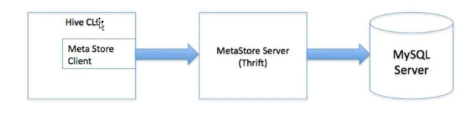
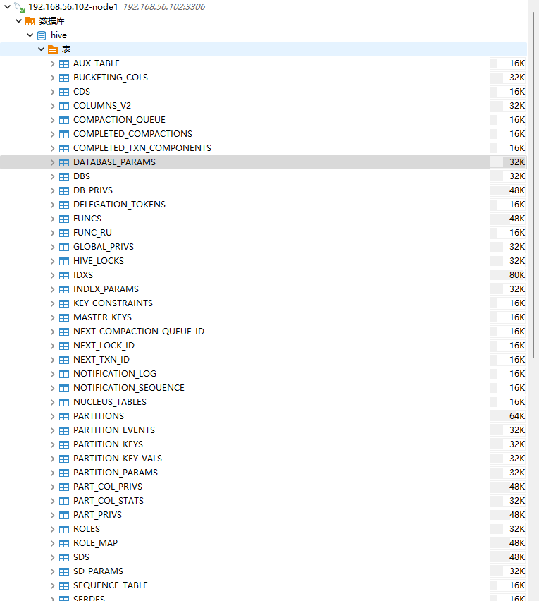
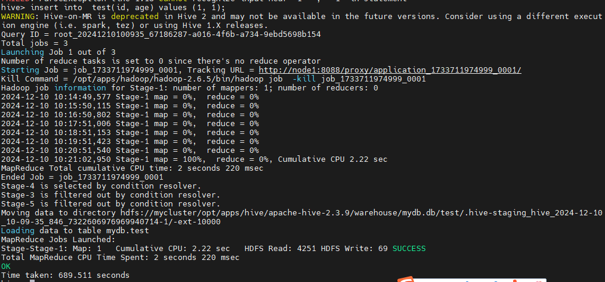
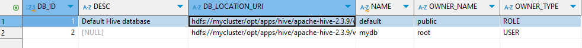
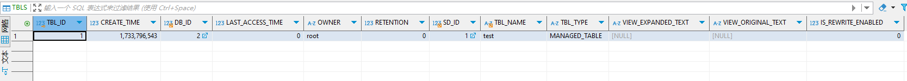
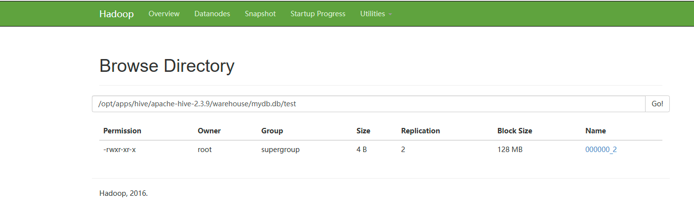
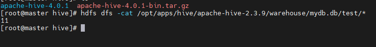
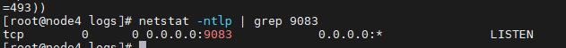
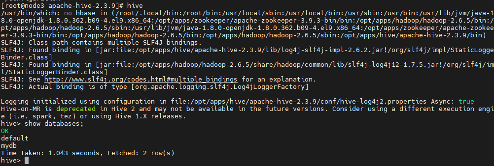

# Hive三种安装方式区别和搭建

Hive中metastore(元数据存储)的三种模式：

- 内嵌Derby模式

- 直连数据库模式

- 远程服务器模式

## 内嵌Derby模式

### 链接参数

| 参数                                    | 描述                         | 演示                                                |
| ------------------------------------- | -------------------------- | ------------------------------------------------- |
| javax.jdo.option.ConnectionURL        | JDBC链接url信息，包含了数据库名称元数据    | jdbc:derby::databaseName=metastore_db;create=true |
| javax.jdo.option.ConnectionDriverName | JDBC链接驱动的名称，使用的derby的单用户模式 | org.apache.derby.jdbc.EmbeddedDriver              |
| javax.jdo.option.ConnectionUserName   | Derby数据库的用户名称              | APP                                               |
| javax.jdo.option.ConnectionPassword   | 数据库的密码                     | mine                                              |

> 此模式链接到一个In-memory的数据库Derby, 一般用于Unit Test，一台服务器即可，基本不可用。

## 直连数据库(mysql)模式

### 链接参数

| 参数                                    | 描述                         | 演示                                                |
| ------------------------------------- | -------------------------- | ------------------------------------------------- |
| javax.jdo.option.ConnectionURL        | JDBC链接url信息，包含了数据库名称元数据    | jdbc:mysql::databaseName=metastore_db;create=true |
| javax.jdo.option.ConnectionDriverName | JDBC链接驱动的名称，使用的derby的单用户模式 | com.mysql.jdbc.Driver                             |
| javax.jdo.option.ConnectionUserName   | Derby数据库的用户名称              |                                                   |
| javax.jdo.option.ConnectionPassword   | 数据库的密码                     |                                                   |

## 远程服务器模式

### 链接参数

用于非Java客户端访问源数据库，在服务器端启动MetaStoreServer，客户端利用Thrift协议通过MetaStoreServer访问源数据库。起到了解耦的作用，如果更换其他数据库只需要修改MetaStoreServer即可。



### 链接参数

| 参数                   | 描述                      | 例子                        |
| -------------------- | ----------------------- | ------------------------- |
| hive.metastore.urls  | metastore server所在的服务地址 | thrift://<host_name>:9083 |
| hive.metastore.local |                         | false                     |

## 安装

在开始安装Hive之前，需要先从[Index of /dist/hive](https://archive.apache.org/dist/hive/)中获取自己需要的Hive的版本，我这里使用的是`2.3.9`版本。同时Hive是依赖Hadoop做数据存储的，Hadoop安装可以参考[Hadoop HA集群搭建](../Hadoop HA集群搭建.md)

```shell
tar -zxvf apache-hive-2.3.9.tar.gz
cp conf/hive-default.xml.template conf/hive-site.xml

 # 在/etc/profile中，将HIVE_HOME配置到PATH路径，并支持hive命令的访问
```

### mysql模式安装

> 在mysql模式安装中，mysql只是负责存储hive的元数据信息，不做真实的数据存储。同时，hive的lib依赖包下，并没有mysql的依赖包，需要自己将mysql的依赖包上传到`$HIVE_HOME/lib`下面。

#### hive-site.xml

```xml
<configuration>
  <!-- WARNING!!! This file is auto generated for documentation purposes ONLY! -->
  <!-- WARNING!!! Any changes you make to this file will be ignored by Hive.   -->
  <!-- WARNING!!! You must make your changes in hive-site.xml instead.         -->
        <!-- Hive Execution Parameters -->

        <property>
                <name>hive.metastore.warehouse.dir</name>
                <value>/opt/apps/hive/apache-hive-2.3.9/warehouse</value>
        </property>
        <property>
                <name>javax.jdo.option.ConnectionURL</name>
                <value>jdbc:mysql://node1:3306/hive?createDatabaseIfNotExist=true&allowPublicKeyRetrieval=true</value>
        </property>

        <property>
                <name>javax.jdo.option.ConnectionDriverName</name>
                <value>com.mysql.cj.jdbc.Driver</value>
        </property>

        <property>
                <name>javax.jdo.option.ConnectionUserName</name>
                <value>root</value>
        </property>

        <property>
                <name>javax.jdo.option.ConnectionPassword</name>
                <value>123456</value>
        </property>
</configuration>
```

在有了以上的配置之后，然后就需要初始化Hive所需要的数据表信息：

```shell
schematool --dbType mysql --initSchema
```

> 初始化工具的使用，可以参考[Hive Schema Tool - Apache Hive - Apache Software Foundation](https://cwiki.apache.org/confluence/display/Hive/Hive+Schema+Tool)

在执行完成之后，就可以在mysql数据库中查看到hive有关的数据库信息：



在有了以上信息之后，则可以启动hive命令：

```shell
# 启动hive
hive


# 在hive客户端中，额可以创建数据库，创建表
show databases;
# 创建数据库
create mydb;
# 使用数据库
use mydb;
# 创建数据表
create table test(id int, age int);
# 插入一条数据
insert into test(id,age) values (1,1)
```

> 在执行以上的insert语句的时候，就可以看到会将对应的雨具转换成为MapReduce任务执行。



然后我们查看mysql中hive表中的数据，则可以看到与Hive有关的原始表的数据信息。





这时我们可以查看HDFS中的文件存储，就可以看到对应的数据存储方式了：





到这里，关于mysql模式的安装Hive就完成。

### 远程服务器模式

在以上的mysql的安装模式后，我们可以配置一个metastore server用来处理远程的Hive请求。

#### hive-site.xml

该文件在服务端则不需要修改任何内容，主要还是配置元数据存储的方式这些内容。因此可以跟上面mysql模式安装保持一致。

#### 启动metastore server

启动server则需要用到命令：

```shell
hive --service metastore
```

这种方式会阻塞线程的执行，我们可以让hive在后端运行：

```shell
nohup hive --service metastore &
```

这里默认端口为`9083`，可以通过命令的方式查看是否启动完成:

```shell
netstat -ntlp | grep 9083
```



可以看到metastore server已经启动成功。

> 如果不想使用9083这个端口，也可以使用`hive --service metastore -p <端口号>`指定其他的端口。[AdminManual Metastore Administration - Apache Hive - Apache Software Foundation](https://cwiki.apache.org/confluence/display/Hive/AdminManual+Metastore+Administration#AdminManualMetastoreAdministration-Local/EmbeddedMetastoreDatabase(Derby))

#### 客户端链接配置

客户端链接的时候，则只需要配置metastore server的地址就可以了，具体配置信息如下：

```xml
<configuration>
  <!-- WARNING!!! This file is auto generated for documentation purposes ONLY! -->
  <!-- WARNING!!! Any changes you make to this file will be ignored by Hive.   -->
  <!-- WARNING!!! You must make your changes in hive-site.xml instead.         -->
        <!-- Hive Execution Parameters -->

        <property>
                <name>hive.metastore.warehouse.dir</name>
                <value>/opt/apps/hive/apache-hive-2.3.9/warehouse</value>
        </property>

        <property>
                <name>hive.metastore.local</name>
                <value>false</value>
        </property>

        <property>
                <name>hive.metastore.uris</name>
                <value>thrift://node4:9083</value>
        </property>
</configuration>
```

在经过了以上配置之后，我们可以直接连接metastore server进行操作了：

```shell
hive
```



以上就是远程模式的安装方式。
