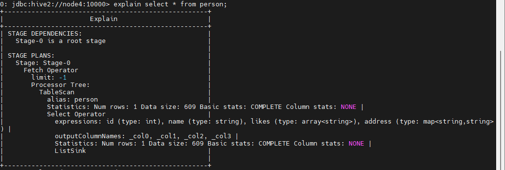
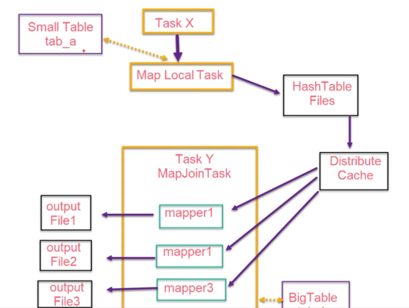
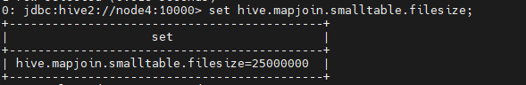

# Hive优化

## Fetch抓取

```properties
set hive.fetch.task.conversion=non/more(默认值)
```

默认做了优化，以下两种情况都不经过MR,改为none后，将走mr。

以下SQL不会被转换为MapReduce任务来执行：

1. select仅查询本表字段
   
   ```sql
   select id, name from person;
   ```

2. where仅对本表字段做过滤
   
   ```sql
   select id, name from person where name = '小明1'
   ```

对于以上的SQL， 我们可以通过explain的方式分析sql,具体使用如下：

```sql
explain select * from person;
explain extended select * from person;
```

将得到一下的结果：



## Hive本地运行模式

```properties
set hive.exec.mode.local.auto=false;
```

> 该配置默认为false，也就是说不采用本地执行的方式。

一般在开发和测试阶段使用本地模式，优点是快。对于小数据集的hive来说，通过本地模式在单机上处理任务，执行时间可以明显的缩短。缺点是这种任务在cluster任务中看不到对应的mapreduce任务。

设置`local mr`的最大输入数据量，当输入数据量小于这个值时采用`local mr`的方式，该值默认为`134217728`也就是`128M`。若大于该配置仍以集群方式来运行。

```sql
hive.exec.mode.local.auto.inputbytes.max=134217728
```

设置local mr的最大传输文件个数，当文件个数小于这个值时采用local mr方式：

```sql
hive.exec.mode.local.auto.input.files.max=4
```

## 并行模式

```sql
set hive.exec.parallel=true;
```

> 这种模式会受到资源的限制，不一定会达到理想的优化效果

开启了并行模式之后，有以下的两个参数可以选择：

```sql
set hive.exec.parallel.thread.number = 8;
```

> 并行进程默认是8个进程同时进行。

```sql
select t1.ct, t2.ct from (select count(id) ct from person) t1,
(select count(name) ct from person)t2;
```

## 严格与非严格模式

参数设置如下：

```sql
set hive.mapred.mode=strict;
-- 设置非严格模式
set hive.mapred.mode=nonstrict;(默认)
```

但是这种方式会有一些限制：

1. 对于分区表，必须加where对于分区字段的条件过滤。
   
   ```sql
   # age是分区字段
   select * from person7 where age = 10;
   ```

2. order by 语句必须包含limit输出限制
   
   ```sql
   select * from person order by id desc limit 10;
   ```

3. 限制执行笛卡尔积的查询
   
   ```sql
   select * from person1, person2;
   ```


## Hive 排序

- order by：
  
  - 对于查询结果做全排序，只允许有一个reduce处理，当数据量较大时，应慎用。严格模式下，必须结合limit来使用

- sort by：
  
  - 对于单个reduce的数据进行排序

- distribute by：
  
  - 分区排序，经常和sort by 结合使用

- cluster by：
  
  - 相当于sort by + distribute by
  
  - 这种排序方式不能通过`asc, desc`的方式指定排序规则。

可以通过`distribute by column sort by column desc|asc`的方式来实现排序。

## 分区裁剪、列裁剪

- 尽可能早的过滤掉尽可能多的数据，避免大量数据流入外层SQL

- 分区裁剪
  
  - 分区在hive上本质是目录，分区裁剪可以高效的过滤掉大部分数据
  
  - 尽量使用分区裁剪

- 列裁剪
  
  - 只获取需要的列的数据，减少数据输入
  
  - 少用`select *`

```sql
select id , name from (select id, name from person) tmp;
```

## Hive JVM重用

这种优化方式有自己的使用场景：

- 小文件过多

- task个数过多

为了达到这种效果，可以通过hive配置来设置：

```sql
set mapred.job.reuse.jvm.num.tasks=n;
```

> 其中n为task插槽个数， 默认为1

- 优点：
  
  - JVM重用使得JVM实例在同一个Job中重新使用多次，减少进程启动和销毁时间和频繁申请资源的系统开销。

- 缺点
  
  - 设置开启后，task插槽会一直占用资源，不论是否有task运行，直到所有的task即整个job全部执行完成时，才会释放所有的task插槽资源。

## 推测执行

根据一定的法则推测出执行慢的任务，并为这样的任务启动一个备份任务，让该任务和原始任务同时处理`同一份`数据，并最终选择最先成功完成任务的计算结果作为最终结果。

```sql
set hive.mapred.reduce.tasks.speculative.execution=true; # 默认开启
```

## 表优化

### 大表和小表join

#### reduce端的join

reduce 端的join时一种最简单的Join方式，其主要思想如下：

- 在map阶段，map函数同时读取两个文件file1和file2，为了区分两种来源的key/value数据对，对每条数据打一个标签（tag）。即在map阶段主要是对不同文件的数据进行打标签

- 在reduce阶段，reduce函数获取key相同的来自不同文件的value list, 然后对同一个key， 对File1和File2中的数据进行Join(笛卡尔乘积)。(也就是在reduce阶段进行实际的链接操作)

#### map端的join

之所以存在reduce端的join, 是因为map端不能获取所有需要的join字段。即同一个key对应的字段可能位于不同map种。

reduce端的Join效率是很低的，因为shuffle阶段要进行大量的数据传输。

map端join是针对以下场景进行优化的：

- 两个待链接的表中，有一个表非常大，而另一个表非常小，以至于小表可以直接存放到内存中。这样就可以将小表复制多分，让每个map task内存中存储一份，然后只扫描大表。对于大表中的每一条记录key/value，在hash table中查找是否有相同的key的记录，如果有，则链接后输出即可。

> 在执行Join计算时，将小表(驱动表)放在join的左边。

主要有两种方式可以实现Map端的Join操作。

##### 1. SQL方式

在SQL语句中添加MapJoin标记(mapjoin hint), 具体的语法如下：

```sql
select /*+ MAPJOIN(smalltable_name) */ smallTable.key, bigTable.value
from smallTable join bigTable on smallTable.key = bigTable.key;
```

##### 2. 开启自动的MapJoin

大小判断标准，表数据的大小而不是行数。(通常行少的数据一般式小表)

可以通过以下配置开启：

```sql
# 默认为true，如果自动和手动冲突了，手动的配置失效，已自动配置为准
set hive.ignore.mapjoin.hint=true;
```

> 将key相对分散，并数据量小的表放在join左边，这样可以有效减少内存溢出触发的概率。还可以使用map join让小的维度表先进内存，在map端完成reduce.

> 在新版本的Hive上已经对join大表和小表进行了优化，小表放在左边或者右边已经没有明显的区别。

##### 3. map join的原理分析



相关的配置参数如下：

###### 开启自动的MapJoin

通过修改以下配置启用自动的mapjoin:

```sql
set hive.auto.convert.join=true;
```

> 该参数为true时，Hive自动对左边的表统计量，如果时小表就加入内存，即对小表使用map join。

###### 在SQL中加入MAPJOIN的标记

```sql
select /*+ MAPJOIN(smalltable_name) */ smallTable.key, bigTable.value
from smallTable join bigTable on smallTable.key = bigTable.key;
```

###### 配置参数

```sql
# 设置小表的默认文件大小，默认值为250000,表示25M
set hive.mapjoin.smalltable.filesize=25; 

# 是否忽略mapjoin hint，即mapjoin标记; 默认值为true
set hive.ignore.mapjoin.hint=true;

# 将普通的join转化为普通的mapjoin时，是否将多个mapjoin转化为一个mapjoin, 默认值为true
set hive.auto.convert.join.noconditionaltask = true;

# 将多个mapjoin转化为一个mapjoin时，其表的最大值。默认值为10000000
set hive.auto.convert.join.noconditionaltask.size = 10000000;

# 避免数据倾斜，一个MR变2个，先做一次数据合并，有时候一个MR都即将100%的时候卡着不动
# ，就可以分为两个完成。他的默认值为false
set hive.groupby.skewindata=false;
```



### 大表join大表

#### 1. 空key过滤

- 有时join超时是因为某些key对应的数据太多，而相同key对应的数据都会发送到同一个reducer上，从而导致内存不够。此时我们应该仔细分析这些异常的key, 很多情况下，这些key对应的数据是异常数据，我们需要再SQL语句中进行过滤。

- 一般在ETL数据清洗时变回对控制进行了处理，所以该条一般情况下意义不大

#### 2. 空key转换

- 有时虽然某个key为空对应的数据很多，但是响应的数据不是异常数据，必须要包含在Join的结果中，此时可以表a中key为空的字段赋一个随机的值，使得数据随机均匀分布到不同的reducer上，以此来减轻reducer的执行压力。

#### 3. Map-Side聚合

- 默认情况下，Map阶段相同key分送到一个reduce，当某个key的数据过大时就会发生数据倾斜

- 并不是所有的聚合都需要在reduce端完成，可以先在map端进行聚合，然后在reduce端聚合，相当于conbiner.

可以通过以下设置开启在Map端的聚合:

```sql
# 开启在map端的聚合，默认为true
set hive.map.aggr=true;

# map端group by执行聚合时处理的行数据量
set hive.groupby.mapaggr.checkinterval=100000;

# 进行聚合的最小比例，（预先对100000条数据做聚合，若如何之后的数据量/100000的值大于
# 该配置0.5, 则不聚合
set hive.map.aggr.hash.min.reduction=0.5;

# map端聚合使用的内存的最大值
set hive.map.aggr.hash.percentmemory=0.5;

# map端做聚合操作是hash表的最大可用内容，大于该值则会触发flush
set hive.map.aggr.hash.force.flush.memory.threshold=0.9;
```

#### 4. count(distinct)去重统计

数据量小的无所谓，数据量大的情况下，由于COUNT DISTINCT操作会用一个Reduce Task来完成，这一个Reduce需要处理的数据量太大，就会导致整个Job很难完成，一般COUNT DISTINCT 使用先GROUP BY再 COUNT的方式替换。

```sql
# 每个reduce任务处理的数据量，默认值256MB
set hive.exec.reducers.bytes.per.reducer=256000000


select count(distict imei) from phone_info;
可以转换为
select count(imei) from (select imei from phone_info group by imei) tmp
```

以上的转换会多出一个Job来完成，但在数据量大的情况下，这个是有效的优化手段。

#### 5. 笛卡尔积

尽量避免笛卡尔积，即避免join的时候不加on条件或者无效的on条件，Hive只使用一个reduce来完成笛卡尔积，所以效率特别低。

### 合适设置Map与Reduce的数量

- 通常情况下，作业会通过input的目录产生一个或者多个map任务
  
  - 主要决定因素：input的文件总个数，input的大小文件，集群设置的文件块大小。block块，split_size， 文件个数，split切片数量决定map task数量

- 是不是map数越多越好?
  
  - 不是，如果一个任务有很多小文件，则每个小文件都会被当成一个split切片，用一个map任务来完成，执行真实逻辑运算的时间远小于map任务的启动和初始化的时间，就会造成很大的资源浪费。另外，同时可执行的map数也是受限的。
  
  - 针对这种情况，需要减少map任务的数量，比如通过合并小文件减少map数量

- 是不是保证每个map处理接近128M的文件块，就能够突破性能瓶颈?
  
  - 不一定，比如一个128MB的文件，默认情况会用一个map去完成，但是这个文件可能只有很少的小字段，却有几千万的记录，如果map处理的逻辑比较复杂，用一个map任务去做，会比较耗时
  
  - 这个时候就需要增加map任务的个数。

#### 合并小文件

小文件数目多，容易在文件存储端造成压力，给hdfs造成压力，影响效率。

可以通过设置是否合并小文件的配置：

```sql
# 是否合并map输出文件
set hive.merge.mapfiles=true;
# 是否合并reduce输出文件
set hive.merge.mapredfiles=true;
# 合并文件的大小
set hive.merge.size.per.task=256*1000*1000;
# CombineHiveInputFormat具有针对小文件进行合并的功能
set hive.input.format=org.apache.hadoop.hive.ql.io.CombineHiveInputFormat
```

#### 复杂文件增加map数

对比设置split逻辑块的大小(minSize, maxSize)

```sql
# 默认设置了split块的大小
set mapred.max.split.size=256000000;

splitSize=Math.max(minSize, Math.min(maxSize, blockSize));
一个split的最大值，即每个map处理文件的最大值。让该值小于blockSize就可以增加map的个数。
```

这里需要注意，mapreduce任务最小的split的大小为`1`, 即

```sql
set mapred.min.split.size=1;
```

针对于扩展map数量相关的参数有:

```sql
#一个节点上split的最小值
set mapred.min.split.size.per.node=1
# 一个机架上split的最小值
set mapred.min.split.size.per.rack=1;
```

#### 合理设置reduce数量

设置reduce的数量有以下几种方式：

##### 直接设置reduce任务数

```sql
# 设置reduce任务数
set mapred.reduce.tasks=5;
```

##### 设置reduce默认处理数据量

```sql
# 设置每个reduce处理的数据量默认值约等于256M
set hive.exec.reducers.bytes.per.reducer=256000000;

# 设置每个任务最大的reduce数，默认为1009
set hive.exec.reducers.max=1009;

# 计算reduce数
num = min(hive.exec.reducers.max, 
        总输入数据量/hive.exec.reducers.bytes.per.reduder)
```

> reduce个数并不是越多越好，过多的reduce任务会导致启动和初始化reduce任务消耗过多的时间和资源，同时reduce会生成很多个文件结果，同样产生了小文件问题。
