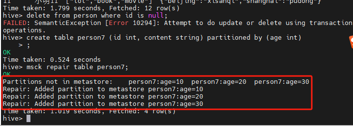
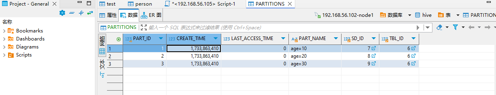

# Hive基础知识

## 1. 创建表

```sql
create table person (
    id int ,
    name string,
    likes array<string>,
    address map<string, string>
)
row format delimited
fields terminated by ','
collection items terminated by '-'
map keys terminated by ':'
localtion '/usr/'
```

## 2. 内部表和外部表

### 2.1 Hive内部表

```sql
create table [IF NOT EXISTS] table_name
```

> 删除表的时候，会将元数据和HDFS上的数据一起删除

### 2.2 Hive外部表

```sql
create external table [if not exists] table_name location hdfs_path
```

> 删除外部表只删除metastore的元数据，不删除hdfs中的表数据

## 3. 表分区

Hive分区partition必须在定义表时指定partition字段。

### 3.1 单分区表

```sql
create table day_table (id int, content string) partitioned by (dt string)
```

单分区表，按天分区，在表结构中存在id, content, dt三列.

> 上面的语句表示：以dt为文件夹区分

### 3.2 双分区建表语句

```sql
create table day_hour_table (id int, content string, dt string, hour string)
partitioned by (dt string, hour string)
```

双分区表，按天和小时分区，在表结构中新增加了dt和hour两列。

> 以dt为文件夹，再以hour为子文件夹区分

### 3.3 Hive表添加分区

> 表已经创建，在此基础上添加分区，注意只能添加在表创建时定义好的分区的值

```sql
alter table person6 add partition(age=30, sex="man")
```

> 表在创建时定义的是双分区，条件分区值时，不能只指定一个，需要同时指定两个分区的值。

### 3.4 修复分区

```sql
msck repair table table_name
```

> 修复分区是使用了hdfs中的数据，但是元数据中没有分区的信息，这个时候就可以使用分区修复。



> 在hdfs中，person7的目录下有age=10, age=20, age=30几个目录，因此在修复的时候，就创建了对应的partition分区的信息。



在元数据表中，则看到了对应的分区信息。

## 4. 使用已有表建表

```sql
create table empty_key_value_store like key_value_store;
```

> 这个创建语句，只是创建了和key_value_store相同的表结构，但是表中没有具体的数据信息。

也可以配合查询语句然后创建表结构:

```sql
create table table_name as select column1, column2 .. from table_name2
```

## 5. 删除数据

```sql
-- 删除数据
delete from table_name;

-- 删除数据
truncate table table_name;
```

> 以上的语句都是用来清空表数据，但是不能删除单条数据， 当尝试删除单条数据的时候，会有以下的提示: ` SemanticException [Error 10294]: Attempt to do update or delete using transaction manager that does not support these operations.`

## 6. 添加数据

### 6.1 load files into tables

在hive上进行数据的操作，主要包含copy和move两种操作，这两种操作都能够将数据文件移动到hive的表中。

```sql
load data [local] inpath 'filepath' [overwrite] into table tablename [partition (partcoll=val1, partcol2=val2)]
```

- **copy**: load的是本地(local)的文件

- **move**：load的是hdfs上的文件，不适用local. 如果也copy的话，hdfs上将产生不必要的文件。

### 6.2 Inserting data into Hive Tables from queries

查询的数据能够通过insert的语句插入到Hive表中，语法如下：

```sql
insert into table tablename1 [partition (partcol=val...)] select columns from tablenam32
```

```sql
insert overwrite table tablename1 [partition (partcoln=val1...)] [IF NOT EXSITS] select columns from tablename2
```

> 以上方式不建议使用，主要是因为insert的时候会创建mp任务并执行任务，需要比较长的时间。另外，上面的语句中也存在性能问题，主要是查询一条数据就需要插入一次。

#### 将大表中的数据拆分到多个小表

```sql
from from_statement
insert overwrite table tablename1 [partitioin (partcol=val..)] 
[if not exists] select select_statements
insert overwrite table tablename1 [partitioin (partcol=val..)] 
[if not exists] select select_statements
insert overwrite table tablename1 [partitioin (partcol=val..)] 
[if not exists] select select_statements
```

> 以上方式只查询一次，性能较高

- **INSERT OVERWRITE**：表示覆盖

- **INSERT INTO**：表示追加
