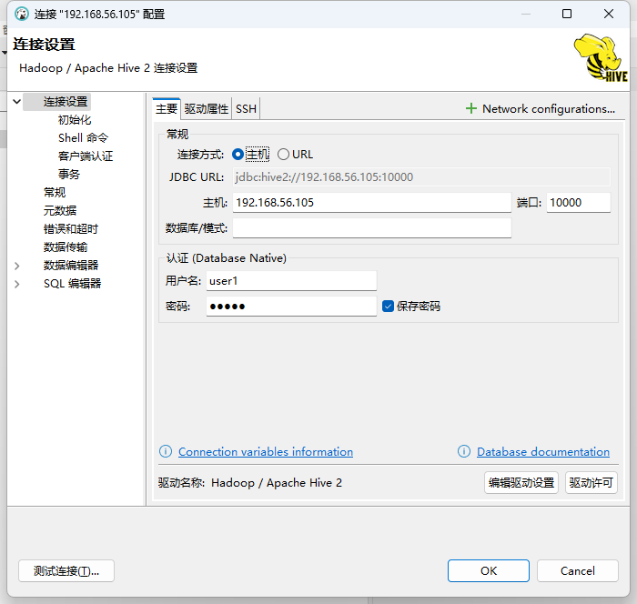
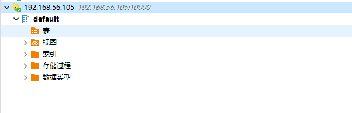

# Hive客户端配置

在[Hive三种安装方式和搭建](./Hive三种安装方式和搭建.md)中介绍了metastore服务端的安装，但是这个服务端不能够直接为客户端提供链接，在Hive中提供了hiveserver2的服务用于客户端链接，包括hive客户端工具，JDBC等。

## hive-site.xml

```xml
<configuration>
  <!-- WARNING!!! This file is auto generated for documentation purposes ONLY! -->
  <!-- WARNING!!! Any changes you make to this file will be ignored by Hive.   -->
  <!-- WARNING!!! You must make your changes in hive-site.xml instead.         -->
        <!-- Hive Execution Parameters -->

        <property>
                <name>hive.metastore.warehouse.dir</name>
                <value>/opt/apps/hive/apache-hive-2.3.9/warehouse</value>
        </property>

        <property>
                <name>hive.metastore.local</name>
                <value>false</value>
        </property>
        <property>
                <name>javax.jdo.option.ConnectionDriverName</name>
                <value>com.mysql.cj.jdbc.Driver</value>
        </property>
        <property>
                <name>javax.jdo.option.ConnectionURL</name>
                <value>jdbc:mysql://192.168.56.102:3306/hive?createDatabaseIfNotExist=true&amp;allowPublicKeyRetrieval=true</value>
        </property>
        <property>
                <name>javax.jdo.option.ConnectionUserName</name>
                <value>root</value>
        </property>
        <property>
                <name>javax.jdo.option.ConnectionPassword</name>
                <value>123456</value>
        </property>

        <property>
                <name>hive.server2.thrift.port</name>
                <value>10000</value>
        </property>
        <property>
                <name>hive.server2.thrift.host</name>
                <value>0.0.0.0</value>
        </property>
        <property>
                <name>hive.server2.authentication</name>
                <value>CUSTOM</value>
        </property>
        <property>
                <name>hive.server2.custom.authentication.class</name>
                <value>org.hadoop.hive.learn.PasswordAuthenticationProvider</value>
        </property>
        <property>
                <name>hive.server2.custom.authentication.file</name>
                <value>/opt/apps/hive/apache-hive-2.3.9/conf/passwd</value>
        </property>
        <property>
                <name>hive.server2.enable.doAs</name>
                <value>false</value>
        </property>
</configuration>
```

Hive在连接的时候可以设置授权信息，但是官方提供的[Setting Up HiveServer2 - Apache Hive - Apache Software Foundation](https://cwiki.apache.org/confluence/display/Hive/Setting+up+HiveServer2#SettingUpHiveServer2-PluggableAuthenticationModules(PAM))集中方式中，我没有LDAP或者KERBEROS，因此我使用了`CUSTOM`的方式，自己实现了一个简单的授权工具。

> 在以上的配置中，有`hive.server2.enable.doAs`的配置，该配置默认是true, 这个配置表明是否按照Hive登录的用户去操作hadoop, 如果为true的话，则需要登录的用户在hadoop中也存在，否则将会抛出`org.apache.hadoop.ipc.RemoteException:User: xxx is not allowed to impersonate root`.

## 授权实现

```java
package org.hadoop.hive.learn;

import org.apache.hadoop.hive.conf.HiveConf;
import org.apache.hive.service.auth.PasswdAuthenticationProvider;
import org.slf4j.Logger;
import org.slf4j.LoggerFactory;

import javax.security.sasl.AuthenticationException;
import java.io.BufferedReader;
import java.io.FileReader;
import java.util.HashMap;
import java.util.Map;

public class PasswordAuthenticationProvider implements PasswdAuthenticationProvider {

    private final HiveConf hiveConf;
    private final static String DEFAULT_PASSWD_PATH = "/opt/apps/passwd";
    private final String filePath;

    private static final Logger LOG = LoggerFactory.getLogger(PasswordAuthenticationProvider.class);

    private Map<String, String> userPwdMap = new HashMap<String, String>();

    public PasswordAuthenticationProvider(HiveConf hiveConf) {
        this.hiveConf = hiveConf;
        String filePath = this.hiveConf.get("hive.server2.custom.authentication.file");
        this.filePath = filePath == null ? DEFAULT_PASSWD_PATH : filePath;

        init();
    }

    private void init() {
        try(BufferedReader reader = new BufferedReader(new FileReader(filePath))) {
            String line = "";
            while ((line = reader.readLine()) != null) {
                line = line.trim();
                String[] splits = line.split(":");
                userPwdMap.put(splits[0], splits[1]);
            }
        } catch (Exception e) {
            LOG.error("初始化失败: {}", e.getMessage(), e);
            throw new RuntimeException(e);
        }

       LOG.info("数据初始化完成");
    }


    @Override
    public void Authenticate(String s, String s1) throws AuthenticationException {
        String pwd = userPwdMap.get(s);
        if (pwd != null && !"".equals(s1.trim())) {
            return;
        }

        throw new AuthenticationException("用户名或密码错误");
    }
}

```

> 这个实现很简单，没有复杂的点，就是在文件中按照`user:pwd`的方式存储，然后在初始化的时候将信息放入到map， 然后匹配用户名和密码即可。
> 
> 在完成开发之后，则可以将该类打包成jar包，放在`HIVE_HOME/lib`目录下，在`hive.server2.custom.authentication.class`中配置自己的授权类即可。

## 启动hiveserver2

启动hiveserver2可以通过两个命令来实现:

```shell
hiveserver2


# 或者通过hive命令启动
hive --service hiveserver2
```

> hiveserver2默认的监听端口为10000，可以通过`netstat -ntlp | grep 10000`查看端口的监听情况

## 连接hiveserver2

在启动完成hiveserver2的任务之后，则可以通过客户端工具链接了:



则最终链接的效果如下:



到这里，hiveserver2配置完成。
