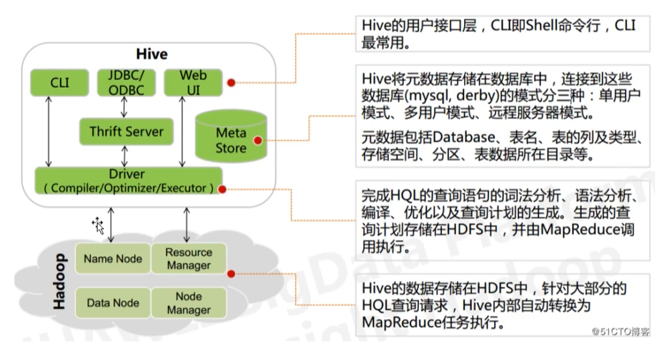
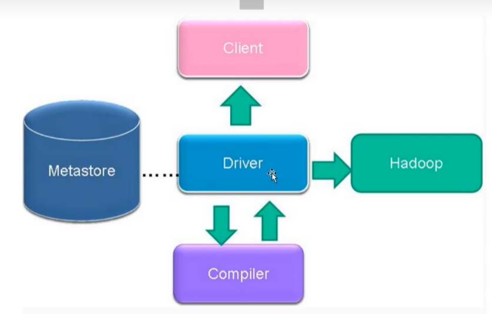
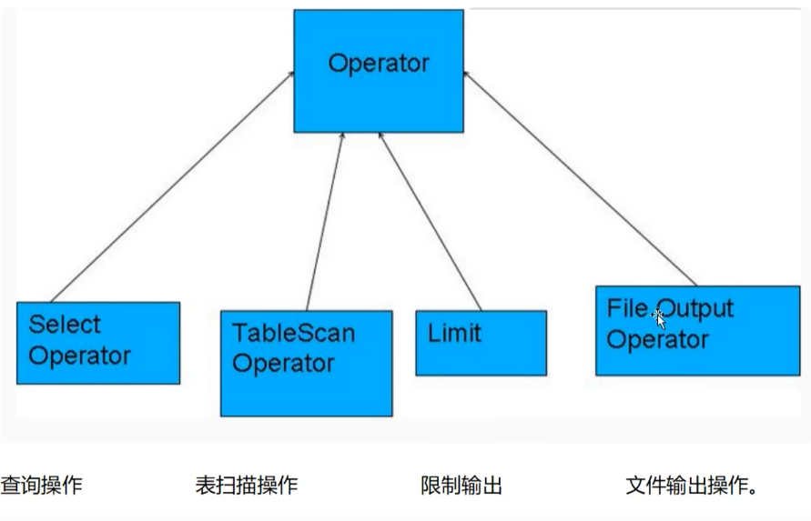

# hive与关系型数据库的比较

| 对比项             | Hive        | 关系型数据库                 |
| --------------- | ----------- | ---------------------- |
| 查询语言            | HQL         | SQL                    |
| 数据存储            | HDFS        | Llocal FS or RawDevice |
| 执行器             | MapReducer  | Executor               |
| 数据insert        | 支持批量导入和单条插入 | 支持批量导入和单条插入            |
| 数据update和delete | 支持追加，不支持删除  | 行级别的更新和删除              |
| 数据规模            | 大           | 小                      |
| 执行延迟            | 高           | 低                      |
| 分区              | 支持          | 支持                     |
| 索引              | v0.8之后支持    | 支持                     |
| 数据加载模式          | 读时模式（快）     | 写时模式(慢)                |
| 扩展性             | 高           | 低                      |
| 应用场景            | 海量数据查询      | 实时查询                   |

## Hive架构

### Hive架构

- 编译器将一个Hive SQL转换操作符

- 操作符是Hive的最小的处理单元

- 每个操作符代表HDFS的一个操作或者一道MapReduce作业

### Operator(操作符)

- Operator都是Hive定义的处理过程

- Operator的定义有：
  
  - protected List <Operator<? extends Serializable>> child Operators;
  
  - proetected List <Operator<? extends Serializable>> parentOperators;
  
  - protected boolean done; // 初始化值为false

## Hive三种安装方式区别和搭建

Hive中metastore(元数据存储)的三种模式：

- 内嵌Derby模式

- 直连数据库模式

- 远程服务器模式
