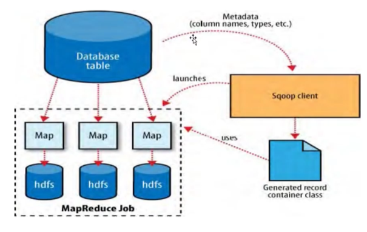
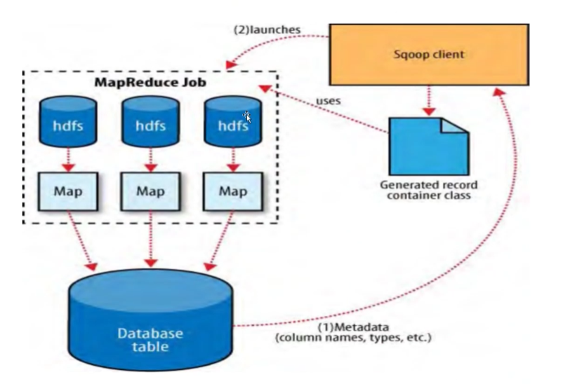
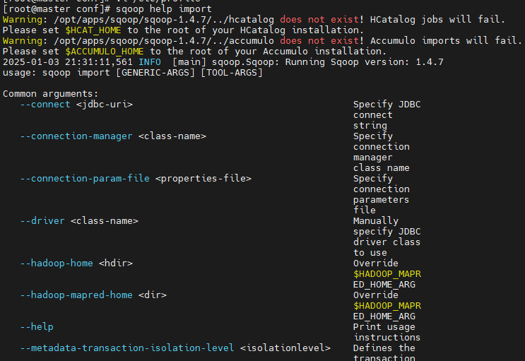
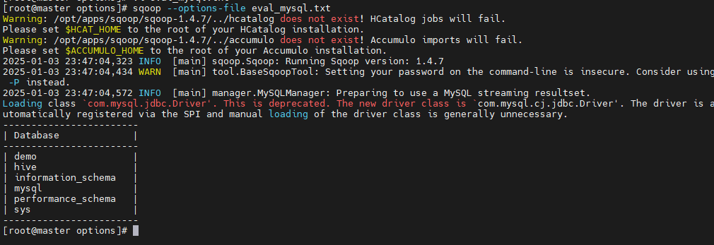

# sqoop介绍和安装

## Sqoop是什么？

Sqoop是将关系型数据库，例如mysql, oracle, pgsql等数据域Hadoop数据进行转换的工具，官方地址为: https://sqoop.apache.org/

目前sqoop一共包含了两个版本，`sqoop1: 1.4.x`和`sqoop2: 1.99.x`

> 这两个版本是完全不兼容的，因此不能实现平滑升级。目前Sqoop项目已经不再维护了。同类产品可以考虑使用其他产品

可替换的同类产品工具包括：

- DataX: 阿里顶级数据交换工具

## Sqoop导入和导出原理

### 导入



> 导入操作是相对于HDFS本身的，因此从HDFS以外的地方存储到HDFS上，就叫导入。例如从关系型数据库中导入到HDFS

### 导出



> 导出也是相对于HDFS来说的，只要从HDFS到其他存储中，就叫做导出。

## Sqoop安装

目前Sqoop还是支持下载，具体现在地址为[Index of /dist/sqoop](https://archive.apache.org/dist/sqoop/)，这里就以Sqoop1.4.7版本作为学习版本。

```shell
# 下载gz包
wget https://archive.apache.org/dist/sqoop/1.4.7/sqoop-1.4.7.bin__hadoop-2.6.0.tar.gz
# 解压
tar -zxvf sqoop-1.4.7.bin-hadoop-2.6.0.tar.gz
```

### sqoop-env.sh

该文件主要是配置sqoop依赖的环境配置，文件中会配置hadoop, hive, hbase的路径，这是因为sqoop依赖的事hadoop的mapreduce任务完成数据的导入和导出，因此对hadoop强依赖，那么该文件的配置如下：

```shell
#Set path to where bin/hadoop is available
export HADOOP_COMMON_HOME=/opt/apps/hadoop/hadoop-2.6.5

#Set path to where hadoop-*-core.jar is available
export HADOOP_MAPRED_HOME=/opt/apps/hadoop/hadoop-2.6.5/share/hadoop/mapreduce/

#set the path to where bin/hbase is available
export HBASE_HOME=/opt/apps/hbase/hbase-2.0.6

#Set the path to where bin/hive is available
export HIVE_HOME=/opt/apps/hive/apache-hive-4.0.1

#Set the path for where zookeper config dir is
#export ZOOCFGDIR=
```

在完成了以上配置后，需要在`/etc/profile`中配置`SQOOP_HOME`的路径变量，

```shell
vi /etc/profile


export SQOOP_HOME=/opt/apps/sqoop/sqoop-1.4.7
export PATH=$PATH:$SQOOP_HOME/bin
```

在配置完成以上的配置之后，那么就可以使用sqoop的命令了，使用如下：

```shell
# 查看sqoop的使用帮助
sqoop help
# 查看具体的option帮助
sqoop helo import
```



## Sqoop测试

在上面安装了Sqoop之后，那么久可以尝试连接mysql并执行一些mysql的命令，例如在以下的例子中，通过Sqoop连接mysql并查看已有的数据库列表：

> 在操作mysql的时候，因为sqoop本身没有mysql的包，需要将mysql的jar包放到`$SQOOP_HOME/lib`目录下。

```shell
sqoop eval --connect jdbc:mysql://node1:3306 --username root --password 123456 -e show databases
```

因为命令行每次写的时候都是比较麻烦，因此Sqoop提供了文件记录的方式，创建文件, 并写入如下内容：

```shell
eval
# 这个注释行，帮助对命令内容的理解
--connect
jdbc:mysql://node1:3306
--username
root
--password
123456
-e
'show databases'
```

```shell
sqoop --options-file eval_mysql.txt
```



执行以上命令，将看到mysql的执行结果如图所示，表名Mysql执行成功。到这里，Sqoop就已经安装成功了。


