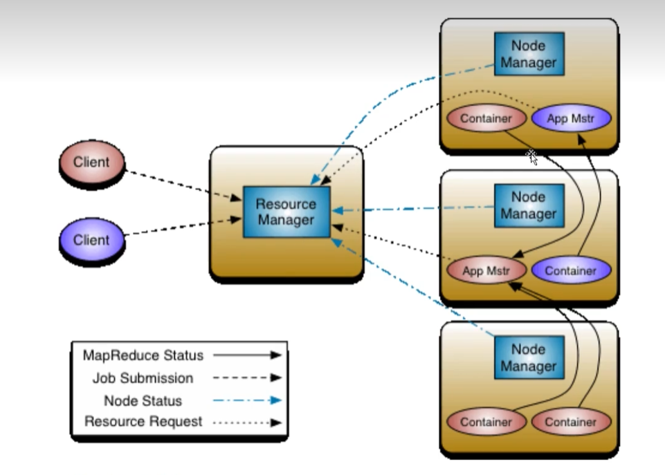
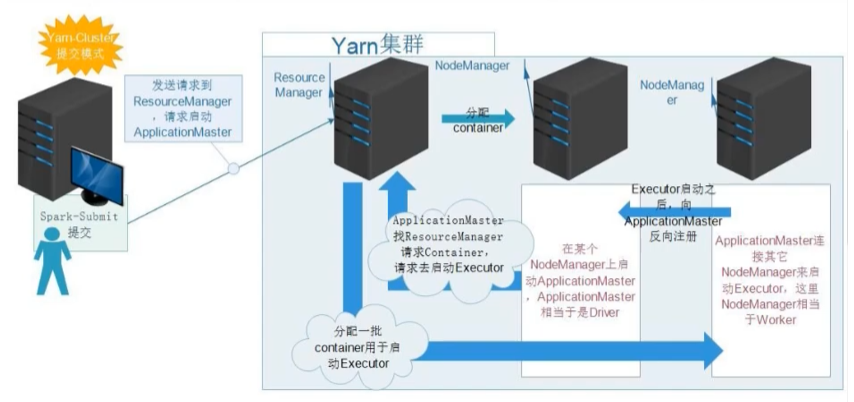
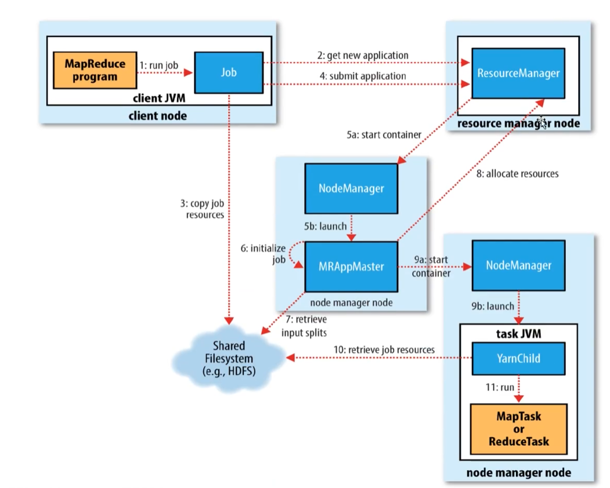

# yarn架构

- MRv2：On Yarn
  
  - Yarn：解耦资源与计算
    
    - ResourceManager
      
      - 主，核心
      
      - 集群节点资源管理
    
    - NodeManager
      
      - 与RM汇报资源
      
      - 管理Container生命周期
      
      - 计算框架中的角色都以Container表示
    
    - Container：(节点NameNode, cpu, MEM, I/O大小，启动命令)
      
      - 默认NodeManager启动线程监控Container大小，超出申请资源额度，`kill`
      
      - 支持Linux内核的Cgroup
    
    - MR
      
      - MR-ApplicationMaster-Container
        
        - 作业为单位，避免单点故障，负载到不同的节点
        
        - 创建Task需要和RM申请资源(Container)
      
      - TaskContainer
    
    - Client
      
      - RM-Client：请求资源创建ApplicationMaster
      
      - AM-Client：与ApplicationMaster交互

## YARN

- YARN: Yet Another Resource Negotiator

- Hadoop 2.0新引入的资源管理系统
  
  - 核心思想：将MRv1中JobTracker的资源管理和任务调度两个功能分开，分别由ResourceManager和ApplicationMaster进程实现
  
  - ResourceManager：负责整个集群的资源管理和调度
  
  - ApplicationMaster：负责应用程序相关的事务，比如任务调度、任务监控和容错等

- YARN的引入，使得多个计算框架可运行在一个集群中
  
  - 每个应用程序对应一个ApplicationMaster
  
  - 目前多个计算框架可以运行在YARN上，比如MapReduce, Spark，Storm等

## MapReduce On YARN： MRv2

- 将MapReduce作业直接运行在YARN上，而不是由JobTracker和TaskTracker构建的MRv1系统中

- 基本功能模块
  
  - YARN：负责资源管理和调度
  
  - MPAppMaster：负责任务切片、任务调度、任务监控和容错等
  
  - MapTask/ReduceTask：任务驱动引擎，与MRv1一致

- 每个MapReduce作业对应一个MRAppMaster
  
  - MRAppMaster任务调度
  
  - YARN将资源分配给MRAppMaster
  
  - MRAppMaster进一步将资源分配给内部的任务

- MRAppMaster容错
  
  - 失败后，由YARN重新启动
  
  - 任务失败后，MRAppMaster重新申请资源

## YARN 作业提交流程

1. 作业提交Job后，job.waitForCompletion(true)调用monitorAndPrintJob()方法每秒轮询作业进度，如果发现自上次报告后由改变，便把进度报告给控制台。Job的submit()方法创建一个内部的JobSubmitter实例，并调用其submitJobInternal方法。作业完成后，如果成功，就显示计数器；如果失败，这将导致作业失败的错误记录到控制台上。

2. JobSubmitter所实现的作业提交过程如下所述：
   
   - 向ResourceManager资源管理器请求一个新作业的ID, 用于MapReduce作业ID。
   
   - 作业客户端检查作业的输出说明，计算输入分片并将作业资源(包括作业jar, 配置和分片信息)复制到HDFS
   
   - 通过调度资源管理器上的submitApplication()方法提交作业

3. 作业初始化：
   
   - 资源管理器ResourceManager收到调用他的submitApplication()消息后，便将请求传递给调度器(scheduler)。调度器分配一个容器，然后资源管理器再节点管理器的管理下载容器中启动应用程序的master进程
   
   - MapReduce作业的application master是一个javachengxu ,他的主类是MRAppMaster。他对作业进行初始化，通过创建多个簿记对象以保持队作业进度的跟踪，因为它将接受来自任务的进度和完成报告。
   
   - 任务接受来自共享文件系统再客户端计算的输入分片。对每一个分片创建一个map任务对象以及由mapreduce.job.reduces属性确定多个reduce任务对象

4. 任务分配
   
   - AppMaster为该作业中的所有map任务和reduce任务向资源管理器请求容器

5. 执行任务
   
   - 一旦资源管理器的调度器为任务分配了容器，AppMaster就通过与节点管理器NodeManager通讯来启动容器
   
   - 该任务由主类为YarnChild的Java应用程序执行。在它允许任务之前，首先将任务需要的资源本地化，包括作业的配置，JAR文件和所有来自分布式缓存的文件
   
   - 最后运行map任务或reduce任务

6. 进度和状态更新
   
   - 在YARN运行时，任务每**3秒**通过umbilical接口向AppMaster汇报进度和状态。
   
   - 客户端每**1秒钟(通**过mapreduce.client.Progressmonitor.pollinterval设置)查询一次AppMaster以接受进度更新，通常都会向客户显示。

7. 作业完成
   
   除了向AppMaster查询进度外，客户端每**5秒钟**还通过调用Job的waitForCompletion()来检查作业是否完成。查询的间隔可以通过`mapreduce.client.completion.pollinterval()`属性进行配置。
