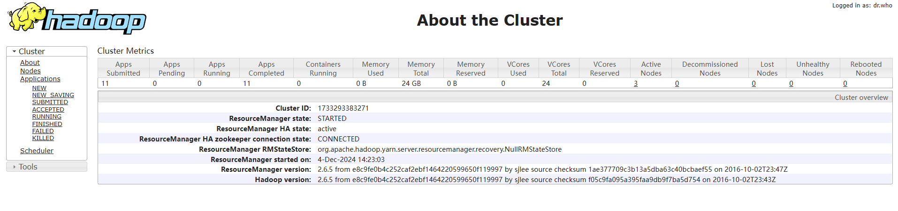

# yarn集群配置

hadoop的集群HA安装，可以参考[Hadoop HA集群搭建](../Hadoop HA集群搭建.md)中进行查看，这里主要是在已有的Hadoop集群上启动yarn, 然后启动集群yarn, 就可以在集群中进行任务的调度和执行。yarn的调度过程，可以参考[yarn架构](./yarn架构.md)

## yarn-site.xml

```xml
<configuration>

        <!-- Site specific YARN configuration properties -->
        <!-- 让yarn的容器支持mapreduce的洗牌，开启shuffle服务  -->
        <property>
                <name>yarn.nodemanager.aux-services</name>
                <value>mapreduce_shuffle</value>
        </property>

        <!-- 启用resoucemanager的HA -->
        <property>
                <name>yarn.resourcemanager.ha.enabled</name>
                <value>true</value>
        </property>

        <!-- 指定zookeeper集群的各个节点地址和端口号 -->
        <property>
                <name>yarn.resourcemanager.zk-address</name>
                <value>node1:2181,node2:2181,node3:2181</value>
        </property>

        <!-- 标识集群，以确保RM不会接管另一个集群的活动 -->
        <property>
                <name>yarn.resourcemanager.cluster-id</name>
                <value>cluster1</value>
        </property>
        <!-- RM HA的两个ResourceManager的名字 -->
        <property>
                <name>yarn.resourcemanager.ha.rm-ids</name>
                <value>rm1,rm2</value>
        </property>

        <!-- 指定rm1的resourcemanager进程所在的主机名称 -->
        <property>
                <name>yarn.resourcemanager.hostname.rm1</name>
                <value>node1</value>
        </property>

        <!-- 指定rm2的resourcemanager进程所在的主机名称 -->
        <property>
                <name>yarn.resourcemanager.hostname.rm2</name>
                <value>node4</value>
        </property>
</configuration>
```

## mapred-site.xml

```xml
<configuration>
    <!--指定mr作业运行的框架：要么本地运行，要么使用classic(MRv1)，要么使用yarn-->
        <property>
                <name>mapreduce.framework.name</name>
                <value>yarn</value>
        </property>
</configuration>
```

> 这里主要配置了在任性任务调度的时候，使用yarn进行任务的调度，这样就可以使用yarn了

## 启动yarn

启动yarn则不会像启动dfs那样可以通过ssh的方式启动，我们可以通过脚本的方式启动yarn:

```shell
#!/bin/bash
for node in node1 node2 node3
do
        ssh $node "source /etc/profile; zkServer.sh start"
done

sleep 1
start-dfs.sh
start-yarn.sh

for node in node4
do
        ssh $node "source /etc/profile; start-yarn.sh"
done

echo "----------------node1-jps------------------------"
jps

for node in node2 node3 node4
do
        echo "--------------------------${node}-jps-----------------"
        ssh $node "source /etc/profile; jps"
done
```

这里就主要通过ssh的方式去启动yarn和dfs，并查看启动的状态，以上就是yarn的简单配置，这样我们就可以访问集群了。

## 验证是否成功

从上面配置可以知道，我们可以通过访问node1和Node4查看yarn的启动情况。通过访问8088端口，查看集群启动情况，如果启动正常，则会展示一下界面：

以下为node1的界面情况:



以下为node4的界面情况：


因为node4是standby的角色，因此在访问node4的8088端口时，会自动的跳转到node1的地址。

以上就是yarn简单配置，这样我们就可以开发mapreduce的任务啦~~~~


