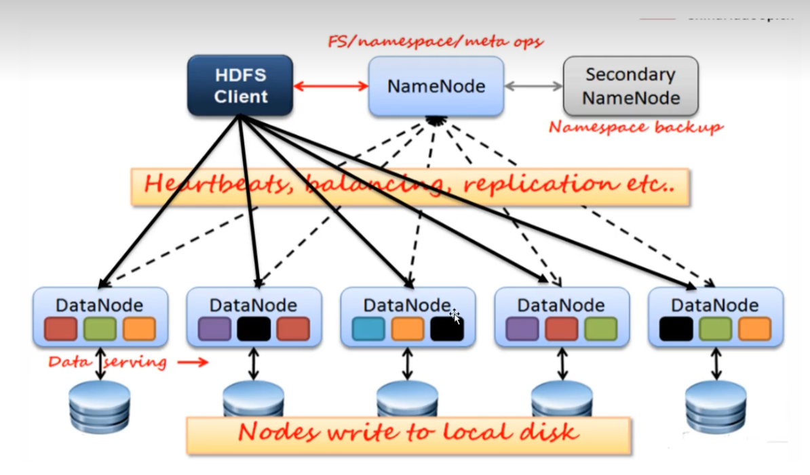
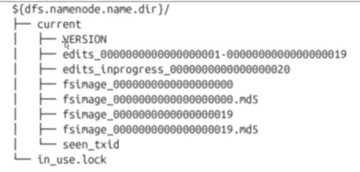
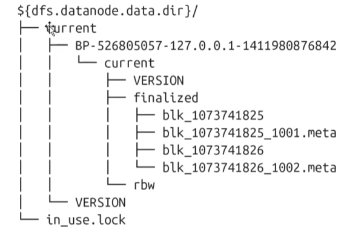
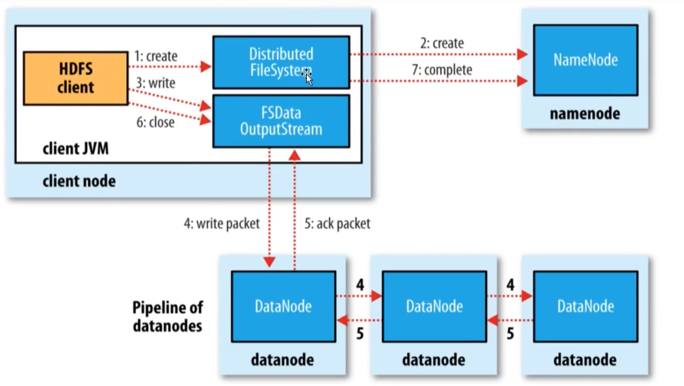
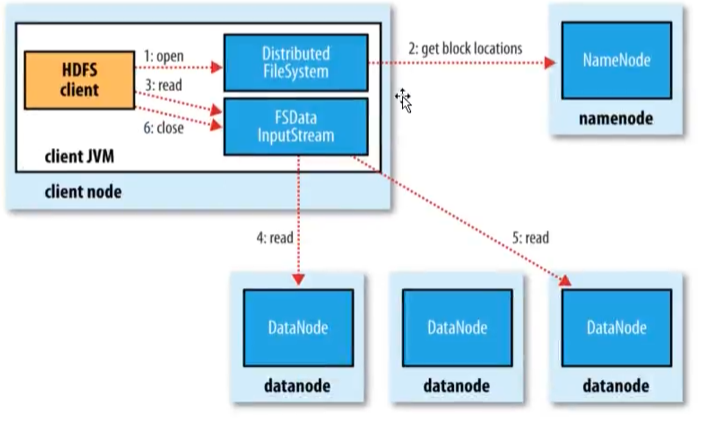

# 基础概念

## 1. HDFS架构

### 1.1 前提和设计目标

1. 硬件错误
   
   - 硬件错误是常态而不是异常
   
   - HDFS可能由成百上千的服务器构成，单机故障概率的存在意味着总有一部分服务器不工作
   
   - 错误检测和快速自动恢复室HDFS最核心架构目标

2. 流式数据访问
   
   - 运行在HDFS上的应用需要流式访问他们的数据集
   
   - HDFS的设计重点是批处理，而不是交互处理。是高吞吐量而不是低延迟
   
   - 为了提高数据的吞吐量，在关键方面修改POSIX的语义。

3. 大规模数据集
   
   - HDFS上的一个典型文件大小一般都在G字节至T字节
   
   - HDFS支持大文件存储
   
   - 单一HDFS实例能支撑数以千万计的文件

4. 简单的一致性模型
   
   - HDFS应用遵循`一次写入多次读取`的文件访问模型
   
   - 简化了数据一致性问题，并且使吞吐量的数据访问成为可能
   
   - Map/Reduce应用或者网络爬虫应用都非常适合这个模型

5. 移动计算比移动数据更划算
   
   - 降低网络阻塞的影响，提高系统数据的吞吐量
   
   - 将计算程序发送到数据所在的主机，比GB级别，TB级别的数据移动更便捷

6. 异构软硬件平台间的可移植性
   
   - HDFS在设计的时候就考虑到了平台的可移植性
   
   - 这种特性方便了HDFS作为大规模数据应用平台的推广



### 1.2 NameNode

NameNode管理文件系统的命名空间

1. 文件和目录的元数据：（运行时，元数据存放在内存）
   
   - 文件的block副本个数
   
   - 修改和访问的时间
   
   - 访问权限
   
   - block大小以及组成文件的block列表信息

2. 以两种方式在NameNode本地进行持久化
   
   - 命令空间镜像文件(fsimage)
   
   - 编辑日志(edits log)

3. fsimage文件不记录每个block所在的NameNode信息，这些信息在每次系统启动的时候从DataNode重建。之后DataNode会周期性地通过心跳包向NameNode报告Block信息。DataNode向NameNode注册的时候NameNode请求DataNode发送blcok列表信息。
   
   1. 文件名称和路径
   
   2. 文件的大小
   
   3. 文件的所属关系
   
   4. 文件的block块大小128MB
   
   5. 文件的副本个数3 MR 10个副本
   
   6. 文件的修改时间爱你
   
   7. 文件的访问时间
   
   8. 文件的权限
   
   9. 文件的block列表

#### 存储结构

一个运行的NameNode如下的目录结构，该目录结构在第一次格式化的时候创建:



- 如果`dfs.namenode.name.dir`指定了多个路径，则每个路径中的内容是一样的。尤其是当其中一个挂载的是NFS的时候，这种机制为管理提供了一些弹性

- in_use.lock 文件用于NameNode锁定存储目录，这样放弃其他同时运行的NameNode实例使用相同的存储目录

- edits表示edits log日志文件

- fsimage 表示文件系统元数据镜像文件

- VERSION是一个JAVA的属性文件

- blockpoolID：是block池的唯一标识符，一个NameNode管理一个命名空间，该命名空间中的所有文件存储的block都在block池中。

- cTime：标记着当前NameNode创建的时间。对于刚格式化的存储，该值用于是0.但是当文件系统更新的时候，这个值就会更新为一个时间戳。

- storageType：表示当前目录存储NameNode内容的数据结构

> NameNode在checkpoint之前首先要切换新的edits log文件，在切换时更新seen_txid的值。上次合并fsimage和editslog之后的第一个操作编号。

#### 执行流程

用户的操作是一个事务，每个操作NN都要先将操作记录到editslog中，如果给NN指定了多个目录，则在多个目录中都存在edits logs文件，用户的操作要在多个目录中都写完成，才让NN同步数据到内存中。当NN在内存中也同步了数据，就返回客户端SUCCESS.

#### 检查点和数据恢复

每个fsimage文件都是系统元数据的一个完整的持久化检查点(checkpoint)(后缀表示镜像中的最后一个事务)。写操作不更新这个数据，因为镜像文件通常为GB数量级，写到磁盘很慢。`如果NameNode宕机，可以将最新fsimage加载到内存，同时执行edits log对应与该fsimage之后的操作，就可以重建元数据的状态`。而这正是每次自动NameNode的时候NameNode要做的工作。

### 1.3 SecondaryNameNode

edits log会随着对文件系统的操作而无限制地增长，这对正在运行的NameNode而言没有任何影响，如果NameNode重启，则需要很长的时间执行edits log的记录以更新fsimage(元数据镜像文件)。在此期间，整个系统不可用。

在系统启动期间，NameNode合并fsimage + edits log.


#### 触发SecondaryNameNode合并文件的条件

- 时间维度：默认一小时合并一次，可以通过`dfs.namenode.checkpoint.period: 3600`修改

- 次数维度：默认100w次合并一次，可以通过`dfs.namenode.checkpoint.txns: 1000000`修改

### 1.4 DataNode

#### 存储结构

DataNode不需要显式地格式化；关键文件和目录结构如下：



- HDFS块数据存储于blk_前缀的文件中，包含了被存储文件原始字节数据的一部分

- 每个block文件都有一个.meta后缀的元数据文件关联。该文件包含了一个版本和类型信息的头部，后接该block中每个部分的校验和

- 每个block属于一个block池，每个block池有自己的存储目录，该目录名称就是该池子的ID(跟NameNode的VERSION文件中记录的block池ID一样)

> 当一个目录中block达到64个(通过`dfs.datanode.numblocks`配置)的时候，DataNode会创建一个新的子目录来存放新的block和它们的元数据。这样即使当系统中有大量的block的时候，目录树也不会太深。同时保证了每个目录中文件数量是可管理的，避免了多数操作系统都会碰到的当个目录中的文件个数限制。

- 如果`dfs.datanode.data.dir`指定了位于在不同的硬盘驱动器上的多个不同的目录，则会通过轮询的方式向目录中写block数据。需要注意的是，block副本不回在同一个DataNode上复制，而是在不同的DataNode节点之间复制。

#### 存储数据模型

1. 文件线性切割成块(Block)，按照字节切割

2. Block分散存储在集群节点中

3. 单一文件Block大小一致，文件与文件可以不一致

4. Block可以设置副本数，副本分散在不同节点中
   
   1. 副本数不要超过节点数
   
   2. 承担计算
   
   3. 容错

5. 文件上传可以设置Block大小和副本数

6. 已上传的文件Block副本数可以调整，大小不变

7. 只支持一次写入多次读取，同一时刻只有一个写入者。对同一个文件，一个时刻只有后一个写入者

8. 可以append追加数据

### 1.5 数据块副本存放策略

- 第一个副本：放置在上传文件的DataNode；如果是集群外提交，则随机挑选一台磁盘不太满，CPU不太忙的节点

- 第二个副本：存放在第一个副本不同的机架的节点上

- 第三个副本：与第二个副本相同的机架的节点

- 更多副本：随机节点

### 1.6 HDFS的权限

- 每个文件和目录都和一个拥有者和组相关联

- 文件或者目录对于拥有者、同组用户、和其他用户拥有独立的权限

- 对于一个文件：
  
  - r表示读取的权限
  
  - w表示写或者追加的权限

- 对于目录而言：
  
  - r列出目录内容的权限
  
  - w表示创建或者删除文件和目录的权限
  
  - x表示访问该目录子项目的权限

- 默认情况下, hadoop运行时安全措施处于停用模式。一个客户端可以在远程系统上通过创建和任意一个合法用户同名的账号来进行访问。

- 安全措施可以防止用户或自动工具及程序意外修改或删除文件系统的重要部分。`dfs.permissions.enabled`属性进行配置

- 超级用户是namenode进程的标识，对于超级用户，系统不会执行任何权限检查

### 1.7 hadoop安全模式

#### 1. 工作流程

1. 启动NameNode, NameNode加载fsimage到内存，对内存数据执行edits log日志中的事务操作。

2. 文件系统元数据内存镜像加载完毕，进行fsimage和edits log日志的合并，并创建新的fsimage文件和一个空的edtis log日志文件

3. NameNode等待DataNode上传block列表信息，直到副本数满足最小副本条件。

4. 当满足了最小副本条件，再过30秒，NameNode就会退出安全模式。最小副本条件指整个文件系统中有99.9%的block达到了最小副本数(默认值是1, 可以修改)

#### 2. NameNode安全模式（safemode）：

- 对文件系统元数据进行只读操作

- 当文件的所有block信息俱备的情况下，对文件进行只读操作

- 不允许进行文件修改(写、删除或重命名文件)

#### 3. 注意事项

1. NameNode不会持久化block位置信息； DataNode保有各自存储的block列表信息。正常操作时， NameNode在内存中有一个block位置的映射信息。

2. NameNode在安全模式下，NameNode需要给DataNode时间来上传block列表信息到NameNode。如果NameNode不等待DataNode上传这些信息的话，则会在DataNode之间进行block复制，而这在大多数情况下都是非必须得。(因为只需要等待DataNode上传就行了)，还会造成资源的浪费。

3. 在安全模式NameNode不会要求DataNode复制或删除block

4. 新格式化的HDFS不进入安全模式，因为DataNode没有block信息

#### 4 配置信息

| 属性名称                                | 类型      | 默认值   | 描述                                                                |
| ----------------------------------- | ------- | ----- | ----------------------------------------------------------------- |
| dfs.namenode.replication.min        | Int     | 1     | 写文件成功的最小副本数                                                       |
| dfs.namenode.safemode.threshold-pct | float   | 0.999 | 系统block达到了最小副本数的比例，之后NameNode会退出安全模式。小于等于0表示不进入安全模式，大于1表示永不退出安全模式 |
| dfs.namenode.safemode.extension     | int（ms） | 30000 | 当副本数达到最小最小副本条件之后安全模式延续的时间。对于宵的集群，可以设置为0                           |

#### 5. 命令操作

通过命令的方式查看namenode是否处于安全模式：

```shell
hdfs dfsadmin -safemode get
```

HDFS的前端webUI页面也可以查看NameNode是否处于安全模式。

有时候我们希望等待安全模式退出，之后进行文件的读写操作，尤其是在脚本中，此时：

```shell
hdfs dfsadmin -safemode wait
```

管理员有权在认识时间让NameNode进入或退出安全模式，进入安全模式：

```shell
hdfs dfsadmin -safemode enter
```

这样做可以让NameNode一直处于安全模式，也可以设置`dfs.namenode.safemode.threshold-pc=1`实现。

离开安全模式，可以使用如下命令：

```shell
hdfs dfsadmin -safemode leave
```

### 1.8 HDFS写文件流程

#### 1. 流程



- 调用客户端的对象DistributeFileSystem的create方法

- DistributeFileSystem会发起对namenode的一个RPC的链接，请求创建一个文件，不包含关于block的请求。namenode会执行各种各样的检查，确保创建的文件不存在，并且客户端有创建文件的权限。如果检查通过，namenode会创建一个文件(在edits中，同时更新内存状态)，否则创建失败，客户端抛异常IOException

- DistributeFileSystem返回一个FSDataOutputStream对象负责客户端跟datanode以及namenode通信

- FSDataOutputStream对象将数据切分为小的数据包(64kb, core-default.xml:file.client-write-packet-size默认值65536)，并写入到一个内部队列(数据队列)。DataStream会读取其中内容，并请求NameNode返回一个datanode列表来存储当前block副本。列表中的DataNode会形成管道，DataStreamer将数据发送给管道中的第一个DataNode, 第一个DataNode将接收到的数据发送给第二个DataNode, 一次类推。

- DFSOoutputStream维护者一个数据包的队列，这的数据包是需要写入到DataNode中的，该队列称为确认队列。当一个数据包在管道中所有DataNode写入完成，就从ack队列中移除该数据包。如果在数据写入期间DataNode发生故障，则执行一下操作：
  
  - 关闭管道：把确认队列中的所有包都添加回数据队列的最前端，以保证故障节点下游的DataNode不会漏掉任何一个数据包
  
  - 为存储在另一正常DataNode的当前数据块指定一个新的标志，并将该表征传送给NameNode，以便故障DataNode在恢复以后可以删除存储的部分数据块
  
  - 从管道中删除故障节点并且把余下的数据块写入管道中另外正常的DataNode。NameNode在检测到副本数量不足时，会在另外一个节点上创建新的副本
  
  - 后续的数据块继续正常接受处理
  
  - 在一个块被写入期间，可能多个DataNode同时发生故障，但非常少见。只要设置了`dfs.replication.min`的副本数，写操作就会成功，别切这个块在集群中异步复制，直到达到其目标的副本数(dfs.replication默认值为3)

- 如果有多个block, 则会返回从步骤4开始执行

- 当客户端完成了数据的传输，调用数据流的close方法。该方法将数据队列中的剩余数据包写到DataNode的管道并等待管道的确认

- 客户端收到管道中所有正常DataNode的确认消息后，通知NameNode文件写完了

- NameNode已经知道文件由哪些块组成，所以它在返回成功前只需要等待数据块进行最小量的复制。

### 1.9 HDFS读文件流程



1. 客户端通过FileSystem对象的open方法打开希望读取的文件，DistributeFileSystem对象通过RPC调用NameNode, 以确保文件起始位置。对与每个block， NameNode返回存有该副本的DataNode地址。这些DataNode根据他们与客户端的距离来排序。如果客户端本身就是一个DataNode, 并保存由响应的block一个副本，会从本地读取这个block数据。

2. DistributeFileSystem返回一个FSDataInputStream对象给客户端读取数据。该类封装了DFSInputStream对象，该对象管理者DataNode和NameNode的I/O, 用于给客户端使用。客户端对这个输入调用read方法，存储这文件起始几个block的DataNode地址的DFSInputStream链接距离最近的DataNode。通过对数据流反复调用read方法，可以将数据从DataNode传输到客户端。到达block的末端时，DFSInputStream关闭与该DataNode的链接。然后寻找下一个block的最佳DataNode。客户端只需要读取连续的流，并且对客户端都是透明的

3. 客户端从流中读取数据时, block是按照打开DFSInputStream与DataNode新建连接的顺序读取的。他也会根据需要访问NameNode来检索下一批数据块的DataNode的位置。一旦客户端完成读取，就close FSDataInputStream的输入流对象

4. 在读取数据的时候，如果DFSInputStream在与DataNode通信室遇到错误，会尝试从这个块的一个最近邻DataNode读取数据。它也记住哪个故障DataNode, 保证以后不会反复读取该节点上的后续的block。DFSInputStream也会通过校验和确认从DataNode发来的数据是否完整。如果发现有损坏的块，就在DFSInputStream试图从其他DataNode读取器副本之前通知NameNode

5. Client下载完block后会验证DataNode中的MD5，保证数据块的完整性。
