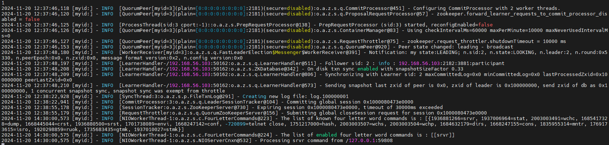
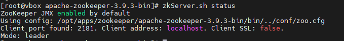

# 安装zookeeper

## 下载ZooKeeper

[Apache ZooKeeper](https://zookeeper.apache.org/releases.html)

## 解压ZooKeeper安装

```shell
tar -xzvf zookeeper-3.4.10.tar.gz
```

## 复制`/conf`目录下的zoo_simple.cfg文件

```shell
cp zoo_simple.cfg zoo.cfg
```

## 1. 单机启动

### 通过后端模式启动服务器

```shell
bin/zkServer.sh start
```

### 通过前端的方式启动服务器

```shell
bin/zkServer.sh start-foreground
```

## 2. 集群启动

我有三台虚拟机，虚拟机地址分别为:

- node1: 192.168.56.102

- node2: 192.168.56.103

- node3: 192.168.56.104

### 1. 配置修改

```shell
vi zoo.cfg
```

```properties
# The number of milliseconds of each tick,
# 表示发送心跳的降额时间，单位为毫秒
tickTime=2000
# The number of ticks that the initial
# synchronization phase can take
# 这里指代的是follower和observer的在初始化链接时最长能够忍受多少个心跳间隔数
initLimit=10
# The number of ticks that can pass between
# sending a request and getting an acknowledgement
# 这个配置项标识Leader与Follower之间发送消息，不能抄过多少个tickTime的时间爱你长度i
syncLimit=5
# the directory where the snapshot is stored.
# do not use /tmp for storage, /tmp here is just
# example sakes.
dataDir=/opt/apps/zookeeper/apache-zookeeper-3.9.3-bin/data
dataLogDir=/opt/apps/zookeeper/apache-zookeeper-3.9.3-bin/logs
# the port at which the clients will connect
clientPort=2181
electionPort=3881
# the maximum number of client connections.
# increase this if you need to handle more clients
#maxClientCnxns=60
#
# Be sure to read the maintenance section of the
# administrator guide before turning on autopurge.
#
# https://zookeeper.apache.org/doc/current/zookeeperAdmin.html#sc_maintenance
#
# The number of snapshots to retain in dataDir
#autopurge.snapRetainCount=3
# Purge task interval in hours
# Set to "0" to disable auto purge feature
#autopurge.purgeInterval=1

## Metrics Providers
#
# https://prometheus.io Metrics Exporter
#metricsProvider.className=org.apache.zookeeper.metrics.prometheus.PrometheusMetricsProvider
#metricsProvider.httpHost=0.0.0.0
#metricsProvider.httpPort=7000
#metricsProvider.exportJvmInfo=true
server.1=192.168.56.102:2182:3881
server.2=192.168.56.103:2182:3881
server.3=192.168.56.104:2182:3881

```

在以上的配置中，有三个端口需要配置：

- clientPort: 这个是供客户端链接的

- 在配置server的时候，格式为: server.[myid]=[ip]:[port]:[port]
  
  - 第一个port主要用于消息的同步，在发生事件时，主要通过这个端口发送消息通知，例如，新的leader产生后，其他的follower要接受到新的leader的地址信息，并链接。
  
  - 第二个port则是用于选举，在leader发生故障之后，则通过这个端口进行选举

在配置以上的server信息的时候，后面会有一个节点的编号，则需要将编号放置在data的目录下，

```shell
#node1
echo 1 > data/myid


#node2
echo 2 > data/myid

#node3
echo 3 > data/myid
```

- dataLogDir：则是方式zookeeper运行中产生的日志文件

- dataDir: 则是放的是zookeeper的运行数据信息。

### 2. 启动zookeeper

```shell
./bin/zkServer.sh start
```

### 3. 查看启动日志信息

```shell
tail -200f logs/zookeeper-root-server-vbox.out
```

则可以看到如下的日志信息:



### 4. 查看zookeeper集群的状态

```shell
./bin/zkServer.sh status
```



其中就可以反应出，当前节点是否为主节点，是否为从节点。


## 3. 防火墙配置

在有了以上的三个端口之后，在开启防火墙的状态下，则需要配置防火墙，以能够让其他服务器能否访问，则可以有如下配置：

```shell
firewall-cmd --zone=public --add-port=2182/tcp --permanent
firewall-cmd --zone=public --add-port=3881/tcp --permanent
firewall-cmd --zone=public --add-port=2181/tcp --permanent
```

以上就是zookeeper的简单配置，这时就可以访问zookeeper了。
