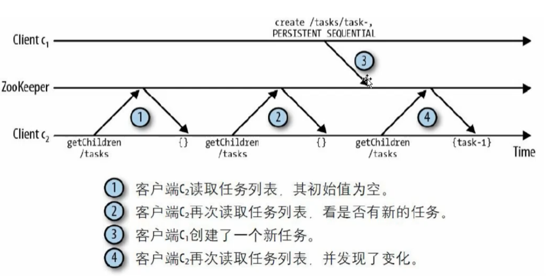
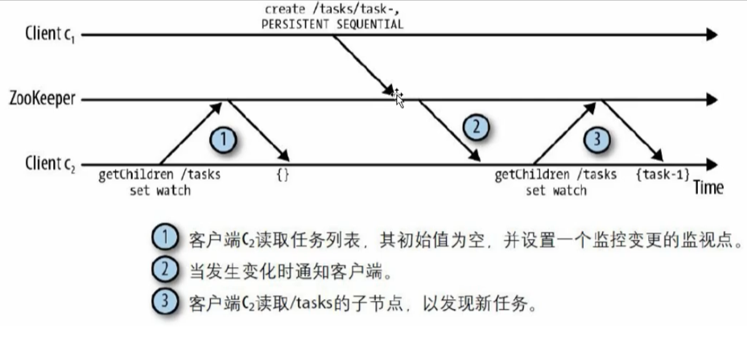
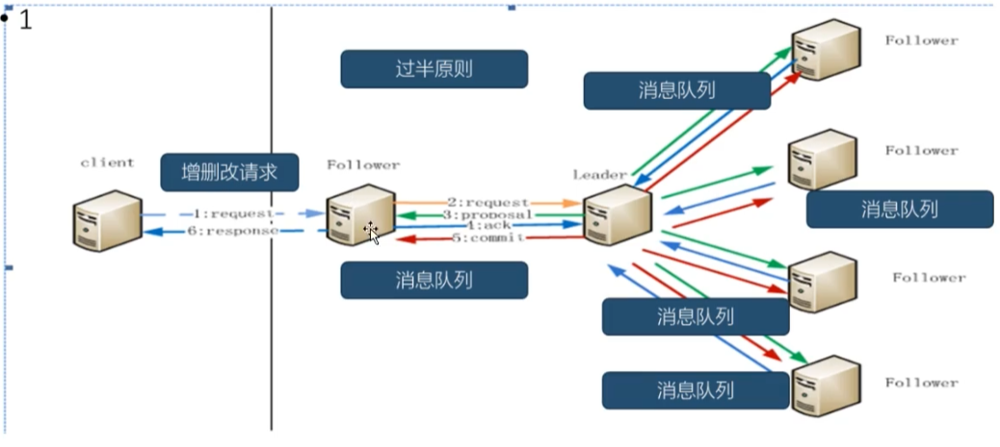

# Zookeeper相关概念

## 1. Zookeeper会话

1. 客户端通过TCP协议与独立服务器或者一个集群中的某个服务器建立会话连接

2. 会话提供顺序保障，即同一个会话中的请求以FIFO的顺序执行。如果客户端有多个并发会话，FIFO顺序在多个会话之间未必能够保持

3. 如果链接的Server出现没有，在没有超过Timeout时间时，可以链接其他节点，Zookeeper客户端透明地转移一个会话到不同的服务器上。

4. 同一个Session期内的特性不变

5. 当一个会话因某种原因终止，在这个会话期间创建的临时节点将会消失

## 2. 事件监听

- 客户端轮询指定节点下的数据，最大的问题是：通过网络轮询，代价很大

基于通知(notification)的机制：

- 客户端向Zookeeper注册需要接受通知的znode，通过对znode设置监听点（watch)来接受通知。监视点是一个单词触发的操作，意即监视点会触发一个通知。

- 为了接受多个通知，客户端必须在每次通知后设置一个新的监视点

### 事件监听Watcher

Watcher在Zookeeper是一个核心功能，可以监听目录节点的数据变化以及子目录的变化，一旦这些状态发生变化，服务器就会通知所有设置在这个节点上的Watcher，从而每个客户端都很快知道它所关注的目录节点的状态发生变化，而做出响应的反应。

- 可以设置观察点的操作：
  
  - exists, getChildren,getData

- 可以触发观察的操作：
  
  - create，delete，setData

## 3. 广播模式

Zookeeper的核心是原子广播，这个机制保证了各个server之间的信息同步，实现这个机制的协议叫做ZAB协议、

### ZAB协议有两种模式

1. 恢复模式：当服务启动或者在领导者崩溃后，ZAB就进入了恢复模式。当领导者被选举出来，且大多数server完成了和Leader的状态同步以后，恢复模式就结束了。状态同步保证了leader和follower以及observer具有相同的系统状态。

2. 广播模式
   
   广播模式需要保证`proposal`被顺序处理，因此zk采用了递增的事务id号(zxid)来保证，所有的`提议(proposal)`都在被提出的时候加上了zxid
   
   `epoch`也称为纪元数字。实现中zxid是一个64位的数字，它高32位是epoch用来标识leader关系是否改变，每次一个leader被选出来，他都会有一个新的epoch, 低32位是一个递增计数。

## 4. Zookeeper集群特点

| 特点    | 说明                                                            |
| ----- |:------------------------------------------------------------- |
| 最终一致性 | 为客户端展示同一个试图，这时zookeeper里面一个非常重要的功能                            |
| 可靠性   | 如果消息被一台服务器接收，那么它将被所有的服务器接受                                    |
| 实时性   | Zookeeper不能保证两个客户端能够同事得到刚更新的数据，如果需要最新数据，应该在读取数据之前调用`sync()`接口 |
| 独立性   | 各个Client之间互不干预                                                |
| 原子性   | 更新只能成功或者失败，没有中间状态                                             |
| 顺序性   | 所有Server, 同一消息发布顺序一直                                          |

## 5. ZK常见的应用场景

1. 分布式环境下的同一命名服务

2. 分布式环境下的配置管理

3. 数据发布/订阅

4. 分布式环境下的分布式锁

5. 集群管理问题

