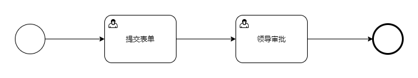
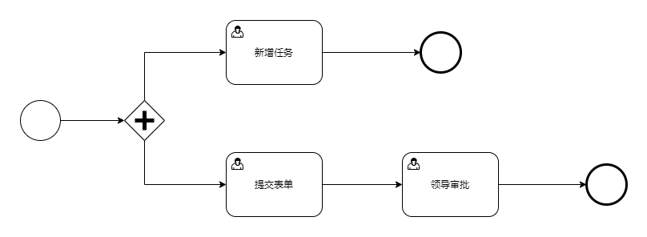
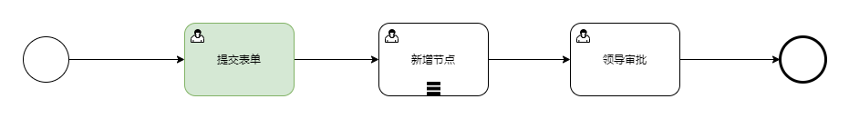
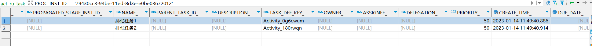
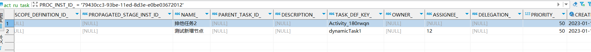
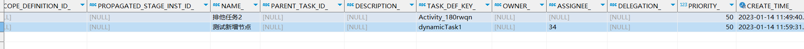
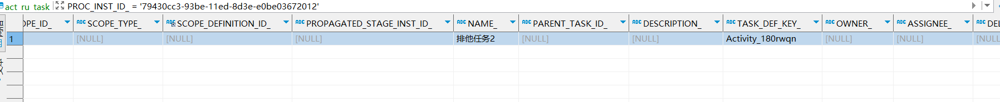

# flowable 运行时动态创建会签节点

在最近的项目开发中，涉及到了审批人在审批时，需要动态的指定审批人。在目前最通用的方案就是在涉及流程的时候，审批人通过变量的方式指定，然后审批人在审批的时候，动态传入审批人即可。但是这种方式比较大的问题，没办法覆盖所有的场景，当场景比较灵活的时候，对流程的设计有比较高的要求。因此就开始调研能否通过代码的方式动态创建任务节点。

在Flowable中确实提供了几个类，用于帮助我们动态新增任务节点，达到目的，主要类如下:

- InjectUserTaskInProcessInstanceCmd

- InjectEmbeddedSubProcessInProcessInstanceCmd

- InjectParallelEmbeddedSubProcessCmd

- InjectParallelUserTaskCmd

通过查看源码，以上的方法在实现的时候，都只能够指定单个审批人，因此对于多人审批而言，是没有支持的，因此为了能够达到会签的目的，因此在他原有功能基础上，做一些功能的扩展。

## 1. InjectUserTaskInProcessInstanceCmd

通过对接类型的对比，该类是最符合我的预期的，在改造前，需要他实现的代码原理有些了解，以便更好改造。

### 1.1 createDerivedProcessDefinition

该方法是在`AbstractDynamicInjectionCmd`类中，是所有类型的公共方法，该方法实现比较简单。

```java
protected void createDerivedProcessDefinition(CommandContext commandContext, ProcessInstance processInstance) {
        // 获取当前运行流程实例的定义
        ProcessDefinitionEntity originalProcessDefinitionEntity = CommandContextUtil.getProcessDefinitionEntityManager(commandContext).findById(processInstance.getProcessDefinitionId());
        // 流程部署信息
        DeploymentEntity deploymentEntity = createDerivedDeployment(commandContext, originalProcessDefinitionEntity);
        // 创建流程图，这里是动态插入节点任务的关键
        BpmnModel bpmnModel = createBpmnModel(commandContext, originalProcessDefinitionEntity, deploymentEntity);
        // 保存新的流程图
        storeBpmnModelAsByteArray(commandContext, bpmnModel, deploymentEntity, originalProcessDefinitionEntity.getResourceName());
        // 重新部署信息
        ProcessDefinitionEntity derivedProcessDefinitionEntity = deployDerivedDeploymentEntity(commandContext, deploymentEntity, originalProcessDefinitionEntity);
        // 更新运行信息
        updateExecutions(commandContext, derivedProcessDefinitionEntity, (ExecutionEntity) processInstance, bpmnModel);
    }
```

### 1.2 createBpmnModel

```java
protected BpmnModel createBpmnModel(CommandContext commandContext, ProcessDefinitionEntity originalProcessDefinitionEntity, DeploymentEntity newDeploymentEntity) {
        // 获取正在执行流程的xml定义信息
        ResourceEntity originalBpmnResource = CommandContextUtil.getResourceEntityManager(commandContext)
                .findResourceByDeploymentIdAndResourceName(originalProcessDefinitionEntity.getDeploymentId(), originalProcessDefinitionEntity.getResourceName());
        // 将xml解析为BpmnModel信息
        BpmnModel bpmnModel = new BpmnXMLConverter().convertToBpmnModel(new BytesStreamSource(originalBpmnResource.getBytes()), false, false);

        // 获取流程对象，其中包含了流程定义的信息
        org.flowable.bpmn.model.Process process = bpmnModel.getProcessById(originalProcessDefinitionEntity.getKey());
        // 更新BpmnProcess对象
        updateBpmnProcess(commandContext, process, bpmnModel, originalProcessDefinitionEntity, newDeploymentEntity);
        return bpmnModel;
    }
```

### 1.3 updateBpmnProcess

该方法是动态插入任务节点的关键，该方法是一个抽象方法，需要每个子类去实现，我们先看看flowable在实现的时候的思路，具体源码如下:

```java
protected void updateBpmnProcess(CommandContext commandContext, Process process,
            BpmnModel bpmnModel, ProcessDefinitionEntity originalProcessDefinitionEntity, DeploymentEntity newDeploymentEntity) {
        // 获取流程任务开始事件节点
        List<StartEvent> startEvents = process.findFlowElementsOfType(StartEvent.class);
        StartEvent initialStartEvent = null;
        for (StartEvent startEvent : startEvents) {
            if (startEvent.getEventDefinitions().size() == 0) {
                initialStartEvent = startEvent;
                break;
                
            } else if (initialStartEvent == null) {
                initialStartEvent = startEvent;
            }
        }
        
        // 创建并行网关
        ParallelGateway parallelGateway = new ParallelGateway();
        parallelGateway.setId(dynamicUserTaskBuilder.nextForkGatewayId(process.getFlowElementMap()));
        // 将并行网关加入到流程
        process.addFlowElement(parallelGateway);

        // 创建动态任务
        UserTask userTask = new UserTask();
        if (dynamicUserTaskBuilder.getId() != null) {
            userTask.setId(dynamicUserTaskBuilder.getId());
        } else {
            userTask.setId(dynamicUserTaskBuilder.nextTaskId(process.getFlowElementMap()));
        }
        dynamicUserTaskBuilder.setDynamicTaskId(userTask.getId());
        
        userTask.setName(dynamicUserTaskBuilder.getName());
        userTask.setAssignee(dynamicUserTaskBuilder.getAssignee());
        // 将动态任务节点加入到流程
        process.addFlowElement(userTask);
        
        // 创建结束事件节点
        EndEvent endEvent = new EndEvent();
        endEvent.setId(dynamicUserTaskBuilder.nextEndEventId(process.getFlowElementMap()));
        // 将结束事件加入到流程
        process.addFlowElement(endEvent);

        // 创建连线, 将并行网关与用户任务链接
        // 即 ParallelGateway ->  UserTask
        SequenceFlow flowToUserTask = new SequenceFlow(parallelGateway.getId(), userTask.getId());
        flowToUserTask.setId(dynamicUserTaskBuilder.nextFlowId(process.getFlowElementMap()));
        process.addFlowElement(flowToUserTask);

        // 将动态任务与结束节点链接
        // 即 UserTask-> EndEvent
        SequenceFlow flowFromUserTask = new SequenceFlow(userTask.getId(), endEvent.getId());
        flowFromUserTask.setId(dynamicUserTaskBuilder.nextFlowId(process.getFlowElementMap()));
        process.addFlowElement(flowFromUserTask);

        // 将开始事件的出线指定到并行网关
        // 即 StartEvent -> UserTask
        // 修改为 UserTask -> ParallelGateway
        SequenceFlow initialFlow = initialStartEvent.getOutgoingFlows().get(0);
        initialFlow.setSourceRef(parallelGateway.getId());

        // 将开始事件链接到并行网关
        // 即 StartEvent -> ParallelGateway
        SequenceFlow flowFromStart = new SequenceFlow(initialStartEvent.getId(), parallelGateway.getId());
        flowFromStart.setId(dynamicUserTaskBuilder.nextFlowId(process.getFlowElementMap()));
        process.addFlowElement(flowFromStart);
        
        // ... 省略坐标计算
        
        BaseDynamicSubProcessInjectUtil.processFlowElements(commandContext, process, bpmnModel, originalProcessDefinitionEntity, newDeploymentEntity);
    }
```

在这段代码中，主要包含了两个主要功能:

- 将动态的任务节点插入到流程定义中，并且修改流程连线

- 调整新增加的任务节点的坐标信息，便于绘制流程图

以上描述会很抽象，可以画一个简单地图看一下:

例如有一下流程定义，



在执行完成以上代码之后，则流程变为以下形式：



因此在默认的实现中，是采用了并行网关的一个设计，来达到扩展的一个目的。

### 1.4 更新运行时

当流程图已被修改之后，这个时候我们需要将新的流程图替换老的流程图，由于在新的流程图中使用了并行网关，这个时候需要将新增加的节点标记为运行节点，因此这个时候就需要用到了`updateExecutions`方法，`因为当我们任务向后走了之后，并行网关无法生效，则需要我们手动的将新增的任务激活`

```java
protected void updateExecutions(CommandContext commandContext, ProcessDefinitionEntity processDefinitionEntity, 
            ExecutionEntity processInstance, List<ExecutionEntity> childExecutions) {

        ExecutionEntityManager executionEntityManager = CommandContextUtil.getExecutionEntityManager(commandContext);
        ExecutionEntity execution = executionEntityManager.createChildExecution(processInstance);
        
        BpmnModel bpmnModel = ProcessDefinitionUtil.getBpmnModel(processDefinitionEntity.getId());
        UserTask userTask = (UserTask) bpmnModel.getProcessById(processDefinitionEntity.getKey()).getFlowElement(dynamicUserTaskBuilder.getDynamicTaskId());
        // 激活动态任务
        execution.setCurrentFlowElement(userTask);

        Context.getAgenda().planContinueProcessOperation(execution);
    }
```

> 这点很重要，因为和后面我们扩展的地方会有些不一样，会导致很多奇怪的问题。

## 2. 自定义会签节点

通过以上的图形分析，我们发现其实能够达到我们需要的效果，因为我们大多数需要的都是在当前审批节点之后运行，但是这样实现的时候，会导致流程相对比较复杂，因此我有以下需求：

- 能够加入多实例会签节点

- 加入到当前节点之后，不额外新增并行网关节点

因此带着以上两个目的，进行改造，具体代码如下:

```java
package com.xjt.micro.financial.workflow.cmd;

import com.xjt.micro.financial.workflow.constant.ProcessConstants;
import org.flowable.bpmn.model.Process;
import org.flowable.bpmn.model.*;
import org.flowable.common.engine.impl.interceptor.CommandContext;
import org.flowable.engine.impl.cmd.InjectUserTaskInProcessInstanceCmd;
import org.flowable.engine.impl.dynamic.BaseDynamicSubProcessInjectUtil;
import org.flowable.engine.impl.dynamic.DynamicUserTaskBuilder;
import org.flowable.engine.impl.persistence.entity.DeploymentEntity;
import org.flowable.engine.impl.persistence.entity.ExecutionEntity;
import org.flowable.engine.impl.persistence.entity.ProcessDefinitionEntity;

import java.util.Arrays;
import java.util.HashMap;
import java.util.List;
import java.util.Map;

/**
 * @author xianglujun
 * @date 2023/1/13 20:17
 */

public class InjectMultiInstanceUserTaskCmd extends InjectUserTaskInProcessInstanceCmd {

	private String currentTaskId;
	private UserTask currentUserTask;
	private String processInstanceId;
	private DynamicUserTaskBuilder dynamicUserTaskBuilder;
	private List<String> userIds;

	public InjectMultiInstanceUserTaskCmd(
			String processInstanceId,
			String taskId,
			List<String> userIds,
			DynamicUserTaskBuilder dynamicUserTaskBuilder) {
		super(processInstanceId, dynamicUserTaskBuilder);
		this.processInstanceId = processInstanceId;
		this.currentTaskId = taskId;
		this.dynamicUserTaskBuilder = dynamicUserTaskBuilder;
		this.userIds = userIds;
	}

	@Override
	protected void updateBpmnProcess(CommandContext commandContext, Process process, BpmnModel bpmnModel, ProcessDefinitionEntity originalProcessDefinitionEntity, DeploymentEntity newDeploymentEntity) {
        // 创建动态节点
		UserTask userTask = new UserTask();
		if (dynamicUserTaskBuilder.getId() != null) {
			userTask.setId(dynamicUserTaskBuilder.getId());
		} else {
			userTask.setId(dynamicUserTaskBuilder.nextTaskId(process.getFlowElementMap()));
		}
		dynamicUserTaskBuilder.setDynamicTaskId(userTask.getId());

		userTask.setName(dynamicUserTaskBuilder.getName());
		userTask.setAssignee(dynamicUserTaskBuilder.getAssignee());

        // 创建多实例对象，设置多实例条件
		MultiInstanceLoopCharacteristics characteristics = new MultiInstanceLoopCharacteristics();
		// 设置多实例用户变量
        characteristics.setElementVariable("assignee");
        // 设置获取用户信息的方法处理器
        // 这里不能使用setCollectionString()方法，根据官方说法，
        // 当使用的表达式或者类获取用户列表是，应当使用setInputDataItem代替
        // 具体handler可以搜一下，还是很简单
		characteristics.setInputDataItem("${multiInstanceHandler.getUserIds(execution)}");
		// 设置是并行还是串行
        characteristics.setSequential(true);
        // 设置任务完成条件
		characteristics.setCompletionCondition("${nrOfCompletedInstances>=nrOfInstances}");
            
        // 设置用户列表
		userTask.setCandidateUsers(userIds);
        // 从多实例变量中取审批人
		userTask.setAssignee("${assignee}");
		userTask.setLoopCharacteristics(characteristics);

		Map<String, List<ExtensionAttribute>> attributeMap = new HashMap<>();

        // 设置节点属性, 这个根据代码处理逻辑而定
		ExtensionAttribute attribute = new ExtensionAttribute();
		attribute.setName("flowable:" + ProcessConstants.PROCESS_CUSTOM_DATA_TYPE);
		attribute.setValue("USERS");

		attributeMap.put(ProcessConstants.NAMASPASE, Arrays.asList(attribute));
		userTask.setAttributes(attributeMap);
		process.addFlowElement(userTask);

		// 获取当前节点
		this.currentUserTask = (UserTask) process.getFlowElement(currentTaskId);
		// 获取出口
		List<SequenceFlow> outgoingFlows = this.currentUserTask.getOutgoingFlows();
		// 出线口指向当前节点
        // 线条的改变规则其实很简单
        // prev -> next
        // 修改为 prev -> dynamicTask -> next
		for (SequenceFlow flow : outgoingFlows) {

			SequenceFlow newFlow = new SequenceFlow();
			newFlow.setSourceRef(userTask.getId());
			newFlow.setTargetRef(flow.getTargetRef());
			newFlow.setTargetFlowElement(flow.getTargetFlowElement());
			process.addFlowElement(newFlow);

			flow.setTargetRef(userTask.getId());
			flow.setTargetFlowElement(userTask);
		}


		BaseDynamicSubProcessInjectUtil.processFlowElements(commandContext, process, bpmnModel, originalProcessDefinitionEntity, newDeploymentEntity);
	}

	@Override
	protected void updateExecutions(CommandContext commandContext, ProcessDefinitionEntity processDefinitionEntity, ExecutionEntity processInstance, List<ExecutionEntity> childExecutions) {
//		ExecutionEntityManager executionEntityManager = CommandContextUtil.getExecutionEntityManager(commandContext);
//		ExecutionEntity execution = executionEntityManager.createChildExecution(processInstance);
//		BpmnModel bpmnModel = ProcessDefinitionUtil.getBpmnModel(processDefinitionEntity.getId());
//		UserTask userTask = (UserTask) bpmnModel.getProcessById(processDefinitionEntity.getKey()).getFlowElement(currentTaskId);
//		execution.setCurrentFlowElement(userTask);
//		Context.getAgenda().planContinueProcessOperation(execution);
	}
}


```

上面代码实现了在当前审批节点之后动态添加多实例会签任务的实现，我们通过图形的方式看看前后的差别:


这个图还是跟上面的保持一致，那么改变之后的流程图变更为:



在通过以上修改之后，我是感觉这个流程舒服多了，符合我们的一个预期。

> 细心的小伙伴会发现，我们注销了updateExecutions这个方法的执行，可能会有些疑惑。这是因为我考虑的是将节点加到当前节点之后来执行，当前任务其实还是处于一个活跃的状态，当将新增的动态任务激活的话，会导致当前任务未完成，但是却创建了任务，当当前任务审批后，依然会创建`新增节点`又会再一次被创建，这个时候你就会看到`新增节点被创建了两次`的问题，这个问题也是困扰了比较常的时间。

在官方给定的实例实现中，他需要激活是因为采用了并行网关的缘故，必须手动的激活新增的节点，否则会导致新增节点不生效的问题。

## 3. 测试是否生效

### 3.1 启动流程

我使用的流程和上面的流程不一样，但是足以能够说明问题。

```java
@Test
	void startProcess() {

		new Expectations(LoginHelper.class) {
			{
				LoginUser loginUser = getUser(1L);
				LoginHelper.getLoginUser();
				result = loginUser;
			}
		};

		String categoryCode = CategoryCodeEnum.TRAVEL_EXP_APPLY.getCode();
		String applyCode = "1557335262099177474";
		String bizNode = "c001";

		Map<String, Object> variables = new HashMap<>();
		variables.put("nn", "22");
		variables.put("type", 2);
		variables.put("amount", new BigDecimal("2.3"));

		String processInstanceId = processService.startProcess(categoryCode, applyCode, ApplyTypeEnum.DEPT.getApplyType(), bizNode, variables);
		Assert.assertTrue(processInstanceId != null);

		System.out.println(processInstanceId);
	}
```

我通过单测的方式启动了一个流程。

> 我的流程是现成的，大家可以自己设计一个流程，然后用自己的方式启动即可，这里主要是说明问题。

此时数据库中的数据如下：



此时可以看到数据库已经产生了两个任务，我们在`排他任务1`后面新增一个动态任务节点，则对应的测试代码如下:

### 3.2 插入动态节点

```java
	@Test
	public void addUserTask() {
		String taskKey = "Activity_0g6cwum";
		String processInsId = "79430cc3-93be-11ed-8d3e-e0be03672012";

		managementService.executeCommand(new InjectMultiInstanceUserTaskCmd(
				processInsId,
				taskKey,
				Arrays.asList("12", "34"),
				new DynamicUserTaskBuilder()
						.assignee("23")
						.name("测试新增节点")
		));
	}
```

### 3.3 审批当前节点

通过以上步骤，已经完成节点的动态添加，因此我们审批当前节点，看是否生效

```java
@Test
	void completeTask() {

		new Expectations(LoginHelper.class) {
			{
				LoginHelper.getUserId();
				result = 1550018080533200898L;
			}
		};

		WfTaskBo taskBo = new WfTaskBo();
		taskBo.setTaskId("7970d39d-93be-11ed-8d3e-e0be03672012");
		taskBo.setInstanceId("79430cc3-93be-11ed-8d3e-e0be03672012");

		Map<String, Object> variables = new HashMap<>();
		variables.put("audit", "同意");
		variables.put("comment", "备注信息");
		taskBo.setValues(variables);

		taskBo.setComment("备注信息");

		wfTaskService.complete(taskBo, Collections.emptyList());
	}
```

这时数据库中查看对应的任务信息为:



可以看到这里插入的任务已经生效，我们再次审批新增节点任务



在串行的模式下，可以看到用户能够按照顺序执行，再次审批，将结束当前新增的任务节点



由此可以看出，我们达到了预期，新增多实例会签节点完成。


文章自己经过了很多的尝试和修改，如果对你对你有帮助，希望为文章点赞哦。文章未经允许，不可转载。
