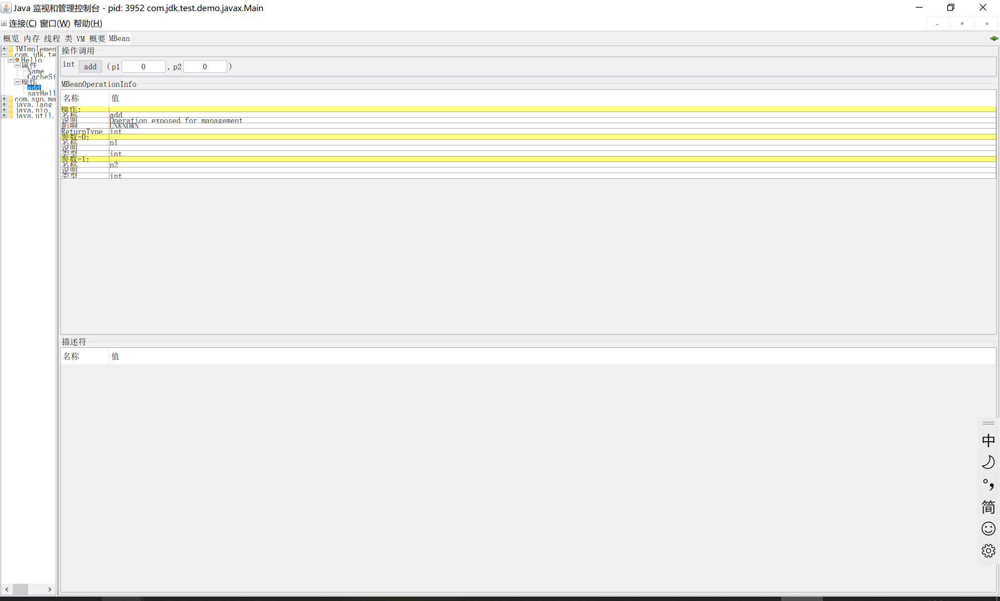

# MBeans

## 定义

MBean是一个可管理的对象，类似JavaBean组件，遵循JMX规范。一个MBean可以是应用、设备、任何需要被管理的资源。


MBeans定义了一系列可管理的接口：

- 可读写的属性集合
- 可操作方法集合
- 自我描述信息

> 这些管理接口，在MBean生命周期内，不能更改


## 分类

JMX规范中，定义了5中MBean的类型：

- Standard MBeans
- Dynamic MBeans
- Open MBeans
- Model MBeans
- MXBeans


### Standard MBean

#### 定义MBean接口

- 根据JMX规范定义，接口名称必须采用`MBean`结尾
- 对于属性定义，通过setter控制可写。getter控制可读
- 通过对接口定义方法，定义可操作列表

```java
package com.jdk.test.demo.javax;

public interface HelloMBean {
    void sayHello();
    int add(int x, int y);

    String getName();

    int getCacheSize();
    void setCacheSize(int size);
}

```

#### MBean实现

MBean的实现，实现`HelloMBean`接口，并实现接口中定义的方法

```java
package com.jdk.test.demo.javax;

public class Hello implements HelloMBean {

    private static final int DEFAULT_CACHE_SIZE = 200;

    private int cacheSize = DEFAULT_CACHE_SIZE;
    private String name = "HelloMBean";

    @Override
    public void sayHello() {
        System.out.println("Hello World");
    }

    @Override
    public int add(int x, int y) {
        return x + y;
    }

    @Override
    public String getName() {
        return name;
    }

    @Override
    public int getCacheSize() {
        return cacheSize;
    }

    @Override
    public void setCacheSize(int size) {
        this.cacheSize = size;
        System.out.println("current cache size is : " + cacheSize);
    }
}

```

#### 启动MBean Server

- 启动MBean Server时，可以通过`ManagementFactory`获取平台默认的MBean Server
- 对于注册的MBean, 必须包含一个名字

```java
package com.jdk.test.demo.javax;

import javax.management.*;
import java.lang.management.ManagementFactory;

public class Main {

    public static void main(String[] args) throws MalformedObjectNameException, NotCompliantMBeanException, InstanceAlreadyExistsException, MBeanRegistrationException, InterruptedException {
        MBeanServer mBeanServer = ManagementFactory.getPlatformMBeanServer();

        // 获取MBean的路径，以及名称
        ObjectName objectName = new ObjectName("com.jdk.test.demo.javax:type=Hello");
        Hello hello = new Hello();
        mBeanServer.registerMBean(hello, objectName);

        System.out.println("Waiting Forever...");
        Thread.sleep(Long.MAX_VALUE);
    }
}

```

#### 调用MBean

当MBean Server服务启动完成后，就可以通过JConsole服务查看MBean对象，并调用MBean对象




### MXBeans

MXBeans是MBean类型的一种，MXBeans提前预定义数据类型集合。通过这种方式，数据资源可以被任何客户端访问，MXBeans提供了一种将关联的数据聚合的渐变方式, 并且不需要客户端做任何配置。


```java
package com.jdk.test.demo.javax;

import java.beans.ConstructorProperties;
import java.util.Date;
import java.util.Queue;

public class QueueSimple {

    private Date date;
    private Queue<String> queue;
    private String head;

    @ConstructorProperties({"date", "queue", "head"})
    public QueueSimple(Date date, Queue<String> queue, String head) {
        this.date = date;
        this.queue = queue;
        this.head = head;
    }

    public Date getDate() {
        return date;
    }

    public void setDate(Date date) {
        this.date = date;
    }

    public String getHead() {
        return head;
    }
}

```


```java
package com.jdk.test.demo.javax;

public interface QueueSimplerMXBean {

    QueueSimple getQueueSimple();

    void clearQueue();
}

```


```java
package com.jdk.test.demo.javax;

import java.util.Date;
import java.util.Queue;

public class QueueSimpler implements QueueSimplerMXBean {

    private Queue<String> queue;

    public QueueSimpler(Queue<String> queue) {
        this.queue = queue;
    }

    @Override
    public QueueSimple getQueueSimple() {
        return new QueueSimple(new Date(), queue, queue.peek());
    }

    @Override
    public void clearQueue() {
        this.queue.clear();
    }
}

```

```java
package com.jdk.test.demo.javax;

import javax.management.MBeanServer;
import javax.management.ObjectName;
import java.lang.management.ManagementFactory;
import java.util.Queue;
import java.util.concurrent.ArrayBlockingQueue;

public class QueueSimplerMain {
    public static void main(String[] args) throws Exception {
        MBeanServer mBeanServer = ManagementFactory.getPlatformMBeanServer();

        ObjectName objectName = new ObjectName("com.jdk.test.demo.javax:type=QueueSimpler");
        Queue<String> queue = new ArrayBlockingQueue(10);
        queue.offer("test1");
        queue.offer("test2");
        queue.offer("test3");
        queue.offer("test4");

        mBeanServer.registerMBean(new QueueSimpler(queue), objectName);

        System.out.println("Forever");

        Thread.sleep(Long.MAX_VALUE);
    }
}

```

## Notification

MBean可以发送事件通知，具体实现如下：

```java
package com.jdk.test.demo.javax;

import javax.management.AttributeChangeNotification;
import javax.management.MBeanNotificationInfo;
import javax.management.Notification;
import javax.management.NotificationBroadcasterSupport;

public class Hello extends NotificationBroadcasterSupport implements HelloMBean {

    private static final int DEFAULT_CACHE_SIZE = 200;

    private int cacheSize = DEFAULT_CACHE_SIZE;
    private String name = "HelloMBean";
    private int sequenceNumber;

    @Override
    public void sayHello() {
        System.out.println("Hello World");
    }

    @Override
    public int add(int x, int y) {
        return x + y;
    }

    @Override
    public String getName() {
        return name;
    }

    @Override
    public int getCacheSize() {
        return cacheSize;
    }

    @Override
    public void setCacheSize(int size) {
        int oldSize = cacheSize;
        this.cacheSize = size;
        System.out.println("current cache size is : " + cacheSize);

        Notification n = new AttributeChangeNotification(this,
                sequenceNumber++, System.currentTimeMillis(),
                "CacheSize changed", "CacheSize", "int",
                oldSize, this.cacheSize);

        sendNotification(n);
    }

    @Override
    public MBeanNotificationInfo[] getNotificationInfo() {
        String[] types = new String[]{
                AttributeChangeNotification.ATTRIBUTE_CHANGE
        };

        String name = AttributeChangeNotification.class.getName();
        String description = "An attribute of this MBean has changed";
        MBeanNotificationInfo info =
                new MBeanNotificationInfo(types, name, description);
        return new MBeanNotificationInfo[]{info};
    }
}

```

## 暴露远程端口

MBean资源信息，可以通过参数配置的方式，将资源暴露到远程服务器之上，具体配置如下：

```java
java -Dcom.sun.management.jmxremote.port=9999 \
     -Dcom.sun.management.jmxremote.authenticate=false \
     -Dcom.sun.management.jmxremote.ssl=false \
     com.example.Main
```

