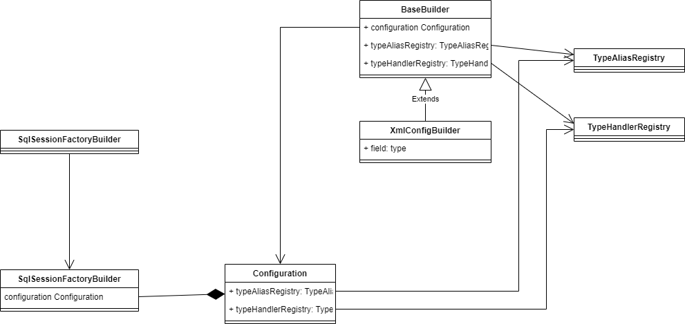

# mybatis Configuration初始化源码分析

在上一篇文章中，我们记录了[mybatis的基础用法](./mybatis的基础用法.md)，这里我们将主要探讨下mybatis mapper的生成原理，主要查看mybatis是如何加载xml配置文件、类与类之间的关系、以及mapper如何创建。因此我们带着好奇心开始探讨mybatis吧。

## SqlSessionFactory

在基础用法章节，我们可以看到，mybatis的开始也是通过SqlSessionFactory作为开端的，因此我们看一下该类是通过什么方式创建出来的。下面先给出在初始化的时候，类与类之间的关系:



在SqlSessionFactory初始化中，主要目的为初始化`Configuration`对象，该对象为一个很复杂的对象，因此在这里采用了构造器模式。

- `Configuration`: 该对象为mybatis的所有配置信息，构建复杂，成本较高，因此该对象为一个单例对象

- `XmlConfigBuilder`: 该对象为`Configuration`构造对象，通过将XML配置信息转换为`Configuration`对象

- `TypeAliasHandler`: 该类主要注册了别名与类之间的关系，当我们有了别名之后，就可以在mybatis使用的时候，通过别名的方式代替类型的全限定名称输入

- `TypeHandlerRegistry`: 类型处理注册器，改了记录了不同类型之间的转换处理方式，我们也可以通过xml的方式注入我们自己的类型转换器。该类在将数据库类型转换为java类型很有用处。

### SqlSessionFactoryBuilder

在该类中，主要是提供了不同的重载方法，这些方法能够满足不同场景的使用，我们主要看下最重要的两个方法：

```java
public SqlSessionFactory build(InputStream inputStream, String environment, Properties properties) {
    try {
      XMLConfigBuilder parser = new XMLConfigBuilder(inputStream, environment, properties);
      return build(parser.parse());
    } catch (Exception e) {
      throw ExceptionFactory.wrapException("Error building SqlSession.", e);
    } finally {
      ErrorContext.instance().reset();
      try {
        inputStream.close();
      } catch (IOException e) {
        // Intentionally ignore. Prefer previous error.
      }
    }
  }

  public SqlSessionFactory build(Configuration config) {
    return new DefaultSqlSessionFactory(config);
  }
```

- 第一个build主要确认xml的来源，并且通过XMLConfigBuilder类对xml信息进行解析，并通过parse()方法组装成为Configuration对象

- 第二个build方法主要是创建DefaultSqlSessionFactory对象，该对象为SqlSessionFactory的默认实现。

## XMLConfigBuilder

这个类就是启动Mybatis最核心的类，该类中主要是解析XML配置并生成Configuration对象，下面我们就主要一步一步来看该类的每个方法的作用，以及组装Configuration步骤。

### 构造器

```java
public XMLConfigBuilder(InputStream inputStream, String environment, Properties props) {
    this(new XPathParser(inputStream, true, props, new XMLMapperEntityResolver()), environment, props);
  }

  private XMLConfigBuilder(XPathParser parser, String environment, Properties props            ) {
    // 创建Configuration对象，并放置到父类中
    super(new Configuration());
    // 错误上下文
    ErrorContext.instance().resource("SQL Mapper Configuration");
    // 设置变量信息
    this.configuration.setVariables(props);
    // 是否解析标志
    this.parsed = false;
    // 启动时的环境名称
    this.environment = environment;
    // xml解析对象
    this.parser = parser;
  }
```

通过以上源码解析，主要包含了以下信息:

- 解析xml操作主要委派给了XPathParser对象，实现XML内容的解析

- 可以指定启动时的环境，该环境可以在mybatis config配置文件中配置多个

- 在启动时可以指定环境变量，通过configuration.setVariables()进行设置

### parse()

当XMLConfigBuilder对象在创建完成后，将通过parse()方法完成解析，并生成Configuration对象，因此我们看下parse()方法的源码：

```java
public Configuration parse() {
    // 如果已经解析，则抛出异常
    if (parsed) {
      throw new BuilderException("Each XMLConfigBuilder can only be used once.");
    }
    // 将已解析标记为true
    parsed = true;
    // 解析并设置configuration参数
    parseConfiguration(parser.evalNode("/configuration"));
    // 返回configuration
    return configuration;
  }
```

通过以上可以得出:

- 在mybatis初始化的时候，对应的xml文件只能被解析一次

- 在解析的时候，都是将xml节点的内容信息填充到当前的configuration对象

### parseConfiguration()

从上面不难看出，这个方法是很重要的方法:

- parser.evalNode("/configuration") ：该方法主要返回了mybatis config配置信息的根节点，并从根节点开始解析。

```java
private void parseConfiguration(XNode root) {
    try {
      // issue #117 read properties first
      // 解析properties配置
      propertiesElement(root.evalNode("properties"));
      // 解析settings信息
      Properties settings = settingsAsProperties(root.evalNode("settings"));
      loadCustomVfs(settings);
      loadCustomLogImpl(settings);
      // 解析typeAlias信息
      typeAliasesElement(root.evalNode("typeAliases"));
      // 解析plugins信息
      pluginElement(root.evalNode("plugins"));
      // 解析objectFactory信息
      objectFactoryElement(root.evalNode("objectFactory"));
      // 解析objectWrapperFactory
      objectWrapperFactoryElement(root.evalNode("objectWrapperFactory"));
      // 解析reflectorFactory
      reflectorFactoryElement(root.evalNode("reflectorFactory"));
      settingsElement(settings);
      // read it after objectFactory and objectWrapperFactory issue #631
      // 解析root.evalNode("environments")
      environmentsElement(root.evalNode("environments"));
      // 解析 databaseIdProvider
      databaseIdProviderElement(root.evalNode("databaseIdProvider"));
      // 解析 typeHandlers
      typeHandlerElement(root.evalNode("typeHandlers"));
      // 解析mappers
      mapperElement(root.evalNode("mappers"));
    } catch (Exception e) {
      throw new BuilderException("Error parsing SQL Mapper Configuration. Cause: " + e, e);
    }
  }
```

这个方法其实也很简单，就是简单从根据mybatis config配置信息中获取除对应节点，并解析对应节点内容即可。这个方法本身没有什么难度。

### propertiesElement()

该方法主要用于解析<properties>节点的内容，在配置文件中, properties中的内容可以在后面的配置直接使用，因此该配置的解析是很重要的.

```java
private void propertiesElement(XNode context) throws Exception {
    // 节点是否为空, 不为空则解析
    if (context != null) {
      // 将子节点解析成properties对象，也就是key-value的格式
      Properties defaults = context.getChildrenAsProperties();
      // 解析resource属性
      String resource = context.getStringAttribute("resource");
      // 解析url属性
      String url = context.getStringAttribute("url");

      // resource和url的配置不能同时存在
      if (resource != null && url != null) {
        throw new BuilderException("The properties element cannot specify both a URL and a resource based property file reference.  Please specify one or the other.");
      }

      // 如果resource存在，则加载resource中的配置内容
      // 这里的resource是从classpath中加载配置文件的内容,具体可以参考Resources类
      if (resource != null) {
        defaults.putAll(Resources.getResourceAsProperties(resource));
      } else if (url != null) {
        // 从url中加载配置文件
        defaults.putAll(Resources.getUrlAsProperties(url));
      }

      // 从configuration中获取配置properties列表
      Properties vars = configuration.getVariables();
      // 如果有，则加入
      if (vars != null) {
        defaults.putAll(vars);
      }
      // 将配置防止到XPathParser对象中
      parser.setVariables(defaults);
      // configuration关联配置
      configuration.setVariables(defaults);
    }
  }
```

通过以上的代码分析，配置内容的来源有很多，包含程序、property节点、resource、url四种来源信息，这其中包含了优先级, 从上面的代码中，我们得出加载顺序：

- 从***<property>***节点加载配置

- 从**resource/url**中加载配置，此时会覆盖**<property>**中相同的配置项

- 将程序设置的配置放入到配置列表**defaults**中，此时会覆盖前两次加载的相同配置项.

> 到这里就可以得出以下结论：
> 
> **property配置 < resource / url配置 < 程序配置**

### settings节点解析

settings节点是作为mybatis全局的配置存在，影响的也是全局的功能配置。settings最终的配置内容是设置在Configuration中，但是因为Configuration中存储对应的设置并不是简单的字符串，而很多有不同的类型，因此在Mybatis启动的时候，会将这些值转换为对应的对象，并放置在Configuration.

#### settingsAsProperties()

这个方法根据名称其实很好理解，就是将settings下的所有setting节点以properties格式返回。

> mybatis中，对于setting的验证是比较严格的，并不能随意的增加setting配置

```java
private Properties settingsAsProperties(XNode context) {
    if (context == null) {
      return new Properties();
    }
    // 将setting节点加载为properties文件
    Properties props = context.getChildrenAsProperties();
    // Check that all settings are known to the configuration class
    // 检查是否所有setting属性都包含在configuration中
    // 因此对于不存在的setting会抛出异常信息
    MetaClass metaConfig = MetaClass.forClass(Configuration.class, localReflectorFactory);
    for (Object key : props.keySet()) {
      if (!metaConfig.hasSetter(String.valueOf(key))) {
        throw new BuilderException("The setting " + key + " is not known.  Make sure you spelled it correctly (case sensitive).");
      }
    }
    return props;
  }
```

#### loadCustomLogImpl()

加载自定义log的实现，这里的log主要是输出mybatis日志信息，包括了sql, 其他调试信息等。

```java
private void loadCustomLogImpl(Properties props) {
    // 从typeAliasRegistry中根据别名获取class对象
    Class<? extends Log> logImpl = resolveClass(props.getProperty("logImpl"));
    // 关联configuration
    configuration.setLogImpl(logImpl);
}

 protected <T> Class<? extends T> resolveClass(String alias) {
    if (alias == null) {
      return null;
    }
    try {
      return resolveAlias(alias);
    } catch (Exception e) {
      throw new BuilderException("Error resolving class. Cause: " + e, e);
   }
}


protected <T> Class<? extends T> resolveAlias(String alias) {
    return typeAliasRegistry.resolveAlias(alias);
  }
```

> vfs的加载setting配置，因为在我工作中vfs我没有遇到过，如果有知道的小伙伴欢迎评论

#### settingsElement()

该方法也是对settings配置文件的处理，该方法主要将settings中的所有配置内容与Configuration进行设置，这里因为Configuration存储的并不是单纯的字符串类型，因此在绑定的时候需要做大量的类型转换工作。

```java
private void settingsElement(Properties props) {
    configuration.setAutoMappingBehavior(AutoMappingBehavior.valueOf(props.getProperty("autoMappingBehavior", "PARTIAL")));
    configuration.setAutoMappingUnknownColumnBehavior(AutoMappingUnknownColumnBehavior.valueOf(props.getProperty("autoMappingUnknownColumnBehavior", "NONE")));
    configuration.setCacheEnabled(booleanValueOf(props.getProperty("cacheEnabled"), true));
    configuration.setProxyFactory((ProxyFactory) createInstance(props.getProperty("proxyFactory")));
    configuration.setLazyLoadingEnabled(booleanValueOf(props.getProperty("lazyLoadingEnabled"), false));
    configuration.setAggressiveLazyLoading(booleanValueOf(props.getProperty("aggressiveLazyLoading"), false));
    configuration.setMultipleResultSetsEnabled(booleanValueOf(props.getProperty("multipleResultSetsEnabled"), true));
    configuration.setUseColumnLabel(booleanValueOf(props.getProperty("useColumnLabel"), true));
    configuration.setUseGeneratedKeys(booleanValueOf(props.getProperty("useGeneratedKeys"), false));
    configuration.setDefaultExecutorType(ExecutorType.valueOf(props.getProperty("defaultExecutorType", "SIMPLE")));
    configuration.setDefaultStatementTimeout(integerValueOf(props.getProperty("defaultStatementTimeout"), null));
    configuration.setDefaultFetchSize(integerValueOf(props.getProperty("defaultFetchSize"), null));
    configuration.setDefaultResultSetType(resolveResultSetType(props.getProperty("defaultResultSetType")));
    configuration.setMapUnderscoreToCamelCase(booleanValueOf(props.getProperty("mapUnderscoreToCamelCase"), false));
    configuration.setSafeRowBoundsEnabled(booleanValueOf(props.getProperty("safeRowBoundsEnabled"), false));
    configuration.setLocalCacheScope(LocalCacheScope.valueOf(props.getProperty("localCacheScope", "SESSION")));
    configuration.setJdbcTypeForNull(JdbcType.valueOf(props.getProperty("jdbcTypeForNull", "OTHER")));
    configuration.setLazyLoadTriggerMethods(stringSetValueOf(props.getProperty("lazyLoadTriggerMethods"), "equals,clone,hashCode,toString"));
    configuration.setSafeResultHandlerEnabled(booleanValueOf(props.getProperty("safeResultHandlerEnabled"), true));
    configuration.setDefaultScriptingLanguage(resolveClass(props.getProperty("defaultScriptingLanguage")));
    configuration.setDefaultEnumTypeHandler(resolveClass(props.getProperty("defaultEnumTypeHandler")));
    configuration.setCallSettersOnNulls(booleanValueOf(props.getProperty("callSettersOnNulls"), false));
    configuration.setUseActualParamName(booleanValueOf(props.getProperty("useActualParamName"), true));
    configuration.setReturnInstanceForEmptyRow(booleanValueOf(props.getProperty("returnInstanceForEmptyRow"), false));
    configuration.setLogPrefix(props.getProperty("logPrefix"));
    configuration.setConfigurationFactory(resolveClass(props.getProperty("configurationFactory")));
    configuration.setShrinkWhitespacesInSql(booleanValueOf(props.getProperty("shrinkWhitespacesInSql"), false));
    configuration.setDefaultSqlProviderType(resolveClass(props.getProperty("defaultSqlProviderType")));
    configuration.setNullableOnForEach(booleanValueOf(props.getProperty("nullableOnForEach"), false));
  }
```

> 这里有个疑问，其实settings的处理方法并没有放在一起，这里其实我是没有太明白的，settingsElement()方法为什么不与其他处理settings方法放在一起??

### typeAliasesElement()

紧接着就处理类型别名的元素节点**typeAliases**, 该配置主要设置类型的别名信息，这样在使用对应类型的时候，就不需要设定类的全限定名称，而可以通过别名的方式来完成。

> 这取决于别名取名的易识别性，当类型很多时，其实别名不太能够理解的。

```java
private void typeAliasesElement(XNode parent) {
    // 判断节点是否为空
    if (parent != null) {
      // 获取所有子节点typeAlias、package，并遍历
      for (XNode child : parent.getChildren()) {
        // 子节点名称是否为package
        if ("package".equals(child.getName())) {
          // 获取package节点名称
          String typeAliasPackage = child.getStringAttribute("name");
          // 注册package下所有的class为别名，当没有使用@Alia注解时，默认以
          // 类名作为别名。例如: com.mybatis.Domain 则别名为domain
          configuration.getTypeAliasRegistry().registerAliases(typeAliasPackage);
        } else {
          // 获取别名名称
          String alias = child.getStringAttribute("alias");
          // 获取类型
          String type = child.getStringAttribute("type");
          try {
            // 加载class对象
            Class<?> clazz = Resources.classForName(type);
            // 如果别名为null, 则只按照类型注册，在类型注册的时候有两个条件：
            // 1. 是否包含@Alia注解，如果包含，则使用@Alia注解指定的别名
            // 2. 如果没有@Alia注解，则以类的非限定名称小写作为别名配置
            if (alias == null) {
              typeAliasRegistry.registerAlias(clazz);
            } else {
              // 别名存在时，则直接使用别名注册。这里按照别名进行注册时
              // 会将别名中所有的大写字符转换为消息，并且判断对应的别名是否已经注册
              typeAliasRegistry.registerAlias(alias, clazz);
            }
          } catch (ClassNotFoundException e) {
            throw new BuilderException("Error registering typeAlias for '" + alias + "'. Cause: " + e, e);
          }
        }
      }
    }
  }
```

在mybatis内部默认注册了很多的别名类型，可以在`TypeAliasRegistry`中进行查看，这里就不再展示具体的源码实现了。

### pluginElement()

插件在mybatis中充当了非常重要的地位，例如常用的分页查件，数据权限组件等。都是通过插件的方式进行扩展。这里我们只看插件的初始化的方式，后面我们会单独用一章节来分析插件的实现。

```java
private void pluginElement(XNode parent) throws Exception {
    // 判断节点是否为空
    if (parent != null) {
      // 获取所有的plugin列表        
      for (XNode child : parent.getChildren()) {
        // 获取interceptor拦截器的全限定名称
        String interceptor = child.getStringAttribute("interceptor");
        // 获取拦截器所有配置信息
        Properties properties = child.getChildrenAsProperties();
        // 创建拦截器实例
        Interceptor interceptorInstance = (Interceptor) resolveClass(interceptor).getDeclaredConstructor().newInstance();
        // 设置属性
        interceptorInstance.setProperties(properties);
        // configuration中新增拦截器
        configuration.addInterceptor(interceptorInstance);
      }
    }
  }
```

### objectFactoryElement()

ObjectFactory会在每次Mybatis创建对象时完成实例化工作，默认的对象工厂只是完成了对象的实例化操作，要么通过无参构造函数，要么通过存在的参数映射调用带有参数的构造方法。我们可以通过`<objectFactory>`节点实现我们自己的对象工厂。

```java
private void objectFactoryElement(XNode context) throws Exception {
    // 判断节点是否存在
    if (context != null) {
      //获取type属性
      String type = context.getStringAttribute("type");
      // 获取所有配置属性
      Properties properties = context.getChildrenAsProperties();
      // 实例化对象工厂
      ObjectFactory factory = (ObjectFactory) resolveClass(type).getDeclaredConstructor().newInstance();
      // 设置属性列表
      factory.setProperties(properties);
      // 设置对象工厂
      configuration.setObjectFactory(factory);
    }
  }
```

### objectWrapperFactoryElement()

解析ObjectWrapperFactory节点，这个节点候选更新.....

### reflectorFactoryElement()

后续更新

### environmentsElement()

`<environments>`节点用于将sql映射到不同的数据库实例之上。这帮助我们可以在开发、测试、生产环境上进行切换。

> 其实在正式的环境中，我们每个环境是独立进行的，因此配置到一起的时机基本没有。

在enviroment定义中定义了数据库的连接池、以及事务管理器信息。

```java
  private void environmentsElement(XNode context) throws Exception {
    // 判断节点是否为空
    if (context != null) {
      // 判断是否已经包含了默认环境id
      if (environment == null) {
        // 如果没有包含，则取default属性作为默认环境编号
        environment = context.getStringAttribute("default");
      }
      // 遍历所有子节点信息
      for (XNode child : context.getChildren()) {
        // 获取id属性
        String id = child.getStringAttribute("id");
        // 判断是否为默认环境
        if (isSpecifiedEnvironment(id)) {
          // 如果是默认环境信息，则创建事务工厂
          TransactionFactory txFactory = transactionManagerElement(child.evalNode("transactionManager"));
          // 创建连接池工厂
          DataSourceFactory dsFactory = dataSourceElement(child.evalNode("dataSource"));
          // 创建连接池
          DataSource dataSource = dsFactory.getDataSource();
          // 构建环境对象
          Environment.Builder environmentBuilder = new Environment.Builder(id)
              .transactionFactory(txFactory)
              .dataSource(dataSource);
          // 将环境对象与Configuration绑定
          configuration.setEnvironment(environmentBuilder.build());
          break;
        }
      }
    }
  }
```

> 尽管mybatis可以配置多个数据库环境，但是每一个SqlSessionFactory只能对应一个数据库环境

每个数据库环境都有以下节点:

- 默认使用的环境ID(**"default=prod"**)

- 每个`environment`节点都是有自己的id属性

- 事务管理器的配置

- 数据源的配置
  
  - 数据源类型
    
    - **UNPOOLED**: 该类型会在每次请求时重新创建链接并使用完成后关闭链接
    
    - **POOLED**: 数据库连接池化技术。更好的管理数据库连接，避免资源浪费
    
    - **JNDI**: 这个数据源实现是为了能在如 EJB 或应用服务器这类容器中使用，容器可以集中或在外部配置数据源，然后放置一个 JNDI 上下文的数据源引用

### databaseIdProviderElement() 数据库厂商标识

```java
private void databaseIdProviderElement(XNode context) throws Exception {
    DatabaseIdProvider databaseIdProvider = null;
    if (context != null) {
      String type = context.getStringAttribute("type");
      // awful patch to keep backward compatibility
      if ("VENDOR".equals(type)) {
        type = "DB_VENDOR";
      }
      Properties properties = context.getChildrenAsProperties();
      databaseIdProvider = (DatabaseIdProvider) resolveClass(type).getDeclaredConstructor().newInstance();
      databaseIdProvider.setProperties(properties);
    }
    Environment environment = configuration.getEnvironment();
    if (environment != null && databaseIdProvider != null) {
      String databaseId = databaseIdProvider.getDatabaseId(environment.getDataSource());
      configuration.setDatabaseId(databaseId);
    }
  }
```

MyBatis 可以根据不同的数据库厂商执行不同的语句，这种多厂商的支持是基于映射语句中的 `databaseId `属性。 MyBatis 会加载带有匹配当前数据库 `databaseId `属性和所有不带 `databaseId `属性的语句。 如果同时找到带有 `databaseId `和不带 `databaseId `的相同语句，则后者会被舍弃。

> 一般来说，数据库厂商返回的字符串信息一般都很长，而且在不同版本上可能会有一些差异，因此可以通过这种配置的方式来缩短数据库标识，并且便于理解。

在默认的实现中，获取数据标识通过`VendorDatabaseIdProvider`类实现，实现逻辑就是通过字符串匹配即可，具体代码如下:

```java
private String getDatabaseName(DataSource dataSource) throws SQLException {
    String productName = getDatabaseProductName(dataSource);
    if (this.properties != null) {
      for (Map.Entry<Object, Object> property : properties.entrySet()) {
        if (productName.contains((String) property.getKey())) {
          return (String) property.getValue();
        }
      }
      // no match, return null
      return null;
    }
    return productName;
  }
```

其实就是能够在返回的数据库厂商名字中包含指定的字符串即可。当然我们也可以指定自己的实现实现数据厂商的判断。

### typeHandlerElement()

类型处理器元素定义了对于数据库类型与实体类型之间的转换关系。在mybatis中内置了一些常用的类型转换器。同时我们可以通过配置的方式实现自己的类型转换器。

```java
private void typeHandlerElement(XNode parent) {
    // 判断节点是否为空
    if (parent != null) {
      // 获取所有package, typeHandler节点
      for (XNode child : parent.getChildren()) {
        // 如果是package节点，则扫描包下的所有类
        if ("package".equals(child.getName())) {
          // 获取类型映射类全限定名称
          String typeHandlerPackage = child.getStringAttribute("name");
          // 将类型注册类型转换注册器上，这里逻辑为:
          // 1. 判断是否包含有 MappedTypes注解，如果包含按照MappedTypes注解注册
          // 2. 判断实行是否包含Class参数构造器，如果没有则用默认构造器，创建实例
          // 3. 判断是否为TypeReference实现，如果是则按照TypeReference实现注册
          // 4. 判断是否包含MappedJdbcTypes注解，如果有则按照MappedJdbcTypes注册
          // 5. 否则，按照当钱类型注册
          typeHandlerRegistry.register(typeHandlerPackage);
        } else {
          // 这里判断逻辑与上同
          String javaTypeName = child.getStringAttribute("javaType");
          String jdbcTypeName = child.getStringAttribute("jdbcType");
          String handlerTypeName = child.getStringAttribute("handler");
          Class<?> javaTypeClass = resolveClass(javaTypeName);
          JdbcType jdbcType = resolveJdbcType(jdbcTypeName);
          Class<?> typeHandlerClass = resolveClass(handlerTypeName);
          if (javaTypeClass != null) {
            if (jdbcType == null) {
              typeHandlerRegistry.register(javaTypeClass, typeHandlerClass);
            } else {
              typeHandlerRegistry.register(javaTypeClass, jdbcType, typeHandlerClass);
            }
          } else {
            typeHandlerRegistry.register(typeHandlerClass);
          }
        }
      }
    }
  }
```

通过代码可以知道，mybatis为我们提供了多种注册的方式，我们可以根据需要定义需要的类型转换器。

### mapperElement()

mapper是在Mybatis中充当了非常重要的地位，这里需要遍历所有的mapper的配置文件，并解析为对应mapper对象。

```java
private void mapperElement(XNode parent) throws Exception {
    // 判断是否包含mappers节点
    if (parent != null) {
      // 遍历所有的mapper、package节点
      for (XNode child : parent.getChildren()) {
        // 判断是否为package节点
        if ("package".equals(child.getName())) {
          // 获取包名
          String mapperPackage = child.getStringAttribute("name");
          // 将包下的所有mapper注册到mappers集合中
          configuration.addMappers(mapperPackage);
        } else {
          // 获取datasource
          String resource = child.getStringAttribute("resource");
          // 获取url属性
          String url = child.getStringAttribute("url");
          // 获取class属性
          String mapperClass = child.getStringAttribute("class");
          // 如果包含了resource属性，则加载resource属性指向的资源内容
          if (resource != null && url == null && mapperClass == null) {
            ErrorContext.instance().resource(resource);
            try(InputStream inputStream = Resources.getResourceAsStream(resource)) {
              XMLMapperBuilder mapperParser = new XMLMapperBuilder(inputStream, configuration, resource, configuration.getSqlFragments());
              mapperParser.parse();
            }
          } else if (resource == null && url != null && mapperClass == null) {
            // 包含了url信息，则从url中拉取mapper列表并解析
            ErrorContext.instance().resource(url);
            try(InputStream inputStream = Resources.getUrlAsStream(url)){
              XMLMapperBuilder mapperParser = new XMLMapperBuilder(inputStream, configuration, url, configuration.getSqlFragments());
              mapperParser.parse();
            }
          } else if (resource == null && url == null && mapperClass != null) {
            // 加载类型, 并加入到mapper中
            Class<?> mapperInterface = Resources.classForName(mapperClass);
            configuration.addMapper(mapperInterface);
          } else {
            throw new BuilderException("A mapper element may only specify a url, resource or class, but not more than one.");
          }
        }
      }
    }
  }
```

通过以上的源码可以得知, mybatis提供了三种设置mapper的方式，

- `resource`: 从classpath中加载xml配置资源

- `url`: 从网络上加载xml配置资源

- `class`: 根据接口类所在位置寻找xml配置资源

#### XMLMapperBuilder

该类作为解析Mapper.xml的重要类，负责接下Mapper的xml文件信息，主要看下该类做了哪些事情。

```java
private XMLMapperBuilder(XPathParser parser, Configuration configuration, String resource, Map<String, XNode> sqlFragments) {
    super(configuration);
    this.builderAssistant = new MapperBuilderAssistant(configuration, resource);
    this.parser = parser;
    this.sqlFragments = sqlFragments;
    this.resource = resource;
  }
```

构造器还是比较简单，主要是为变量赋值，以为后面使用

##### parse()

方法作为解析的入口，包含了解析mapper配置文件的所有操作，具体源码如下：

```java
  public void parse() {
    // 判断资源是否已经被加载，如果没有被加载，则加载
    if (!configuration.isResourceLoaded(resource)) {
      // 配置mapper节点配置
      configurationElement(parser.evalNode("/mapper"));
      // 添加已配置资源
      configuration.addLoadedResource(resource);
      // 将namespace与mapper绑定
      bindMapperForNamespace();
    }
    // 解析失败的ResultMap
    parsePendingResultMaps();
    // 解析失败的CacheRef
    parsePendingCacheRefs();
    // 解析师表SQL表达式
    parsePendingStatements();
  }
```

根据以上可以得知，加载的资源信息放在Configuration中，并用做后面的条件判断，因此具体查看每个方法具体做了什么样的事情。

##### configurationElement()

```java
private void configurationElement(XNode context) {
    try {
      // 从mapper节点中获取namespace属性
      String namespace = context.getStringAttribute("namespace");
      // 判断namespace是否指定，如果没有指定，则抛出异常
      if (namespace == null || namespace.isEmpty()) {
        throw new BuilderException("Mapper's namespace cannot be empty");
      }
      // 构建帮助类，主要记录当前正在处理的namespace名字
      builderAssistant.setCurrentNamespace(namespace);
      // 解析cache-ref节点
      cacheRefElement(context.evalNode("cache-ref"));
      // 记录cache节点
      cacheElement(context.evalNode("cache"));
      // 解析parameterMap节点
      parameterMapElement(context.evalNodes("/mapper/parameterMap"));
      // 解析resultMap节点
      resultMapElements(context.evalNodes("/mapper/resultMap"));
      // 解析sql节点
      sqlElement(context.evalNodes("/mapper/sql"));
      // 解析sql操作节点
      buildStatementFromContext(context.evalNodes("select|insert|update|delete"));
    } catch (Exception e) {
      throw new BuilderException("Error parsing Mapper XML. The XML location is '" + resource + "'. Cause: " + e, e);
    }
  }
```

通过以上源码可以得知，在mapper中主要包含了几类节点:

- `cache`: 缓存的设置

- `cache-ref`: 缓存的引用

- `parameterMap`: 参数映射配置

- `resultMap`: 结果映射配置

- `sql`: sql片段

- `select`: 查询

- `update`: 更新语句

- `insert`: 插入语句

- `delete`: 删除语句

##### cacheRefElement()

解析cache-ref节点，cache-ref节点主要设置缓存的信息, 主要目的在于引用其他namespace的缓存配置，我们来看下具体代码:

```java
private void cacheRefElement(XNode context) {
    // 判断cache-ref节点是否为空
    if (context != null) {
      // 映射当前Mapper namespace与指定缓存namespace之间的映射关系
      configuration.addCacheRef(builderAssistant.getCurrentNamespace(), context.getStringAttribute("namespace"));
      // 创建CacheRefResolver对象
      CacheRefResolver cacheRefResolver = new CacheRefResolver(builderAssistant, context.getStringAttribute("namespace"));
      try {
        // 这里的解析很简单，就是将引入的目标命令空间
        // 放到builderAssistant.useCacheRef()中，也就是一个关系的绑定
        cacheRefResolver.resolveCacheRef();
      } catch (IncompleteElementException e) {
        // 这里当cacheRef设置失败时，则加入到Configuration中进行保存。
        // 在上面中可以看到，后续会对未完成的再次进行解析和设置
        configuration.addIncompleteCacheRef(cacheRefResolver);
      }
    }
  }
```

在解析cache-ref是只是简单的设置了当前namespace与目标namesapce之间的映射关系，在解析的过程中发生异常时，暂存到Configuration中，并在解析完成所有mapper配置后再次进行解析。

> 这里主要是因为，mapper的解析是没有顺序的，可能发生的应用关系的目标namespace还没有被解析，因此会等到左右加载完成之后再次解析。

##### cacheElement()

`cache`节点是对缓存的配置，缓存会保存查询的结果信息，避免再次请求数据库。

```java
  private void cacheElement(XNode context) {
    // 判断是否包含cache节点
    if (context != null) {
      // 获取type属性，默认值为PERPETUAL
      String type = context.getStringAttribute("type", "PERPETUAL");
      // 根据类型加载Cache实现类，主要根据别名获取
      Class<? extends Cache> typeClass = typeAliasRegistry.resolveAlias(type);
      // 内存的淘汰策略，默认值为LRU
      String eviction = context.getStringAttribute("eviction", "LRU");
      // 根据淘汰策略获取Cache实现类
      Class<? extends Cache> evictionClass = typeAliasRegistry.resolveAlias(eviction);
      // 缓存刷新间隔
      Long flushInterval = context.getLongAttribute("flushInterval");
      // 缓存大小
      Integer size = context.getIntAttribute("size");
      // 是否为只读, 默认值为false
      boolean readWrite = !context.getBooleanAttribute("readOnly", false);
      // 是否为阻塞，默认值为false
      boolean blocking = context.getBooleanAttribute("blocking", false);
      // 缓存配置信息
      Properties props = context.getChildrenAsProperties();
      // 创建缓存对象, 创建出来的cache对象并与Configuration进行绑定
      // 每个缓存都有一个id, 默认值为当前namespace名字
      builderAssistant.useNewCache(typeClass, evictionClass, flushInterval, size, readWrite, blocking, props);
    }
  }
```

##### parameterMapElement()

参数类型映射主要是用于我们将Java类型转换为jdbc对象，可以帮助我们达到精确的类型定义，同时可以避免在sql查询时因为数据类型不一致导致索引失效等问题。

```java
private void parameterMapElement(List<XNode> list) {
    // 遍历parameterMap节点
    for (XNode parameterMapNode : list) {
      // 获取id属性
      String id = parameterMapNode.getStringAttribute("id");
      // 获取type属性
      String type = parameterMapNode.getStringAttribute("type");
      // 加载type的class对象
      Class<?> parameterClass = resolveClass(type);
      // 获取parameter节点列表
      List<XNode> parameterNodes = parameterMapNode.evalNodes("parameter");
      List<ParameterMapping> parameterMappings = new ArrayList<>();
      for (XNode parameterNode : parameterNodes) {
        // 获取Property属性
        String property = parameterNode.getStringAttribute("property");
        // javaType属性
        String javaType = parameterNode.getStringAttribute("javaType");
        // jdbcType属性
        String jdbcType = parameterNode.getStringAttribute("jdbcType");
        // resultMap属性
        String resultMap = parameterNode.getStringAttribute("resultMap");
        // mode属性
        String mode = parameterNode.getStringAttribute("mode");
        // typeHandler属性
        String typeHandler = parameterNode.getStringAttribute("typeHandler");
        // numericScale属性
        Integer numericScale = parameterNode.getIntAttribute("numericScale");
        // 解析参数模型, 包含了IN,OUT,INOUT, 指定了出入参信息
        ParameterMode modeEnum = resolveParameterMode(mode);
        // 加载java类型Class
        Class<?> javaTypeClass = resolveClass(javaType);
        // 加载jdbcType枚举
        JdbcType jdbcTypeEnum = resolveJdbcType(jdbcType);
        // 解析typeHandler的Class对象
        Class<? extends TypeHandler<?>> typeHandlerClass = resolveClass(typeHandler);
        // 创建参数映射对象
        ParameterMapping parameterMapping = builderAssistant.buildParameterMapping(parameterClass, property, javaTypeClass, jdbcTypeEnum, resultMap, modeEnum, typeHandlerClass, numericScale);
        parameterMappings.add(parameterMapping);
      }
      // 绑定参数映射
      builderAssistant.addParameterMap(id, parameterClass, parameterMappings);
    }
  }
```

##### resultMapElement()

该方法是对`resultMap`节点的解析，其实和parameterMap节点很类似，都是对java类与jdbc类型之间的映射关系的定义。

```java
private ResultMap resultMapElement(XNode resultMapNode, List<ResultMapping> additionalResultMappings, Class<?> enclosingType) {
    ErrorContext.instance().activity("processing " + resultMapNode.getValueBasedIdentifier());

    // 获取结果类型, 取type, ofType, resultType, javaType属性中一个即可
    String type = resultMapNode.getStringAttribute("type",
        resultMapNode.getStringAttribute("ofType",
            resultMapNode.getStringAttribute("resultType",
                resultMapNode.getStringAttribute("javaType"))));
    // 获取type的Class对象
    Class<?> typeClass = resolveClass(type);
    if (typeClass == null) {
      // 如果没有指定type, 则使用默认的enclosingType
      typeClass = inheritEnclosingType(resultMapNode, enclosingType);
    }
    Discriminator discriminator = null;
    List<ResultMapping> resultMappings = new ArrayList<>(additionalResultMappings);

    // 获取所有子节点
    List<XNode> resultChildren = resultMapNode.getChildren();
    for (XNode resultChild : resultChildren) {
      // 构造器节点
      if ("constructor".equals(resultChild.getName())) {
        // 解析构造器节点, 主要描述构造器依赖参数定义信息, 与parameterMapping类似
        processConstructorElement(resultChild, typeClass, resultMappings);
      } else if ("discriminator".equals(resultChild.getName())) {
        // 解析discriminator信息
        discriminator = processDiscriminatorElement(resultChild, typeClass, resultMappings);
      } else {
        List<ResultFlag> flags = new ArrayList<>();
        // 解析id属性节点
        if ("id".equals(resultChild.getName())) {
          flags.add(ResultFlag.ID);
        }
        // 解析其他节点信息，并加入到mappings集合中
        resultMappings.add(buildResultMappingFromContext(resultChild, typeClass, flags));
      }
    }

    // 获取resultMap的唯一编号信息
    // getValueBasedIdentifier()方法会遍历所有的父节点，并加父节点信息拼接到id标识中
    // 因此resultMap其实应该是某个namespace独有的
    String id = resultMapNode.getStringAttribute("id",
            resultMapNode.getValueBasedIdentifier());
    // 获取extends属性
    String extend = resultMapNode.getStringAttribute("extends");
    // 获取autoMapping属性
    Boolean autoMapping = resultMapNode.getBooleanAttribute("autoMapping");
    // 创建resultMapResolver对象
    ResultMapResolver resultMapResolver = new ResultMapResolver(builderAssistant, id, typeClass, extend, discriminator, resultMappings, autoMapping);
    try {
      // 解析resultMap, 这里的解析其实就是将解析好的mappings信息
      // 加入到configuration中，这里异常主要产生在于extends属性依赖的resultMap
      // 可能还没有被加载，因此会出现异常。
      return resultMapResolver.resolve();
    } catch (IncompleteElementException e) {
      // resultMap解析没有完成，加入到inCompleteResultMap中，并在mapper解析完成后
      // 再次发起解析
      configuration.addIncompleteResultMap(resultMapResolver);
      throw e;
    }
  }
```

以上就是`resultMap`节点的解析过程，最主要是映射java类型与数据库类型之间的映射关系，和类型转换的处理逻辑，这里的`resultMap`是按照`namespace`进行区分，防止`resultMap`的名称重复导致的冲突。

##### sqlElement()

该方法主要解析的是`sql`节点的内容，sql节点内容主要记录了sql的片段信息，方便在写sql的时候能够直接引用。

```java
  private void sqlElement(List<XNode> list, String requiredDatabaseId) {
    // sql节点列表
    for (XNode context : list) {
      // 获取databaseId属性
      String databaseId = context.getStringAttribute("databaseId");
      // 获取id属性
      String id = context.getStringAttribute("id");
      // 获取id，因为sql定义在具体的namespace下，因此id属性上回拼接上当前的namespace
      // 名称
      id = builderAssistant.applyCurrentNamespace(id, false);
      // 加入sql片段信息
      if (databaseIdMatchesCurrent(id, databaseId, requiredDatabaseId)) {
        sqlFragments.put(id, context);
      }
    }
  }
```

通过代码可以知道，其实sql的片段并没有绑定到configuration， 这是因为sql片段信息在解析mapper的时候，就会和最终的sql进行合并。

##### buildStatementFromContext()

该方法会最终解析所有select, update, delete, insert操作，会最终映射成为Mapping对象，具体源码如下：

```java
private void buildStatementFromContext(List<XNode> list) {
    if (configuration.getDatabaseId() != null) {
      buildStatementFromContext(list, configuration.getDatabaseId());
    }
    buildStatementFromContext(list, null);
  }

  private void buildStatementFromContext(List<XNode> list, String requiredDatabaseId) {
    for (XNode context : list) {
      final XMLStatementBuilder statementParser = new XMLStatementBuilder(configuration, builderAssistant, context, requiredDatabaseId);
      try {
        statementParser.parseStatementNode();
      } catch (IncompleteElementException e) {
        configuration.addIncompleteStatement(statementParser);
      }
    }
  }
```

在这个方法里面，其实很简单，主要是封装`XMLStatementBuilder`对象，该对象中封装了对各个节点的处理。

> 在上面的代码中，onfiguration.addIncomp()方法的调用也是记录了未完成的解析操作，需要在mapper解析完成后，再次发起解析

#### XMLStatementBuilder

##### parseStatementNode()

该方法是解析Mapper中最重要的节点信息，这些节点是对数据库的实际操作，包含了大量的sql信息，以及对参数的一些处理方法。

```java
public void parseStatementNode() {
    // 获取属性id
    String id = context.getStringAttribute("id");
    // 获取databaseId属性
    String databaseId = context.getStringAttribute("databaseId");

    // 这里主要判断sql上的databaseId标记是否和正在运行的环境数据库标识相符
    // 如果不适用于当前数据，则会停止解析
    if (!databaseIdMatchesCurrent(id, databaseId, this.requiredDatabaseId)) {
      return;
    }

    // 获取节点名称
    String nodeName = context.getNode().getNodeName();
    // 获取sql操作类型，
    SqlCommandType sqlCommandType = SqlCommandType.valueOf(nodeName.toUpperCase(Locale.ENGLISH));

    // 是否为select
    boolean isSelect = sqlCommandType == SqlCommandType.SELECT;
    // 是否刷新缓存, 这里设定只有不是select, 都需要刷新缓存
    boolean flushCache = context.getBooleanAttribute("flushCache", !isSelect);
    // 是否使用缓存，只要是select就需要使用缓存
    boolean useCache = context.getBooleanAttribute("useCache", isSelect);
    // 是否结果排序，默认为false
    boolean resultOrdered = context.getBooleanAttribute("resultOrdered", false);

    // Include Fragments before parsing
    // 这里主要处理sql判断信息，以及变量占位符
    XMLIncludeTransformer includeParser = new XMLIncludeTransformer(configuration, builderAssistant);
    includeParser.applyIncludes(context.getNode());

    // 获取参数类型
    String parameterType = context.getStringAttribute("parameterType");
    Class<?> parameterTypeClass = resolveClass(parameterType);

    // 获取语言驱动
    String lang = context.getStringAttribute("lang");
    LanguageDriver langDriver = getLanguageDriver(lang);

    // Parse selectKey after includes and remove them.
    // 处理selectKey
    processSelectKeyNodes(id, parameterTypeClass, langDriver);

    // Parse the SQL (pre: <selectKey> and <include> were parsed and removed)
    KeyGenerator keyGenerator;
    String keyStatementId = id + SelectKeyGenerator.SELECT_KEY_SUFFIX;
    keyStatementId = builderAssistant.applyCurrentNamespace(keyStatementId, true);
    if (configuration.hasKeyGenerator(keyStatementId)) {
      keyGenerator = configuration.getKeyGenerator(keyStatementId);
    } else {
      keyGenerator = context.getBooleanAttribute("useGeneratedKeys",
          configuration.isUseGeneratedKeys() && SqlCommandType.INSERT.equals(sqlCommandType))
          ? Jdbc3KeyGenerator.INSTANCE : NoKeyGenerator.INSTANCE;
    }
    // 获取sql信息
    SqlSource sqlSource = langDriver.createSqlSource(configuration, context, parameterTypeClass);
    // 执行sql语句的方式
    StatementType statementType = StatementType.valueOf(context.getStringAttribute("statementType", StatementType.PREPARED.toString()));
    // fetchSize
    Integer fetchSize = context.getIntAttribute("fetchSize");
    // 超时时间
    Integer timeout = context.getIntAttribute("timeout");
    // 参数映射
    String parameterMap = context.getStringAttribute("parameterMap");
    // 结果类型
    String resultType = context.getStringAttribute("resultType");
    Class<?> resultTypeClass = resolveClass(resultType);
    // 结果集映射
    String resultMap = context.getStringAttribute("resultMap");
    // 结果集类型
    String resultSetType = context.getStringAttribute("resultSetType");
    ResultSetType resultSetTypeEnum = resolveResultSetType(resultSetType);
    if (resultSetTypeEnum == null) {
      resultSetTypeEnum = configuration.getDefaultResultSetType();
    }
    // keyProperty属性
    String keyProperty = context.getStringAttribute("keyProperty");
    // keyColumn属性
    String keyColumn = context.getStringAttribute("keyColumn");
    // 结果集
    String resultSets = context.getStringAttribute("resultSets");

    // 生成mappedStatement对象
    builderAssistant.addMappedStatement(id, sqlSource, statementType, sqlCommandType,
        fetchSize, timeout, parameterMap, parameterTypeClass, resultMap, resultTypeClass,
        resultSetTypeEnum, flushCache, useCache, resultOrdered,
        keyGenerator, keyProperty, keyColumn, databaseId, langDriver, resultSets);
  }
```

以上就是mybatis在启动时所做的初始化操作，将XML转换为Configuration对象的源码，**如果有帮助到你，请为文章点赞哦~~~~**
