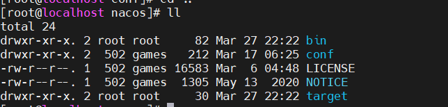
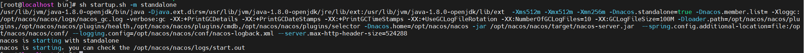
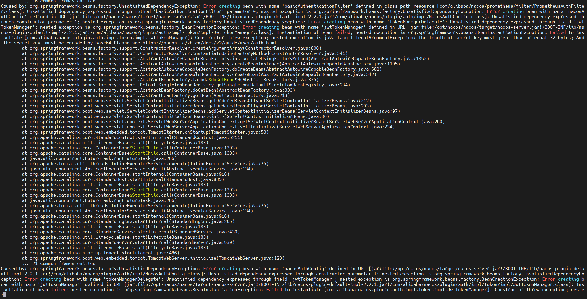
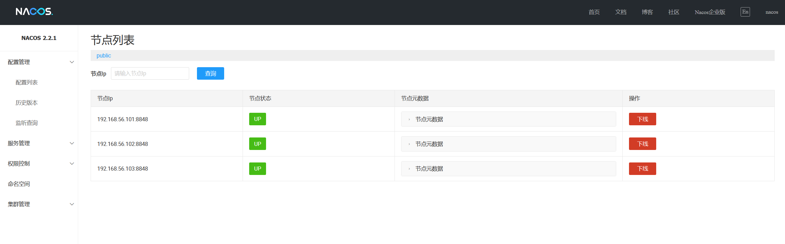

# nacos安装教程

在spring-cloud-alibaba的架构中，nacos充当了配置管理和服务注册与发现的角色，因此要使用框架，就需要做一些基础环境的准备。

## 1. 下载并安装nacos

nacos的源代码放在github上的，对应的下载地址为：[nacos下载地址](https://github.com/alibaba/nacos). nacos为我们提供了linux环境和windows环境的包，根据需求下载对应的包即可。我这里主要使用的是linux环境。

### 1.1 安装包准备

我们将下载的安装包上传到服务器，并解压。

```shell
# 解压安装包
tar -xvzf nacos-server-2.2.1.tar.gz

```

安装包解压之后，我们就可以看到nacos的目录结构：



安装目录简单介绍：

- bin: 主要是可执行的脚本

- conf: 配置文件目录，包括了properties运行配置文件，以及数据库脚本等

### 1.2 环境准备

nacos是依赖于java运行的，因此环境如下：

- 64位的操作系统

- 64位的JDK或者openJDK, 并且需要再1.8+以上

## 2. 启动nacos

### 2.1 单机启动

#### 2.1.1 默认配置启动

默认配置启动是在不更改任何条件下其启动的，使用如下命令:

```shell
cd bin
sh startup.sh -m standalone
```

在启动后，会有如下日志输出，



在默认启动中，查看启动日志会发现报错



这个错误提示是因为认证模块的secrete.key的长度为空导致的，我们修改application.properties文件配置如下：

```properties
### The default token (Base64 String):
nacos.core.auth.plugin.nacos.token.secret.key=VGhpc0lzTXlDdXN0b21TZWNyZXRLZXkwMTIzNDU2Nzg=

```

重新启动nacos, 发现启动nacos成功，以上问题得到解决.

> 1. 在2.2.0.1版本后，社区发布版本将移除以文档如下值作为默认值，需要自行填充，否则无法启动节点。

官方网站对这一异常做了描述，因此在使用的时候需要特别注意。

#### 2.1.2 开启nacos鉴权

因为nacos提供的只是一个弱鉴权的实现，因此为了防止配置的暴露，因此需要：

- 开启nacos鉴权机制

- 将nacos部署在内部，并不能够通过互联网进行访问

```shell
vi conf/application.properties

nacos.core.auth.caching.enabled=true
nacos.core.auth.server.identity.key=VGhpc0lzTXlDdXN0b21TZWNyZXRLZXkwMTIzNDU2Nzg=
nacos.core.auth.server.identity.value=VGhpc0lzTXlDdXN0b21TZWNyZXRLZXkwMTIzNDU2Nzg=

```

重启nacos

```shell
sh bin/startup.sh -m standalone
```

#### 2.1.3 配置mysql

nacos中目前支持的数据源有限，一下为mysql的数据源配置：

```properties
### If use MySQL as datasource:
spring.datasource.platform=mysql

### Count of DB:
db.num=1

### Connect URL of DB:
db.url.0=jdbc:mysql://${url}:${port}/yecai_config?characterEncoding=utf8&connectTimeout=1000&socketTimeout=3000&autoReconnect=true&useUnicode=true&useSSL=false&serverTimezone=UTC
db.user.0=${username}
db.password.0=${password}
```

在启动使用之前，需要我们将对应的初始化sql在数据库中执行，然后重启nacos

当nacos启动完成自后，我们可以通过http://localhost:8848/nacos访问控制台，默认用户密码为`nacos/nacos`

### 2.2 集群启动

集群启动方式部分配置和单机启动的配置很相似，唯一的不同就在与会多一个cluster.conf的文件，一般集群的部署会推荐至少3个或者3个以上的节点，因此我们需要再至少3个节点上运行nacos服务，单实例配置请参考以上的步骤。

#### 2.2.1 环境准备

我有三台虚拟机，虚拟机信息如下：

- 192.168.56.101:8848

- 192.168.56.102:8848

- 192.168.56.103:8848

#### 2.2.2 创建cluster.conf

创建cluster.conf文件，并在文件中填写所有节点的ip和端口信息，如下：

```properties
192.168.56.101:8848  
192.168.56.102:8848
192.168.56.103:8848
```

#### 2.2.3 启动nacos

启动集群的nacos有两种方式，

```shell
# 如果使用的内嵌的数据源
sh bin/startup.sh -p embedded

#如果使用的是外部的数据源
sh bin/startup.sh
```



则最终的展示情况如上图所示，则集群配置成功。


