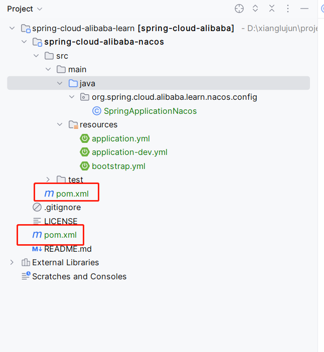
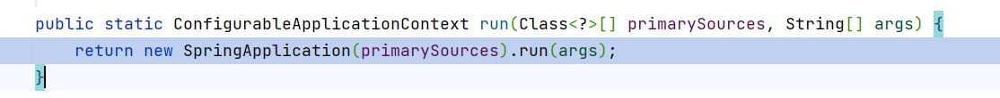
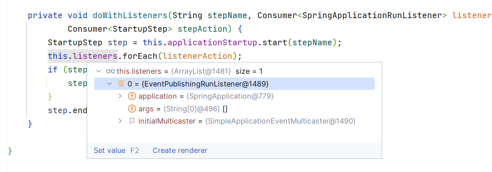
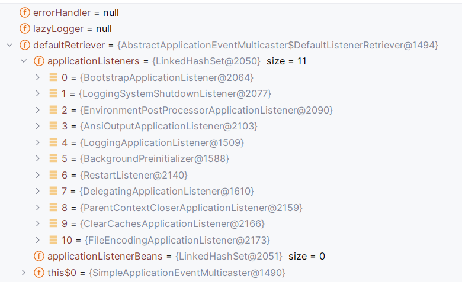
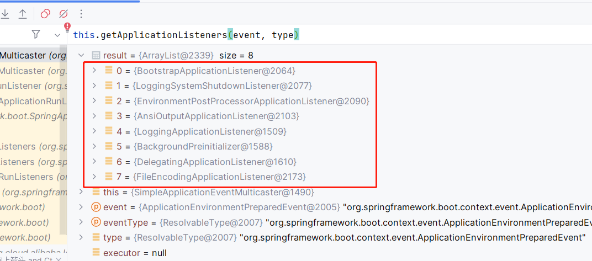
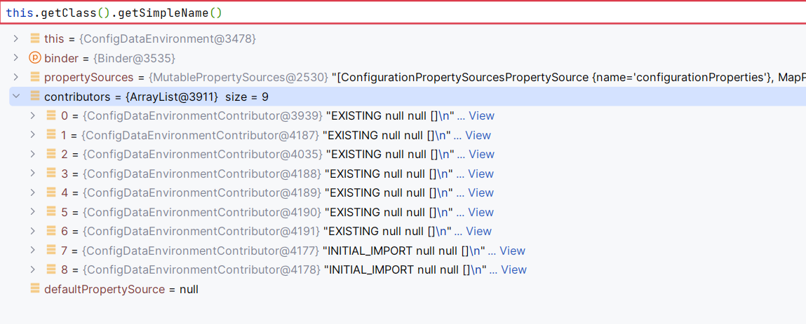

# spring boot 环境配置加载原理

spring boot的出现，大大减少了配置文件的数量，我们可以通过代码的方式完成spring的所有配置，在spring boot启动过程中，重要的就是环境变量数据的加载，这些环境变量会成为后面容器启动的关键配置信息，因此主要看下环境配置加载的原理。

## 1. 使用实例

在开始了解配置加载以前，首先以demo的方式实验配置的使用，以及可能存在配置文件之间的配置覆盖。

### 1.1 maven项目搭建

maven的项目结构，还是按照parent-child的方式创建，parent负责jar包的版本管理，这样可以实现版本的统一管理。

#### parent pom.xml

```xml
<project xmlns="http://maven.apache.org/POM/4.0.0" xmlns:xsi="http://www.w3.org/2001/XMLSchema-instance"
         xsi:schemaLocation="http://maven.apache.org/POM/4.0.0 http://maven.apache.org/xsd/maven-4.0.0.xsd">
  <modelVersion>4.0.0</modelVersion>

  <groupId>org.spring.cloud.alibaba.learn</groupId>
  <artifactId>spring-cloud-alibaba</artifactId>
  <version>1.0-SNAPSHOT</version>
  <packaging>pom</packaging>

  <name>spring-cloud-alibaba</name>
  <url>http://maven.apache.org</url>


  <modules>
    <module>spring-cloud-alibaba-nacos</module>
  </modules>

  <properties>
    <project.build.sourceEncoding>UTF-8</project.build.sourceEncoding>
  </properties>

  <dependencyManagement>
    <dependencies>
      <dependency>
        <groupId>com.alibaba.cloud</groupId>
        <artifactId>spring-cloud-alibaba-dependencies</artifactId>
        <version>2021.0.5.0</version>
        <type>pom</type>
        <scope>import</scope>
      </dependency>
      <dependency>
        <groupId>org.springframework.cloud</groupId>
        <artifactId>spring-cloud-dependencies</artifactId>
        <version>2021.0.5</version>
        <type>pom</type>
        <scope>import</scope>
      </dependency>
      <dependency>
        <groupId>org.springframework.boot</groupId>
        <artifactId>spring-boot-dependencies</artifactId>
        <version>2.6.13</version>
        <type>pom</type>
        <scope>import</scope>
      </dependency>
    </dependencies>
  </dependencyManagement>
</project>
```

#### child pom.xml

```xml
<project xmlns="http://maven.apache.org/POM/4.0.0" xmlns:xsi="http://www.w3.org/2001/XMLSchema-instance"
         xsi:schemaLocation="http://maven.apache.org/POM/4.0.0 http://maven.apache.org/xsd/maven-4.0.0.xsd">
  <modelVersion>4.0.0</modelVersion>

  <parent>
    <groupId>org.spring.cloud.alibaba.learn</groupId>
    <artifactId>spring-cloud-alibaba</artifactId>
    <version>1.0-SNAPSHOT</version>
    <relativePath>../pom.xml</relativePath>
  </parent>

  <groupId>org.example</groupId>
  <artifactId>spring-cloud-alibaba-nacos</artifactId>
  <version>1.0-SNAPSHOT</version>
  <packaging>jar</packaging>

  <name>spring-cloud-alibaba-nacos</name>
  <url>http://maven.apache.org</url>

  <properties>
    <project.build.sourceEncoding>UTF-8</project.build.sourceEncoding>
  </properties>

  <dependencies>
    <dependency>
      <groupId>junit</groupId>
      <artifactId>junit</artifactId>
      <version>4.13.2</version>
      <scope>test</scope>
    </dependency>

    <dependency>
      <groupId>org.springframework.cloud</groupId>
      <artifactId>spring-cloud-starter-bootstrap</artifactId>
    </dependency>
    <dependency>
      <groupId>org.springframework.boot</groupId>
      <artifactId>spring-boot-starter</artifactId>
    </dependency>
    <dependency>
      <groupId>org.springframework.boot</groupId>
      <artifactId>spring-boot-autoconfigure</artifactId>
    </dependency>
  </dependencies>
</project>
```

则整体的项目结构如下：



### 1.2 创建配置文件

我们只是单纯的查看配置文件的加载原理，因此不需要太多的配置信息。从上图可以知道，主要包含了三个配置文件：

- bootstrap.yml

- application.yml

- application-dev.yml

这三个文件存在加载顺序的先后关系，按照加载顺序排列。

> bootstrap.yml文件的加载，在spring-boot中是不会加载的，该配置文件是在spring-cloud-bootstrap中引入并加载。

bootstrap.yml的配置如下:

```yml
config:
  name: bootstrap
  bootstrap: app-boot
spring:
  application:
    name: spring-cloud-alibaba-nacos
```

application.yml

```yml
config:
  name: application
  app: application
spring:
  profiles:
    active: dev
```

application-dev.yml

```yml
config:
  name: spplication-dev
```

### 1.3 程序实现

```java
@SpringBootApplication
public class SpringApplicationNacos {
    public static void main(String[] args) {
        ConfigurableApplicationContext applicationContext = SpringApplication.run(SpringApplicationNacos.class, args);
        System.out.println(applicationContext);
        ConfigurableEnvironment environment = applicationContext.getEnvironment();
        System.out.println(environment.getProperty("config.name"));
        System.out.println(environment.getProperty("config.app"));
        System.out.println(environment.getProperty("config.bootstrap"));
    }
}
```

从代码的实现中可以看出，程序还是很简单的，就是创建ApplicationContext并从Environment中获取对应的变量信息。

执行以上代码，可以得到以下输出结果信息：

```textile
spplication-dev
application
app-boot
```

可以看出，相同的配置文件信息，application-dev.yml具有更高的优先级，因此我们以上面这段代码为例，跟踪环境信息加载源码。

## 2. 环境配置加载

### 2.1 SpringApplication

spring boot的启动都是以SpringApplication为入口，通过run()方法发起容器的启动。在SpringApplication类中，主要通过new的方式创建SpringApplication对象，并执行目标run()方法。



最终代码会走到SpringApplication构造器中，构造器中包含了包含了初始化的一些代码逻辑，如下：

```java
    public SpringApplication(ResourceLoader resourceLoader, Class<?>... primarySources) {
        // 资源加载器
        this.resourceLoader = resourceLoader;
        // 参数必要验证，启动类不能为空
        Assert.notNull(primarySources, "PrimarySources must not be null");
        this.primarySources = new LinkedHashSet<>(Arrays.asList(primarySources));
        // 确定应用类型，主要通过加载特定的class对象判定是否成功，如果成功则为指定类型。
        // 在web中主要包含了Servlet和WebFlux响应式的两种，如果没有引入web包，则为null
        this.webApplicationType = WebApplicationType.deduceFromClasspath();
        // 获取BootstrapRegistryInitializer对象，这里主要通过Spring SPI的方式加载对应的类型
        // 程序会加载所有jar包中的spring.factories的文件中的配置，并缓存
        this.bootstrapRegistryInitializers = new ArrayList<>(
                getSpringFactoriesInstances(BootstrapRegistryInitializer.class));
        // 获取并初始化ApplicationContextInitializer实例
        setInitializers((Collection) getSpringFactoriesInstances(ApplicationContextInitializer.class));
        // 获取并初始化ApplicationListener实例
        setListeners((Collection) getSpringFactoriesInstances(ApplicationListener.class));
        this.mainApplicationClass = deduceMainApplicationClass();
    }
```

#### run()

```java
public ConfigurableApplicationContext run(String... args) {
    long startTime = System.nanoTime();
    // 创建启动上下文
    DefaultBootstrapContext bootstrapContext = createBootstrapContext();
    ConfigurableApplicationContext context = null;
    // 设置系统信息
    configureHeadlessProperty();
    // 获取SpringApplicationRunLister对象，通过SPI从spring.factories中加载
    SpringApplicationRunListeners listeners = getRunListeners(args);
    // 执行starting方法, 通过SpringApplicationRunListeners发送ApplicationStartingEvent事件
    listeners.starting(bootstrapContext, this.mainApplicationClass);
    try {
        // 创建命令行参数对象
        ApplicationArguments applicationArguments = new DefaultApplicationArguments(args);
        // 准备Environment对象
        ConfigurableEnvironment environment = prepareEnvironment(listeners, bootstrapContext, applicationArguments);
        configureIgnoreBeanInfo(environment);
        ....
    }
    ...
    return context;
}
```

在执行环境变量操作之前，主要执行了几个重要的步骤：

- 创建`DefaultBootstrapContext`对象，这个对象主要是上下文，用于存放在执行过程中的一些重要的结果

- 获取`SpringApplicationRunListener`对象，这个对象是对容器开始执行的监听，然后在执行前通过`ApplicationStartingEvent`事件触发。这个对象的扩展，主要通过Spring的SPI机制来完成。

#### prepareEnvironment()

```java
private ConfigurableEnvironment prepareEnvironment(SpringApplicationRunListeners listeners,
            DefaultBootstrapContext bootstrapContext, ApplicationArguments applicationArguments) {
        // 创建或获取Environment对象
        // 该方法会根据webApplicationType创建不同的Environment对象
        // 如果environment对象已经存在，则直接返回
        ConfigurableEnvironment environment = getOrCreateEnvironment();
        // 配置Environment, 
        // 主要包括设置ConversionService对象
        // 合并默认的配置信息以及命令行的配置信息，并将source名称定义为commandLineArgs
        configureEnvironment(environment, applicationArguments.getSourceArgs());
        // 关联Environment对象，
        // 该方法主要判断在环境变量中是否已经包含了configurationProperties的resource信息
        // 如果已经包含，则将该resource方法resources列表的头部，如果不存在，则创建SpringConfigurationPropertySources
        ConfigurationPropertySources.attach(environment);
        // 发送ApplicationEnvironmentPreparedEvent事件，并由监听器执行处理该事件
        // 这里的事件处理机制也是加载各种配置文件的入口地方
        listeners.environmentPrepared(bootstrapContext, environment);
        // 将defaultProperties的配置信息移动到resources末尾，相当于降低优先级
        DefaultPropertiesPropertySource.moveToEnd(environment);
        Assert.state(!environment.containsProperty("spring.main.environment-prefix"),
                "Environment prefix cannot be set via properties.");
        // 将environment和SpringApplication进行绑定
        bindToSpringApplication(environment);

        // 如果是自定义的环境变量，则需要将environment对象转换为StandardEnvironment对象
        if (!this.isCustomEnvironment) {
            environment = convertEnvironment(environment);
        }
        // 将configurationProperties配置放到resources头部
        ConfigurationPropertySources.attach(environment);
        // 返回环境变量对象
        return environment;
    }
```

- configureEnvironment()：该方法主要合并了默认配置信息和命令行的配置信息

- ConfigurationPropertySources.attach()：该方主要是配置configurationProperties的配置员source，并将该配置放在首位，这样具有高优先权

- environmentPrepared()：该方法则是真正加载配置文件的地方，作为重点的对象

### 2.2 SpringApplicationRunListener

该类主要用于执行在Environment对象的对象操作，该类的实现类是通过spring的SPI的机制加载到内存中，即:`spring.factories`文件进行配置，具体配置信息如下：

```properties
# Run Listeners
org.springframework.boot.SpringApplicationRunListener=\
org.springframework.boot.context.event.EventPublishingRunListener
```

> 这里也是作为spring的SPI机制的扩展重点，因为这些扩展点我们也可以通过这种方式加载自己的配置文件源，然后做自定义的实现。

> 另外还有一点很有意思的是，spring并不是直接遍历SpringApplicationRunListener列表，而是通过一个对象SpringApplicationRunListeners来间接的遍历，并提供了Iterator的能力，这种方式可以避免集合的遍历代码分散，实现功能的内敛

在以上的实例中，该对象之引入了一个实例，



也就是`EventPublishingRunListener`对象，该对象也就是处理加载配置文件的入口。

### 2.3 EventPublishingRunListener

我们查看该类的实现接口`SpringApplicationRunListener`, 可以看出，该类就是定义了容器启动中每个阶段不同处理，我们可以根据自己需求，实现每个阶段中的一部分进行扩展。

#### 构造器

```java
    public EventPublishingRunListener(SpringApplication application, String[] args) {
        // 当前正在启动的SpringApplication对象
        this.application = application;
        // 命令行参数
        this.args = args;
        // 事件分发器初始化
        this.initialMulticaster = new SimpleApplicationEventMulticaster();
        // 这里我们知道，在初始化SpringApplication的时候，是从spring.factories中
        // 加载了配置的ApplicationListener实现实例，因此从application中获取并和
        // 事件分发器进行绑定
        for (ApplicationListener<?> listener : application.getListeners()) {
            this.initialMulticaster.addApplicationListener(listener);
        }
    }
```

#### environmentPrepared()

该方法就是用来处理环境environment准备的入口，具体代码如下：

```java
    public void environmentPrepared(ConfigurableBootstrapContext bootstrapContext,
            ConfigurableEnvironment environment) {
        this.initialMulticaster.multicastEvent(
                new ApplicationEnvironmentPreparedEvent(bootstrapContext, this.application, this.args, environment));
    }
```

这个方法就很简单了，主要分为两步：

- 创建ApplicationEnvironmentPreparedEvent事件对象

- 分发该事件到ApplicationListener示例并进行处理。

### 2.4 SimpleApplicationEventMulticaster

在执行事件分发的时候，对应的ApplicationListener实际上已经实例化完成，可以通过堆栈查看对应的列表：



在默认的配置下，有11个ApplicationListener被加载，对于事件的分发，并不是所有的Listener都可以执行，因此在具体的分发的时候，需要过滤掉不能处理的listener.

#### multicaseEvent()

该方法则是具体执行事件分发的地方，具体代码如下：

```java
public void multicastEvent(final ApplicationEvent event, @Nullable ResolvableType eventType) {
    // 解析泛型，主要获取event的实际类型
    ResolvableType type = (eventType != null ? eventType : resolveDefaultEventType(event));
    // 获取线程池对象，如果没有开启异步事件分发，则为null
    Executor executor = getTaskExecutor();
    // getApplicationListeners()方法主要根据event的实际类型判断，
    // listener是否能够处理当前event, 如果能，则返回; 否则过滤掉
    for (ApplicationListener<?> listener : getApplicationListeners(event, type)) {
        // 如果线程池对象不为空，则异步执行事件分发
        if (executor != null) {
            executor.execute(() -> invokeListener(listener, event));
        }
        else {
            // 否则同步执行分发
            invokeListener(listener, event);
        }
    }
}
```



通过事件类型过滤后，实际上只有8个listener能够处理当前的事件。具体处理逻辑，可以自行查看对应源码。

#### doInvokeListener()

```java
private void doInvokeListener(ApplicationListener listener, ApplicationEvent event) {
    try {
        listener.onApplicationEvent(event);
    }
    catch (ClassCastException ex) {
        ....
    }
}
```

执行listener就只是调用对应的onApplicaiontEvent()方法。

### 2.5 ApplicationListener

该类就是具体处理以上各种事件的入口，对于配置文件二院，我们不需要关心所有的类，而是只关注配置文件相关的类即可。因此，在一下的源码梳理中，不会列出所有类的实现。

#### 2.5.1 BootstrapApplicationListener

> 该类不是spring-boot引入，而是由spring-cloud引入。因此这里需要区分，当我们只使用spring-boot时，是没有这个类型的。

##### onApplicationEvent()

```java
public void onApplicationEvent(ApplicationEnvironmentPreparedEvent event) {
    // 获取环境对象
    ConfigurableEnvironment environment = event.getEnvironment();

    // bootstrapEnabled: 主要判断是否启用bootstrap, 可以通过判断spring.cloud.bootstrap.enabled=true或org.springframework.cloud.bootstrap.marker.Marker
    // 能够被加载，因此就算不开启配置，只要引入了spring-cloud-bootstrap包，也就默认配置的开启
    // useLegacyProcessing()方法用于判断spring.config.use-legacy-processing是否为true
    if (!bootstrapEnabled(environment) && !useLegacyProcessing(environment)) {
        return;
    }
    // don't listen to events in a bootstrap context
    // 判断是否包含了bootstrap的配置员，主要是为防止循环监听和加载
    if (environment.getPropertySources().contains(BOOTSTRAP_PROPERTY_SOURCE_NAME)) {
        return;
    }

    ConfigurableApplicationContext context = null;
    // 这里是获取spring.cloud.bootstrap.name的值，默认只为bootstrap.
    // 这里需要注意，这个时候，环境配置中只包含了环境变量和系统变量以及命令行参数，因此这个配置如果需要
    // 该表该值，是不可以通过配置文件进行修改，或者定义更高级别的处理方式
    String configName = environment.resolvePlaceholders("${spring.cloud.bootstrap.name:bootstrap}");

    // 这里是容器初始代码，这个代码也是在初始化SpringApplication时通过SPI的方式加载
    // 这段代码主要是获取ApplicationContext容器，如果是具有层级关系的初始化器时，则尝试
    // 从初始化器中获取ApplicationContext容器
    for (ApplicationContextInitializer<?> initializer : event.getSpringApplication().getInitializers()) {
        if (initializer instanceof ParentContextApplicationContextInitializer) {
            context = findBootstrapContext((ParentContextApplicationContextInitializer) initializer, configName);
        }
    }

    // 如果ApplicationContext容器化没有创建，则创建
    if (context == null) {
        context = bootstrapServiceContext(environment, event.getSpringApplication(), configName);
        event.getSpringApplication().addListeners(new CloseContextOnFailureApplicationListener(context));
    }

    apply(context, event.getSpringApplication(), environment);
}
```

在该方法中主要有以下步骤：

- 环境配置中是否已经加入了bootstrap源，如果包含了，则不再重复加载

- 是否已经创建ApplicationContext上下文，如果没有包含，则创建ApplicaontContext上下文，并重新执行SpringApplication.run()方法

> 这里bootstrap创建的上下文信息，以及在环境变量中的内容，最终是不会合并到当前正在执行的application之上，而是以parent的方式存在

##### bootstrapServiceContext()

```java
private ConfigurableApplicationContext bootstrapServiceContext(ConfigurableEnvironment environment,
            final SpringApplication application, String configName) {
        ConfigurableEnvironment bootstrapEnvironment = new AbstractEnvironment() {
        };

        // 获取配置源列表
        MutablePropertySources bootstrapProperties = bootstrapEnvironment.getPropertySources();
        // 获取bootstrap配置文件列表
        String configLocation = environment.resolvePlaceholders("${spring.cloud.bootstrap.location:}");
        // 获取bootstrap额外配置信息
        String configAdditionalLocation = environment
                .resolvePlaceholders("${spring.cloud.bootstrap.additional-location:}");

        // 创建bootstrap配置映射
        Map<String, Object> bootstrapMap = new HashMap<>();
        // 设置spring.config.name配置为bootstrap
        bootstrapMap.put("spring.config.name", configName);
        bootstrapMap.put("spring.main.web-application-type", "none");
        if (StringUtils.hasText(configLocation)) {
            bootstrapMap.put("spring.config.location", configLocation);
        }
        if (StringUtils.hasText(configAdditionalLocation)) {
            bootstrapMap.put("spring.config.additional-location", configAdditionalLocation);
        }
        // 加入bootstrap配置信息
        bootstrapProperties.addFirst(new MapPropertySource(BOOTSTRAP_PROPERTY_SOURCE_NAME, bootstrapMap));
        // 从已有environment中读取源数据并加入到新的environment中
        for (PropertySource<?> source : environment.getPropertySources()) {
            if (source instanceof StubPropertySource) {
                continue;
            }
            bootstrapProperties.addLast(source);
        }

        // 构建SpringApplicaionBuilder对象
        SpringApplicationBuilder builder = new SpringApplicationBuilder().profiles(environment.getActiveProfiles())
                .bannerMode(Mode.OFF).environment(bootstrapEnvironment)
                .registerShutdownHook(false).logStartupInfo(false).web(WebApplicationType.NONE);
        final SpringApplication builderApplication = builder.application();

        // 如果启动class为空，则使用当前application的主class
        if (builderApplication.getMainApplicationClass() == null) {
            builder.main(application.getMainApplicationClass());
        }

        // 如果包含refreshArgs配置源，则过滤listener
        if (environment.getPropertySources().contains("refreshArgs")) {
            builderApplication.setListeners(filterListeners(builderApplication.getListeners()));
        }

        // configuration源设置
        builder.sources(BootstrapImportSelectorConfiguration.class);
        // 执行run方法，跟SpringApplication.run()方法类似，只是很多参数设置为固定值
        // 这个时候实际上创建了一个新的ApplicationContext对象
        final ConfigurableApplicationContext context = builder.run();
        // 设置当前ApplicationContext的id为bootstrap
        context.setId("bootstrap");
        // 为AncestorInitializer对象设置parent的容器信息
        addAncestorInitializer(application, context);
        // 从配置源中移除bootstrap配置信息
        bootstrapProperties.remove(BOOTSTRAP_PROPERTY_SOURCE_NAME);
        // 合并配置
        mergeDefaultProperties(environment.getPropertySources(), bootstrapProperties);
        return context;
    }
```

#### 2.5.2 EnvironmentPostProcessorApplicationListener

该监听器主要用于处理EnvironmentPostProcessor的实现，具体加载代码如下：

```java
    static EnvironmentPostProcessorsFactory fromSpringFactories(ClassLoader classLoader) {
        return new ReflectionEnvironmentPostProcessorsFactory(classLoader,
                SpringFactoriesLoader.loadFactoryNames(EnvironmentPostProcessor.class, classLoader));
    }
```

可以看出，EnvironmentPostProcessor的执行通过SPI机制进行加载，具体在spring.factories的定义如下：

```properties
# Environment Post Processors
org.springframework.boot.env.EnvironmentPostProcessor=\
org.springframework.boot.cloud.CloudFoundryVcapEnvironmentPostProcessor,\
org.springframework.boot.context.config.ConfigDataEnvironmentPostProcessor,\
org.springframework.boot.env.RandomValuePropertySourceEnvironmentPostProcessor,\
org.springframework.boot.env.SpringApplicationJsonEnvironmentPostProcessor,\
org.springframework.boot.env.SystemEnvironmentPropertySourceEnvironmentPostProcessor,\
org.springframework.boot.reactor.DebugAgentEnvironmentPostProcessor
```

> 这里的定义只是取了其中很小的一部分，并不是全部内容，只是为了说明配置方式。

##### onApplicationEvent()

事件的执行入口方法，该方法很简单，

```java
public void onApplicationEvent(ApplicationEvent event) {
    if (event instanceof ApplicationEnvironmentPreparedEvent) {
        onApplicationEnvironmentPreparedEvent((ApplicationEnvironmentPreparedEvent) event);
    }
    if (event instanceof ApplicationPreparedEvent) {
        onApplicationPreparedEvent();
    }
    if (event instanceof ApplicationFailedEvent) {
        onApplicationFailedEvent();
    }
}
```

该类能够处理多种事件类型，在该阶段主要关心`ApplicationEnvironmentPreparedEvent`即可

##### onApplicationEnvironmentPreparedEvent()

```java
private void onApplicationEnvironmentPreparedEvent(ApplicationEnvironmentPreparedEvent event) {
    // 获取环境变量对象
    ConfigurableEnvironment environment = event.getEnvironment();
    // 获取SpringApplication对象
    SpringApplication application = event.getSpringApplication();
    // 获取EnvironmentPostProcessor列表
    for (EnvironmentPostProcessor postProcessor : getEnvironmentPostProcessors(application.getResourceLoader(),
            event.getBootstrapContext())) {
        // 遍历并同步调用方法
        postProcessor.postProcessEnvironment(environment, application);
    }
}
```

该方法主要包含了两个重要的点：

- 从`spring.factories`中获取`EnvironmentPostProcessor`对象列表，主要通过SPI机制继续加载

- 调用`EnvironmentPostProcessor.postProcessEnvironment()`方法

### 2.6 EnvironmentPostProcessor

该类是对Environment对象的后置处理器，该接口定义也很简单：

```java
public interface EnvironmentPostProcessor {
    void postProcessEnvironment(ConfigurableEnvironment environment, SpringApplication application);
}
```

在以上配置中，可以查看从spring.factories中加了处理器列表：

#### 2.6.1 ConfigDataEnvironmentPostProcessor

配置文件数据处理器，在该处理器中会主要处理配置文件相关的加载.

```java
void postProcessEnvironment(ConfigurableEnvironment environment, ResourceLoader resourceLoader,
            Collection<String> additionalProfiles) {
        try {
            this.logger.trace("Post-processing environment to add config data");
            // 获取ResourceLoader对象
            resourceLoader = (resourceLoader != null) ? resourceLoader : new DefaultResourceLoader();
            // 获取ConfigDataEnvironment对象，并调用processAndApply()方法
            getConfigDataEnvironment(environment, resourceLoader, additionalProfiles).processAndApply();
        }
        catch (UseLegacyConfigProcessingException ex) {
            ...
        }
    }

    ConfigDataEnvironment getConfigDataEnvironment(ConfigurableEnvironment environment, ResourceLoader resourceLoader,
            Collection<String> additionalProfiles) {
        // 创建爱你ConfigDataEnvironment对象
        return new ConfigDataEnvironment(this.logFactory, this.bootstrapContext, environment, resourceLoader,
                additionalProfiles, this.environmentUpdateListener);
    }
```

对于环境配置处理，最终委派到了`ConfigDataEnvironment`对象中，因此我们需要主要查看该对象内部的处理逻辑。

### 2.7 ConfigDataEnvironment

该类需要关注类型初始化的逻辑，其中包含了多的潜在的逻辑，对后续阅读会有很大的帮助。

#### 类初始化

类初始化主要是为了初始化静态变量相关数据，在该类中，静态初始化主要定义了扫描的配置文件路径信息。

```java
    static final ConfigDataLocation[] DEFAULT_SEARCH_LOCATIONS;
    static {
        List<ConfigDataLocation> locations = new ArrayList<>();
        locations.add(ConfigDataLocation.of("optional:classpath:/;optional:classpath:/config/"));
        locations.add(ConfigDataLocation.of("optional:file:./;optional:file:./config/;optional:file:./config/*/"));
        DEFAULT_SEARCH_LOCATIONS = locations.toArray(new ConfigDataLocation[0]);
    }
```

这里的配置文件的路径包含了两种：

- 在`classpath`下寻找配置文件
  
  - `/`
  
  - `/config/`

- 在当前路径下寻找
  
  - `./`
  
  - `./config/`
  
  - `./config/*/`

> 相比之下，在当前路径下寻找多了一个正则匹配的项，因此扫描的路径更广

#### 构造器

```java
ConfigDataEnvironment(DeferredLogFactory logFactory, ConfigurableBootstrapContext bootstrapContext,
            ConfigurableEnvironment environment, ResourceLoader resourceLoader, Collection<String> additionalProfiles,
            ConfigDataEnvironmentUpdateListener environmentUpdateListener) {
        // 创建数据绑定器
        Binder binder = Binder.get(environment);
        // 判断是否包含了spring.config.use-legacy-processing的配置, 
        UseLegacyConfigProcessingException.throwIfRequested(binder);
        // 创建日志工厂对象
        this.logFactory = logFactory;
        // 获取日志打印对象
        this.logger = logFactory.getLog(getClass());
        // spring.config.on-not-found配置绑定, 如果没有配置，则使用FAIL对象
        this.notFoundAction = binder.bind(ON_NOT_FOUND_PROPERTY, ConfigDataNotFoundAction.class)
                .orElse(ConfigDataNotFoundAction.FAIL);
        // 启动上下文
        this.bootstrapContext = bootstrapContext;
        // 环境变量
        this.environment = environment;
        // ConfigDataLocationResolver获取并创建
        // 从spring.factories中加载ConfigDataLocationResolver并实例化
        this.resolvers = createConfigDataLocationResolvers(logFactory, bootstrapContext, binder, resourceLoader);
        this.additionalProfiles = additionalProfiles;
        this.environmentUpdateListener = (environmentUpdateListener != null) ? environmentUpdateListener
                : ConfigDataEnvironmentUpdateListener.NONE;
        // ConfigDataLoaders对象, 用于加载配置文件
        this.loaders = new ConfigDataLoaders(logFactory, bootstrapContext, resourceLoader.getClassLoader());
        // 创建ConfigDataEnvironmentContributors对象
        this.contributors = createContributors(binder);
    }
```

该类的初始化是比较复杂的，包含了多的功能都在初始化的时候完成。因此按照从上到下的顺序一次查看对应的源码。

#### createConfigDataLocationResolvers()

```java
    protected ConfigDataLocationResolvers createConfigDataLocationResolvers(DeferredLogFactory logFactory,
            ConfigurableBootstrapContext bootstrapContext, Binder binder, ResourceLoader resourceLoader) {
        return new ConfigDataLocationResolvers(logFactory, bootstrapContext, binder, resourceLoader);
    }
```

该类方法主要就是为了创建`ConfigDataLocationResolvers`对象，该对象主要持有`ConfigDataLocationResolver`列表，以便后期使用。

#### ConfigDataLocationResolvers

```java
ConfigDataLocationResolvers(DeferredLogFactory logFactory, ConfigurableBootstrapContext bootstrapContext,
            Binder binder, ResourceLoader resourceLoader) {
        // 在这一步中，最主要的就是加载ConfigDataLocationResolver的实例，这个实例加载出来的主要是名称的列表
        this(logFactory, bootstrapContext, binder, resourceLoader, SpringFactoriesLoader
                .loadFactoryNames(ConfigDataLocationResolver.class, resourceLoader.getClassLoader()));
    }
    ConfigDataLocationResolvers(DeferredLogFactory logFactory, ConfigurableBootstrapContext bootstrapContext,
            Binder binder, ResourceLoader resourceLoader, List<String> names) {
        // 这一步主要是创建实例化对象，标记了需要实例化的类为ConfigDataLocationResolver, 并且向可用参数中放入了可能得一下参数列表
        // 当在实例化Instantiator的时候，就可以利用对应的参数信息
        Instantiator<ConfigDataLocationResolver<?>> instantiator = new Instantiator<>(ConfigDataLocationResolver.class,
                (availableParameters) -> {
                    availableParameters.add(Log.class, logFactory::getLog);
                    availableParameters.add(DeferredLogFactory.class, logFactory);
                    availableParameters.add(Binder.class, binder);
                    availableParameters.add(ResourceLoader.class, resourceLoader);
                    availableParameters.add(ConfigurableBootstrapContext.class, bootstrapContext);
                    availableParameters.add(BootstrapContext.class, bootstrapContext);
                    availableParameters.add(BootstrapRegistry.class, bootstrapContext);
                });
        // 这里对ConfigDataLocationResolver进行实例化，并且对实例化的列表进行重排序
        this.resolvers = reorder(instantiator.instantiate(resourceLoader.getClassLoader(), names));
    }
```

对于Instantiator的初始化逻辑而言，主要是根据构造器的参数类型，获取对应的绑定对应，这样就可以实现对象的初始化操作。这部分代码就不做分析，感兴趣可以查看对应的源码部分。通过该方法我们就拿到了`ConfigDataLocationResolver`对象的列表。

#### ConfigDataLoaders

该类的初始化，主要是对配置文件加载的实现具体逻辑，这里主要看下在该类初始化的时候，做了那些主要的事情。

```java
ConfigDataLoaders(DeferredLogFactory logFactory, ConfigurableBootstrapContext bootstrapContext,
ClassLoader classLoader) {
    // 通过SPI的方式加载ConfigDataLoader对象
    this(logFactory, bootstrapContext, classLoader,
        SpringFactoriesLoader.loadFactoryNames(ConfigDataLoader.class, classLoader));
}

ConfigDataLoaders(DeferredLogFactory logFactory, ConfigurableBootstrapContext bootstrapContext,
ClassLoader classLoader, List<String> names) {
    this.logger = logFactory.getLog(getClass());
    Instantiator<ConfigDataLoader<?>> instantiator = new Instantiator<>(ConfigDataLoader.class,
        (availableParameters) -> {
            availableParameters.add(Log.class, logFactory::getLog);
            availableParameters.add(DeferredLogFactory.class, logFactory);
            availableParameters.add(ConfigurableBootstrapContext.class, bootstrapContext);
            availableParameters.add(BootstrapContext.class, bootstrapContext);
            availableParameters.add(BootstrapRegistry.class, bootstrapContext);
        });
    // 初始化ConfigDataLoader对象
    this.loaders = instantiator.instantiate(classLoader, names);
    // 因为ConfigDataLoader定义为泛型，因此这里通过反射的方式获取泛型的具体类型
    // 因此这里记录了加载资源类型的列表
    this.resourceTypes = getResourceTypes(this.loaders);
}
```

> 从这里就可以看到，其实对于类型初始化方式都很像，都是通过Instantiator类型来完成的，然后定义可能得参数列表

#### createContributors()

该方法主要用于创建`ConfigDataEnvironmentContributors`对象，该对象持有了ConfigDataEnvironmentContributor对象的列表，具体源码如下：

```java
private ConfigDataEnvironmentContributors createContributors(Binder binder) {
    //记录日志
    this.logger.trace("Building config data environment contributors");
    // 获取当前环境中的配置源列表
    MutablePropertySources propertySources = this.environment.getPropertySources();
    List<ConfigDataEnvironmentContributor> contributors = new ArrayList<>(propertySources.size() + 10);
    PropertySource<?> defaultPropertySource = null;
    // 遍历配置元对象
    for (PropertySource<?> propertySource : propertySources) {
        // 判断是否为默认配置源
        if (DefaultPropertiesPropertySource.hasMatchingName(propertySource)) {
            defaultPropertySource = propertySource;
        }
        else {
            // 记录日志
            this.logger.trace(LogMessage.format("Creating wrapped config data contributor for '%s'",
                    propertySource.getName()));
            // 创建ConfigDataEnvironmentContributor对象，并放入列表
            contributors.add(ConfigDataEnvironmentContributor.ofExisting(propertySource));
        }
    }

    // 这里是获取初始化的导入Contributors, 主要包括了：
    // spring.config.import 配置
    // spring.config.additional-location 配置
    // spring.config.location 配置
    contributors.addAll(getInitialImportContributors(binder));
    if (defaultPropertySource != null) {
        this.logger.trace("Creating wrapped config data contributor for default property source");
        contributors.add(ConfigDataEnvironmentContributor.ofExisting(defaultPropertySource));
    }
    // 创建ConfigDataEnvironmentContributors对象
    return createContributors(contributors);
}
```

因此在代码执行完成后，这里的Contributors主要是根据当前已经加载的Source和需要加载的Source几部分组成，因此Contributors的列表代码大致如下：



Contributor有几部分组成，可以看到`Kind`值有很多种，

- EXISTING：表示了已经加载的配置列表

- INTIAL_IMPORT：表示了初始化导入，但这部分的配置文件导入还没有完成

#### processAndApply()

```java
void processAndApply() {
    // 创建ConfigDataImporter对象
    ConfigDataImporter importer = new ConfigDataImporter(this.logFactory, this.notFoundAction, this.resolvers,
            this.loaders);
    // 注册启动binder对象
    registerBootstrapBinder(this.contributors, null, DENY_INACTIVE_BINDING);
    // 执行初始化, 包括了加载配置文件信息
    ConfigDataEnvironmentContributors contributors = processInitial(this.contributors, importer);
    // 创建ConfigDataActivationContext对象
    ConfigDataActivationContext activationContext = createActivationContext(contributors.getBinder(null, BinderOption.FAIL_ON_BIND_TO_INACTIVE_SOURCE));
    // 执行在没有指定profile的时候配置加载
    contributors = processWithoutProfiles(contributors, importer, activationContext);
    // 主要从现有的配置源中加载spring.profiles.include信息，并将Profile信息存放在ConfigDataActivationContext中
    activationContext = withProfiles(contributors, activationContext);
    // 当设置了Profiles信息的时候，重新加载profile文件信息，例如根据激活的profile信息，则对应加载bootstrap-default.yml等
    contributors = processWithProfiles(contributors, importer, activationContext);
    // 将配置信息应用到environment环境中
    applyToEnvironment(contributors, activationContext, importer.getLoadedLocations(),
            importer.getOptionalLocations());
}
```

该方法处理中，主要包含了三个关键的步骤：

- 根据配置信息加载配置文件

- 从已经加载的配置文件中加载Profile相关信息，然后加载与profile有关的配置文件

- 将加载的配置文件应用到environment以便于使用

### 2.8 ConfigDataEnvironmentContributors

执行数据导入的时候，最终通过该类实现配置文件的导入工作。

#### withProcessedImports()

该方法会执行所有的活跃的`Contributor`对象，并且返回一个新的`ConfigDataEnvironmentContributors`实例对象。

```java
    ConfigDataEnvironmentContributors withProcessedImports(ConfigDataImporter importer,
            ConfigDataActivationContext activationContext) {
        // 获取导入的阶段
        // 当activationContext为空的时候，返回：BEFORE_PROFILE_ACTIVATION
        // 当activetionContext不为空，并且Profiles不为空的时候，则返回：AFTER_PROFILE_ACTIVATION
        ImportPhase importPhase = ImportPhase.get(activationContext);
        this.logger.trace(LogMessage.format("Processing imports for phase %s. %s", importPhase,
                (activationContext != null) ? activationContext : "no activation context"));
        ConfigDataEnvironmentContributors result = this;
        int processed = 0;
        while (true) {
            // 获取下一个需要执行Contributor对象, 判断是否需要执行，需要满足以下几个条件：
            // 1. 当前contributor的kink 等于 UNBOUND_IMPORT
            // 或者
            // 1. contributor持有的配置properties为空
            // 2. contributor对应的properties处于active状态
            ConfigDataEnvironmentContributor contributor = getNextToProcess(result, activationContext, importPhase);

            // 如果contributor为空，则表示所有的contributor已经执行完成
            if (contributor == null) {
                this.logger.trace(LogMessage.format("Processed imports for of %d contributors", processed));
                return result;
            }

            // 判断需要执行的contributor的kind是否为UNBOUND_IMPORT, 如果是，则重新构建ConfigDataEnvironmentContributors并继续遍历Contributor
            // UNBOUND_IMPORT表示了当前的ConfigData数据依赖了其他的Contributor配置
            if (contributor.getKind() == Kind.UNBOUND_IMPORT) {
                // 创建UNBOUND_IMPORT的kind 类型contributor
                ConfigDataEnvironmentContributor bound = contributor.withBoundProperties(result, activationContext);
                result = new ConfigDataEnvironmentContributors(this.logger, this.bootstrapContext,
                        result.getRoot().withReplacement(contributor, bound));
                continue;
            }

            // 创建ConfigDataLocationResolverContext上下文对象
            ConfigDataLocationResolverContext locationResolverContext = new ContributorConfigDataLocationResolverContext(
                    result, contributor, activationContext);
            // 创建ConfigDataLoaderContext上下文对象
            ConfigDataLoaderContext loaderContext = new ContributorDataLoaderContext(this);
            // 获取当前contributor需要加载的配置文件路径列表
            List<ConfigDataLocation> imports = contributor.getImports();
            this.logger.trace(LogMessage.format("Processing imports %s", imports));
            // 根据需要加载的文件路径列表，从路径加载对应文件，并存储在ConfigData中
            Map<ConfigDataResolutionResult, ConfigData> imported = importer.resolveAndLoad(activationContext,
                    locationResolverContext, loaderContext, imports);
            this.logger.trace(LogMessage.of(() -> getImportedMessage(imported.keySet())));

            // 这里主要是创建一个包含当前Contributor的一个ConfigDataEnvironmentContributor对象
            ConfigDataEnvironmentContributor contributorAndChildren = contributor.withChildren(importPhase,
                    asContributors(imported));
            // 这里会生成一个新的ConfigDataEnvironmentContributors对象，新的对象中会将当前的contributor对象的处理结果进行替换
            // 这样做的目的是：当有resource被处理完成后，就不需要重复处理了。
            // 当有的资源依赖于其他的contributor处理结果时，还有可以被继续处理的机会
            result = new ConfigDataEnvironmentContributors(this.logger, this.bootstrapContext,
                    result.getRoot().withReplacement(contributor, contributorAndChildren));
            processed++;
        }
    }
```

### 2.9 ConfigDataImporter

该类主要负责的是对配置文件数据的加载，因此主要关注对应的加载过程和源码。

#### resolveAndLoad()

```java
        Map<ConfigDataResolutionResult, ConfigData> resolveAndLoad(ConfigDataActivationContext activationContext,
            ConfigDataLocationResolverContext locationResolverContext, ConfigDataLoaderContext loaderContext,
            List<ConfigDataLocation> locations) {
        try {
            Profiles profiles = (activationContext != null) ? activationContext.getProfiles() : null;
            // 根据locations定义，封装成为ConfigDataResolutionResult对象，该对象中包含了需要处理的配置文件路径信息。
            // 这里的处理主要通过SPI加载到的ConfigDataLocationResolver实例，并判断ConfigDataLocationResolver是否能够处理路径的文件
            // 这里其实只是做了一个判断，如果不满足的ConfigDataLocationResolver会被过滤掉，最终不会执行
            List<ConfigDataResolutionResult> resolved = resolve(locationResolverContext, profiles, locations);
            // 根据ConfigDataResolutionResult结果，加载对应配置文件
            return load(loaderContext, resolved);
        }
        catch (IOException ex) {
            throw new IllegalStateException("IO error on loading imports from " + locations, ex);
        }
    }
```

#### load()

```java
private Map<ConfigDataResolutionResult, ConfigData> load(ConfigDataLoaderContext loaderContext,
List<ConfigDataResolutionResult> candidates) throws IOException {
    Map<ConfigDataResolutionResult, ConfigData> result = new LinkedHashMap<>();

    // 开始遍历配置文件路径结果
    for (int i = candidates.size() - 1; i >= 0; i--) {
        ConfigDataResolutionResult candidate = candidates.get(i);
        // 获取文件路径
        ConfigDataLocation location = candidate.getLocation();
        // 获取文件资源
        ConfigDataResource resource = candidate.getResource();
        // 资源是否为可选，该值是在创建ConfigDataResource的时候，需要手动设置该值true/false; 默认值为false
        if (resource.isOptional()) {
            this.optionalLocations.add(location);
        }
        // 判断当前的资源时候覅偶已经被加载, 如果资源已经被加载，则放入到loadedLocations列表中
        if (this.loaded.contains(resource)) {
            this.loadedLocations.add(location);
        }
        else {
            try {
                // 代码走到这里，就表示了资源没有被加载, 通过ConfigDataLoader进行配置文件加载
                ConfigData loaded = this.loaders.load(loaderContext, resource);
                // 不为空，则表示资源加载成功, 则进行资源状态的映射和存储
                if (loaded != null) {
                    this.loaded.add(resource);
                    this.loadedLocations.add(location);
                    result.put(candidate, loaded);
                }
            }
            catch (ConfigDataNotFoundException ex) {
                handle(ex, location, resource);
            }
        }
    }
    return Collections.unmodifiableMap(result);
}
```

### 2.10 ConfigDataLoaders

该类则主要用于加载配置文件的具体入口。该类主要功能实际上是提供了遍历的功能，主要持有`ConfigDataLoader`列表，并提供遍历调用和对异常结果的处理。

#### load()

```java
    <R extends ConfigDataResource> ConfigData load(ConfigDataLoaderContext context, R resource) throws IOException {
        // 根据resource类型获取ConfigDataLoader对象, 这里的resource实际上就是泛型中定义的resource类型
        ConfigDataLoader<R> loader = getLoader(context, resource);
        this.logger.trace(LogMessage.of(() -> "Loading " + resource + " using loader " + loader.getClass().getName()));
        // 调用load方法加载配置文件。
        // 配置文件的加载每个Loader的实现各异
        return loader.load(context, resource);
    }
```

`getLoader()`方法主要是根据`Resource`具体的类型来获取对应的`ConfigDataLoader`类，这样就可以直接调用到具体的加载逻辑，因此`getLoader()`的方法可以自行查看。

### 2.11 StandardConfigDataLoader

在通用的配置文件加载逻辑中，只关注该类就可以了。因为该类实际上就是那些常用配置文件加载的地方。因此就查看该类的源码即可。

#### load()

```java
public ConfigData load(ConfigDataLoaderContext context, StandardConfigDataResource resource)
throws IOException, ConfigDataNotFoundException {
    // 如果资源目标是一个文件夹，则返回空配置数据
    if (resource.isEmptyDirectory()) {
        return ConfigData.EMPTY;
    }

    // 如果配置文件不存在，则抛出异常
    ConfigDataResourceNotFoundException.throwIfDoesNotExist(resource, resource.getResource());
    // 获取资源文件的引用
    StandardConfigDataReference reference = resource.getReference();
    // 获取资源文件源对象
    Resource originTrackedResource = OriginTrackedResource.of(resource.getResource(),
        Origin.from(reference.getConfigDataLocation()));
    String name = String.format("Config resource '%s' via location '%s'", resource,
        reference.getConfigDataLocation());
    // 加载资源对象，这里资源的对象会根据后缀的不同，使用不同的对象进行加载。
    List<PropertySource<?>> propertySources = reference.getPropertySourceLoader().load(name, originTrackedResource);
    // 判断资源是否制定了profile, 如果制定，则包装成为PropertySourceOptions对象
    PropertySourceOptions options = (resource.getProfile() != null) ? PROFILE_SPECIFIC : NON_PROFILE_SPECIFIC;
    return new ConfigData(propertySources, options);
}
```

### 2.12 ConfigDataLocationResolvers

该类也是很重要的类，主要的用处在于需要扫描特定的路径下的文件，并判断对应的配置文件是否存在：

- 当指定spring.config.name的时候，加载对应配置文件名称和与profile有关的配置文件

- 当未指定spring.config.name的时候，默认加载application以及与profile有关的配置文件

#### resolve()

```java
private List<ConfigDataResolutionResult> resolve(ConfigDataLocationResolver<?> resolver,
    ConfigDataLocationResolverContext context, ConfigDataLocation location, Profiles profiles) {

    // 这里主要用于获取默认的配置文件信息，这里的加载不带有任何环境信息
    List<ConfigDataResolutionResult> resolved = resolve(location, false, () -> resolver.resolve(context, location));
    if (profiles == null) {
        return resolved;
    }

    // 这里的文件的配置，是带有Profile信息的配置文件加载。
    // 当第一次加载的时候，其实并没有profiles信息，因此这里是加载不到的
    // 当默认application配置中配置了spring.profiles.active的时候，则带有profiles配置，
    // 该配置就会生效
    List<ConfigDataResolutionResult> profileSpecific = resolve(location, true,
        () -> resolver.resolveProfileSpecific(context, location, profiles));
    return merge(resolved, profileSpecific);
}
```

### 2.13 合并配置

在以上的代码中我们知道，因为spring-cloud的引入，会自动的引入bootstrap配置以及与spring-cloud相关的配置，但是在创建的时候，却是单独的加载以及创建了一个父容器，这是就会涉及到对两个环境配置的合并。

在ApplicationContext被加载以前，会做容器初始化必要的环境准备，在加载流程中可以分为三个步骤：

```java
prepareContext(bootstrapContext, context, environment, listeners, applicationArguments, printedBanner);
refreshContext(context);
afterRefresh(context, applicationArguments);
```

在prepareContext中就会包含了环境配置合并的操作。

```java
context.setEnvironment(environment);
postProcessApplicationContext(context);
// 执行初始化器
applyInitializers(context);
listeners.contextPrepared(context);
```

#### BootstrapApplicationListener#AncestorInitializer

该类实在`bootstrap`的从容器初始化完成后，被加入到SpringApplication的初始化器列表哦之中，具体可以参考`BootstrapApplicationListener`处理事件的源码。

```java
private void reorderSources(ConfigurableEnvironment environment) {
    // 从配置源中移除springCloudDefaultProperties配置
    PropertySource<?> removed = environment.getPropertySources().remove(DEFAULT_PROPERTIES);
    // 判断是否为ExtendedDefaultPropertySource的子类
    if (removed instanceof ExtendedDefaultPropertySource) {
        ExtendedDefaultPropertySource defaultProperties = (ExtendedDefaultPropertySource) removed;
        // 将springCloudDefaultProperties重新加入到配置源中
        environment.getPropertySources()
                .addLast(new MapPropertySource(DEFAULT_PROPERTIES, defaultProperties.getSource()));
        // 遍历springCloudDefaultProperties中的已经加载的配置源信息，这里就主要包括了
        // bootstrap, bootstrap-profile等配置文件内容
        // 这里我们可以知道，bootstrap的优先级在application之后的, 因此在启动的过程中，可以知道bootstrap的优先级很低
        for (PropertySource<?> source : defaultProperties.getPropertySources().getPropertySources()) {
            if (!environment.getPropertySources().contains(source.getName())) {
                environment.getPropertySources().addBefore(DEFAULT_PROPERTIES, source);
            }
        }
    }
}
```

以上就是spring-boot在处理环境配置时的逻辑。后续会有关于nacos做配置管理的相关文章分析。
