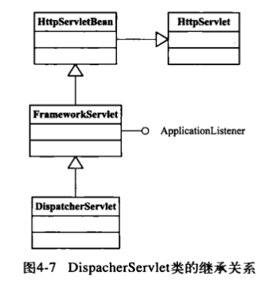
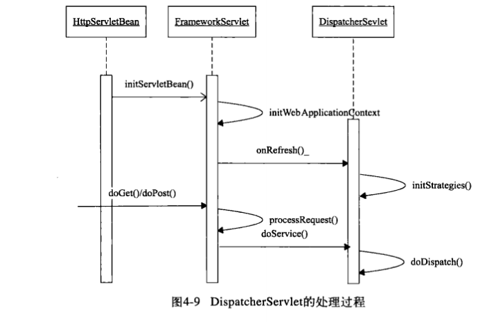
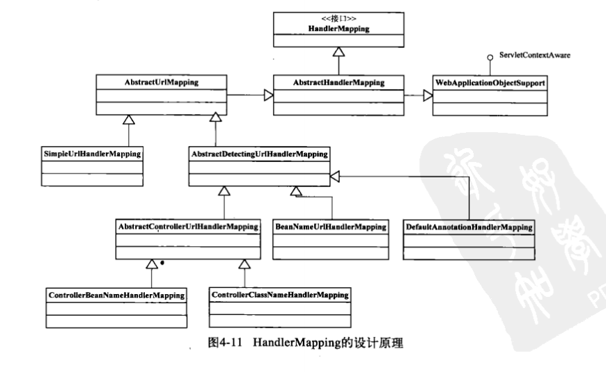
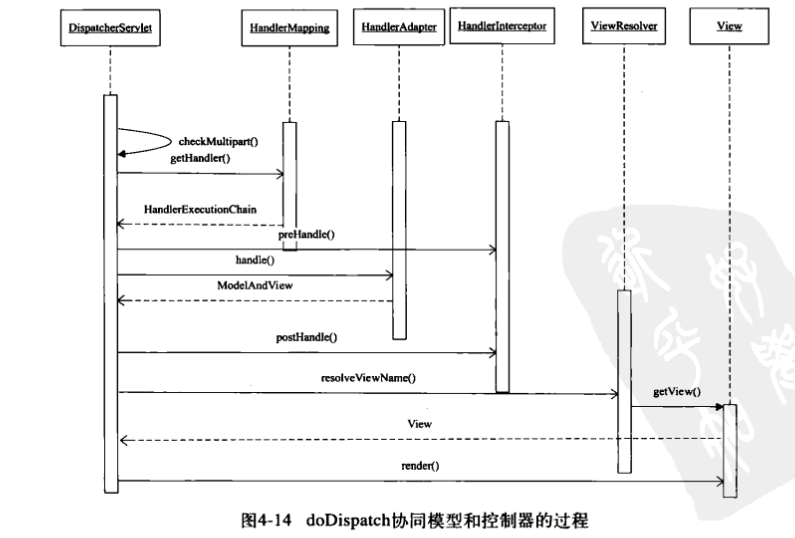

# DispatcherServlet

## 类图结构

DispatcherServlet的工作大致分为两个部分

1. 初始化Servlet, 由`initServletBean()`启动, 通过`initWebApplicationContext()`方法最终调用`DispatcherServlet`的`initStrategies()`方法, 在这个方法中, 主要完成了对容器中的其他组件的初始化,例如`handlerMapping`,`ViewResolver`等。

2. 是对Http请求的处理, 作为一个Sevlet, 最终会调用到`doGet`和`doPost`方法, 经过`FrameworkServlet`方法的`processRequest()`方法简单处理之后, 会调用到`DispatcherServlet`的`doService()`方法。

## WEB中的双亲委派模型

`DispatcherServlet`本身也是一个Servlet的实例, 因此, `DispatcherServlet`的初始化, 实际上跟`Servlet`初始化一致，在[SpringMVC原理](SpringMVC原理.md)中介绍了`ContextLoader`的加载过程, 会在`ServletContext`中绑定`ROOT`容器,那么在`Servlet`中也有自己的`WebApplicationContext`的实现, 并且都是`ROOT`容器的子容易, 在`IOC`中, 我们知道了在`getBean`操作中, 会先从父容器中获取对应的bean信息，因此在`ROOT`中的bean可以在各个子容器共享。

> NOTE: 每一个单独的Servlet都可以拥有自己的`WebApplicationContext`的容器，他们共享一个`ROOT`的容器。

## 加载流程

- 从`HttpServletBean`中执行`init`方法
- 从`FrameworkServlet`中, 初始化当前Servlet的`WebApplicationContext`的容器, 并将`ROOT`设置为父容器
- `DispatcherServlet`中执行`initStrategies()`方法, 初始化mvc中的容器控件

### initStrategies中初始化那些东西?

- 初始化`MultipartResolver`实例
- 初始化`LocaleResolver`实例
- 初始化`ThemeResolver`实例
- 初始化`handlerMapping`实例
- 初始化`HandlerAdapter`实例
- 初始化`HandlerExceptionResolver`实例
- 初始化`RequestToViewNameTranslator`实例
- 初始化`ViewResolver`实例

### HandlerMapping

从上面我们知道, 在`DispatcherServlet`初始化的时候, 会从容器中寻找`handlerMapping`的子类, 作为当前的`HandlerMappings`的列表, 如果当前的容器中没有配置, 则使用`DispatcherServlet.properties`的配置文件中获取默认的配置.

`HandlerMapping`在DispatcherServlet中对应这个列表, 并且是按照顺序排列的,并且这些 `HandlerMapping`存储着http的请求数据, 这里的每个`HandlerMapping`都持有者一个`URL`到`Controller`的映射关系, Spring MVC中提供了很多的`HandlerMapping`的实现，具体如下图:

#### getHandler

`getHandler`的方法实际返回的是一个`HandlerExecutionChain`的对象, 这个对象不仅包含了`HandlerMapping`的本身，同时也包含了`http interceptors`的拦截器的对象, 这些`HandlerMappings`可以通过`Ordered`的进行排序, `priority`越低, 则执行的优先级越高, 如果没有设置, 则具有最低执行优先级

#### SimpleUrlHandlerMapping

该类是`HandlerMapping`的实现类, 实现了`URL`到`Controller`的映射关系, 通过`registerHandlers()`方法实现`url`与`hanlder`之间的映射关系，最终关系维护在`AbstractUrlMapping`的类中, 通过`Map`来进行实现。

### DispatcherServlet的请求分发

### View

View主要通过视图的渲染, 这里的渲染包含了生成`View`的对象, 通过`View`的`render`的方法实现渲染。
