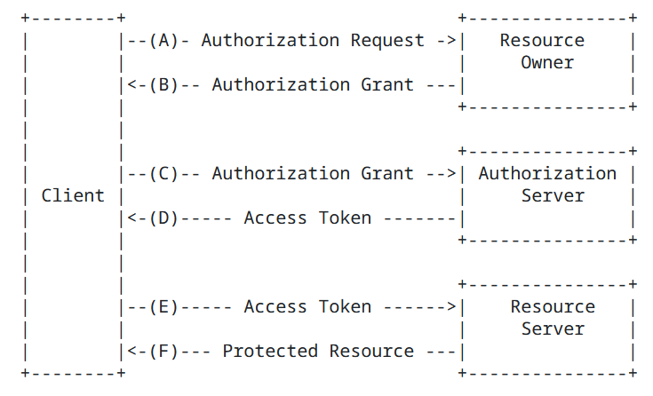

# Spring Security Oauth2.0 基础概念

  最近项目中有涉及到身份认证服务的一些实现，因此主要花点时间学习一下Spring Security 中的oauth2.0的集成，

oauth2.0也是为了保护系统资源不被恶意访问和权限控制的一种协议，在授权和鉴权的步骤中通过不同的角色完成不同的功能，以此来完成访问资源的权限控制。

## Oauth2.0四种角色

### 资源所有者(ResourceOwner)

资源所有者指代的是能够提供共享数据的应用。例如，在系统开发中，用户中心提供了用户信息、权限以及角色等，那么用户中心则是资源所有者。

因此资源所有者是用户数据的持有者，为身份认证和授权系统最基础的数据支撑。

### 客户端(Clients)

这里的客户端是广义的，指代了用户操作的客户端，同时也只包含了服务器应用。这里的客户端相对于的是请求资源的对象。

例如：在对接微信时，服务器可以通过对接流程获取到微信用户的信息，这个时候服务器的应用相对于微信授权服务器来说，则服务器应用也是一个客户端。

因此，客户端的最终解释，是相对于被请求的资源服务器来讲。

### 授权服务器(Authorization Server)

授权服务器主要负责对客户端身份的认证并在认证通过后，为客户端授权并颁发token, token的信息会被客户端保存，并在访问资源服务器资源时用作验证，以保证资源能够被合法的访问。

因此，授权服务器是很重要的一个角色，在后面会讲到，对于授权有几种不同的模式，不同模式的不同行为都是通过授权服务器来完成。

### 资源服务器(Resource Server)

托管受保护的资源的服务器，能够接受和响应带有令牌对受保护资源的访问。在微服务实现中，其实资源服务器和授权服务器是可以放在一起实现的，但是，为了能够达到统一授权的目的，也是可以拆分来实现的。

每种角色之间的交互方式如下：

- A：客户端想资源所有者(Resource Owner)发起授权。可以直接向资源所有者(Resource owner)发起授权请求或者通过授权服务器(Authorization Server)作为中介

- B：客户端收到授权凭证(身份认证码)，该授权凭证需要配合授权类型(四种授权类型)获取token信息

- C：客户端在拿到授权凭证之后，向授权服务器(`Authorization Server`)发送获取token授权请求，

- D：授权服务器(`Authorization Server)` 在收到请求后，对客户端的身份信息、权限授予进行验证，如果验证通过，则向客户端返回token令牌

- E：客户端携带token令牌向资源服务器(`Resource Server`)发送资源访问请求，资源服务器根据客户端提供的token验证客户端的身份合法性

- F：资源服务器(`Resource Server`)验证token令牌通过，则返回客户端访问的资源

## Oauth2.0四种工作模式

> 在Oauth2.0文档中，其实是建议使用授权服务器(Authorization Server)替代资源所有者，避免直接与客户端打交道的，因此，在工作模式中，其实是也是建议都通过授权服务器(Authorization Server)来完成。

### 授权码模式(authorization_code)

授权码模式中，使用授权服务器代替资源所有者工作，进行授权码的生成和返回。在这个过程中，直接访问资源所有者时，会将客户端的请求重定向到授权服务器。

授权码模式在获取token令牌之前，会通过授权服务器做身份的验证，只有在身份验证通过之后，才会想客户端返回授权码，授权码模式有一定的优势，就是将授权码直接传递给客户，而不需要通过资源所有者进行转发，这样可以防止授权码被其他拦截，而产生一定的风险。

授权码模式的工作流程如下：

- 访问授权服务器获取授权码code

- 授权服务器验证当前用户未授权，则跳转到登录界面进行登录

- 用户填写用户名/密码信息，并进行登录

- 授权服务器做登录操作，并验证权限

- 验证身份成功，通过跳转uri的方式，将code发回到客户端中

- 客户端从uri中获取code信息，并使用code换取token

### 简化模式(implicit)

隐式授权是对授权码模式进行简化，在隐式授权中，没有了客户端授权码获取的步骤，而是直接获取令牌token. 

隐式授权并没有对客户端的身份进行验证，生成的token, 在某些时候，也是通过重定向`redirect_uri`将`token`传递到客户端，客户端获取并使用。

隐式授权其实效率相对较高，因为减少了中间授权码的操作，简化了步骤。但是这种授权码的方式存在一定的安全隐患，降低了一定的安全性。

### 密码凭证模式(username and password credentials)

