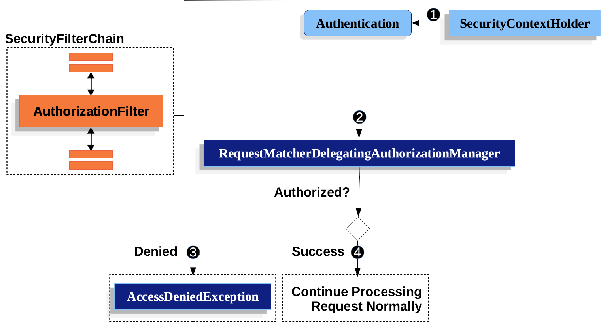

# Spring Security HttpServletRequest鉴权

Spring Security中允许根据业务需要配置定制化的鉴权规则。例如：我们可以为`/admin`下的所有请求配置指定鉴权规则、为其他页面定制另外一个鉴权规则。

> 默认情况下，Spring Security为所有请求都需要鉴权，因此，对于有特殊需求的时候，需要自己设置健全的规则。

则具体的配置规则如下：

```java
http
    .authorizeHttpRequests((authorize) -> authorize
        .anyRequest().authenticated()
    )
```

## 理解基于请求健全工作原理



以上图形中，具体执行步骤如下：

- `AuthorizationFilter`从`SecurityContextHolder`中获取`Authentication`信息，并组装`Supplier`

- 将`Supplier`对象中，包含了Authentication信息和当前的`HttpServletRequest`对象调用`AuthorizationManager`实例，并从`AuthorizationManager`中获取规则结果：
  
  - 如果鉴权被拒绝，则会发布`AuthorizationDeniedEvent`事件信息，并且`AccessDeniedException`异常被抛出。这个时候`ExceptionTranslationFilter`就会处理`AccessDeniedException`信息。
  
  - 如果鉴权通过，则发布`AuthorizationGrantedEvent`事件信息，并且继续调用`FilterChain`仅需调用后续的应用逻辑。

### AuthorizationFilter默认在FilterChain末尾

在Spring Security的`FilterChain`中，`AuthorizationFilter`默认是在最后一个，这就以为这Spring Security的`AuthenticationFilter`，漏洞保护和其他filter的集成都不要进行鉴权。同时，如果我们自己实现了`Filter`实例，并且放在了`AuthorizationFilter`之前，同样也是不要授权的。其他情况是需要进行授权。

> 这里有个地方需要特别注意，就是当我们使用Spring MVC的时候，因为使用`DispatcherServlet`，该类工作在Filter之后，因此请求都会经过`AuthorizationFilter`进行鉴权，就需要配置鉴权规则，并允许访问通过。

## 所有dispatch都需要鉴权

`AuthorizationFilter`不仅对每个`Request`鉴权，也会对所有的`dispatch`进行鉴权。其中包括了`FORWARD`,`ERROR`和`INCLUDE`

> 这里实在不知道`dispatch`翻译成什么单词比较好，就用该单词吧

例如以下的代码中，将会`FORWARD`一个请求到视图解析器(`View Resolver`)，然后渲染一个`Thymleaf`的模版。

```java
@Controller
public class MyController {
    @GetMapping("/endpoint")
    public String endpoint() {
        return "endpoint";
    }
}
```

在上面的场景中，鉴权操作会进行两次:

- 对请求`/endpoint`进行鉴权

- 对forward到一个`endpoint`的模板进行鉴权

基于以上的原因，因此需要我们对所有的`FORWARD dispatch`执行`permit`操作。

另外一个实例就是Spring boot处理异常信息的时候，会自动跳转到`/error`的地址，具体代码如下：

```java
@Controller
public class MyController {
    @GetMapping("/endpoint")
    public String endpoint() {
        throw new UnsupportedOperationException("unsupported");
    }
}
```

在这个场景中，也发生了两次鉴权：

- `/endpoint`请求时的鉴权

- `/error`处理异常地址的鉴权

## 鉴权请求地址

在配置终端时，可以按照优先级顺序配置规则，以此让Spring Security具有不同的规则配置。

假如希望`/endpoint`在访问时，能够包含`USER`角色权限，则可以进行如下配置:

```java
@Bean
SecurityFilterChain web(HttpSecurity http) throws Exception {
	http
		.authorizeHttpRequests((authorize) -> authorize
			.requestMatchers("/endpoint").hasAuthority('USER')
			.anyRequest().authenticated()
		)
        // ...

	return http.build();
}
```

在以上的配置中，匹配规则和角色是成对出现的。

当`AuthorizationFilter`在进行请求鉴权匹配时，是按照定义的顺序执行，只执行第一个匹配到的接口。例如：在以上的规则配置中，虽然`/**`也满足了请求`/endpoint`规则，但是`/endpoint`规则优先被匹配到，因此对应的鉴权规则只需要包含`USER`即可。

在以上的配置中，包含了两个配置规则，则对应配置规则如下：

- 当匹配到`/endpoint`请求时，判断是否包含`USER`权限

- 其他请求，则需要用户已经完成身份授权

## 匹配请求地址

到目前为止，我们已经知道了两种匹配请求的方式

- 第一种就是匹配所有的请求`/**`，这种对于任何的请求都生效

- 第二种就是匹配精确的请求`/endpoint`，这种只是针对于单个请求生效

### 使用Ant匹配请求

Ant是Spring Security默认使用的匹配语言，具备一下功能：

- 能够匹配单个终端或者一组终端

- 并且能够捕获表达中的变量，并提供给后面使用

- 同时能够使用Ant匹配HTTP的请求方式

```java
http
    .authorizeHttpRequests((authorize) -> authorize
        .requestMatchers("/resource/**").hasAuthority("USER")
        .anyRequest().authenticated()
    )
```

这段配置中，表名了当在访问`/resource/`下所有地址请求时，都需要`USER`权限才能够访问通过，否则将抛出`AccessDeniedException`异常。

#### 捕获变量

我们也可以在匹配模式中捕获变量，然后在鉴权的时候进行使用，例如以下:

```java
http
    .authorizeHttpRequests((authorize) -> authorize
        .requestMatchers("/resource/{name}").access(new WebExpressionAuthorizationManager("#name == authentication.name"))
        .anyRequest().authenticated()
    )
```

### 使用正则匹配请求

Spring Security也支持正则表达式匹配请求，能够提供比`/**`更加严格的匹配规则。

例如，考虑在请求路径中包含了用户名字，而用户名称必须为字符和数字，则对应的匹配规则如下：

```java
http
    .authorizeHttpRequests((authorize) -> authorize
        .requestMatchers(RegexRequestMatcher.regexMatcher("/resource/[A-Za-z0-9]+")).hasAuthority("USER")
        .anyRequest().denyAll()
    )
```

### 匹配HTTP请求方式

```java
http
    .authorizeHttpRequests((authorize) -> authorize
        .requestMatchers(HttpMethod.GET).hasAuthority("read")
        .requestMatchers(HttpMethod.POST).hasAuthority("write")
        .anyRequest().denyAll()
    )
```

- 如果请求方式为`GET`，则需要`read`权限

- 如果请求方式为`POST`， 则需要`write`权限

### 匹配dispatch类型

Spring Security默认是将所有的dispatcher类型都需要进行授权，但我们也可以只对部分类型进行授权，则具体代码如下：

```java
http
    .authorizeHttpRequests((authorize) -> authorize
        .dispatcherTypeMatchers(DispatcherType.FORWARD, DispatcherType.ERROR).permitAll()
        .requestMatchers("/endpoint").permitAll()
        .anyRequest().denyAll()
    )
```

### 自定义匹配规则

除了Spring Security默认提供的匹配规则以外，我们也可以自己实现匹配规则，如下:

```java
RequestMatcher printview = (request) -> request.getParameter("print") != null;
http
    .authorizeHttpRequests((authorize) -> authorize
        .requestMatchers(printview).hasAuthority("print")
        .anyRequest().authenticated()
    )
```

这段代码则表示，只要请求包含了`print`参数，则需要`print`权限。

## 匹配http请求

一旦某个请求规则匹配之后，那么就可以对该请求执行`permitAll`、`denyAll`或者`hasAuthority`操作，以下是对各个操作的简要概述:

- `permitAll`：表明请求的地址是公开地址，不需要鉴权。这就意味着，不会从Session中获取`Authentication`信息。

- `denyAll`：该操作表名了，任何请求在任何请求下都不会被鉴权通过。该操作不会从Session中获取`Authentication`信息

- `hasAuthority`：表明请求所关联的`Authentication`中包含了指定值的`GrantedAuthority`信息

- `hasRole`：表明请求包含了以`ROLE_`开头或者自定义的前缀信息的角色信息

- `hasAnyAuthority`：表明请求所关联的`Authentication`中的`GrantedAuthority`中包含了任一一个权限值

- `hasAnyRole`：跟`hasAnyAuthority`相同，只是判断包含任意一个`ROLE_`或者自定义前缀的角色信息。

- `access`：这个是自定义`AuthorizationManager`实现，来判断是否鉴权通过。

基于以上概述，假如有以下程序配置：

```java
import static jakarta.servlet.DispatcherType.*;

import static org.springframework.security.authorization.AuthorizationManagers.allOf;
import static org.springframework.security.authorization.AuthorityAuthorizationManager.hasAuthority;
import static org.springframework.security.authorization.AuthorityAuthorizationManager.hasRole;

@Bean
SecurityFilterChain web(HttpSecurity http) throws Exception {
	http
		// ...
		.authorizeHttpRequests(authorize -> authorize                                  (1)
            .dispatcherTypeMatchers(FORWARD, ERROR).permitAll() (2)
			.requestMatchers("/static/**", "/signup", "/about").permitAll()         (3)
			.requestMatchers("/admin/**").hasRole("ADMIN")                             (4)
			.requestMatchers("/db/**").access(allOf(hasAuthority('db'), hasRole('ADMIN')))   (5)
			.anyRequest().denyAll()                                                (6)
		);

	return http.build();
}
```

1. 这里声明了匹配规则，规则的顺序与声明顺序保持一致

2. `dispatch``FORWARD`和`ERROR`请求的`permitAll`, 允许直接访问Spring MVC的界面渲染和Spring boot的`error`渲染。

3. 允许任何用户访问`/static`,`/signup`和`/about`的所有请求

4. 对于`/admin`开头的所有请求，都需要当前已经身份认证的用户包含`ROLE_ADMIN`角色。这里注意到，我们在设置角色的时候，不需要指定`ROLE_`前缀

5. 所有以`/db/**`开头的请求，要求已身份认证的用户具备以下权限：
   
   1. 具有`db`权限
   
   2. 具有`ROLE_ADMIN`角色

6. 其他所有没有匹配到的请求，都直接拒绝。


