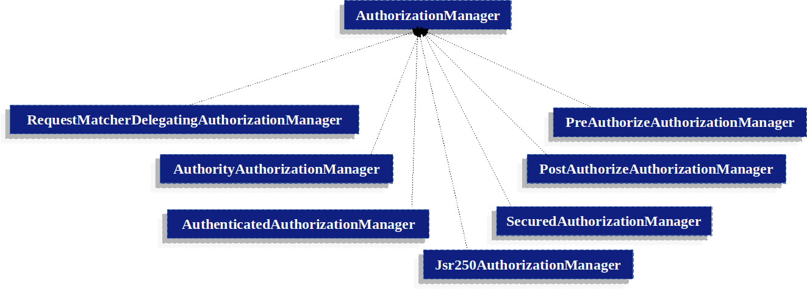
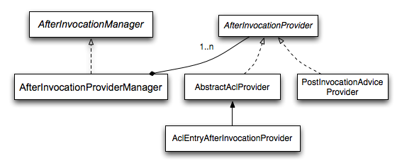

# Spring Security Authorization架构简介

## Authorities

在身份认证模块中，我们介绍了在认证完成之后，`Authentication`信息中会存储`Authorities`列表信息。`Authentication`信息经由`AuthenticationManager`对象获取并生成对应示例，然后将会被`AccessDecisionManager`读取，并用于授权使用。

授权的使用都需要实现`GrantedAuthority`接口，该接口只有一个方法:

```java
String getAuthority();
```

该方法返回的是一个String类型，主要是提供给`AuthorizationManager`来使用，这样的话，当我们返回String类型的时候，需要`GrantedAuthority`能够精准的表达权限信息，这样能够被大部分的`AuthorizationManager`实例所识别。如果`GrantedAuthority`不能表单为精确的授权信息，则需要考虑使用复杂的授权模式，则`getAuthority()`方法应该返回`null`

在Spring Security中，提供了`GrantedAuthority`接口的实现实例：`SimpleGrantedAuthority`, 该实现能够使得用户将String类型转换为`SimpleGrantedAuthority`对象实例，所有的`AuthenticationProvider`实例都是用`SimpleGrantedAuthority`对象对`Authentication`信息进行授权。

> 在默认情况下，如果spring security是基于角色进行授权时，授权信息`authority`都会包含`ROLE_`前缀，也就是说，假如需要包含角色`USER`，则通过`GrantedAuthority#getAuthority()`返回`ROLE_USER`
> 
> 同时Spring Security也提供了修改角色授权，通过`GrantedAuthorityDefaults`进行修改。

```java
@Bean
static GrantedAuthorityDefaults grantedAuthorityDefaults() {
    return new GrantedAuthorityDefaults("MYPREFIX_");
}
```

## 调用处理

 Spring Security 提供了拦截器用于对需要授权资源进行鉴权。Spring Security中，主要通过`AuthorizationManager`实例进行鉴权处理，鉴权有两种方式：

- 在方法被调用前执行鉴权操作

- 在方法被调用后，对返回的数据执行鉴权

### AuthorizationManager

在新版本的Security中，`AuthorizationManager`完全替代了`AccessDecisionManager`和`AccessDecisionManager`。Spring Security 支持基于请求(`request-based`), 基于方法(`method-based`)和基于消息(`message-based`), 然后通过`AuthorizationManager`做出最终鉴权决策，该类主要包含两个方法：

```java
AuthorizationDecision check(Supplier<Authentication> authentication, Object secureObject);

default AuthorizationDecision verify(Supplier<Authentication> authentication, Object secureObject)
        throws AccessDeniedException {
    // ...
}
```

- `check()`方法能够获取到需要授权的所有信息，以助于做出鉴权的决策。通过`secureObject`对象，可以获取到时间安全对象调用中的所有参数信息。对于鉴权的具体逻辑，则是由自定义实现。返回的`AuthorizationDecision`有以下几种情况
  
  - `true`：表示鉴权通过
  
  - `false`：表示鉴权失败
  
  - `null`：则表示放弃鉴权

- `verify()`方法则是调用`check()`方法，并判断是否鉴权失败，如果鉴权失败，则抛出`AccessDeniedException`异常。

### 基于代理的 AuthorizationManager 实现

虽然用户可以实现`AuthorizationManager`来实现鉴权的各个方面，但是, Spring Security还是提供了一些实现来与其他的`AuthorizationManager`实例合作实现鉴权。

例如：

- 当我们需要基于请求(request)进行鉴权时，可以使用`RequestMatcherDelegatingAuthorizationManager`

- 当基于方法进行鉴权时，可以使用`AuthorizationManagerBeforeMethodInterceptor`和`AuthorizationManagerAfterMethodInterceptor`

`Authorization Manager`实现的框架图如下:



通过这种方式，那么`AuthorizationManager`实现组合都能够作用于鉴权决策。

#### AuthorityAuthorizationManager

该类是作为比较通用的实现，主要是判断`Authentication`中是否包含了指定的`Authority`信息，只有在包含时，则`AuthorizationDecision`返回的结果为true；其他情况返回都是false.

#### AuthenticatedAuthorizationManager

该类主要是用来区分匿名用户、完全认证的用户和通过remember-me认证的用户。在某些情况下，可能需要remember-me登录的用户在访问某些功能时，需要二次认证。

#### AuthorizationManagers

该类是静态工厂类，主要作用在于组合单个`AuthorizationManager`。

#### 自定义Authorization Managers

就是自定义实现`AuthorizationManager`接口，并且实现鉴权的逻辑。在自定义的实现中，可能和业务逻辑存在必要的耦合关系等。

## 适配AccessDecisionManager 和 AccessDecisionVoters

在`AuthorizationManager`出现之前，主要使用的是`AccessDecisionManager`和`AccessDecisionVoters`两个类，在移植一些比较老的项目的时候，则鉴权主要使用的是这两个类型，我们可以通过自定义的方式进行改造和实现。

```java
@Component
public class AccessDecisionManagerAuthorizationManagerAdapter implements AuthorizationManager {
    private final AccessDecisionManager accessDecisionManager;
    private final SecurityMetadataSource securityMetadataSource;

    @Override
    public AuthorizationDecision check(Supplier<Authentication> authentication, Object object) {
        try {
            Collection<ConfigAttribute> attributes = this.securityMetadataSource.getAttributes(object);
            this.accessDecisionManager.decide(authentication.get(), object, attributes);
            return new AuthorizationDecision(true);
        } catch (AccessDeniedException ex) {
            return new AuthorizationDecision(false);
        }
    }

    @Override
    public void verify(Supplier<Authentication> authentication, Object object) {
        Collection<ConfigAttribute> attributes = this.securityMetadataSource.getAttributes(object);
        this.accessDecisionManager.decide(authentication.get(), object, attributes);
    }
}
```

或者只是使用`AccessDecisionVoters`进行鉴权，则代码如下:

```java
@Component
public class AccessDecisionVoterAuthorizationManagerAdapter implements AuthorizationManager {
    private final AccessDecisionVoter accessDecisionVoter;
    private final SecurityMetadataSource securityMetadataSource;

    @Override
    public AuthorizationDecision check(Supplier<Authentication> authentication, Object object) {
        Collection<ConfigAttribute> attributes = this.securityMetadataSource.getAttributes(object);
        int decision = this.accessDecisionVoter.vote(authentication.get(), object, attributes);
        switch (decision) {
        case ACCESS_GRANTED:
            return new AuthorizationDecision(true);
        case ACCESS_DENIED:
            return new AuthorizationDecision(false);
        }
        return null;
    }
}
```

以上的两个累心，都需要写入到`SecurityFilterChain`中。

## 角色层级

角色层级指代的是，当授权用户具有更高层次的角色时，能够自动的依赖较低层级的角色权限。例如，当前登录用户角色`ADMIN`，也能够自动拥有`USER`的权限，这样的话，就可以省去了很多角色配置以及繁杂的配置关系。在Spring Security中也提供了这样的一个实现，具体代码如下：

```java
@Bean
static RoleHierarchy roleHierarchy() {
    var hierarchy = new RoleHierarchyImpl();
    hierarchy.setHierarchy("ROLE_ADMIN > ROLE_STAFF\n" +
            "ROLE_STAFF > ROLE_USER\n" +
            "ROLE_USER > ROLE_GUEST");
}

// and, if using method security also add
@Bean
static MethodSecurityExpressionHandler methodSecurityExpressionHandler(RoleHierarchy roleHierarchy) {
    DefaultMethodSecurityExpressionHandler expressionHandler = new DefaultMethodSecurityExpressionHandler();
    expressionHandler.setRoleHierarchy(roleHierarchy);
    return expressionHandler;
}
```

> 在以上的代码中, `>`就可以理解为包含关系

以上代码中，包含了四种权限角色：`ROLE_ADMIN`, `ROLE_STAFF`, `ROLE_USER`, `ROLE_GUEST`，通过以上的表达，当登录角色为`ROLE_ADMIN`时，就能够自动拥有其他三种角色的权限。

## 旧版授权组件

> spring security包含了很多历史的就组建，处于保留历史信息的目录，这些组件没有做移出操作。

### AccessDecisionManager

`AccessDecisionManager`是被`AbstractSecurityInterceptor`类所调用，并最终做决定的地方。该类主要包含了三个方法:

```java
void decide(Authentication authentication, Object secureObject,
    Collection<ConfigAttribute> attrs) throws AccessDeniedException;

boolean supports(ConfigAttribute attribute);

boolean supports(Class clazz);
```

- `decide()`：该方法能够获取到所有的做最终决策的所有信息。`secureObject`则是最终需要做决策的安全对象，在运行时得以确认。

- `supports(ConfigAttribute)`：方法被`AbstractSecurityInterceptor`类型所调用，用于判断`AccessDecisionManager`的实例是否支持处理`ConfigAttribute`对象

- `supports(Class)`：该方法主要是被security 拦截器的实现所调用，以确保`AccessDecisionManager`实现类能够处理`secureObject`具体类型实例。

### 基于投票的AccessDecisionManager实现

用户能够实现自定义的`AccessDecisionManager`实例，用于控制鉴权的方方面面，Spring security 包含了基于投票的多个`AccessDecisionManager`的实现。具体的实现实例如下:


通过上面可以看出，`AccessDecisionManager`通过`AccessDecisionVoter`实现实例获取投票结果，并以此判断是否抛出`AccessDeniedException`信息。

`AccessDecisionVoter`一共包含了三个方法，如下:

```java
int vote(Authentication authentication, Object object, Collection<ConfigAttribute> attrs);

boolean supports(ConfigAttribute attribute);

boolean supports(Class clazz);
```

`vote()`方法需要返回一个int类型数据，这个类型的数据定义在`AccessDecisionVoter`中，其中的值意义如下：

- `ACCESS_GRANTED = 1`：代表投票通过

- `ACCESS_ABSTAIN = 0`：表示弃权

- `ACCESS_DENIED = -1`：代表拒绝

在Spring Security中，提供了三种`AccessDecisionManager`的实现，具体如下:

- `ConsensusBased`：该实现主要依据同意和拒绝的数量来判定是否授权通过
  
  - 所有voter都同意，则通过
  
  - 所有voter都弃权，则根据配置判断是否通过，默认为false
  
  - 如果同意数大于拒绝数，则通过
  
  - 如果同意数小于拒绝数，则抛出`AccessDeniedException`异常
  
  - 如果同意数等于拒绝数，则需要根据配置`allowIfEqualGrantedDeniedDecisions`判断是否通过，默认为`true`; 否则抛出`AccessDeniedException`异常

- `AffirmativeBased`：该实现不会关注同意的数量，而是值关注拒绝的数量，因此当有voter拒绝之后，则会抛出`AccessDeniedException`异常。同时，针对所有voter都弃权的情况，可以通过配置`allowIfAllAbstainDecisions`进行操作

- `UnanimousBased`：与`AffirmativeBased`刚好相反，该实现不关注拒绝的数量，只关注统一的数量，因此，只要有一个同意，则视为通过。同时，只要有一个拒绝，则会抛出`AccessDeniedException`异常。对于所有的都弃权的情况，则可以根据`allowIfAllAbstainDecisions`进行控制。

> 当然我们也可以通过自定义的方式来实现自定义的逻辑判断。

#### RoleVoter

该实现方式应该是比较常用的`AccessDecisionVoter`实现，该类的实现主要比对认证的用户信息中是否包含了指定的`ROLE_`前缀的授权信息，如果明确的指定了，则返回认证成功。否者就是认证失败。

#### AuthenticatedVoter

该类主要是用来判断匿名用户，完全认证、和通过remember-me进行认证的用户，在某些网站的实现中，通过`remember-me`进行认证的用户会收到部分权限的限制，因此在访问某些功能的时候，需要二次认证。

该类如果在进行鉴权的时候，使用了`IS_AUTHENTICATED_ANONYMOUSLY`配置，则代表了以上三种情况都是支持的，同时也是支持匿名用户，则返回同意的结果。

#### 自定义Voters



跟其他的实现一样的，`AfterInvocationManager`的实现也是只有一个`AfterInvocationProviderManager`对象，该实现持有了`AfterInvocationProvider`列表，并且每个实例都能够修改返回值或者抛出`AccessDeniedException`异常。并且每个`AfterInvocationProvder`修改后的结果会传给下一个provider实例。


