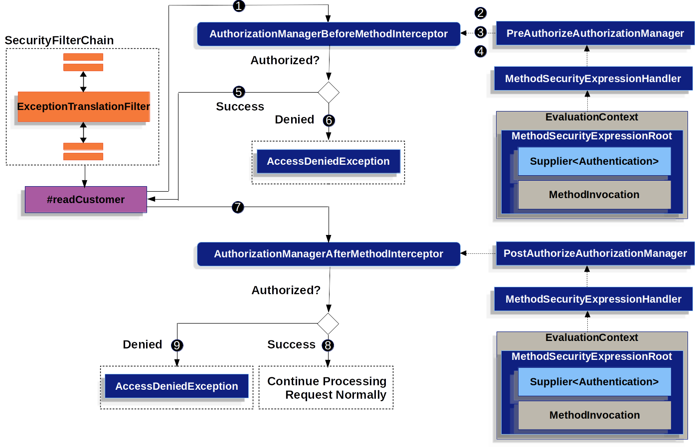

# Spring Security 方法鉴权

Spring Security也提供了方法级别的鉴权，默认是没有开启的，需要我们通过`@EnableMethodSecurity`注解的方式启用。当我们启用了方法鉴权之后，则可以使用`@PreAuthorize`，`@PostAuthorize`，`@PreFilter`和`@PostFilter`进行方法调用鉴权。

```java
@EnableMethodSecurity
@Configuration
public class SecurityConfiguration {}
```

## 方法鉴权是如何工作的

 Spring Security对方法的鉴权，有以下优点：

- 支持细粒度的授权逻辑。例如，可以获取调用方法的参数以及返回值，为决策提供数据支撑

- 在服务层面保证安全

- 在风格上倾向于注解而非`HttpSecurity`配置

> 由于Spring Security的方法鉴权采用的是Spring AOP进行构建，因此可以访问全部的能力，并且在有需要时，覆盖掉Spring Security的默认行为。

在较新版本中，`@EnableGlobalMethodSecurity`已经标记为过期，使用`@EnableMethodSecurity`注解进行代替，使用改注解有以下好处：

- 简化配置`AuthorizationManager`对象，简化了`meta resources`, `config attribute`, `decision managers`, `voters`.并且这些配置支持服用和自定义

- 基于bean的配置，而不是继承`GlobalMethodSecurityConfiguration`来实现自定义配置

- 使用Spring AOP进行构建，取消抽象的实现，能够基于Spring AOP做自定义实现

- 能够自动检测重复配置

- 实现`JSR-250`规范

- 默认启用了`@PreAuthorize`，`@PostAuthorize`，`@PreFilter`和`@PostFilter`

方法级别的鉴权，分为了调用前和调用后，对应代码如下：

```java
@Service
public class MyCustomerService {
    @PreAuthorize("hasAuthority('permission:read')")
    @PostAuthorize("returnObject.owner == authentication.name")
    public Customer readCustomer(String id) { ... }
}
```

则该方法对应的调用逻辑如下：



- Spring AOP执行代理方法`readCustomer`，针对`@PreAuthorize`注解，执行`AuthorizationManagerBeforeMethodInterceptor`类

- `AuthorizationManagerBeforeMethodInterceptor`执行`PreAuthorizeAuthorizationManager#check`方法

- `PreAuthorizeAuthorizationManager`使用`MethodSecurityExpressionHandler`解析`Spring SPEL`表达式，并从`MethodSecurityExpressionRoot`(包含了Supplier和MethodInvocation)中创建`EvaluationContext`对象

- `PreAuthorizeAuthroizationManager`通过`EvaluationContext`解析并计算表达式的值。注意，这里需要通过`Supplier`对象读取Authentication的值，并计算`permission:read`是否包含在`authrities`列表中

- 如果最终计算结果为true，则Spring AOP执行被代理对象的方法

- 如果计算结果为false, 则interceptor会发布`AuthorizationDeniedEvent`事件，并抛出`AccessDeniedException`并且`TranslationExceptionFilter`捕获异常并向response写出`403`状态码

- 当方法有返回值时，Spring AOP执行`AuthorizationManagerAfterMethodInterceptor`用户处理`@AfterAuthorize`, 操作与上面黑相似，只不过使用的`PostAuthorizeAuthroizationManager`进行处理

- 如果处理结果为true, 则执行后面的正常流程

- 如果处理结果为false，则interceptor会发布`AuthorizationDeniedEvent`事件，并抛出`AccessDeniedException`并且`TranslationExceptionFilter`捕获异常并向response写出`403`状态码

> 这里有点需要注意，如果注解使用在服务层时，那么很可能方法的调用是没有在http的上下文中，这是就需要自己处理`AccessDeniedException`异常信息

### 多注解线性执行

当在方法上有多个注解需要鉴权时，同一时间只能执行一个，这些注解会被集中到一起，并且保证所有的鉴权都通过之后，才能访问对应的方法。

### 不支持重复的注解

在同一个方法上不能同时使用两个相同的注解，例如`@PreAuthorize`注解不能再同一个方法上使用两次。

这种情况我们可以使用`SPEL 表达式`或者使用独立的bean完成逻辑。

### 每一个注解都有自己的切面

每个注解都有各自的实例用来处理对应的注解元数据。

### 每个注解都有各自的MethodInterceptor

每个注解都有各自的专用方法拦截器。这样就能够更加的便捷，例如：我们可以禁用`@PreAuthorize`的功能

方法拦截器列表如下：

- `@PreAuthorize`使用`AuthenticationManagerBeforeMethodInterceptor#preAuthorize`方法，该方法返回`PreAuthorizeAuthorizationManager`实例

- `@PostAuthorize`使用`AuthenticationManagerAfterMethodInterceptor#afterAuthorize`方法，该方法返回`AfterAuthorizeAuthorizationManager`实例

- `@PreFilter`使用`PreFilterAuthenticationMethodInterceptor#preFilter`方法

- `@PostFilter`使用`PostFilterAuthenticationMethodInterceptor#postFilter`方法

- `@Secured`使用`AuthenticationManagerBeforeMethodInterceptor#secured`方法，该方法返回`SecuredAuthorizationManager`实例

- 对于`JSR-250`规范的使用，使用`AuthenticationManagerBeforeMethodInterceptor#jsr250`方法，返回`Jsr250AuthorizationManager`

### 复杂Spel表达式授权

例如，有以下授权方式授权：

```java
@PreAuthorize("hasAuthority('permission:read') || hasRole('ADMIN')")
```

为了能够简化配置的方式，我们可以使用`RoleHierarchy`对象进行配置权限的层级关系，代码配置如下：

```java
@Bean
static RoleHierarchy roleHierarchy() {
    return new RoleHierarchyImpl("ROLE_ADMIN > permission:read");
}
```

具备了层级关系之后，则以上的配置则可以简化为以下：

```java
@PreAuthorize("hasAuthority('permission:read')")
```

## 注解使用

### @PreAuthorize

使用`@PreAuthorize`注解进行方法调用授权

```java
@Component
public class BankService {
    @PreAuthorize("hasRole('ADMIN')")
    public Account readAccount(Long id) {
        // ... is only invoked if the `Authentication` has the `ROLE_ADMIN` authority
    }
}
```

> @PreAuthorize注解能够被做为元注解使用，能够用在class或者interface之上。

### @PostAuthorize

可以使用`@PostAuthorize`注解对方法返回值进行处理：

```java
@Component
public class BankService {
    @PostAuthorize("returnObject.owner == authentication.name")
    public Account readAccount(Long id) {
        // ... is only returned if the `Account` belongs to the logged in user
    }
}
```

在以上配置中，业务意义为：当返回值Account得owner属性值与当前授权用户的name值相等时，才返回方法值结果。

这里有几个内置的参数:

- `returnObject`：指代的为方法返回值Account对象

- `authentication`：指代了当前的授权用户信息

> 与@PreAuthorize一样，该注解也能够做为元注解。

作为元注解时，则对应的使用方法如下：

```java
@Target({ ElementType.METHOD, ElementType.TYPE })
@Retention(RetentionPolicy.RUNTIME)
@PostAuthorize("returnObject.owner == authentication.name")
public @interface RequireOwnership {}
```

因此，当做为元注解使用的时候，那么就可以替换已有的配置：

```java
@Component
public class BankService {
    @RequireOwnership
    public Account readAccount(Long id) {
        // ... is only returned if the `Account` belongs to the logged in user
    }
}
```

> 这里需要注意，对应的对象的使用，都包含在`MethodSecurityExpressionRoot`类中, 可以作为参考

### @PreFilter

`@PreFilter`用来对数据进行过滤，代码示例如下：

```java
@Component
public class BankService {
    @PreFilter("filterObject.owner == authentication.name")
    public Collection<Account> updateAccounts(Account... accounts) {
        // ... `accounts` will only contain the accounts owned by the logged-in user
        return updated;
    }
}
```

这段配置意味着从方法参数`accounts`中过滤符合`filterObject.owner == authentication.name`的值，这个过程会遍历accounts中的每个值。

`@PreFilter`注解能够支持多种数据类型，包括`数组`, `集合`, `map`, 以及`stream`, 以下为各种数据类型的具体示例：

```java
@PreFilter("filterObject.owner == authentication.name")
public Collection<Account> updateAccounts(Account[] accounts)

@PreFilter("filterObject.owner == authentication.name")
public Collection<Account> updateAccounts(Collection<Account> accounts)

@PreFilter("filterObject.value.owner == authentication.name")
public Collection<Account> updateAccounts(Map<String, Account> accounts)

@PreFilter("filterObject.owner == authentication.name")
public Collection<Account> updateAccounts(Stream<Account> accounts)
```

### @PostFilter

`@PostFilter`是对方法返回的参数进行过滤，在返回数据进行过滤时，做对应的数据过滤：

```java
@Component
public class BankService {
    @PostFilter("filterObject.owner == authentication.name")
    public Collection<Account> readAccounts(String... ids) {
        // ... the return value will be filtered to only contain the accounts owned by the logged-in user
        return accounts;
    }
}
```

以上配置，会遍历返回值`accounts`并判断返回值`account`是否满足条件`filterObject.owner == authentication.name`表达式，如果满足，则作为结果返回。

`@PostFilter`注解能够支持多种数据类型，包括`数组`, `集合`, `map`, 以及`stream`, 以下为各种数据类型的具体示例：

```java
@PostFilter("filterObject.owner == authentication.name")
public Account[] readAccounts(String... ids)

@PostFilter("filterObject.value.owner == authentication.name")
public Map<String, Account> readAccounts(String... ids)

@PostFilter("filterObject.owner == authentication.name")
public Stream<Account> readAccounts(String... ids)
```

### @Secured

`@Secured`实现鉴权操作，该操作需要再启用注解中加入配置参数：`@EnableMethodSecurity(secured = true)`来开启。在一般情况下，可以通过`@PreAuthorize`进行替换

```java
@EnableMethodSecurity(secured=true)
```

### 使用JSR-250注解

在Spring Security中，也支持对JSR-250协议的支持，在`@PreAuthorize`是更加的具有表达性，也是建议使用的注解。

> 在Spring Security中，JSR-250默认是关闭的，需要通过注解配置进行开启：
> 
> `@EnableMethodSecurity(jsr250Enable=true)`

在`JSR-250`中，包含了`@RolesAllowed`, `@PermitAll`, `@DenyAll`。

### 在class和interface上使用注解

Spring Security的注解能够在class和interface上进行使用，声明如下：

```java
@Controller
@PreAuthorize("hasAuthority('ROLE_USER')")
public class MyController {
    @GetMapping("/endpoint")
    public String endpoint() { ... }
}
```

这种声明方式，使得所有的方法都继承`@PreAuthorize("hasAuthority('ROLE_USER')")`的配置，因此，如果方法中的权限都是一样的时候，可以直接在类上进行声明。

Spring Security 也是支持同时在类和方法上声明，此时，方法声明会覆盖类的声明。

```java
@Controller
@PreAuthorize("hasAuthority('ROLE_USER')")
public class MyController {
    @GetMapping("/endpoint")
    @PreAuthorize("hasAuthority('ROLE_ADMIN')")
    public String endpoint() { ... }
}
```

此时，访问endpoint()方法的时候，需要的是具有`ROLE_ADMIN`的权限，而不是`ROLE_USER`。

### 使用元注解

为了提升程序的可读性以及快速的开发，可以自定义注解，然后实现特定的功能。例如，可以有以下程序配置：

```java
@Target({ ElementType.METHOD, ElementType.TYPE })
@Retention(RetentionPolicy.RUNTIME)
@PreAuthorize("hasRole('ADMIN')")
public @interface IsAdmin {}
```

这段代码定义了`@IsAdmin`注解，主要用来鉴权当前授权登录用户是否包含了`ROLE_ADMIN`的角色，因此，我们可以通过如下方式使用该注解：

```java
@Component
public class BankService {
    @IsAdmin
    public Account readAccount(Long id) {
        // ... is only returned if the `Account` belongs to the logged in user
    }
}
```

### 启用鉴权注解

在启用`@EnableMethodSecurity`注解时，可以通过注解配置关闭默认的注解，例如，可以通过`prePostEnabled=false`来关闭`@PreAuthorize`，`@PostAuthorize`, `@PreFilter`, `@PostFilter`的配置信息，而只开启某一个注解：

```java
@Configuration
@EnableMethodSecurity(prePostEnabled = false)
class MethodSecurityConfig {
    @Bean
    @Role(BeanDefinition.ROLE_INFRASTRUCTURE)
    Advisor postAuthorize() {
        return AuthorizationManagerBeforeMethodInterceptor.postAuthorize();
    }
}
```

## 方法鉴权编程

### 在Spel表达式中使用自定义bean

在以上介绍中，我们可以看到spring security为我们提供了很多的默认实现，包括了角色，权限等简要实现类，同时我们也可以通过编程的方式自定义校验规则，例如以下程序配置:

```java
@Component("authz")
public class AuthorizationLogic {
    public boolean decide(MethodSecurityExpressionOperations operations) {
        // ... authorization logic
    }
}
```

那么，我们可以通过注解的方式调用对应的bean方法：

```java
@Controller
public class MyController {
    @PreAuthorize("@authz.decide(#root)")
    @GetMapping("/endpoint")
    public String endpoint() {
        // ...
    }
}
```

### 使用自定义AuthorizationManager

为了能够使用自定义的`AuthorizationManager`对象，需要自定义实现：

```java
@Component
public class MyAuthorizationManager implements AuthorizationManager<MethodInvocation> {
    public AuthorizationDecision check(Supplier<Authentication> authentication, MethodInvocation invocation) {
        // ... authorization logic
    }
}
```

为了能够将`@PreAuthorize`等注解使用我们自定义的`AuthorizationManager`实现，我们需要做如下配置：

```java
@Configuration
@EnableMethodSecurity(prePostEnabled = false)
class MethodSecurityConfig {
    @Bean
    @Role(BeanDefinition.ROLE_INFRASTRUCTURE)
    Advisor postAuthorize(MyAuthorizationManager manager) {
        return AuthorizationManagerBeforeMethodInterceptor.preAuthorize(manager);
    }

    @Bean
    @Role(BeanDefinition.ROLE_INFRASTRUCTURE)
    Advisor postAuthorize(MyAuthorizationManager manager) {
        return AuthorizationManagerAfterMethodInterceptor.postAuthorize(manager);
    }
}
```

### 自定义ExpressionHandler

在配置过程中，我们也可以自定义Spel表达式的处理过程，为了实现这样的目的，需要在配置中暴露`MethodSecurityExpressionHandler`对象实例。

```java
@Bean
static MethodSecurityExpressionHandler methodSecurityExpressionHandler(RoleHierarchy roleHierarchy) {
    DefaultMethodSecurityExpressionHandler handler = new DefaultMethodSecurityExpressionHandler();
    handler.setRoleHierarchy(roleHierarchy);
    return handler;
}
```

> 这里定义的方法采用的是static的方式，这样可以保证在Spring Security的@Configuration的配置类方法执行前，优先被执行，保证能够顺利替换默认配置。

## 自定义AspectJ

在Spring AOP中，可以使用自定义的`Advisor`进行拦截，实现自定义的鉴权规则，例如有以下定义：

```java
import static org.springframework.security.authorization.AuthorityAuthorizationManager.hasRole;

@Bean
@Role(BeanDefinition.ROLE_INFRASTRUCTURE)
static Advisor protectServicePointcut() {
    JdkRegexpMethodPointcut pattern = new JdkRegexpMethodPointcut();
    pattern.setPattern("execution(* com.mycompany.*Service.*(..))");
    return new AuthorizationManagerBeforeMethodInterceptor(pattern, hasRole("USER"));
}
```

### 使用AspectJ做byte-weaving

有些时候通过字节编制的方式可以提高一定的性能，在默认情况下，Spring Security使用的是代理模式，如果需要使用AspectJ，则可以修改对应的模式即可。

```java
@EnableMethodSecurity(mode=AdviceMode.ASPECTJ)
```

## 使用Spel表达式鉴权配置

在以上的配置中，我们已经知道了Spel的一些配置方式，这里主要设计到在使用Spel表达式的时候所使用的几个重要的API

- Spring Security 包装了所有的授权用户的字段、和方法到一个root object中

- 大部分的root object都是继承自`SecurityExpressionRoot`类型，Spring Security默认使用的`MethodSecurityExpressionRoot`作为数据承载

- 当Spring Security在准备计算Spel表达式的时候，会将root object传给`MethodSecurityEvaluationContext`的`rootObject`字段

### 使用字段和方法表达式鉴权

- `permitAll`：表明请求的地址是公开地址，不需要鉴权。这就意味着，不会从Session中获取`Authentication`信息。

- `denyAll`：该操作表名了，任何请求在任何请求下都不会被鉴权通过。该操作不会从Session中获取`Authentication`信息

- `hasAuthority`：表明请求所关联的`Authentication`中包含了指定值的`GrantedAuthority`信息

- `hasRole`：表明请求包含了以`ROLE_`开头或者自定义的前缀信息的角色信息

- `hasAnyAuthority`：表明请求所关联的`Authentication`中的`GrantedAuthority`中包含了任一一个权限值

- `hasAnyRole`：跟`hasAnyAuthority`相同，只是判断包含任意一个`ROLE_`或者自定义前缀的角色信息。

- `hasPermission`：该方法会自动使用`PermissionEvaluator`类进行权限的校验

同时，该root object中也包含了可以使用的字段：

- `authentication`：指代了`Authentication`实例，与方法调用绑定

- `principal`：`Authentication#principal`信息与方法调用绑定

以下代码是对Spel表达式比较复杂的使用：

```java
@Component
public class MyService {
    @PreAuthorize("denyAll")
    MyResource myDeprecatedMethod(...);

    @PreAuthorize("hasRole('ADMIN')")
    MyResource writeResource(...)

    @PreAuthorize("hasAuthority('db') and hasRole('ADMIN')")
    MyResource deleteResource(...)

    @PreAuthorize("principal.claims['aud'] == 'my-audience'")
    MyResource readResource(...);

	@PreAuthorize("@authz.check(authentication, #root)")
    MyResource shareResource(...);
}
```

- `myDeprecatedMethod`定义江导致该方法不能够被访问

- `writeResource`方法需要当前授权用户需要有`ROLE_ADMIN`角色

- `deleteResource`方法需要当前授权用户包含`db`授权和`ROLE_ADMIN`角色

- `readResource`则需要`principal.claims['aud']`的值等于`my-audience`

- `shareResource`方法则需要`authz#check`方法返回值为true

### 使用方法参数

另外， Spring Security也提供了获取调用方法的参数的机制，用于Spel表达式中。在Spring Security默认实现中，使用`DefaultSecurityParameterNameDiscoverer`作为变量查找实现，默认包含了以下几种实现：

1. 由Spring Security提供的注解`@P`来标注参数的名称，具体使用情况如下：
   
   ```java
   import org.springframework.security.access.method.P;
   
   ...
   
   @PreAuthorize("hasPermission(#c, 'write')")
   public void updateContact(@P("c") Contact contact);
   ```

这里的代码配置，表示了参数`name`和`authentication#name`相等的时候，则表示授权通过

2. 由Spring Data提供的注解`@Param`设置的参数的名称，具体配置如下：
   
   ```java
   import org.springframework.data.repository.query.Param;
   
   ...
   
   @PreAuthorize("#n == authentication.name")
   Contact findContactByName(@Param("n") String name);
   ```

3. 如果在进行代码编译的时候，加入了`-parameters`参数，标准的JDK的反射API能够获取到参数的具体名称，这样能够对class和interface都生效。

4. 如果使用的debug模式，这个时候只能通过debug模式来获取参数的名称，这种方式不适合interface接口，因此针对interface接口，需要使用`-parameters`参数来实现。

### 自定义实现DefaultMethodSecurityExpressionHandler

可以自定义`ExpressionHandler`来进行扩展，实例代码如下：

```java
@Component
class MyExpressionHandler extends DefaultMethodSecurityExpressionHandler {
    @Override
    public EvaluationContext createEvaluationContext(Supplier<Authentication> authentication, MethodInvocation mi) {
		StandardEvaluationContext context = (StandardEvaluationContext) super.createEvaluationContext(authentication, mi);
        MethodSecurityExpressionOperations delegate = (MethodSecurityExpressionOperations) context.getRootObject().getValue();
        MySecurityExpressionRoot root = new MySecurityExpressionRoot(delegate);
        context.setRootObject(root);
        return context;
    }
}
```

## 参考文档

1. [method security-spring security](https://docs.spring.io/spring-security/reference/servlet/authorization/method-security.html)


