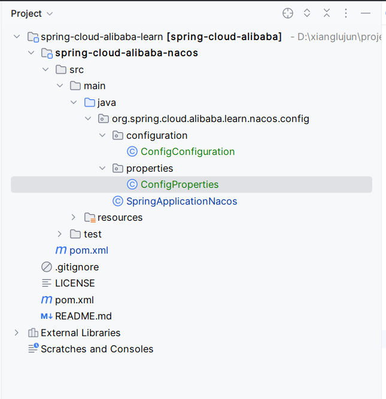

# @ConfigurationProperties自动刷新配置原理

 在nacos自动配置刷新中，当我们使用spring-cloud做微服务开发的时候，主要通过两种方式自动刷新配置：

- `@RefreshScope`

- 将配置放在类中，并通过`@ConfigurationProperties`配置

这边文章主要介绍`@ConfigurationProperties`注解工作原理，以及解释自动刷新配置的工作机制。

## 1. 示例展示

在开始讲解具体原理之前，还是以一个示例开始，不会显得那么突兀。项目结构以及关键文件配置如下：



> 这里可能显的有点多余，不过抱着学习的态度还是需要有的，主要可以避免再去查询和匹配spring-cloud-alibaba版本的配对以及部分新学的小伙伴看不太懂的尴尬。如果你已经知道怎么使用，则跳过示例展示部分，直接进入正题。

### parent pom.xml

```xml
<project xmlns="http://maven.apache.org/POM/4.0.0" xmlns:xsi="http://www.w3.org/2001/XMLSchema-instance"
         xsi:schemaLocation="http://maven.apache.org/POM/4.0.0 http://maven.apache.org/xsd/maven-4.0.0.xsd">
  <modelVersion>4.0.0</modelVersion>

  <groupId>org.spring.cloud.alibaba.learn</groupId>
  <artifactId>spring-cloud-alibaba</artifactId>
  <version>1.0-SNAPSHOT</version>
  <packaging>pom</packaging>

  <name>spring-cloud-alibaba</name>
  <url>http://maven.apache.org</url>


  <modules>
    <module>spring-cloud-alibaba-nacos</module>
  </modules>

  <properties>
    <project.build.sourceEncoding>UTF-8</project.build.sourceEncoding>
  </properties>

  <dependencyManagement>
    <dependencies>
      <dependency>
        <groupId>com.alibaba.cloud</groupId>
        <artifactId>spring-cloud-alibaba-dependencies</artifactId>
        <version>2021.0.5.0</version>
        <type>pom</type>
        <scope>import</scope>
      </dependency>
      <dependency>
        <groupId>org.springframework.cloud</groupId>
        <artifactId>spring-cloud-dependencies</artifactId>
        <version>2021.0.5</version>
        <type>pom</type>
        <scope>import</scope>
      </dependency>
      <dependency>
        <groupId>org.springframework.boot</groupId>
        <artifactId>spring-boot-dependencies</artifactId>
        <version>2.6.13</version>
        <type>pom</type>
        <scope>import</scope>
      </dependency>
    </dependencies>
  </dependencyManagement>
</project>
```

### child pom.xml

```xml
<project xmlns="http://maven.apache.org/POM/4.0.0" xmlns:xsi="http://www.w3.org/2001/XMLSchema-instance"
         xsi:schemaLocation="http://maven.apache.org/POM/4.0.0 http://maven.apache.org/xsd/maven-4.0.0.xsd">
  <modelVersion>4.0.0</modelVersion>

  <parent>
    <groupId>org.spring.cloud.alibaba.learn</groupId>
    <artifactId>spring-cloud-alibaba</artifactId>
    <version>1.0-SNAPSHOT</version>
    <relativePath>../pom.xml</relativePath>
  </parent>

  <groupId>org.example</groupId>
  <artifactId>spring-cloud-alibaba-nacos</artifactId>
  <version>1.0-SNAPSHOT</version>
  <packaging>jar</packaging>

  <name>spring-cloud-alibaba-nacos</name>
  <url>http://maven.apache.org</url>

  <properties>
    <project.build.sourceEncoding>UTF-8</project.build.sourceEncoding>
  </properties>

  <dependencies>
    <dependency>
      <groupId>junit</groupId>
      <artifactId>junit</artifactId>
      <version>4.13.2</version>
      <scope>test</scope>
    </dependency>

    <dependency>
      <groupId>org.springframework.cloud</groupId>
      <artifactId>spring-cloud-starter-bootstrap</artifactId>
    </dependency>
    <dependency>
      <groupId>org.springframework.boot</groupId>
      <artifactId>spring-boot-starter</artifactId>
    </dependency>
    <dependency>
      <groupId>org.springframework.boot</groupId>
      <artifactId>spring-boot-autoconfigure</artifactId>
    </dependency>
    <dependency>
      <groupId>com.alibaba.cloud</groupId>
      <artifactId>spring-cloud-starter-alibaba-nacos-config</artifactId>
    </dependency>
    <dependency>
      <groupId>org.springframework.boot</groupId>
      <artifactId>spring-boot-starter-web</artifactId>
    </dependency>
    <dependency>
      <groupId>org.projectlombok</groupId>
      <artifactId>lombok</artifactId>
    </dependency>
  </dependencies>
  <build>
    <plugins>
      <plugin>
        <groupId>org.apache.maven.plugins</groupId>
        <artifactId>maven-compiler-plugin</artifactId>
        <configuration>
          <source>8</source>
          <target>8</target>
        </configuration>
      </plugin>
    </plugins>
  </build>
</project>
```

### ConfigProperties

```java
@Data
@ConfigurationProperties(prefix = "config")
public class ConfigProperties {

    private String name;
    private Integer age;
    private String className;
}
```

### ConfigConfiguration

```java
@Configuration
@EnableConfigurationProperties({ConfigProperties.class})
public class ConfigConfiguration {

    //    @Bean
    public ConfigProperties configProperties() {
        return new ConfigProperties();
    }
}
```

### SpringApplicationNacos

```java
@SpringBootApplication
public class SpringApplicationNacos {
    public static void main(String[] args) {
        ConfigurableApplicationContext applicationContext = SpringApplication.run(SpringApplicationNacos.class, args);
        System.out.println(applicationContext);
//        ConfigurableEnvironment environment = applicationContext.getEnvironment();
//        System.out.println(environment.getProperty("config.name"));
//        System.out.println(environment.getProperty("config.app"));
//        System.out.println(environment.getProperty("config.bootstrap"));

        ConfigProperties configProperties = applicationContext.getBean(ConfigProperties.class);
        System.out.println(configProperties);
        System.out.println(Arrays.toString(applicationContext.getBeanNamesForType(ConfigProperties.class)));

        new ScheduledThreadPoolExecutor(1)
                .scheduleAtFixedRate(() -> {
                    System.out.println(configProperties);
                }, 0, 5, TimeUnit.SECONDS);
    }
}
```

### bootstrap.yml

```yml
config:
  name: bootstrap
  bootstrap: app-boot
spring:
  cloud:
    nacos:
      config:
        server-addr: 192.168.56.101:8848
        namespace: 48dfde1f-308d-4a79-b1ee-62b2a3ff5320
        file-extension: yml
        username: nacos
        password: nacos
        group: dev
  application:
    name: spring-nacos
```

在以上的示例中，我认为有几点需要大家注意：

- `ConfigProperties`配置使用了`@ConfigurationProperties`注解，该注解会配置前缀`prefix`, 让后将满足前缀的配置封装到当前类中

- `ConfigConfiguration`类中，表明了`@ConfigurationProperties`标注的类有两种引入方式：
  
  - `@EnableConfigurationProperties`注解引入配置类
  
  - 创建bean方法，并在方法上标注`@Bean`实现注入

## 2. Bean的处理

看到这里就会有个疑问: Spring是如何处理被`@ConfigurationProperties`标注的bean的呢？spring的bean加载流程，不在这篇文章范围内。在Spring的扩展机制中，`BeanPostProcessor`是作为主要的扩展实现，因此我们以此为入口，找到对应的扩展类.

### ConfigurationPropertiesBindingPostProcessor

#### postProcessBeforeInitialization()

```java
    public Object postProcessBeforeInitialization(Object bean, String beanName) throws BeansException {
        // bind()方法主要是对当前的bean设置属性值，这里的主要实现是以Binder类型来完成
        // ConfigurationProperitesBean的目的是缓存被@ConfigurationProperties标注的bean, 因此通过该类
        // 可以拿到在spring容器中所有被@ConfigurationProperties标注的bean列表
        bind(ConfigurationPropertiesBean.get(this.applicationContext, bean, beanName));
        return bean;
    }
```

#### bind()

```java
private void bind(ConfigurationPropertiesBean bean) {
    // 判断bean是否为null,或者已经包含了绑定值的bean
    if (bean == null || hasBoundValueObject(bean.getName())) {
        return;
    }
    Assert.state(bean.getBindMethod() == BindMethod.JAVA_BEAN, "Cannot bind @ConfigurationProperties for bean '"
            + bean.getName() + "'. Ensure that @ConstructorBinding has not been applied to regular bean");
    try {
        // 执行属性绑定
        this.binder.bind(bean);
    }
    catch (Exception ex) {
        throw new ConfigurationPropertiesBindException(bean, ex);
    }
}
```

### ConfiguraionPropertiesBean

上面讲到了该类会存储所有的`@ConfigurationProperties`注解标注的bean列表，因此我们这里就主要看下`get()`方法中代码逻辑：

#### get()

```java
    public static ConfigurationPropertiesBean get(ApplicationContext applicationContext, Object bean, String beanName) {
        // 获取bean的工厂方法，当不是通过方法创建bean时，这里返回为空
        Method factoryMethod = findFactoryMethod(applicationContext, beanName);
        // 创建bean
        return create(beanName, bean, bean.getClass(), factoryMethod);
    }
```

#### findFactoryMethod()

```java
private static Method findFactoryMethod(ConfigurableListableBeanFactory beanFactory, String beanName) {
    // BeanFactory中是否包含BeanDefinition定义
    if (beanFactory.containsBeanDefinition(beanName)) {
        // 获取BeanDefinition定义对象
        BeanDefinition beanDefinition = beanFactory.getMergedBeanDefinition(beanName);
        if (beanDefinition instanceof RootBeanDefinition) {
            // 获取创建工厂方法
            Method resolvedFactoryMethod = ((RootBeanDefinition) beanDefinition).getResolvedFactoryMethod();
            if (resolvedFactoryMethod != null) {
                return resolvedFactoryMethod;
            }
        }
        // 如果没有包含创建工厂方法，从beanDefinition中查找工厂方法
        return findFactoryMethodUsingReflection(beanFactory, beanDefinition);
    }
    return null;
}
```

#### findFactoryMethodUsingReflection()

```java
private static Method findFactoryMethodUsingReflection(ConfigurableListableBeanFactory beanFactory,
            BeanDefinition beanDefinition) {
        // 获取工厂方法名称
        String factoryMethodName = beanDefinition.getFactoryMethodName();
        // 获取工厂bean名称
        String factoryBeanName = beanDefinition.getFactoryBeanName();
        // 如果两者都为null，则表明不是通过工厂方法创建，则直接返回null
        if (factoryMethodName == null || factoryBeanName == null) {
            return null;
        }
        // 获取工厂class对象
        Class<?> factoryType = beanFactory.getType(factoryBeanName);
        // 判断是否为cglib代理类
        if (factoryType.getName().contains(ClassUtils.CGLIB_CLASS_SEPARATOR)) {
            factoryType = factoryType.getSuperclass();
        }
        AtomicReference<Method> factoryMethod = new AtomicReference<>();
        // 遍历工厂方法类中的所有方法，并判断方法名称是否一致，一致就作为方法返回
        ReflectionUtils.doWithMethods(factoryType, (method) -> {
            if (method.getName().equals(factoryMethodName)) {
                factoryMethod.set(method);
            }
        });
        return factoryMethod.get();
    }
```

#### create()

```java
private static ConfigurationPropertiesBean create(String name, Object instance, Class<?> type, Method factory) {
    // 从当前bean Class上获取@ConfigurationProperties注解
    ConfigurationProperties annotation = findAnnotation(instance, type, factory, ConfigurationProperties.class);
    // 如果注解为空，则返回
    if (annotation == null) {
        return null;
    }
    // 从type上获取@Validated注解信息
    Validated validated = findAnnotation(instance, type, factory, Validated.class);
    // 如果validated注解不为空，则放入两个注解。否则放入@ConfigurationProperties注解
    Annotation[] annotations = (validated != null) ? new Annotation[] { annotation, validated }
            : new Annotation[] { annotation };
    // 如果是通过工厂方法创建，则按照工厂方法解析bean类型，否则按照type的实际类型解析
    ResolvableType bindType = (factory != null) ? ResolvableType.forMethodReturnType(factory)
            : ResolvableType.forClass(type);
    // 创建Bindable对象
    Bindable<Object> bindTarget = Bindable.of(bindType).withAnnotations(annotations);
    if (instance != null) {
        // 主要判断instance是否存在，存在时会返回新的Bindable对象
        bindTarget = bindTarget.withExistingValue(instance);
    }
    // 创建ConfigurationPropertiesBean对象
    return new ConfigurationPropertiesBean(name, instance, annotation, bindTarget);
}
```

> 创建方法最终是创建了`ConfigurationPropertiesBean`对象，并且带对象持有了bean对象的实例，然后通过`bind()`方法对属性值进行填充。最终是ConfigProperties对象能够包含完整的配置属性值。

## 3. 刷新配置处理

当我们看完了bean的处理逻辑之后，那么配置更新其实并不会自动的导致配置更新到对应的bean, 原因是因为spring中并不清楚配置与bean之间的关系，因此这里可以猜测，通过某种机制会触发Bean被对应的`BeanPostProcessor`类重新执行，然后将新的属性值填充到bean中。

### nacos 监听配置变化

在spring启动过程中，会从nacos-server加载配置信息，当容器启动完毕后，会发送`ApplicationReadyEvent`事件，nacos框架中会监听该事件，并开启监听逻辑。

#### NacosContextRefresher

```java
    public void onApplicationEvent(ApplicationReadyEvent event) {
        // many Spring context
        if (this.ready.compareAndSet(false, true)) {
            this.registerNacosListenersForApplications();
        }
    }
```

当接收到事件之后，当nacos监听还没有准备好时，将开启监听。

```java
private void registerNacosListenersForApplications() {
    if (isRefreshEnabled()) {
        // 获取所有的nacos配置列表
        for (NacosPropertySource propertySource : NacosPropertySourceRepository
                .getAll()) {
            // 判断配置是否能够刷新
            if (!propertySource.isRefreshable()) {
                continue;
            }
            // 获取dataId
            String dataId = propertySource.getDataId();
            // 注册nacos监听器
            registerNacosListener(propertySource.getGroup(), dataId);
        }
    }
}
```

在处理事件的时候，会注册`listener`监听器，用于处理配置文件的变化逻辑。具体代码如下：

```java
private void registerNacosListener(final String groupKey, final String dataKey) {
    // 获取key
    String key = NacosPropertySourceRepository.getMapKey(dataKey, groupKey);
    // 存入listener映射，该listener为一个匿名内部类
    Listener listener = listenerMap.computeIfAbsent(key,
            lst -> new AbstractSharedListener() {
                @Override
                public void innerReceive(String dataId, String group,
                        String configInfo) {
                    // 增加刷新次数
                    refreshCountIncrement();
                    // 新增刷新记录到历史记录中
                    nacosRefreshHistory.addRefreshRecord(dataId, group, configInfo);
                    // 发布RefreshEvent事件
                    applicationContext.publishEvent(
                            new RefreshEvent(this, null, "Refresh Nacos config"));
                    if (log.isDebugEnabled()) {
                        log.debug(String.format(
                                "Refresh Nacos config group=%s,dataId=%s,configInfo=%s",
                                group, dataId, configInfo));
                    }
                }
            });
    try {
        // 将listener注册到ConfigService中
        configService.addListener(dataKey, groupKey, listener);
        log.info("[Nacos Config] Listening config: dataId={}, group={}", dataKey,
                groupKey);
    }
    catch (NacosException e) {
        log.warn(String.format(
                "register fail for nacos listener ,dataId=[%s],group=[%s]", dataKey,
                groupKey), e);
    }
}
```

从以上代码可知，当配置发生更新时，会想容器中发送`RefreshEvent`事件，因此关注点在处理该事件的`listener`的逻辑。

> 事件的注册和监听的逻辑，不在本篇文章的范围内，可以查看源码对应的实现逻辑。

### RefreshEventListener

```java
    @Override
    public void onApplicationEvent(ApplicationEvent event) {
        if (event instanceof ApplicationReadyEvent) {
            handle((ApplicationReadyEvent) event);
        }
        // 处理刷新事件
        else if (event instanceof RefreshEvent) {
            handle((RefreshEvent) event);
        }
    }
    public void handle(RefreshEvent event) {
        if (this.ready.get()) { // don't handle events before app is ready
            log.debug("Event received " + event.getEventDesc());
            // 容器刷新
            Set<String> keys = this.refresh.refresh();
            log.info("Refresh keys changed: " + keys);
        }
    }
```

该类在处理刷新事件的时候，最终是通过`ContextRefresher`完成刷新动作。

### ContextRefresher

#### refresh()

```java
public synchronized Set<String> refresh() {
    // 刷新Environment配置信息
    Set<String> keys = refreshEnvironment();
    // 刷新Scope，该Scope对应的RereshScope的实现，会导致bean重新创建，也是@Refresh实现的关键点
    this.scope.refreshAll();
    return keys;
}
```

> 这段代码有个点，不在这篇文章中介绍，但是缺失一个单独的知识点，就是Scope的工作，因为该类也是@RefreshScope的实现的重要类，这里的scope.refreshAll()方法会导致被@RefreshScope标记的bean重新被创建，这个会在后面的文章中单独介绍。

因此，在刷新的动作中，主要是刷新Environment对象，具体查看刷新的源码.

#### refreshEnvironment()

```java
public synchronized Set<String> refreshEnvironment() {
    // 获取标准配置之前的resources配置列表，
    // systemProperties, systemEnvironment, servletContextInitParams, servletConfigInitParams, configurationProperties, jndiProperties
    // 这里需要注意，因为resources具有优先级，因此低优先级的相同配置最终会被高优先级的配置覆盖
    Map<String, Object> before = extract(this.context.getEnvironment().getPropertySources());
    // 更新环境配置
    updateEnvironment();
    // 对比前后的配置列表，并获取发生变更的配置key
    Set<String> keys = changes(before, extract(this.context.getEnvironment().getPropertySources())).keySet();
    // 发布环境配置发生变更事件
    this.context.publishEvent(new EnvironmentChangeEvent(this.context, keys));
    return keys;
}
```

### LegacyContextRefresher

#### updateEnvironment()

```java
    /* For testing. */ ConfigurableApplicationContext addConfigFilesToEnvironment() {
        ConfigurableApplicationContext capture = null;
        try {
            // 创建并复制Environment对象，复制完成的Environment对象中，主要包括了：
            // commandLineArgs和defaultProperties两种配置信息，
            // 并且也会复制activeProfiles和defaultProfiles两个配置信息，这样就组成了新的Environment对象
            StandardEnvironment environment = copyEnvironment(getContext().getEnvironment());

            // 设置刷新环境参数配置,并将配置信息加入到当前的Environment中，并命名为：refreshArgs
            Map<String, Object> map = new HashMap<>();
            map.put("spring.jmx.enabled", false);
            map.put("spring.main.sources", "");
            // gh-678 without this apps with this property set to REACTIVE or SERVLET fail
            map.put("spring.main.web-application-type", "NONE");
            map.put(BOOTSTRAP_ENABLED_PROPERTY, Boolean.TRUE.toString());
            environment.getPropertySources().addFirst(new MapPropertySource(REFRESH_ARGS_PROPERTY_SOURCE, map));

            // 构建SpringApplication对象，这里的SpringApplication的构建，限制了本身SpringApplication的完整功能，
            // 因此只是一个缩减版
            SpringApplicationBuilder builder = new SpringApplicationBuilder(Empty.class).bannerMode(Banner.Mode.OFF)
                    .web(WebApplicationType.NONE).environment(environment);
            // 在SpringApplicaion创建的时候，会采用SPI机制加载ApplicationListener列表，这里
            // 将默认的配置信息覆盖到，而只是设置了会影响Environment这部分的Listener, 因此
            // 这里的SpringApplication的启动只会影响Environment中的值
            builder.application().setListeners(
                    Arrays.asList(new BootstrapApplicationListener(), new BootstrapConfigFileApplicationListener()));
            capture = builder.run();

            // 移除refreshArgs资源配置信息
            if (environment.getPropertySources().contains(REFRESH_ARGS_PROPERTY_SOURCE)) {
                environment.getPropertySources().remove(REFRESH_ARGS_PROPERTY_SOURCE);
            }

            // 获取刷新前的配置资源列表，并使用现有的资源列表替换已有的资源列表配置
            // 如果配置在已有资源列表中不存在，则加入到资源列表首部，具有高优先级
            MutablePropertySources target = getContext().getEnvironment().getPropertySources();
            String targetName = null;
            for (PropertySource<?> source : environment.getPropertySources()) {
                String name = source.getName();
                if (target.contains(name)) {
                    targetName = name;
                }
                if (!this.standardSources.contains(name)) {
                    if (target.contains(name)) {
                        target.replace(name, source);
                    }
                    else {
                        if (targetName != null) {
                            target.addAfter(targetName, source);
                            // update targetName to preserve ordering
                            targetName = name;
                        }
                        else {
                            // targetName was null so we are at the start of the list
                            target.addFirst(source);
                            targetName = name;
                        }
                    }
                }
            }
        }
        finally {
            ConfigurableApplicationContext closeable = capture;
            while (closeable != null) {
                try {
                    closeable.close();
                }
                catch (Exception e) {
                    // Ignore;
                }
                if (closeable.getParent() instanceof ConfigurableApplicationContext) {
                    closeable = (ConfigurableApplicationContext) closeable.getParent();
                }
                else {
                    break;
                }
            }
        }
        return capture;
    }
```

在配置信息刷新过程中，主要包含了以下几个要点：

- 刷新配置会创建`SpringApplicaion`对象，并重新进行容器初始化。只是这个时候初始化并不会全部初始化，而是只是与`Environment`有关的处理类作为监听入口

- 新的`SpringApplication`配置刷新并不包含`application`相关的配置文件。

- 当在刷新配置之后，有新的配置源引入后，新的配置源会有较高的优先级

- 在刷新之后获取到的环境配置信息会和现有的配置进行合并，相同名称的配置源会被新的配置替换。

## 4. 更新Bean配置

当环境配置更新并加载完毕之后，此时会向容器中发送`EnvironmentChangeEvent`事件通知，该事件通知告知环境配置发生变化，对应的Listener可以对这个事件做出响应。

### ConfigurationPropertiesRebinder

```java
public void onApplicationEvent(EnvironmentChangeEvent event) {
        if (this.applicationContext.equals(event.getSource())
                // Backwards compatible
                || event.getKeys().equals(event.getSource())) {
            rebind();
        }
    }
```

首先判断ApplicationContext是否发生变化，在满足条件之后，则执行`rebind()`方法。

#### rebind()

```java
public void rebind() {
    // 清理所有的错误
    this.errors.clear();
    // 这里所有的bean名称是从ConfigurationPropertiesBeans中获取
    // 该类中存储了所有的被@ConfigurationProperties标注的bean列表
    for (String name : this.beans.getBeanNames()) {
        rebind(name);
    }
}
```

```java
public boolean rebind(String name) {
    // 如果name表示的bean没有在ConfigurationPropertiesBeans，也就是说没有被@ConfigurationProperties标注
    // 那么就不应该处理对应的bean
    if (!this.beans.getBeanNames().contains(name)) {
        return false;
    }
    // 获取ApplicationContext对象
    ApplicationContext appContext = this.applicationContext;
    while (appContext != null) {
        // 判断是否包含了bean对象
        if (appContext.containsLocalBean(name)) {
            return rebind(name, appContext);
        }
        else {
            // 双亲委派规则，如果当前没有，则寻找父context
            appContext = appContext.getParent();
        }
    }
    return false;
}
```

```java
private boolean rebind(String name, ApplicationContext appContext) {
    try {
        // 获取bean实例对象
        Object bean = appContext.getBean(name);
        // 如果是aop代理对象，则获取被代理对象
        if (AopUtils.isAopProxy(bean)) {
            bean = ProxyUtils.getTargetObject(bean);
        }
        if (bean != null) {
            // 判断当前的bean是否不需要刷新
            if (getNeverRefreshable().contains(bean.getClass().getName())) {
                return false; // ignore
            }
            // 执行bean的销毁方法，包含了销毁方法,销毁回调接口等。
            appContext.getAutowireCapableBeanFactory().destroyBean(bean);
            // 重新初始化bean, 这个时候会执行到ConfigurationPropertiesBindingPostProcessor中，重新对bean的属性赋值
            appContext.getAutowireCapableBeanFactory().initializeBean(bean, name);
            return true;
        }
    }
    catch (RuntimeException e) {
        this.errors.put(name, e);
        throw e;
    }
    catch (Exception e) {
        this.errors.put(name, e);
        throw new IllegalStateException("Cannot rebind to " + name, e);
    }
    return false;
}
```

因此，当spring在处理环境配置发生改变的时候，这个时候会包含两个步骤：

- 执行bean的销毁程序，这个就包含了destory的方法，`DisposableBean`回调等

- 再次初始化bean, 初始化bean并不是重新创建一个新的bean, 而是对其中的属性进行重新赋值

因此经过以上的步骤，实现了bean的配置动态更新。到此@ConfigurationProperties配置动态更新的源码解析完毕。
