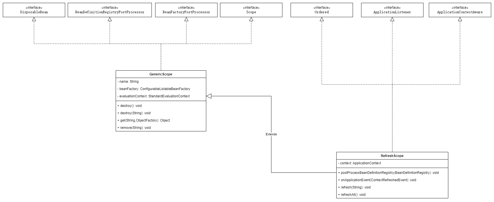
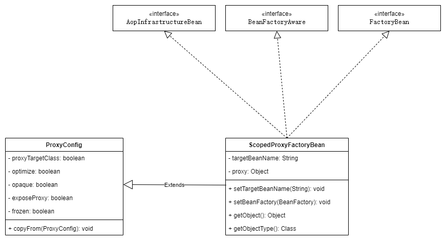
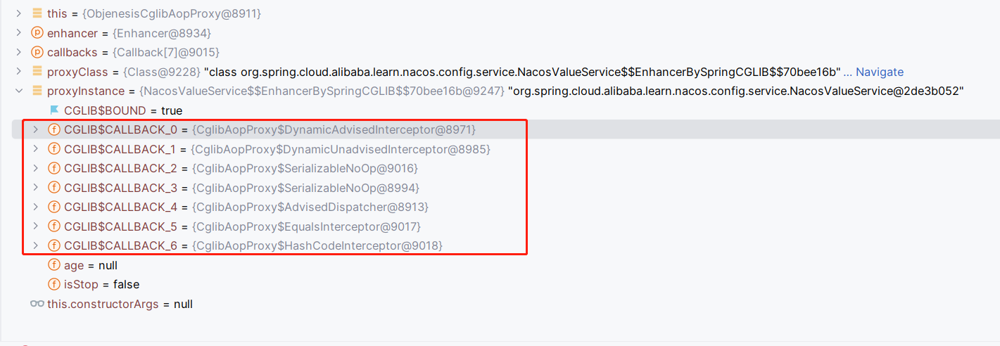

# @RefreshScope动态刷新配置实现原理

在spring cloud alibaba nacos的配置中，我们为了能够实现配置的动态刷新，`@RefreshScope`则是其中的一个解决方案。这篇文章将会从被`@RefreshScope`标记的bean从类信息搜集、创建、使用、刷新、销毁这样一个过程入手，记录Scope在spring中的工作原理。

## 1. @RefreshScope使用方式

```java
@Getter
@Service
@RefreshScope
public class NacosValueService {

    @Value("${config.age}")
    private Integer age;
    private volatile boolean isStop = false;

    @PreDestroy
    public void destroy() {
        System.out.println("执行destroy方法");
    }
}
```

通过在类上使用`@RefreshScope`注解，就能够实现当配置`config.age`在发生变化之后，bean中的配置信息也会发生变化。

## 2. @RefreshScope类信息BeanDefinition创建

### 2.1 RefreshScope注解定义

```java
@Target({ ElementType.TYPE, ElementType.METHOD })
@Retention(RetentionPolicy.RUNTIME)
@Scope("refresh")
@Documented
public @interface RefreshScope {

	/**
	 * @see Scope#proxyMode()
	 * @return proxy mode
	 */
	ScopedProxyMode proxyMode() default ScopedProxyMode.TARGET_CLASS;

}
```

在该注解定义中，包含了两种信息：

- 该注解上除了定义注解的使用方式外，还加了一个`@Scope`注解，该注解定义了`@Scope`的名称，常用的有:
  
  - singleton
  
  - prototype

- 另外就是代理的方式，因此我们可以推断，最终被`@RefreshScope`标记的bean, 最终是一个代理对象。

### 2.2 获取BeanDefinition

在spring-boot环境中，当执行`Application`的时候，回去扫描当前`classpath`下的所有class文件，并将对应的文件解析为对应的`BeanDefinition`对象。

> 这里只考虑默认的扫描路径，不考虑通过注解或者配置方式扫描其他路径的情况

#### 2.2.1 ClassPathBeanDefinitionScanner

该类主要为了扫描`classpath`下的类列表，并将对应的class文件解析为`BeanDefinition`对象，我们主要查看针对`Scope`注解对`BeanDefinition`影响的这部分。其他的不在讨论范围。

##### doScan()

```java
protected Set<BeanDefinitionHolder> doScan(String... basePackages) {
    Assert.notEmpty(basePackages, "At least one base package must be specified");
    Set<BeanDefinitionHolder> beanDefinitions = new LinkedHashSet<>();
    for (String basePackage : basePackages) {
        // 获取路径下的所有BeanDefinition列表
        Set<BeanDefinition> candidates = findCandidateComponents(basePackage);
        // 遍历所有的BeanDefinition
        for (BeanDefinition candidate : candidates) {
            // 解析@Scope注解中的内容, 以ScopeMetadata表示
            ScopeMetadata scopeMetadata = this.scopeMetadataResolver.resolveScopeMetadata(candidate);
            // 更新BeanDefinition的scope值，默认为singleton
            candidate.setScope(scopeMetadata.getScopeName());
            // 生成beanName, 这里的beanName主要有两种获取方式：
            // 1. 判断是否有注解，其中包含了Component, Service, Named, Indexed等注解，如果有，则判断是否设置value值，如果设置，则以value的值为beanName
            // 2. 如果以上条件不满足，则去class的名成，只取类名，并将首字母转换为小写
            String beanName = this.beanNameGenerator.generateBeanName(candidate, this.registry);

            // 这里判断是否为AbstractBeanDefinition类型，如果是，则为BeanDefinition设置必要的参数, 包括初始化方法名称等。
            // 不过在默认中，使用的都没有名缺的指定
            if (candidate instanceof AbstractBeanDefinition) {
                postProcessBeanDefinition((AbstractBeanDefinition) candidate, beanName);
            }
            // 判断是否为AnnotatedBeanDefinition对象，如果是，则执行通用的注解解析和使用:
            // 主要包含了以下几类注解：
            // Lazy, Role, Primary, DependsOn, Description
            if (candidate instanceof AnnotatedBeanDefinition) {
                AnnotationConfigUtils.processCommonDefinitionAnnotations((AnnotatedBeanDefinition) candidate);
            }
            // 检查BeanDefinition是否已经被注册，如果被注册，则检查两者
            if (checkCandidate(beanName, candidate)) {
                BeanDefinitionHolder definitionHolder = new BeanDefinitionHolder(candidate, beanName);
                // 处理ScopeProxyMode属性配置, 并生成新的DefintionHolder对象
                definitionHolder =
                        AnnotationConfigUtils.applyScopedProxyMode(scopeMetadata, definitionHolder, this.registry);
                // 加入beanDefinition列表
                beanDefinitions.add(definitionHolder);
                // 注册当前FactoryBean的Definition到Regsitry中
                registerBeanDefinition(definitionHolder, this.registry);
            }
        }
    }
    return beanDefinitions;
}
```

在处理`BeanDefinition`数据中，最后通过`AnnotationConfigUtils.applyScopedProxyMode()`方法对`BeanDefinition`进行处理，在这个过程中，如果当前的`BeanDefinition`并非为`NO`时，这个时候在`BeanDefinitionRegsitry`中包含了两个`BeanDefinition`, 因此需要特别注意。

- 当`ProxyMode=TARGET_CLASS`时，这个时候被代理的`BeanDefintion`的名称为`scopedTarget.${origianlBeanName}`

- 另一个就是本身的`BeanDefinition`, 这时是一个`FactoryBean`的实现类，则对应的名称为`originalBeanName`. 

所以这两者其实是一个替代关系，代理的`FactoryBean`指向了被代理的`Bean`.

#### 2.2.2 AnnotationConfigUtils

该类主要是对注解配置类的解析，其中`applyScopedMode()`方法解决了不同代理的处理方式，具体源码如下：

##### createScopedProxy()

```java
public static BeanDefinitionHolder createScopedProxy(BeanDefinitionHolder definition,
			BeanDefinitionRegistry registry, boolean proxyTargetClass) {

		// 获取初始beanName
		String originalBeanName = definition.getBeanName();
		// 获取BeanDefinition
		BeanDefinition targetDefinition = definition.getBeanDefinition();
		// 获取targetBeanName, 这里格式为: `scopedTarget.${originalBeanName}`
		String targetBeanName = getTargetBeanName(originalBeanName);

		// Create a scoped proxy definition for the original bean name,
		// "hiding" the target bean in an internal target definition.
		// 这里是为初始的BeanDefinition创建一个代理，隐藏目标的BeanDefinition
		RootBeanDefinition proxyDefinition = new RootBeanDefinition(ScopedProxyFactoryBean.class);
		proxyDefinition.setDecoratedDefinition(new BeanDefinitionHolder(targetDefinition, targetBeanName));
		proxyDefinition.setOriginatingBeanDefinition(targetDefinition);
		proxyDefinition.setSource(definition.getSource());
		proxyDefinition.setRole(targetDefinition.getRole());

		// 设置TargetBeanName属性，则指向了`scopedTarget.${originalBeanName}`BeanDefinition
		proxyDefinition.getPropertyValues().add("targetBeanName", targetBeanName);
		
		if (proxyTargetClass) {
			// 如果ProxMode为TARGET_CLASS, 则设置属性'org.springframework.aop.framework.autoproxy.AutoProxyUtils.preserveTargetClass=true'
			targetDefinition.setAttribute(AutoProxyUtils.PRESERVE_TARGET_CLASS_ATTRIBUTE, Boolean.TRUE);
			// ScopedProxyFactoryBean's "proxyTargetClass" default is TRUE, so we don't need to set it explicitly here.
		}
		else {
			// 如果是其他的，则设置proxyTargetClass为false
			proxyDefinition.getPropertyValues().add("proxyTargetClass", Boolean.FALSE);
		}

		// Copy autowire settings from original bean definition.
		// 从源BeanDefinition中拷贝属性
		proxyDefinition.setAutowireCandidate(targetDefinition.isAutowireCandidate());
		proxyDefinition.setPrimary(targetDefinition.isPrimary());
		if (targetDefinition instanceof AbstractBeanDefinition) {
			proxyDefinition.copyQualifiersFrom((AbstractBeanDefinition) targetDefinition);
		}

		// The target bean should be ignored in favor of the scoped proxy.
		targetDefinition.setAutowireCandidate(false);
		targetDefinition.setPrimary(false);

		// Register the target bean as separate bean in the factory.
		// 这里需要注意，我们实际的beanName名称是自定义或者指定，但是我们这里处理完成了之后
		// 这里就变成了`scopedTarget.${originalBeanName}`, 因此注册的bean名称发生了改变
		registry.registerBeanDefinition(targetBeanName, targetDefinition);

		// Return the scoped proxy definition as primary bean definition
		// (potentially an inner bean).
		// 返回代理之后的BeanDefinition信息
		return new BeanDefinitionHolder(proxyDefinition, originalBeanName, definition.getAliases());
	}
```

## 3. RefreshScope管理Bean

在讲到对`scope=refresh`这类的`BeanDefinition`进行实例化的时候，需要讲到的一个知识点就是对这类Bean的管理。我们知道， Spring默认管理两类bean， 分别为`scope=singleton`和`scope=prototype`两类，我们从bean的实例化过程就可以看出。而针对这两类，其他的`scope`的bean则通过`scope`类型进行管理，因此，针对`scope=refresh`的管理，有专门的`RefreshScope`来实现。

我们查看spring创建bean的过程中，scope的使用如下:

```java
String scopeName = mbd.getScope();
if (!StringUtils.hasLength(scopeName)) {
	throw new IllegalStateException("No scope name defined for bean '" + beanName + "'");
}
Scope scope = this.scopes.get(scopeName);
if (scope == null) {
	throw new IllegalStateException("No Scope registered for scope name '" + scopeName + "'");
}
try {
	Object scopedInstance = scope.get(beanName, () -> { ...
```

从代码中，可以看出，主要包含以下步骤：

- 获取当前`BeanDefinition`原信息的`scope`的值，并根据`scope`的值获取对应的`Scope`对象

- 如果`Scope`对象不存在，则抛出异常

- 根据`Scope`对象的`get`方法创建`bean`对象实例。

### 3.1 类结构



### 3.2 注册时机

从以上的类结构图可以知道，因为GenericScope本身实现了`BeanFactoryPostProcessor`类，因此在BeanFactory准备完毕后，就会实例化该类并回调函数。因此我们查看对应的实现方法。

```java
	public void postProcessBeanFactory(ConfigurableListableBeanFactory beanFactory) throws BeansException {
		this.beanFactory = beanFactory;
		beanFactory.registerScope(this.name, this);
		setSerializationId(beanFactory);
	}
```

可以得知，在`postProcessBeanFacotry()`方法回调方法中，通过`regsiterScope()`方法将`RefreshScope`对象注册到`BeanFactory`对象中，因此在创建`Bean`的时候能够通过`RefreshScope`进行管理。

## 4. 创建Bean

在上面我们讲到了，只要对应的BeanDefintion的`scope`不是`singleton或者prototype`时，都会通过`Scope`对象来管理bean，具体代码如下:

```java
// 获取scope
String scopeName = mbd.getScope();
if (!StringUtils.hasLength(scopeName)) {
	throw new IllegalStateException("No scope name defined for bean '" + beanName + "'");
}
// 根据scope，获取对应的Scope对象
Scope scope = this.scopes.get(scopeName);
// 如果没有注册Scope类型，将抛出错误
if (scope == null) {
	throw new IllegalStateException("No Scope registered for scope name '" + scopeName + "'");
}
try {
	// 从Scope中获取bean对象，如果bean对象不存在，则通过函数创建bean
	Object scopedInstance = scope.get(beanName, () -> {
		beforePrototypeCreation(beanName);
		try {
			return createBean(beanName, mbd, args);
		}
		finally {
			afterPrototypeCreation(beanName);
		}
	});
	beanInstance = getObjectForBeanInstance(scopedInstance, name, beanName, mbd);
}
catch (IllegalStateException ex) {
	throw new ScopeNotActiveException(beanName, scopeName, ex);
}
```

### 4.1 工厂类(FactoryBean)初始化

在上面我们谈到，当我们的类需要做类型代理的时候，则会生成两个`BeanDefinition`对象，因此`originalBeanName`则被FactoryBean所代替。在代理中，实际上使用的是`ScopedProxyFactoryBean`进行代替。

#### ScopedProxyFactoryBean

这个类实现是很简单的，首先该类的类结构如下:



该类的实现是比较简单的，主要包含了两个元素：

- `targetBeanName`: 被代理的bean名称，之前我们知道，实在bean名称前多加了一个`targetBeanName.`的前缀

- `proxy`：被代理bean对象的实例。

> 从初始化角度来说，该FactoryBean并没有太多需要设置的内容。

### 4.2 代理对象proxy何时创建？

我们都知道，代理对象在最终获取被代理对象的时候，都是通过`getObject()`方法来获取，那么我们通过查看源码，`ScopedProxyFactoryBean`的 `proxy`对象的创建，则是放在了`setBeanFacotory()`方法中。

```java
public void setBeanFactory(BeanFactory beanFactory) {
	// 判断beanFactory是否为ConfigurableBeanFacotry的实例
	if (!(beanFactory instanceof ConfigurableBeanFactory)) {
		throw new IllegalStateException("Not running in a ConfigurableBeanFactory: " + beanFactory);
	}
	ConfigurableBeanFactory cbf = (ConfigurableBeanFactory) beanFactory;

	// scopedTargetSource默认为SimpleBeanTargetSource, 这里绑定了BeanFactory
	this.scopedTargetSource.setBeanFactory(beanFactory);

	// 创建ProxyFactory实例
	ProxyFactory pf = new ProxyFactory();
	// 从当前的ProxyConfig拷贝属性值到ProxyFactory中
	pf.copyFrom(this);
	// 设置被代理对象的信息
	pf.setTargetSource(this.scopedTargetSource);

	Assert.notNull(this.targetBeanName, "Property 'targetBeanName' is required");
	// 获取被代理对象的Class类型
	Class<?> beanType = beanFactory.getType(this.targetBeanName);
	// 如果beanType为空, 那么对应的bean的class没有被加载到BeanFactory中,则抛出异常
	if (beanType == null) {
		throw new IllegalStateException("Cannot create scoped proxy for bean '" + this.targetBeanName +
				"': Target type could not be determined at the time of proxy creation.");
	}
	// 判断是否为为代理目标对象，即判断proxyTargetClass属性值是否为false
	// 判断代理对象的类型是否为接口
	// 判断代理对象的类型定义是否为private
	// 当以上条件满足一个时，那么就获取代理对象class的所有接口，并绑定到ProxyFactory对象中
	if (!isProxyTargetClass() || beanType.isInterface() || Modifier.isPrivate(beanType.getModifiers())) {
		pf.setInterfaces(ClassUtils.getAllInterfacesForClass(beanType, cbf.getBeanClassLoader()));
	}

	// Add an introduction that implements only the methods on ScopedObject.
	// 创建DefaultScopedObject对象，
	ScopedObject scopedObject = new DefaultScopedObject(cbf, this.scopedTargetSource.getTargetBeanName());
	// 向ProxyFacotry中新增DelegatingIntroductionInterceptor拦截器
	pf.addAdvice(new DelegatingIntroductionInterceptor(scopedObject));

	// Add the AopInfrastructureBean marker to indicate that the scoped proxy
	// itself is not subject to auto-proxying! Only its target bean is.
	pf.addInterface(AopInfrastructureBean.class);

	// 创建代理对象并绑定到proxy属性中
	this.proxy = pf.getProxy(cbf.getBeanClassLoader());
}
```

通过代码可知，创建代理对象是通过`ProxyFactory`来完成的。

### 4.3 代理对象proxy创建过程

代理对象的创建主要通过ProxyFactory对象来完成，则查看对应的源码：

#### getProxy()

```java
	public Object getProxy(@Nullable ClassLoader classLoader) {
		return createAopProxy().getProxy(classLoader);
	}
```

该创建proxy主要通过`createAopProxy()`方法创建的类来实现。

#### createAopProxy()

```java
	protected final synchronized AopProxy createAopProxy() {
		if (!this.active) {
			activate();
		}
		return getAopProxyFactory().createAopProxy(this);
	}
```

`getAopProxyFactory()`方法创建了工厂类对象，这里使用了`DefaultAopProxyFactory`类来作为默认的工厂类对象。我们知道，spring有两种代理方式：

- JDK Proxy
  
  - 代理class是接口
  
  - 是Proxy生成的代理class
  
  - 是lambda表达式class

- Cglib

这两种方式有不同的选择场景，则对应`createAopProxy()`代码如下:

```java
public AopProxy createAopProxy(AdvisedSupport config) throws AopConfigException {
		if (!NativeDetector.inNativeImage() &&
				(config.isOptimize() || config.isProxyTargetClass() || hasNoUserSuppliedProxyInterfaces(config))) {
			// 获取被代理对象的class
			Class<?> targetClass = config.getTargetClass();
			if (targetClass == null) {
				throw new AopConfigException("TargetSource cannot determine target class: " +
						"Either an interface or a target is required for proxy creation.");
			}
			// 使用jdk的代理方式需要满足一下条件：
			// 1. 是接口
			// 2. 是代理的class
			// 3. 是lambada表达式的class对象
			if (targetClass.isInterface() || Proxy.isProxyClass(targetClass) || ClassUtils.isLambdaClass(targetClass)) {
				return new JdkDynamicAopProxy(config);
			}
			// 其他情况使用Cglib
			return new ObjenesisCglibAopProxy(config);
		}
		else {
			return new JdkDynamicAopProxy(config);
		}
	}
```

这里我们主要关注下cglib的创建方式，因为对于被代理对象是接口的情况，其实我感觉在日常中使用的是比较少的，所以我们关注cglib创建方法。

> cglib创建代理对象主要使用的asm生成字节码，这部分确实要对jvm有很高的认知的才会明白，cglib直接通过asm输入字节码指令生成对应的class文件。因此这里就不做过多介绍。因为我也是云里雾里。。。。

#### CglibAopProxy

##### getProxy()

```java
public Object getProxy(@Nullable ClassLoader classLoader) {
	if (logger.isTraceEnabled()) {
		logger.trace("Creating CGLIB proxy: " + this.advised.getTargetSource());
	}

	try {
		// 获取被代理对象的类型
		Class<?> rootClass = this.advised.getTargetClass();
		Assert.state(rootClass != null, "Target class must be available for creating a CGLIB proxy");

		// 被代理对象
		Class<?> proxySuperClass = rootClass;
		// 判断对象的名称中是否包含了$$, 因此判断是否本身为代理生成的class
		if (rootClass.getName().contains(ClassUtils.CGLIB_CLASS_SEPARATOR)) {
			// 获取超类
			proxySuperClass = rootClass.getSuperclass();
			// 获取接口列表
			Class<?>[] additionalInterfaces = rootClass.getInterfaces();
			// 将接口列表加入到advised对象中
			for (Class<?> additionalInterface : additionalInterfaces) {
				this.advised.addInterface(additionalInterface);
			}
		}

		// Validate the class, writing log messages as necessary.
		// 验证class
		validateClassIfNecessary(proxySuperClass, classLoader);

		// Configure CGLIB Enhancer...
		Enhancer enhancer = createEnhancer();
		if (classLoader != null) {
			// 设置classloader对象
			enhancer.setClassLoader(classLoader);
			if (classLoader instanceof SmartClassLoader &&
					((SmartClassLoader) classLoader).isClassReloadable(proxySuperClass)) {
				enhancer.setUseCache(false);
			}
		}
		// 设置被代理的class对象
		enhancer.setSuperclass(proxySuperClass);
		// 设置代理对象class的接口列表
		enhancer.setInterfaces(AopProxyUtils.completeProxiedInterfaces(this.advised));
		// 设置命名策略
		enhancer.setNamingPolicy(SpringNamingPolicy.INSTANCE);
		// 设置生成策略
		enhancer.setStrategy(new ClassLoaderAwareGeneratorStrategy(classLoader));

		// 获取回调类列表
		Callback[] callbacks = getCallbacks(rootClass);
		Class<?>[] types = new Class<?>[callbacks.length];
		for (int x = 0; x < types.length; x++) {
			types[x] = callbacks[x].getClass();
		}
		// 设置filter, 在代理的过程中，用于判断那些方法不被代理
		// fixedInterceptorMap only populated at this point, after getCallbacks call above
		enhancer.setCallbackFilter(new ProxyCallbackFilter(
				this.advised.getConfigurationOnlyCopy(), this.fixedInterceptorMap, this.fixedInterceptorOffset));
		enhancer.setCallbackTypes(types);

		// Generate the proxy class and create a proxy instance.
		// 创建代理对象
		return createProxyClassAndInstance(enhancer, callbacks);
	}
	catch (CodeGenerationException | IllegalArgumentException ex) {
		throw new AopConfigException("Could not generate CGLIB subclass of " + this.advised.getTargetClass() +
				": Common causes of this problem include using a final class or a non-visible class",
				ex);
	}
	catch (Throwable ex) {
		// TargetSource.getTarget() failed
		throw new AopConfigException("Unexpected AOP exception", ex);
	}
}
```

##### createProxyClassAndInstance()

```java
protected Object createProxyClassAndInstance(Enhancer enhancer, Callback[] callbacks) {
	// 生成代理的class并加载class
	Class<?> proxyClass = enhancer.createClass();
	Object proxyInstance = null;

	if (objenesis.isWorthTrying()) {
		try {
			// 创建代理对象
			proxyInstance = objenesis.newInstance(proxyClass, enhancer.getUseCache());
		}
		catch (Throwable ex) {
			logger.debug("Unable to instantiate proxy using Objenesis, " +
					"falling back to regular proxy construction", ex);
		}
	}

	// 如果代理对象创建失败, 则通过构造器模式创建
	if (proxyInstance == null) {
		// Regular instantiation via default constructor...
		try {
			Constructor<?> ctor = (this.constructorArgs != null ?
					proxyClass.getDeclaredConstructor(this.constructorArgTypes) :
					proxyClass.getDeclaredConstructor());
			ReflectionUtils.makeAccessible(ctor);
			proxyInstance = (this.constructorArgs != null ?
					ctor.newInstance(this.constructorArgs) : ctor.newInstance());
		}
		catch (Throwable ex) {
			throw new AopConfigException("Unable to instantiate proxy using Objenesis, " +
					"and regular proxy instantiation via default constructor fails as well", ex);
		}
	}
	// 为对象设置回调对象列表
	((Factory) proxyInstance).setCallbacks(callbacks);
	return proxyInstance;
```



> 这里通过截图可以看出，对于callback而言，他的内部不是存储的列表，而是将列表拆分成单个成员变量。具体源码可以参考cglib..

到此，对于`FactoryBean`的创建就到此结束。

### 4.4 Scope管理被代理对象

也许会有人会问，为什么本身的`bean`初始化过程为什么不讲，其实很简单，因为本身的bean就是一个普通对象的实例化过程，跟spring初始化一个bean的过程一样，则没有必要单独再讲一遍。

所以我们只需要关注`Scope`在拿到了需要被`Scope`管的`bean`是如何存储的即可。我们还是回到最开始的代码，通过`Scope`获取到`Bean`的代码。

```java
Object scopedInstance = scope.get(beanName, () -> {
	beforePrototypeCreation(beanName);
	try {
		return createBean(beanName, mbd, args);
	}
	finally {
		afterPrototypeCreation(beanName);
	}
});
```

#### GenericScope

在通过get方法获取的时候，主要源码如下：

```java
public Object get(String name, ObjectFactory<?> objectFactory) {
	// 加入缓存
	BeanLifecycleWrapper value = this.cache.put(name, new BeanLifecycleWrapper(name, objectFactory));
	// 加入锁信息
	this.locks.putIfAbsent(name, new ReentrantReadWriteLock());
	try {
		return value.getBean();
	}
	catch (RuntimeException e) {
		this.errors.put(name, e);
		throw e;
	}
}
```

这里设计到两个缓存信息，主要缓存与bean有关的信息。这里主要关注`BeanLifecycleWrapper`类型的`getBean()`方法.

> 这里有个点需要关注：
> 
> - 虽然cache类在每次都是put一个新的对象进入，但是内层的逻辑是会判断当前缓存中是否包含了名称为name的key，如果包含，是不会插入成功的，返回的依然是之前已经缓存过的对象
> 
> - 其次就是在刷新的时候，会清空缓存，这个时候才会将新的缓存对象放置到缓存中。

#### BeanLifecycleWrapper

```java
public Object getBean() {
	// 判断bean是否已经创建, 如果没有创建，则直接创建
	if (this.bean == null) {
		// 锁定名称，让统一时间只有一个线程创建bean
		synchronized (this.name) {
			// 如果bean为空，则调用ObjectFactory创建bean
			if (this.bean == null) {
				this.bean = this.objectFactory.getObject();
			}
		}
	}
	return this.bean;
}
```

因此，在`BeanLifecycleWrapper`类型中，实际上是会缓存bean对象，避免重复创建。

## 5. 清空bean

当bean中的配置在发生变更之后，spring主要通过事件机制判断是否需要刷新bean, 当接受需要刷新事件之后，则会将scope中所有的缓存清空。

### RefreshEventListener

```java
	@Override
	public void onApplicationEvent(ApplicationEvent event) {
		if (event instanceof ApplicationReadyEvent) {
			handle((ApplicationReadyEvent) event);
		}
		// 接受到刷新事件
		else if (event instanceof RefreshEvent) {
			handle((RefreshEvent) event);
		}
	}


	public void handle(RefreshEvent event) {
		if (this.ready.get()) { // don't handle events before app is ready
			log.debug("Event received " + event.getEventDesc());
			// 执行refresh操作
			Set<String> keys = this.refresh.refresh();
			log.info("Refresh keys changed: " + keys);
		}
	}
```

从代码中可以知道，在当前类中主要处理两类事件，一类是`ApplicationReadyEvent`，另一类就是`RefreshEvent`. 当接受到刷新的时候，会执行`ContextRefresher`类的刷新方法。

### ContextRefresher

```java
	public synchronized Set<String> refresh() {
		Set<String> keys = refreshEnvironment();
		this.scope.refreshAll();
		return keys;
	}
```

在刷新的过程中，主要包含了两个步骤：

- 刷新当前的环境配置，这个在之前的文章中已经详细介绍过

- 刷新`Scope`中的缓存。

我们可以看下刷新缓存的实现逻辑：

### RefreshScope

```java
	public void refreshAll() {
		super.destroy();
		this.context.publishEvent(new RefreshScopeRefreshedEvent());
	}
```

这里主要包含了两个步骤：

- 第一个就是执行`destroty`方法，在执行`destroy()`方法的时候，会将保存在`scope`中的bean进行遍历，然后执行销毁`bean`的逻辑

- 再者就是发送一个`RefreshScopeRefreshedEvent`事件，用于通知刷新`scope`成功

以上就是`@RefreshScope`的原理介绍，希望对大家有所帮助。
